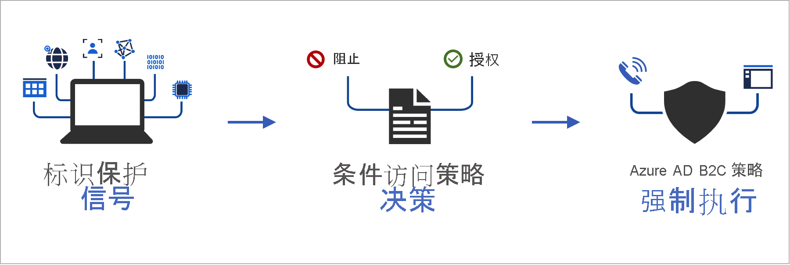
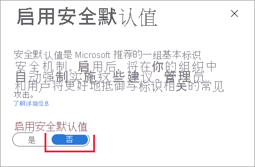
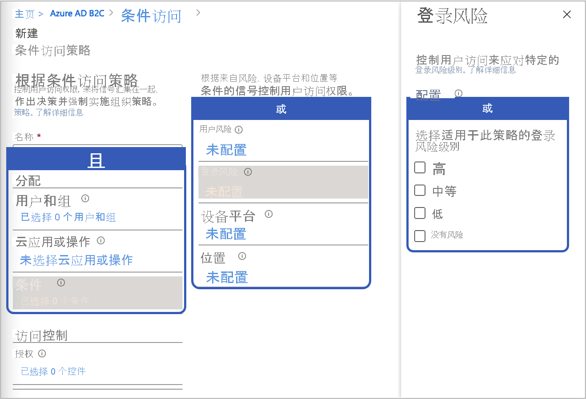
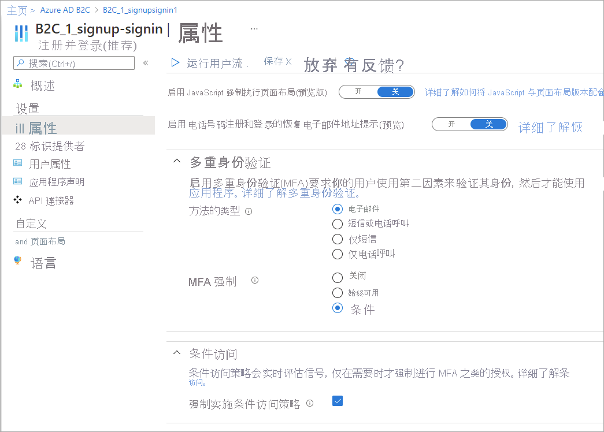

# <a name="add-conditional-access-to-user-flows-in-azure-active-directory-b2c"></a>向 Azure Active Directory B2C 中的用户流添加条件访问

[!INCLUDE [active-directory-b2c-choose-user-flow-or-custom-policy](../../includes/active-directory-b2c-choose-user-flow-or-custom-policy.md)]

可以将“条件访问”添加到 Azure Active Directory B2C (Azure AD B2C) 用户流或自定义策略，以管理应用程序的风险登录。 Azure AD B2C 使用 Azure Active Directory (Azure AD) 条件访问作为工具来汇集信号、做出决策，以及实施组织策略。



通过策略条件自动执行风险评估意味着，风险登录会被立即识别，然后被修正或阻止。

[!INCLUDE [b2c-public-preview-feature](../../includes/active-directory-b2c-public-preview.md)]

## <a name="service-overview"></a>服务概述

Azure AD B2C 会评估每个登录事件，并确保在满足所有策略要求后才向用户授予访问权限。 在此 **评估** 阶段中，“条件访问”服务会评估在登录事件期间由“标识保护”风险检测功能收集的信号。 此评估过程的结果是一组声明，用于指示是应允许登录还是应阻止登录。 Azure AD B2C 策略使用这些声明在用户流中执行某个操作，例如阻止访问，或通过多重身份验证 (MFA) 等特定修正措施来质询用户。 “阻止访问”将覆盖所有其他设置。

::: zone pivot="b2c-custom-policy"
以下示例展示了用于评估登录威胁的条件访问技术配置文件。

```XML
<TechnicalProfile Id="ConditionalAccessEvaluation">
  <DisplayName>Conditional Access Provider</DisplayName>
  <Protocol Name="Proprietary" Handler="Web.TPEngine.Providers.ConditionalAccessProtocolProvider, Web.TPEngine, Version=1.0.0.0, Culture=neutral, PublicKeyToken=null" />
  <Metadata>
    <Item Key="OperationType">Evaluation</Item>
  </Metadata>
  ...
</TechnicalProfile>
```

::: zone-end

在后面的 **修正** 阶段中，将通过 MFA 质询用户。 完成后，Azure AD B2C 会通知“标识保护”，已通过哪种方法修正了所识别的登录威胁。 在此示例中，Azure AD B2C 通过信号表明用户已成功完成多重身份验证质询。 

::: zone pivot="b2c-custom-policy"

以下示例展示了用于修正所查明的威胁的条件访问技术配置文件：

```XML
<TechnicalProfile Id="ConditionalAccessRemediation">
  <DisplayName>Conditional Access Remediation</DisplayName>
  <Protocol Name="Proprietary" Handler="Web.TPEngine.Providers.ConditionalAccessProtocolProvider, Web.TPEngine, Version=1.0.0.0, Culture=neutral, PublicKeyToken=null"/>
  <Metadata>
    <Item Key="OperationType">Remediation</Item>
  </Metadata>
  ...
</TechnicalProfile>
```

::: zone-end

## <a name="components-of-the-solution"></a>解决方案组件

以下是用于在 Azure AD B2C 中实现“条件访问”的组件：

- **用户流** 或 **自定义策略**，用于指导用户完成登录和注册过程。
- **条件访问策略**，用于统合信号以做出决策并实施组织策略。 当用户通过 Azure AD B2C 策略登录到你的应用程序时，条件访问策略将使用 Azure AD 标识保护信号来确定风险登录，并显示相应的修正操作。
- **已注册的应用程序**，用于将用户定向到相应的 Azure AD B2C 用户流或自定义策略。
- [TOR 浏览器](https://www.torproject.org/download/)，用于模拟风险登录。

## <a name="service-limitations-and-considerations"></a>服务限制和注意事项

使用 Azure AD 条件访问时，请考虑以下事项：

- “标识保护”可用于本地标识和社交标识，如 Google 或 Facebook。 对于社交标识，你需要手动激活条件访问。 检测会受到限制，因为社交帐户凭据由外部标识提供者管理。
- 在 Azure AD B2C 租户中，只有 [Azure AD 条件访问](../active-directory/conditional-access/overview.md)策略的一个子集可供使用。


## <a name="prerequisites"></a>先决条件

[!INCLUDE [active-directory-b2c-customization-prerequisites-custom-policy](../../includes/active-directory-b2c-customization-prerequisites-custom-policy.md)]

## <a name="pricing-tier"></a>定价层

创建风险登录策略需要 Azure AD B2C **Premium P2**。 **Premium P1** 租户可以创建基于位置、应用程序的策略，也可以创建基于用户或基于组的策略。 有关详细信息，请参阅[更改 Azure AD B2C 定价层](billing.md#change-your-azure-ad-pricing-tier)

## <a name="prepare-your-azure-ad-b2c-tenant"></a>准备 Azure AD B2C 租户

若要添加条件访问策略，请禁用安全默认值：

1. 登录 [Azure 门户](https://portal.azure.com/)。
2. 在门户工具栏中选择“目录 + 订阅”图标，然后选择包含 Azure AD B2C 租户的目录。
3. 在“Azure 服务”下，选择“Azure AD B2C”。 或者，使用搜索框查找并选择“Azure AD B2C”。
4. 选择“属性”，然后选择“管理安全默认值” 。

   

5. 在“启用安全默认值”下，选择“否”。 

   

## <a name="add-a-conditional-access-policy"></a>添加条件访问策略

条件访问策略是分配和访问控制的 if-then 语句。 条件访问策略会统合信号，以便做出决策并实施组织策略。 各分配之间的逻辑运算符是 *And*。 每个分配中的运算符为 *Or*。



若要添加条件访问策略，请执行以下操作：

1. 在 Azure 门户中，搜索并选择“Azure AD B2C”  。
1. 在“安全性”下，选择“条件访问(预览版)” 。 此时将打开“条件访问策略”页。
1. 选择“+ 新建策略”。
1. 输入策略的名称，例如“Block risky sign-in”。
1. 在“分配”下，选择“用户和组”，然后选择以下一种受支持的配置：

    |包括  |许可证 | 说明  |
    |---------|---------|---------|
    |**所有用户** | P1、P2 |如果你选择包括“所有用户”，则此策略将影响你的所有用户。 若要确保不会将自己锁定，请依次选择“排除”、“目录角色”，然后在列表中选择“全局管理员”，从而排除你的管理帐户。 你还可以选择“用户和组”，然后在“选择排除的用户”列表中选择你的帐户。  | 
 
1. 选择“云应用或操作”，然后选择“选择应用”。 浏览到你的[信赖方应用程序](tutorial-register-applications.md)。

1. 选择“条件”，然后从下列条件中进行选择。 例如，选择“登录风险”以及“高”、“中”和“低”风险级别   。
    
    |条件  |许可证  |说明  |
    |---------|---------|---------|
    |**用户风险**|P2|用户风险表示给定标识或帐户遭入侵的概率。|
    |**登录风险**|P2|登录风险表示给定身份验证请求未经标识所有者授权的概率。|
    |**设备平台**|不支持| 特征根据设备上运行的操作系统而定。 有关详细信息，请参阅[设备预配](../active-directory/conditional-access/concept-conditional-access-conditions.md#device-platforms)。|
    |**位置**|P1、P2|命名位置可包含公共 IPv4 网络信息、国家/地区或未映射到特定国家/地区的未知区域。 有关详细信息，请参阅[位置](../active-directory/conditional-access/concept-conditional-access-conditions.md#locations)。 |
 
1. 在“访问控制”  下，选择“授予”  。 然后选择是要阻止访问还是要允许访问：
    
    |选项  |许可证 |注意  |
    |---------|---------|---------|
    |**阻止访问**|P1、P2| 根据此条件访问策略中指定的条件阻止访问。|
    |**允许访问**，但 **要求必须执行多重身份验证**|P1、P2|根据此条件访问策略中指定的条件，用户需要通过 Azure AD B2C 多重身份验证。|

1. 在“启用策略”下，选择以下选项之一：
    
    |选项  |许可证 |注意  |
    |---------|---------|---------|
    |**仅限报告**|P1、P2| “仅限报告”允许管理员在环境中启用条件访问策略之前先评估其影响。 建议你检查具有此状态的策略，并确定对最终用户的影响，而不要求进行多重身份验证或阻止用户。 有关详细信息，请参阅[查看审核报告中的条件访问结果](#review-conditional-access-outcomes-in-the-audit-report)|
    | **开**| P1、P2| 访问策略会经过评估，并且不会强制执行。 |
    | 关闭 | P1、P2| 访问策略未激活，对用户不会有任何影响。 |

1. 通过选择“创建”启用测试条件访问策略。

## <a name="add-conditional-access-to-a-user-flow"></a>向用户流添加条件访问

添加 Azure AD 条件访问策略后，在用户流或自定义策略中启用条件访问。 启用条件访问时，不需要指定策略名称。

随时可能都会有多个条件访问策略应用于单个用户的情况。 在这种情况下，将优先使用最严格的访问控制策略。 例如，如果一个策略要求执行多重身份验证 (MFA)，而另一个策略阻止访问，则用户将被阻止。

## <a name="enable-multi-factor-authentication-optional"></a>启用多重身份验证（可选）

向用户流添加条件访问时，请考虑使用 **多重身份验证 (MFA)** 。 用户可以通过短信或语音使用一次性代码，或者通过电子邮件使用一次性密码来进行多重身份验证。 MFA 设置独立于条件访问设置。 可以将 MFA 设置为“始终启用”，这样无论你的条件访问设置如何，都始终需要 MFA。 或者，可以将 MFA 设置为“条件性”，使得仅在活动条件访问策略要求 MFA 时才进行 MFA。

> [!IMPORTANT]
> 如果条件访问策略通过 MFA 授予访问权限，但用户尚未注册电话号码，则用户可能被阻止。

::: zone pivot="b2c-user-flow"

若要为用户流启用条件访问，请确保版本支持条件访问。 这些用户流版本标记为“推荐”。

1. 登录 [Azure 门户](https://portal.azure.com)。

1. 在门户工具栏中选择“目录 + 订阅”图标，然后选择包含 Azure AD B2C 租户的目录。

1. 在“Azure 服务”下，选择“Azure AD B2C”。 或者，使用搜索框查找并选择“Azure AD B2C”。

1. 在“策略”下，选择“用户流” 。 然后选择用户流。

1. 选择“属性”，并通过查找标记为“条件访问”的设置来确保用户流支持条件访问 。
 
   

1. 在“多重身份验证”部分中，选择所需的“MFA 方法”，然后在“MFA 强制执行”下选择“条件访问策略(建议)”   。
 
1. 在“条件访问”部分中，选择“强制实施条件访问策略”复选框 。

1. 选择“保存”。


::: zone-end

::: zone pivot="b2c-custom-policy"

## <a name="add-conditional-access-to-your-policy"></a>向策略添加条件访问

1. 在 [GitHub](https://github.com/azure-ad-b2c/samples/tree/master/policies/conditional-access) 上获取条件访问策略的示例。
1. 在每个文件中，将字符串 `yourtenant` 替换为 Azure AD B2C 租户的名称。 例如，如果 B2C 租户的名称为 contosob2c，则 `yourtenant.onmicrosoft.com` 的所有实例都将变为 `contosob2c.onmicrosoft.com`。
1. 上传策略文件。

## <a name="test-your-custom-policy"></a>测试自定义策略

1. 选择 `B2C_1A_signup_signin_with_ca` 或 `B2C_1A_signup_signin_with_ca_whatif` 策略以打开其“概述”页。 然后选择“运行用户流”。 在“应用程序”下，选择“webapp1”。 “回复 URL”应显示为 `https://jwt.ms`。
1. 复制“运行用户流终结点”下的 URL。

1. 若要模拟风险登录，请打开 [Tor 浏览器](https://www.torproject.org/download/)，并使用在前面的步骤中复制的 URL 登录到已注册的应用。

1. 在登录页中输入请求的信息，然后尝试登录。 令牌将返回到 `https://jwt.ms` 并显示出来。 在 jwt.ms 解码令牌中，你应看到登录已被阻止。

::: zone-end

::: zone pivot="b2c-user-flow"

## <a name="test-your-user-flow"></a>测试用户流

1. 选择已创建的用户流以打开其“概述”页，然后选择“运行用户流”。 在“应用程序”下，选择“webapp1”。 “回复 URL”应显示为 `https://jwt.ms`。

1. 复制“运行用户流终结点”下的 URL。

1. 若要模拟风险登录，请打开 [Tor 浏览器](https://www.torproject.org/download/)，并使用在前面的步骤中复制的 URL 登录到已注册的应用。

1. 在登录页中输入请求的信息，然后尝试登录。 令牌将返回到 `https://jwt.ms` 并显示出来。 在 jwt.ms 解码令牌中，你应看到登录已被阻止。

::: zone-end

## <a name="review-conditional-access-outcomes-in-the-audit-report"></a>查看审核报告中的条件访问结果

查看条件访问事件的结果：

1. 登录 [Azure 门户](https://portal.azure.com/)。

2. 在门户工具栏中选择“目录 + 订阅”图标，然后选择包含 Azure AD B2C 租户的目录。

3. 在“Azure 服务”下，选择“Azure AD B2C”。 或者，使用搜索框查找并选择“Azure AD B2C”。

4. 在“活动”下，选择“审核日志” 。

5. 通过将“类别”设置为“B2C”并将“活动资源类型”设置为“IdentityProtection”来筛选审核日志   。 然后，选择“应用”。

6. 查看最多过去 7 天的审核活动。 包括以下类型的活动：

   - **评估条件访问策略**：此审核日志条目指示在身份验证过程中执行了条件访问评估。
   - **修复用户**：此条目指示最终用户符合条件访问策略的授权或要求，并已向风险引擎报告此活动以修复用户（降低用户风险）。

7. 在列表中选择“评估条件访问策略”日志条目以打开“活动详细信息：审核日志” 页，其中显示审核日志标识符，以及“其他详细信息”部分中的以下信息：

   - **ConditionalAccessResult**：条件策略评估所需的授权。
   - **AppliedPolicies**：已满足条件且策略处于启用状态的所有条件访问策略的列表。
   - **ReportingPolicies**：设置为“仅限报告”模式且满足条件的条件访问策略的列表。

## <a name="next-steps"></a>后续步骤

[在 Azure AD B2C 用户流中自定义用户界面](customize-ui-with-html.md)
