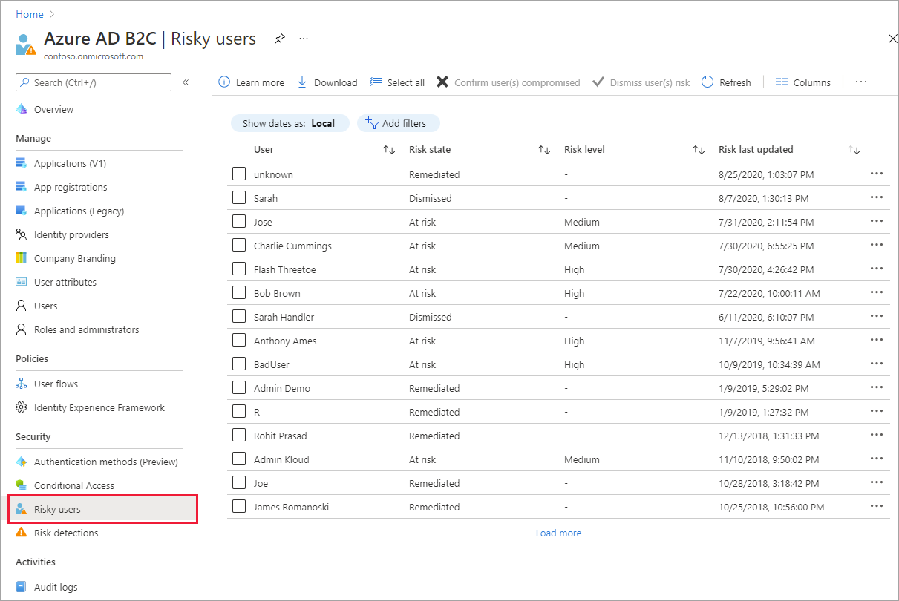
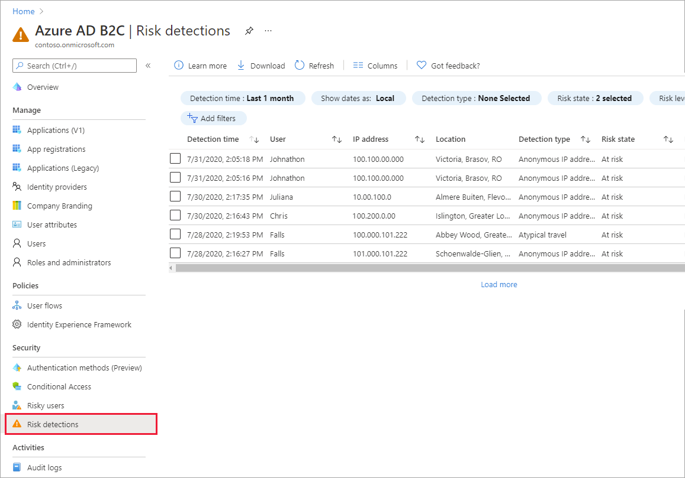

# 使用 Azure AD B2C 中的标识保护来调查风险

标识保护为 Azure AD B2C 租户提供持续的风险检测。 它使组织能够发现、调查和修正基于标识的风险。 标识保护随附风险报告，这些报告可用于调查 Azure AD B2C 租户中的标识风险。 本文介绍如何调查和缓解风险。

## 概述

Azure AD B2C 标识保护提供两份报告。 风险用户报告：管理员可在其中发现哪些用户面临风险，以及有关检测项的详细信息。 风险检测项报告：提供有关每个风险检测项的信息，包括类型、同时触发的其他风险、尝试登录的位置，等等。

每个报表启动时，报表顶部都有一个列表来显示该时间段内的所有检测。 使用报表顶部的筛选器可筛选报表。 管理员可以选择下载数据，或使用 [Microsoft Graph API 和 Microsoft Graph PowerShell SDK](../active-directory/identity-protection/howto-identity-protection-graph-api.md) 持续导出数据。

## 服务限制和注意事项

使用标识保护时，请注意以下事项：

- 默认情况下，标识保护处于启用状态。
- “标识保护”可用于本地标识和社交标识，如 Google 或 Facebook。 对于社交标识，必须激活条件访问。 由于社交帐户凭据由外部标识提供者管理，因此检测会受到限制。
- 在 Azure AD B2C 租户中，只有一部分 [Azure AD 标识保护风险检测项](../active-directory/identity-protection/overview-identity-protection.md)可用。 Azure AD B2C 支持以下风险检测项：  

|风险检测类型  |说明  |
|---------|---------|
| 异常位置登录     | 从异常位置登录，根据用户最近的登录来判定。        |
|匿名 IP 地址     | 从匿名 IP 地址登录（例如：Tor 浏览器，匿名程序 VPN）。        |
|受恶意软件感染的 IP 地址     | 从受恶意软件感染的 IP 地址登录。         |
|不熟悉的登录属性     | 使用给定用户最近未曾出现过的属性登录。        |
|管理员确认用户遭入侵    | 管理员已表明，用户遭到了入侵。             |
|密码喷射     | 通过密码喷射攻击进行登录。      |
|Azure AD 威胁智能     | Microsoft 的内部和外部威胁智能源已识别出已知的攻击模式。        |

## 定价层

要使用某些标识保护功能，必须安装 Azure AD B2C Premium P2。 如有必要，[将 Azure AD B2C 定价层更改为 Premium P2](./billing.md)。 下表汇总了标识保护功能和所需的定价层。  

|功能   |P1   |P2|
|----------|:-----------:|:------------:|
|“有风险用户”报告     |&#x2713; |&#x2713; |
|风险用户报告详细信息  | |&#x2713; |
|风险用户报告修正    | &#x2713; |&#x2713; |
|风险检测项报告   |&#x2713;|&#x2713;|
|风险检测项报告详细信息  ||&#x2713;|
|报告下载 |  &#x2713;| &#x2713;|
|Microsoft Graph API 访问 |  &#x2713;| &#x2713;|

## 先决条件

[!INCLUDE [active-directory-b2c-customization-prerequisites](../../includes/active-directory-b2c-customization-prerequisites.md)]

## 调查有风险的用户

通过风险用户报表提供的信息，管理员可找出：

- 风险状态，显示哪些用户有风险；风险已修正或风险已消除
- 有关检测的详细信息
- 所有风险登录的历史记录
- 风险历史记录
 
然后，管理员可选择对这些事件执行操作。 管理员可选择：

- 重置用户密码
- 确认用户是否已遭入侵
- 消除用户风险
- 阻止用户登录
- 使用 Azure ATP 进一步调查

管理员可以选择在 Azure 门户中消除用户的风险，或者通过 Microsoft Graph API 的[“消除用户风险”](/graph/api/riskyusers-dismiss?preserve-view=true&view=graph-rest-beta)选项以编程方式这样做。 需要管理员权限才能消除用户的风险。 消除风险可以由风险用户或代表该用户的管理员通过特定方式（例如密码重置）来执行。

### 浏览风险用户报告

1. 登录 [Azure 门户](https://portal.azure.com/)。
1. 请确保使用的是包含 Azure AD B2C 租户的目录。 在门户工具栏中选择“目录 + 订阅”图标。
1. 在“门户设置 | 目录+订阅”页上的“目录名称”列表中找到你的 Azure AD B2C 目录，然后选择“切换”。
1. 在“Azure 服务”下，选择“Azure AD B2C”。 或者，使用搜索框查找并选择“Azure AD B2C”。
1. 在“安全性”下，选择“风险用户” 。

   

    选择单个条目后，将展开检测下方的“详细信息”窗口。 管理员可通过“详细信息”视图对每次检测进行调查和执行操作。

    

## 风险检测项报告

风险检测项报告包含过去最长 90 天（3 个月）的可筛选数据。

通过风险检测报表提供的信息，管理员可找出：

- 每项风险检测的相关信息，包括类型。
- 同时触发的其他风险。
- 尝试登录的位置。

然后，管理员可选择返回到用户的风险或登录报表，根据收集到的信息采取措施。

### 浏览风险检测项报告

1. 在 Azure 门户中，搜索并选择“Azure AD B2C”。
1. 在“安全性”下，选择“风险检测” 。

   

## 后续步骤

- [向用户流添加条件访问](conditional-access-user-flow.md)。