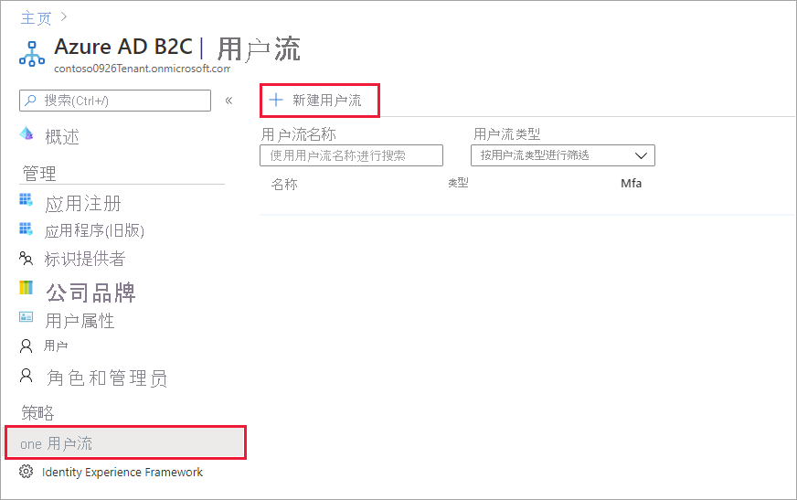
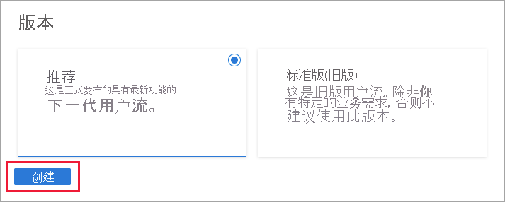

# <a name="tutorial-create-user-flows-and-custom-policies-in-azure-active-directory-b2c"></a>教程：在 Azure Active Directory B2C 中创建用户流和自定义策略

[!INCLUDE [active-directory-b2c-choose-user-flow-or-custom-policy](../../includes/active-directory-b2c-choose-user-flow-or-custom-policy.md)]

可以在应用程序中使用用户流，让用户注册、登录或管理其配置文件。 可以在 Azure Active Directory B2C (Azure AD B2C) 租户中创建多个不同类型的用户流，并根据需要在应用程序中使用它们。 可以跨应用程序重复使用用户流。

::: zone pivot="b2c-user-flow"
利用用户流，可以确定用户在执行登录、注册、编辑配置文件或重置密码等操作时与应用程序交互的方式。 在本文中，学习如何：
::: zone-end

::: zone pivot="b2c-custom-policy"
[自定义策略](custom-policy-overview.md)是定义 Azure Active Directory B2C (Azure AD B2C) 租户行为的配置文件。 在本文中，学习如何：
::: zone-end

> [!div class="checklist"]
> * 创建注册和登录用户流
> * 启用自助式密码重置
> * 创建配置文件编辑用户流

::: zone pivot="b2c-user-flow"
> [!IMPORTANT]
> 我们更改了引用用户流版本的方式。 之前，我们提供 V1（生产就绪）版本，还提供了 V1.1 和 V2（预览版）版本。 现在，我们已将用户流合并为两个版本：“建议”用户流（具有最新功能）和“标准(旧)”用户流 。 所有旧的预览版用户流（V1.1 和 V2）都已弃用。 有关详细信息，请参阅 [Azure AD B2C 中的用户流版本](user-flow-versions.md)。 这些更改仅适用于 Azure 公有云。其他环境将继续使用[旧用户流版本控制](user-flow-versions-legacy.md)。 
::: zone-end

## <a name="prerequisites"></a>先决条件

::: zone pivot="b2c-user-flow"
- 如果没有租户，请[创建链接到 Azure 订阅的 Azure AD B2C 租户](tutorial-create-tenant.md)。
- [注册 Web 应用程序](tutorial-register-applications.md)并[启用 ID 令牌隐式授权](tutorial-register-applications.md#enable-id-token-implicit-grant)。
::: zone-end

::: zone pivot="b2c-custom-policy"

- 如果没有租户，请[创建链接到 Azure 订阅的 Azure AD B2C 租户](tutorial-create-tenant.md)。
- [注册 Web 应用程序](tutorial-register-applications.md)并[启用 ID 令牌隐式授权](tutorial-register-applications.md#enable-id-token-implicit-grant)。
- [创建 Facebook 应用程序](identity-provider-facebook.md#create-a-facebook-application)。 跳过[使用 Facebook 帐户设置注册和登录](identity-provider-facebook.md)一文中的先决条件和其余步骤。 尽管使用自定义策略不需要 Facebook 应用程序，但在本演练中，将用它来演示如何在自定义策略中实现社交登录。

::: zone-end

::: zone pivot="b2c-user-flow"
## <a name="create-a-sign-up-and-sign-in-user-flow"></a>创建注册和登录用户流

注册和登录用户流通过单一配置处理注册和登录体验。 根据上下文将应用程序用户引导至正确的路径。

1. 登录到 [Azure 门户](https://portal.azure.com)。
1. 请确保使用的是包含 Azure AD B2C 租户的目录。 在门户工具栏中选择“目录 + 订阅”图标。
1. 在“门户设置 | 目录+订阅”页上的“目录名称”列表中找到你的 Azure AD B2C 目录，然后选择“切换”。
1. 在 Azure 门户中，搜索并选择“Azure AD B2C”。
1. 在“策略”下，依次选择“用户流”、“新建用户流”。

    

1. 在“创建用户流”页面上，选择“注册和登录”用户流 。

    

1. 在“选择版本”下，选择“建议”，然后选择“创建”  。 （[详细了解](user-flow-versions.md)用户流版本。）

    

1. 输入该用户流的 **名称**。 例如 *signupsignin1*。
1. 对于“标识提供者”，请选择“电子邮件注册”。
1. 对于“用户属性和声明”，请选择在注册期间要从用户收集并发送的声明和属性。 例如，选择“显示更多”，然后选择“国家/地区”、“显示名称”和“邮政编码”所对应的属性和声明。 单击“确定”。

    

1. 单击“创建”以添加用户流。 名称中会自动附加前缀 B2C_1。

### <a name="test-the-user-flow"></a>测试用户流

1. 选择已创建的用户流以打开其概览页，然后选择“运行用户流”。
1. 对于“应用程序”，请选择前面已注册的名为 *webapp1* 的 Web 应用程序。 “回复 URL”应显示为 `https://jwt.ms`。
1. 单击“运行用户流”，然后选择“立即注册”。

    

1. 输入有效的电子邮件地址，单击“发送验证码”，输入收到的验证码，然后选择“验证代码”。
1. 输入新密码并确认。
1. 选择所在的国家和地区，输入要显示的名称，输入邮政编码，然后单击“创建”。 令牌将返回到 `https://jwt.ms` 并显示出来。
1. 现在可以再次运行用户流，你应该可以使用创建的帐户登录。 返回的令牌包含所选国家/地区、名称和邮政编码的声明。

> [!NOTE]
> “运行用户流”体验当前与使用授权代码流的 SPA 回复 URL 类型不兼容。 若要将“运行用户流”体验与这些类型的应用结合使用，请注册类型为“Web”的回复 URL，并启用隐式流，如[此处](tutorial-register-spa.md)所述。

## <a name="enable-self-service-password-reset"></a>启用自助式密码重置

为注册或登录用户流启用[自助式密码重置](add-password-reset-policy.md)：

1. 选择创建的注册或登录用户流。
1. 在左侧菜单的 **设置** 下，选择 **属性**。
1. 在 **密码复杂性** 下，选择 **自助式密码重置**。
1. 选择“保存”。

### <a name="test-the-user-flow"></a>测试用户流

1. 选择已创建的用户流以打开其概览页，然后选择“运行用户流”。
1. 对于“应用程序”，请选择前面已注册的名为 *webapp1* 的 Web 应用程序。 “回复 URL”应显示为 `https://jwt.ms`。
1. 选择“运行用户流”。
1. 在注册或登录页上，选择 **忘记密码？** 。
1. 验证之前创建的帐户的电子邮件地址，然后选择 **继续**。
1. 现在可以更改用户的密码。 更改密码，然后选择“继续”。 令牌将返回到 `https://jwt.ms` 并显示出来。

## <a name="create-a-profile-editing-user-flow"></a>创建配置文件编辑用户流

如果希望用户能够在你的应用程序中编辑其个人资料，请使用个人资料编辑用户流。

1. 在 Azure AD B2C 租户概述页面的菜单中，选择“用户流”，然后选择“新建用户流”。
1. 在“创建用户流”页面上，选择“个人资料编辑”用户流 。 
1. 在“选择版本”下，选择“建议”，然后选择“创建”  。
1. 输入该用户流的 **名称**。 例如 *profileediting1*。
1. 对于“标识提供者”，请选择“本地帐户登录”。
2. 对于“用户属性”，请选择你希望客户能够在其个人资料中编辑的属性。 例如，选择“显示更多”，然后选择“显示名称”和“职务”所对应的属性和声明。 单击 **“确定”** 。
3. 单击“创建”以添加用户流。 名称中会自动追加前缀 *B2C_1*。

### <a name="test-the-user-flow"></a>测试用户流

1. 选择已创建的用户流以打开其概览页，然后选择“运行用户流”。
1. 对于“应用程序”，请选择前面已注册的名为 *webapp1* 的 Web 应用程序。 “回复 URL”应显示为 `https://jwt.ms`。
1. 单击“运行用户流”，然后使用前面创建的帐户登录。
1. 现在，你可以更改用户的显示名称和职务。 单击 **“继续”** 。 令牌将返回到 `https://jwt.ms` 并显示出来。
::: zone-end

::: zone pivot="b2c-custom-policy"
> [!TIP]
> 本文介绍了如何手动设置租户。 可以自动执行本文中的整个过程。 自动执行将部署 Azure AD B2C [SocialAndLocalAccountsWithMFA 初学者包](https://github.com/Azure-Samples/active-directory-b2c-custom-policy-starterpack)，它将提供“注册”和“登录”、“密码重置”和“配置文件编辑”过程。 若要自动完成以下演练，请访问 [IEF 安装应用](https://aka.ms/iefsetup)，并按照说明操作。


## <a name="add-signing-and-encryption-keys"></a>添加签名和加密密钥

1. 登录 [Azure 门户](https://portal.azure.com)。
1. 请确保使用的是包含 Azure AD B2C 租户的目录。 在门户工具栏中选择“目录 + 订阅”图标。
1. 在“门户设置 | 目录+订阅”页上的“目录名称”列表中找到你的 Azure AD B2C 目录，然后选择“切换”。
1. 在 Azure 门户中，搜索并选择“Azure AD B2C”。
1. 在概述页面上的“策略”下，选择“Identity Experience Framework” 。

### <a name="create-the-signing-key"></a>创建签名密钥

1. 选择“策略密钥”，然后选择“添加”。
1. 对于“选项”，请选择 `Generate`。
1. 在“名称”中，请输入 `TokenSigningKeyContainer`。 可能会自动添加前缀 `B2C_1A_`。
1. 对于“密钥类型”，请选择“RSA”。
1. 对于“密钥用法”，请选择“签名” 。
1. 选择“创建”。

### <a name="create-the-encryption-key"></a>创建加密密钥

1. 选择“策略密钥”，然后选择“添加”。
1. 对于“选项”，请选择 `Generate`。
1. 在“名称”中，请输入 `TokenEncryptionKeyContainer`。 可能会自动添加前缀 `B2C_1A`_。
1. 对于“密钥类型”，请选择“RSA”。
1. 对于“密钥用法”，请选择“加密” 。
1. 选择“创建”。

### <a name="create-the-facebook-key"></a>创建 Facebook 密钥

将 Facebook 应用程序的[应用机密](identity-provider-facebook.md)添加为策略密钥。 可将你创建的应用程序的应用机密设为本文先决条件的一部分。

1. 选择“策略密钥”，然后选择“添加”。
1. 对于“选项”，请选择 `Manual`。
1. 对于“名称”，请输入 `FacebookSecret`。 可能会自动添加前缀 `B2C_1A_`。
1. 在“机密”中，输入 developers.facebook.com 提供的 Facebook 应用程序的应用机密。 此值是机密，不是应用程序 ID。
1. 对于“密钥用法”，请选择“签名” 。
1. 选择“创建”。

## <a name="register-identity-experience-framework-applications"></a>注册标识体验框架应用程序

Azure AD B2C 要求注册两个应用程序，它们分别用于通过本地帐户实现用户注册和登录：IdentityExperienceFramework（一个 Web API），以及 ProxyIdentityExperienceFramework（一个原生应用，它具有对 IdentityExperienceFramework 应用的委派权限） 。 用户可使用电子邮件地址或用户名和密码进行注册来访问租户注册的应用程序，这将创建一个“本地帐户”。 本地帐户仅存在于 Azure AD B2C 租户中。

你只需在 Azure AD B2C 租户中注册这两个应用程序一次。

### <a name="register-the-identityexperienceframework-application"></a>注册 IdentityExperienceFramework 应用程序

若要在 Azure AD B2C 租户中注册应用程序，可以使用“应用注册”体验。

1. 选择“应用注册”，然后选择“新建注册” 。
1. 对于“名称”，请输入 `IdentityExperienceFramework`。
1. 在“支持的帐户类型”下，选择“仅此组织目录中的帐户” 。
1. 在“重定向 URI”下，选择“Web”，然后输入 `https://your-tenant-name.b2clogin.com/your-tenant-name.onmicrosoft.com`，其中 `your-tenant-name` 是 Azure AD B2C 租户域名 。
1. 在“权限”下，选择“授予对 openid 和 office_access 权限的管理员许可”复选框。
1. 选择“注册”。
1. 记录“应用程序(客户端) ID”，以便在后续步骤中使用。

接下来，通过添加范围公开 API：

1. 在左侧菜单中的“管理”下，选择“公开 API” 。
1. 选择“添加范围”，然后选择“保存并继续”以接受默认的应用程序 ID URI 。
1. 输入以下值，创建允许在 Azure AD B2C 租户中执行自定义策略的范围：
    * **范围名称**：`user_impersonation`
    * **管理员许可显示名称**：`Access IdentityExperienceFramework`
    * **管理员许可说明**：`Allow the application to access IdentityExperienceFramework on behalf of the signed-in user.`
1. 选择“添加范围”

* * *

### <a name="register-the-proxyidentityexperienceframework-application"></a>注册 ProxyIdentityExperienceFramework 应用程序

1. 选择“应用注册”，然后选择“新建注册” 。
1. 对于“名称”，请输入 `ProxyIdentityExperienceFramework`。
1. 在“支持的帐户类型”下，选择“仅此组织目录中的帐户” 。
1. 在“重定向 URI”下，使用下拉选择“公共客户端/本机(移动和桌面)” 。
1. 对于“重定向 URI”，请输入 `myapp://auth`。
1. 在“权限”下，选择“授予对 openid 和 office_access 权限的管理员许可”复选框。
1. 选择“注册”。
1. 记录“应用程序(客户端) ID”，以便在后续步骤中使用。

接下来，指定应将应用程序视为公共客户端：

1. 在左侧菜单中的“管理”下，选择“身份验证” 。
1. 在“高级设置”下的“允许公共客户端流”部分，将“启用以下移动和桌面流”设置为“是”。 请确保已在应用程序清单中设置 "allowPublicClient": true。 
1. 选择“保存”。

现在，向你先前在 IdentityExperienceFramework 注册中公开的 API 范围授予权限：

1. 在左侧菜单中的“管理”下，选择“API 权限” 。
1. 在“已配置权限”下，选择“添加权限”。
1. 选择“我的 API”选项卡，然后选择“IdentityExperienceFramework”应用程序 。
1. 在“权限”下，选择你先前定义的 user_impersonation 范围 。
1. 选择“添加权限”。 按照指示等待几分钟，然后继续下一步。
1. 选择“向(租户名称)授予管理员许可”。
1. 选择当前登录的管理员帐户，或者使用至少分配了“云应用程序管理员”角色的 Azure AD B2C 租户中的帐户登录。
1. 选择“接受”。
1. 选择“刷新”，然后验证范围 offline_access、openid 和 user_impersonation 的“状态下是否显示“已授予...”。 传播权限可能需要几分钟时间。

* * *

## <a name="custom-policy-starter-pack"></a>自定义策略新手包

自定义策略是你上传到 Azure AD B2C 租户的一组 XML 文件，用于定义技术配置文件和用户旅程。 我们提供了新手包，其中有多个预建策略来帮助你快速入门。 每个新手包中都有实现所述方案必需的最少数量的技术配置文件和用户旅程：

- **LocalAccounts** - 仅允许使用本地帐户。
- **SocialAccounts** - 仅允许使用社交（或联合）帐户。
- **SocialAndLocalAccounts** - 允许使用本地帐户和社交帐户。
- **SocialAndLocalAccountsWithMFA** - 启用社交、本地和多重身份验证选项。

每个新手包中包含：

- **基本文件** - 需要对基本文件进行少量的修改。 示例：TrustFrameworkBase.xml
- **扩展文件** - 大多数配置更改在此文件中进行。 示例：TrustFrameworkExtensions.xml
- **信赖方文件** - 应用程序调用的任务特定文件。 示例：SignUpOrSignin.xml、ProfileEdit.xml、PasswordReset.xml  

在本文中，你将编辑 SocialAndLocalAccounts 新手包中的 XML 自定义策略文件。 如果需要 XML 编辑器，请尝试使用 [Visual Studio Code](https://code.visualstudio.com/download)，它是一种轻型跨平台编辑器。

### <a name="get-the-starter-pack"></a>获取新手包

从 GitHub 获取自定义策略新手包，然后使用 Azure AD B2C 租户名称更新 SocialAndLocalAccounts 新手包中的 XML 文件。

1. [下载 .zip 文件](https://github.com/Azure-Samples/active-directory-b2c-custom-policy-starterpack/archive/master.zip)或克隆存储库：

    ```console
    git clone https://github.com/Azure-Samples/active-directory-b2c-custom-policy-starterpack
    ```

1. 在 SocialAndLocalAccounts 目录中的所有文件中，将字符串 `yourtenant` 替换为 Azure AD B2C 租户的名称。

    例如，如果 B2C 租户的名称为 contosotenant，则 `yourtenant.onmicrosoft.com` 的所有实例都将变为 `contosotenant.onmicrosoft.com`。

### <a name="add-application-ids-to-the-custom-policy"></a>将应用程序 ID 添加到自定义策略

将应用程序 ID 添加到扩展文件 *TrustFrameworkExtensions.xml*。

1. 打开 `SocialAndLocalAccounts/``TrustFrameworkExtensions.xml` 并找到元素 `<TechnicalProfile Id="login-NonInteractive">`。
1. 将 `IdentityExperienceFrameworkAppId` 的两个实例替换为前面创建的 IdentityExperienceFramework 应用程序的 ID。
1. 将 `ProxyIdentityExperienceFrameworkAppId` 的两个实例替换为前面创建的 ProxyIdentityExperienceFramework 应用程序的 ID。
1. 保存文件。

## <a name="upload-the-policies"></a>上传策略

1. 在 Azure 门户的 B2C 租户中，选择“Identity Experience Framework”菜单项。
1. 选择“上传自定义策略”。
1. 按照下列顺序上传策略文件：
    1. TrustFrameworkBase.xml
    1. TrustFrameworkExtensions.xml
    1. SignUpOrSignin.xml
    1. ProfileEdit.xml
    1. PasswordReset.xml

上传文件时，Azure 会向每个文件添加前缀 `B2C_1A_`。

> [!TIP]
> 如果 XML 编辑器支持验证，则根据新手包根目录中的 `TrustFrameworkPolicy_0.3.0.0.xsd` XML 架构来验证文件。 XML 架构验证在上传之前会识别错误。

## <a name="test-the-custom-policy"></a>测试自定义策略

1. 在“自定义策略”下，选择“B2C_1A_signup_signin” 。
1. 对于自定义策略概述页面上的“选择应用程序”，选择先前注册的名为“webapp1”的 Web 应用程序。
1. 请确保回复 URL 为 `https://jwt.ms`。
1. 选择“立即运行”。
1. 使用电子邮件地址注册。
1. 再次选择“立即运行”。
1. 使用相同的帐户登录，以确认配置正确。

## <a name="add-facebook-as-an-identity-provider"></a>将 Facebook 添加为标识提供者

如[先决条件](#prerequisites)中所述，使用自定义策略不需要 Facebook，但在此处用它来演示如何在自定义策略中启用联合社交登录。

1. 在 `SocialAndLocalAccounts/``TrustFrameworkExtensions.xml` 文件中，将 `client_id` 的值替换为 Facebook 应用程序 ID：

   ```xml
   <TechnicalProfile Id="Facebook-OAUTH">
     <Metadata>
     <!--Replace the value of client_id in this technical profile with the Facebook app ID"-->
       <Item Key="client_id">00000000000000</Item>
   ```

1. 将 TrustFrameworkExtensions.xml 文件上传到租户。
1. 在“自定义策略”下，选择“B2C_1A_signup_signin” 。
1. 选择“立即运行”，然后选择 Facebook，通过 Facebook 登录并测试自定义策略。


::: zone-end

## <a name="next-steps"></a>后续步骤

本文介绍了如何执行以下操作：

> [!div class="checklist"]
> * 创建注册和登录用户流
> * 创建配置文件编辑用户流
> * 创建密码重置用户流

接下来，了解如何使用 Azure AD B2C 在应用程序中登录和注册用户。 按照下面链接的示例应用操作：

- [配置示例 ASP.NET Core Web 应用](configure-authentication-sample-web-app.md)
- [配置调用 Web API 的示例 ASP.NET Core Web 应用](configure-authentication-sample-web-app-with-api.md)
- [在示例 Python Web 应用程序中配置身份验证](configure-authentication-sample-python-web-app.md)
- [配置示例单页应用程序 (SPA)](configure-authentication-sample-spa-app.md)
- [配置示例 Angular 单页应用](configure-authentication-sample-angular-spa-app.md)
- [配置示例 Android 移动应用](configure-authentication-sample-android-app.md)
- [配置示例 iOS 移动应用](configure-authentication-sample-ios-app.md)
- [在示例 WPF 桌面应用程序中配置身份验证](configure-authentication-sample-wpf-desktop-app.md)
- [在 Web API 中启用身份验证](enable-authentication-web-api.md)
- [配置 SAML 应用程序](saml-service-provider.md) 

还可以在 [Azure AD B2C 体系结构深入探讨系列](https://www.youtube.com/playlist?list=PLOPotgzC07IKXXCTZcrpuLWbVe3y51kfm)中了解详细信息。
