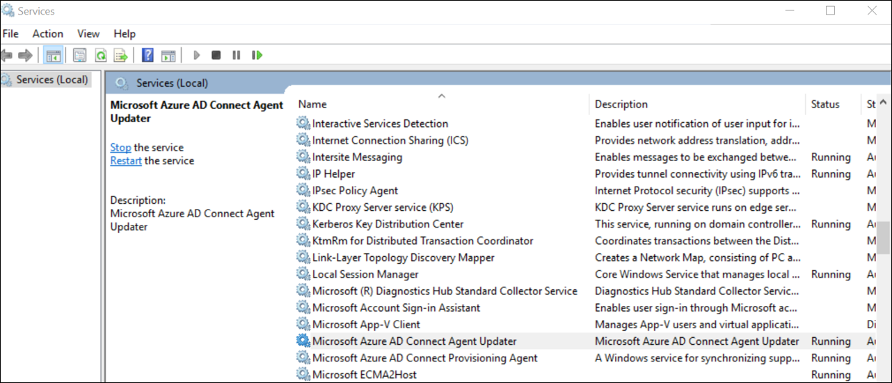
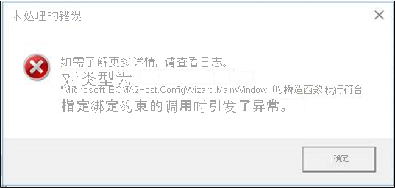
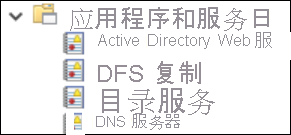
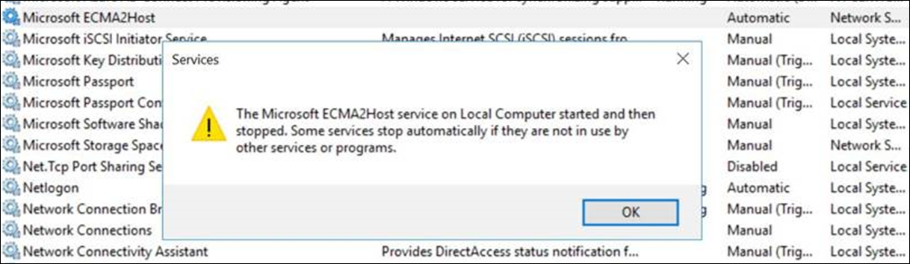
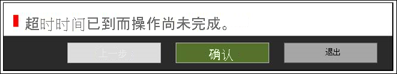

# <a name="troubleshoot-ecma-connector-host-issues"></a>ECMA 连接器主机问题故障排除

>[!IMPORTANT]
> 本地预配预览版目前为仅限受邀请人使用的预览版。 如需请求功能访问权限，请使用[访问请求窗体](https://aka.ms/onpremprovisioningpublicpreviewaccess)”。 未来几个月在我们准备正式发布版的过程中，我们会向更多客户和连接器开放该预览版。

## <a name="troubleshoot-test-connection-issues"></a>测试连接问题故障排除
配置 ECMA 主机和预配代理后，可以测试 Azure Active Directory (Azure AD) 预配服务与预配代理、ECMA 主机和应用程序之间的连接性。 要执行此端到端测试，请在 Azure 门户的应用程序中选择“测试连接”。 如果测试连接失败，请尝试以下故障排除步骤：

 1. 检查代理和 ECMA 主机是否正在运行：
     1. 在安装有代理的服务器上，转到 **开始** > **运行** > **Services.msc** 来打开 **服务**。
     2. 确保“Microsoft Azure AD Connect 代理更新程序”、“Microsoft Azure AD Connect 预配代理”和“Microsoft ECMA2Host”服务包含在“服务”列表中，并且其状态为“正在运行”。
    
        

 2. 选择“故障排除” > “脚本” > “TestECMA2HostConnection”，转到安装 ECMA 主机的文件夹。 运行该脚本。 此脚本发送 SCIM GET 或 POST 请求，以验证 ECMA 连接器主机是否正在运行并响应请求。 应在 ECMA 连接器主机服务本身所在的同一台计算机上运行此脚本。
 3. 转到 Azure 门户中的应用程序，选择“管理员连接性”，选择代理下拉列表，确保代理处于活动状态。
 4. 检查提供的机密令牌是否与本地机密令牌相同。 转到本地，再次提供机密令牌，并将其复制到 Azure 门户。
 5. 确保已将一个或多个代理分配给 Azure 门户中的应用程序。
 6. 分配代理后，需要等待 10 到 20 分钟才能完成注册。 在注册完成之前，连接性测试将无法正常工作。
 7. 确保使用的是有效证书。 转到 ECMA 主机的“设置”选项卡，生成新的证书。
 8. 在虚拟机中转至任务栏，搜索“Microsoft Azure AD Connect 预配代理”，从而重新启动预配代理。 右键单击“停止”，然后选择“启动”。
 9. 在 Azure 门户中预配租户 URL 时，请确保该 URL 遵循以下模式。 可将 `localhost` 替换为主机名，但这并非必要操作。 将 `connectorName` 替换为在 ECMA 主机中指定的连接器名称。 错误消息“资源无效”通常指示 URL 不符合预期格式。
 
    ```
    https://localhost:8585/ecma2host_connectorName/scim
    ```

## <a name="unable-to-configure-the-ecma-host-view-logs-in-event-viewer-or-start-the-ecma-host-service"></a>如果无法配置 ECMA 主机，请在事件查看器中查看日志，或启动 ECMA 主机服务

要解决以下问题，请以管理员身份运行 ECMA 主机：

* 打开 ECMA 主机向导时发生错误。

   

* 可以配置 ECMA 主机向导，但无法看到 ECMA 主机日志。 在这种情况下，需要以管理员身份打开主机，设置一个端到端连接器。 可通过以下方式简化此步骤：导出现有连接器，然后再次导入。 

   

* 可以配置 ECMA 主机向导，但无法启动 ECMA 主机日志。

   


## <a name="turn-on-verbose-logging"></a>启用详细日志记录 

默认情况下，ECMA 连接器主机的 `switchValue` 设置为 `Error`。 此设置意味着将只记录“错误”事件。 要为 ECMA 主机服务或向导启用详细日志记录，请在所示的两个位置将 `switchValue` 设置为 `Verbose`。

详细服务日志记录的文件位置：C:\Program Files\Microsoft ECMA2Host\Service\Microsoft.ECMA2Host.Service.exe.config。
  ```
  <?xml version="1.0" encoding="utf-8"?> 
  <configuration> 
      <startup>  
          <supportedRuntime version="v4.0" sku=".NETFramework,Version=v4.6" /> 
      </startup> 
      <appSettings> 
        <add key="Debug" value="true" /> 
      </appSettings> 
      <system.diagnostics> 
        <sources> 
      <source name="ConnectorsLog" switchValue="Verbose"> 
            <listeners> 
              <add initializeData="ConnectorsLog" type="System.Diagnostics.EventLogTraceListener, System, Version=2.0.0.0, Culture=neutral, PublicKeyToken=b77a5c561934e089" name="ConnectorsLog" traceOutputOptions="LogicalOperationStack, DateTime, Timestamp, Callstack"> 
                <filter type=""/> 
              </add> 
            </listeners> 
          </source> 
          <!-- Choose one of the following switchTrace:  Off, Error, Warning, Information, Verbose --> 
          <source name="ECMA2Host" switchValue="Verbose"> 
            <listeners>  
              <add initializeData="ECMA2Host" type="System.Diagnos
  ```

详细向导日志记录的文件位置：C:\Program Files\Microsoft ECMA2Host\Wizard\Microsoft.ECMA2Host.ConfigWizard.exe.config。
  ```
        <source name="ConnectorsLog" switchValue="Verbose"> 
          <listeners> 
            <add initializeData="ConnectorsLog" type="System.Diagnostics.EventLogTraceListener, System, Version=2.0.0.0, Culture=neutral, PublicKeyToken=b77a5c561934e089" name="ConnectorsLog" traceOutputOptions="LogicalOperationStack, DateTime, Timestamp, Callstack"> 
              <filter type=""/> 
            </add> 
          </listeners> 
        </source> 
        <!-- Choose one of the following switchTrace:  Off, Error, Warning, Information, Verbose --> 
        <source name="ECMA2Host" switchValue="Verbose"> 
          <listeners> 
            <add initializeData="ECMA2Host" type="System.Diagnostics.EventLogTraceListener, System, Version=4.0.0.0, Culture=neutral, PublicKeyToken=b77a5c561934e089" name="ECMA2HostListener" traceOutputOptions="LogicalOperationStack, DateTime, Timestamp, Callstack" /> 
  ```

## <a name="target-attribute-is-missing"></a>缺少目标属性 
预配服务会自动发现目标应用程序中的属性。 如果发现 Azure 门户中的目标属性列表中缺少目标属性，请执行以下故障排除步骤：

 1. 查看 ECMA 主机配置的“选择属性”页，检查是否已选择向 Microsoft Azure 门户公开此属性。
 1. 确保已打开 ECMA 主机服务。 
 1. 查看 ECMA 主机日志，检查是否发出了 /schemas 请求，并查看响应中的属性。 此信息对于支持问题的解决很有价值。

## <a name="collect-logs-from-event-viewer-as-a-zip-file"></a>从事件查看器中以 zip 文件格式收集日志

选择“故障排除” > “脚本”，转到安装 ECMA 主机的文件夹。 以管理员身份运行 `CollectTroubleshootingInfo` 脚本。可使用此脚本以 zip 文件格式捕获日志并将其导出。

## <a name="review-events-in-event-viewer"></a>查看事件查看器中的事件

配置 ECMA 连接器主机架构映射后，请启动该服务，以便其侦听传入连接。 然后，监视传入请求。

  1. 选择“开始”菜单，输入“事件查看器”并选择 **事件查看器**。 
  1. 在“事件查看器”中，展开“应用程序和服务”日志，然后选择“Microsoft ECMA2Host 日志”。 
  1. 在连接器主机收到更改时，事件会写入应用程序日志。 

### <a name="common-errors"></a>常见错误

| 错误      | 解决方法 |
| ----------- | ----------- |
| 无法加载文件或程序集“file:///C:\Program Files\Microsoft ECMA2Host\Service\ECMA\Cache\8b514472-c18a-4641-9a44-732c296534e8\Microsoft.IAM.Connector.GenericSql.dll”或其依赖项之一。 访问被拒绝。      | 确保网络服务帐户对缓存文件夹具有“完全控制”权限。 |
| 对象 DN 的 LDAP 样式无效。 DN：username@domain.com"   | 确保未在 ECMA 主机的“连接”页中选中“DN 是定位点”复选框。 确保在 ECMA 主机的“对象类型”页中选中了“自动生成”复选框。  有关详细信息，请参阅[关于定位点属性和可分辨名称](on-premises-application-provisioning-architecture.md#about-anchor-attributes-and-distinguished-names)。|

## <a name="understand-incoming-scim-requests"></a>了解传入的 SCIM 请求

由 Azure AD 向预配代理和连接器主机发出的请求将使用 SCIM 协议。 从主机向应用发送的请求使用应用支持的协议。 从主机发送到代理再发送到 Azure AD 的请求依赖于 SCIM。 有关 SCIM 实现的更多信息，请参阅[教程：开发和计划 Azure Active Directory 中 SCIM 终结点的预配](use-scim-to-provision-users-and-groups.md)。

在每个预配周期开始时、执行按需预配前以及执行测试连接时，Azure AD 预配服务通常会为[虚拟用户](use-scim-to-provision-users-and-groups.md#request-3)发出 get-user 调用，以确保目标终结点可用，并能够返回符合 SCIM 的响应。 


## <a name="how-do-i-troubleshoot-the-provisioning-agent"></a>如何对预配代理进行故障排除？
你可能会遇到以下错误情况。

### <a name="agent-failed-to-start"></a>代理无法启动

你可能会收到以下错误消息：

“‘Microsoft Azure AD Connect 预配代理’无法启动。 请检查有足够的特权启动系统服务。” 

出现此问题的原因通常是组策略阻止将权限应用于安装程序创建的本地 NT 服务登录帐户 (NT Service\AADConnectProvisioningAgent)。 这些权限是启动服务所必需的。

若要解决此问题，请执行以下操作:

 1. 使用管理员帐户登录到服务器。
 2. 导航到“服务”或者转到“开始” > “运行” > “Services.msc”来打开“服务”。
 3. 在“服务”下，双击“Microsoft Azure AD Connect 预配代理”。
 4. 在“登录”选项卡上，将此帐户更改为域管理员。然后重启服务。 

此测试验证代理是否可以通过端口 443 与 Azure 通信。 打开浏览器，然后通过安装有代理的服务器转到上一个 URL。

### <a name="agent-times-out-or-certificate-is-invalid"></a>代理超时或证书无效

尝试注册代理时，可能会收到以下错误消息。



此问题通常是由于代理无法连接到混合标识服务所导致，并且需要你配置 HTTP 代理。 若要解决此问题，请配置出站代理。 

预配代理支持使用出站代理。 可通过编辑代理配置文件“C:\Program Files\Microsoft Azure AD Connect Provisioning Agent\AADConnectProvisioningAgent.exe.config”对其进行配置。在文件的末尾添加以下行，恰好添加在尾随的 `</configuration>` 标记前面。
将变量 `[proxy-server]` 和 `[proxy-port]` 替换为代理服务器名称和端口值。

```xml
    <system.net>
        <defaultProxy enabled="true" useDefaultCredentials="true">
            <proxy
                usesystemdefault="true"
                proxyaddress="http://[proxy-server]:[proxy-port]"
                bypassonlocal="true"
            />
        </defaultProxy>
    </system.net>
```
### <a name="agent-registration-fails-with-security-error"></a>代理注册失败，出现安全错误

安装云预配代理时可能会收到错误消息。

出现此问题的原因通常是由于本地 PowerShell 执行策略，代理无法执行 PowerShell 注册脚本。

若要解决此问题，请更改服务器上的 PowerShell 执行策略。 需要将“计算机和用户策略”设置为“Undefined”或“RemoteSigned”。 如果设置为“Unrestricted”，则会看到此错误。 有关详细信息，请参阅 [PowerShell 执行策略](/powershell/module/microsoft.powershell.core/about/about_execution_policies?view=powershell-6)。 

### <a name="log-files"></a>日志文件

默认情况下，代理发出最少的错误消息和堆栈跟踪信息。 可以在 C:\ProgramData\Microsoft\Azure AD Connect Provisioning Agent\Trace 文件夹中找到这些跟踪日志。

要收集有关代理相关问题故障排除的更多信息，请执行以下操作：

 1. 按照 [Azure AD Connect 云同步的 AADCloudSyncTools Power Shell 模块](../../active-directory/cloud-sync/reference-powershell.md#install-the-aadcloudsynctools-powershell-module)中所述安装 AADCloudSyncTools PowerShell 模块。
 2. 使用 `Export-AADCloudSyncToolsLogs` PowerShell cmdlet 捕获信息。 使用以下开关微调数据收集。 使用：

      - “SkipVerboseTrace”用于仅导出当前日志而不捕获详细日志（默认值 = false）。
      - “TracingDurationMins”用于指定不同的捕获持续时间（默认值 = 3 分钟）。
      - “OutputPath”用于指定不同的输出路径（默认值 = 用户的文档）。

---------------------

使用 Azure AD，可以在云端监控预配服务、收集本地日志。 预配服务针对在同步过程中评估的每个用户记录日志。 可以通过 [Azure 门户 UI、API 和日志分析](../reports-monitoring/concept-provisioning-logs.md)来使用这些日志。 ECMA 主机还会生成本地日志。 显示收到的每个预配请求，以及发送到 Azure AD 的响应。

### <a name="agent-installation-fails"></a>代理安装失败
* `System.ComponentModel.Win32Exception: The specified service already exists` 错误表示以前的 ECMA 主机没有成功卸载。 请卸载主机应用程序。 转到程序文件，删除 ECMA 主机文件夹。 你可能想要存储用于备份的配置文件。 
* 以下错误表明未满足先决条件。 确保你已经安装了 .NET 4.7.1。

  ```
    Method Name : <>c__DisplayClass0_1 : 
    RegisterNotLoadedAssemblies Error during load assembly: System.Management.Automation.resources.dll
    --------- Outer Exception Data ---------
    Message: Could not load file or assembly 'file:///C:\Program Files\Microsoft ECMA2Host\Service\ECMA\System.Management.Automation.resources.dll' or one of its dependencies. The system cannot find the file specified.

  ```

### <a name="i-am-getting-an-invalid-ldap-style-dn-error-when-trying-to-configure-the-ecma-connector-host-with-sql"></a>尝试使用 SQL 配置 ECMA 连接器主机时，收到了 LDAP 样式 DN 无效错误
默认情况下，genericSQL 连接器要求使用 LDAP 样式填充 DN（在第一个连接页中未选中“DN 是定位点”属性时）。 在上面的错误消息中，可以看到 DN 是 UPN，而不是连接器需要的 LDAP 样式 DN。 

若要解决此问题，请确保配置连接器时在“对象类型”页上选择“自动生成”。

有关详细信息，请参阅[关于定位点属性和可分辨名称](on-premises-application-provisioning-architecture.md#about-anchor-attributes-and-distinguished-names)。

## <a name="next-steps"></a>后续步骤

- [Azure AD ECMA 连接器主机安装](on-premises-ecma-install.md)
- [Azure AD ECMA 连接器主机配置](on-premises-ecma-configure.md)
- [泛型 SQL 连接器](on-premises-sql-connector-configure.md)
- [教程：ECMA 连接器主机泛型 SQL 连接器](tutorial-ecma-sql-connector.md)
