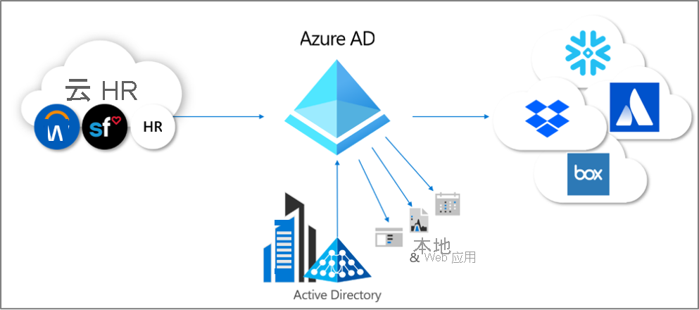

# Azure Active Directory 中的应用预配是什么？

在 Azure Active Directory (Azure AD) 中，术语“应用预配”是指自动为应用程序创建用户标识和角色。
    

Azure AD 到服务型软件 (SaaS) 应用程序的预配是指在用户需要访问的云 ([SaaS](https://azure.microsoft.com/overview/what-is-saas/)) 应用程序中自动创建用户标识和角色。 除了创建用户标识外，自动预配还包括在状态或角色发生更改时维护和删除用户标识。 常见方案包括将 Azure AD 用户预配到 [Dropbox](../../active-directory/saas-apps/dropboxforbusiness-provisioning-tutorial.md)、[Salesforce](../../active-directory/saas-apps/salesforce-provisioning-tutorial.md)、[ServiceNow](../../active-directory/saas-apps/servicenow-provisioning-tutorial.md) 等应用程序中。

Azure AD 支持在 SaaS 应用程序以及本地托管的应用程序或基础结构即服务 (IaaS) 解决方案（如虚拟机）中预配用户。 你可能有一个依赖于 LDAP 用户存储或 SQL 数据库的旧式应用程序。 借助 Azure AD 预配服务，可以在本地应用程序中创建、更新和删除用户，而无需打开防火墙或处理 TCP 端口。 

使用轻型代理可以在本地应用程序中预配用户并管理访问权限。 将 Azure AD 与应用程序代理结合使用时，可以管理对本地应用程序的访问，并提供自动用户预配（通过预配服务）和单一登录（通过应用代理）。 

应用预配可让你：

- 自动预配：在新人加入团队或组织时，在适当的系统中为他们自动创建新帐户。
- **自动取消预配**：在新人离开团队或组织时，在适当的系统中自动停用其帐户。
- **同步系统之间的数据**：确保应用和系统中的标识基于目录中的更改或人力资源系统保持最新。
- **预配组**：将组预配到支持它们的应用程序。
- **管理访问权限**：监视和审核已预配到应用程序中的人员。
- **在棕地方案中无缝部署**：在系统之间匹配现有标识，允许轻松集成，即使目标系统中已存在用户也是如此。
- **使用丰富的自定义**：利用可自定义的属性映射，以定义应将哪些用户数据从源系统流向目标系统。
- **获取关键事件的警报**：预配服务针对关键事件提供警报，允许进行 Log Analytics 集成，以便你可以在其中定义自定义警报来满足业务需求。

## 什么是 SCIM？

为了帮助自动进行预配和取消预配，应用会公开专有用户和组 API。 但是，尝试在多个应用中管理用户的任何人都会告诉你，每个应用都尝试执行相同的操作，例如创建或更新用户、将用户添加到组或取消预配用户。 不过，所有这些操作的实现方式都稍有不同，它们使用不同的终结点路径、用于指定用户信息的不同方法以及用于表示信息的每个元素的不同架构。

为了解决这些难题，跨域身份管理系统 (SCIM) 规范提供了一个公共用户架构，可帮助用户移入、移出应用和围绕应用移动。 SCIM 正在成为预配的事实标准，与联合标准（例如安全断言标记语言 (SAML) 或 OpenID Connect (OIDC)）结合使用时，可为管理员提供基于标准的端到端访问权限管理解决方案。

有关开发 SCIM 终结点以自动将用户和组预配和取消预配到应用程序的详细指南，请参阅[生成 SCIM 终结点并配置用户预配](use-scim-to-provision-users-and-groups.md)。 对于库中预先集成的应用程序（例如 Slack、Azure Databricks 和 Snowflake），可以跳过开发人员文档，并使用[用于将 SaaS 应用程序与 Azure Active Directory 集成的教程](../../active-directory/saas-apps/tutorial-list.md)中提供的教程。

## 手动预配与自动预配

Azure AD 库中的应用程序支持以下两种预配模式之一：

* 手动预配意味着尚没有用于应用的自动 Azure AD 预配连接器。 用户帐户必须手动创建。 例如将用户直接添加到应用的管理门户中，或上传包含用户帐户详细信息的电子表格。 请查阅应用提供的文档，或联系应用开发人员以确定可以使用哪些机制。
* **自动化** 意味着已为此应用程序开发了 Azure AD 预配连接器。 请遵循特定于设置应用程序预配的设置教程。 可以在[用于将 SaaS 应用程序与 Azure Active Directory 集成的教程](../../active-directory/saas-apps/tutorial-list.md)中查找应用教程。

将应用程序添加到企业应用后，应用程序支持的预配模式也会显示在“预配”选项卡上。

## 自动预配的优点

随着现代组织中使用的应用程序数不断增长，IT 管理员承担了大规模访问管理任务。 SAML 或 OIDC 等标准使管理员可以快速设置单一登录 (SSO)，但访问还需要将用户预配到应用中。 对于许多管理员而言，预配意味着手动创建每个用户帐户或每周上传 CSV 文件。 这些过程非常耗时、成本高昂且容易出错。 已采用 SAML 实时 (JIT) 等解决方案来自动进行预配。 企业还需要一个解决方案，以便在用户离开组织或不再需要基于角色更改访问某些应用时对用户取消预配。

使用自动预配的一些常见动机包括：

- 最大程度提高预配过程的效率和准确性。
- 节省与托管和维护定制开发的预配解决方案和脚本相关的成本。
- 通过在用户离开组织时立即删除其在关键 SaaS 应用中的标识，从而保护组织。
- 轻松将大量用户导入特定的 SaaS 应用程序或系统。
- 享用一组策略，确定已预配哪些用户，以及哪些用户可登录应用。

Azure AD 用户预配可帮助解决这些难题。 若要了解有关客户如何使用 Azure AD 用户预配的详细信息，请阅读 [ASOS 案例研究](https://aka.ms/asoscasestudy)。 以下视频概述了 Azure AD 中的用户预配。

> [!VIDEO https://www.youtube.com/embed/_ZjARPpI6NI]

## 可在哪些应用程序和系统中使用 Azure AD 自动用户预配？

Azure AD 功能预先集成了对许多常见 SaaS 应用和人力资源系统的支持，以及对实现 [SCIM 2.0 标准](https://techcommunity.microsoft.com/t5/Identity-Standards-Blog/Provisioning-with-SCIM-getting-started/ba-p/880010)特定部分的应用的一般性支持。

* **预先集成的应用程序（库 SaaS 应用）** ：可以在[用于将 SaaS 应用程序与 Azure Active Directory 集成的教程](../saas-apps/tutorial-list.md)中查找 Azure AD 支持预先集成的预配连接器的所有应用程序。 库中列出的预先集成应用程序通常使用基于 SCIM 2.0 的用户管理 API 进行预配。 

   

   如果要请求新应用程序进行预配，可以[请求将应用程序与应用库集成集成](../develop/v2-howto-app-gallery-listing.md)。 对于用户预配请求，我们要求应用程序具有与符合 SCIM 标准的终结点。 请求应用程序供应商遵循 SCIM 标准，以便我们可以将应用快速加入我们的平台。

* **支持 SCIM 2.0 的应用程序**：有关如何在一般情况下连接实现基于 SCIM 2.0 的用户管理 API 的应用程序的信息，请参阅[生成 SCIM 终结点并配置用户预配](use-scim-to-provision-users-and-groups.md)。

## 如何设置为自动预配到应用程序？

对于库中列出的预先集成应用程序，提供了用于设置自动预配的分步指导。 请参阅[用于将 SaaS 应用程序与 Azure Active Directory 集成的教程](../saas-apps/tutorial-list.md)。 以下视频演示如何设置 SalesForce 的自动用户预配。

> [!VIDEO https://www.youtube.com/embed/pKzyts6kfrw]

对于支持 SCIM 2.0 的其他应用程序，请按照[生成 SCIM 终结点并配置用户预配](use-scim-to-provision-users-and-groups.md)中的步骤进行操作。

## 后续步骤

- [有关如何集成 SaaS 应用的教程列表](../saas-apps/tutorial-list.md)
- [为用户预配自定义属性映射](customize-application-attributes.md)
- [用于用户预配的范围筛选器](define-conditional-rules-for-provisioning-user-accounts.md)
