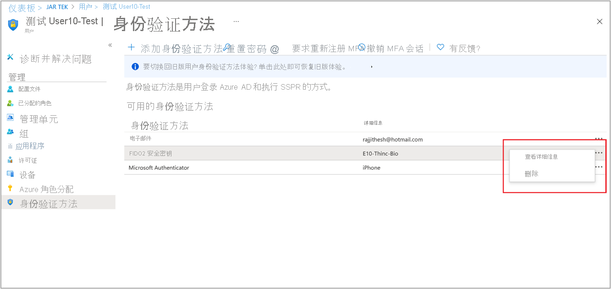

# 启用无密码安全密钥登录 

对于目前使用密码并且具有共享的 PC 环境的企业，安全密钥为工作者提供了无需输入用户名或密码即可进行身份验证的无缝方式。 安全密钥可提高工作者的工作效率，并且安全性更高。

本文档重点介绍如何启用基于安全密钥的无密码身份验证。 在本文末尾，你将能够使用 FIDO2 安全密钥通过 Azure AD 帐户登录到基于 Web 的应用程序。

## 要求

- [Azure AD 多重身份验证](howto-mfa-getstarted.md)
- 启用[合并安全信息注册](concept-registration-mfa-sspr-combined.md)
- 兼容的 [FIDO2 安全密钥](concept-authentication-passwordless.md#fido2-security-keys)
- WebAuthN 需要 Windows 10 版本 1903 或更高版本**

若要使用安全密钥来登录 Web 应用和服务，你必须具有支持 WebAuthN 协议的浏览器。 这种浏览器包括 Microsoft Edge、Chrome、Firefox 和 Safari。

## 准备设备

对于已加入 Azure AD 的设备，最佳体验是在 Windows 10 版本 1903 或更高版本上。

已加入混合 Azure AD 的设备必须运行 Windows 10 版本 2004 或更高版本。

## 启用无密码身份验证方法

### 启用合并注册体验

适用于无密码身份验证方法的注册功能依赖于合并注册功能。 请按照[启用合并安全信息注册](howto-registration-mfa-sspr-combined.md)一文中的步骤来启用合并注册。

### 启用 FIDO2 安全密钥方法

1. 登录 [Azure 门户](https://portal.azure.com)。
1. 浏览到“Azure Active Directory” > “安全” > “身份验证方法” > “身份验证方法策略”   。
1. 在方法“FIDO2 安全密钥”下，选择以下选项：
   1. “启用”-“是”或“否”
   1. “目标”-“所有用户”或“选择用户”
1. 保存配置。

### FIDO 安全密钥可选设置 

有一些安全密钥的可选设置，可用于管理每个租户。  

 

**常规**

- “允许自助设置”应保持设置为“是”。 如果设置为“否”，那么你的用户将无法通过 MySecurityInfo 门户注册 FIDO 密钥，即使通过身份验证方法策略启用也是如此。  
- “强制证明”设置为“是”，需要 FIDO 安全密钥元数据通过 FIDO 联盟元数据服务进行发布和验证，还可以通过 Microsoft 的其他验证测试集。 有关详细信息，请参阅[何为 Microsoft 兼容的安全密钥？](/windows/security/identity-protection/hello-for-business/microsoft-compatible-security-key)

**密钥限制策略**

- “强制实施密钥限制”设置为“是”的情况仅限于你的组织仅允许或禁止特定的 FIDO 安全密钥（由它们的 AAGuids 进行标识）。 你可以使用安全密钥提供程序来确定它们设备的 AAGuid。 如果已注册密钥，还可以通过查看每个用户的密钥的身份验证方法详细信息来找到 AAGUID。 

## 禁用密钥 

若要删除与用户帐户关联的 FIDO2 密钥，请从用户的身份验证方法中删除该密钥。

1. 登录到 Azure AD 门户，然后搜索要从中删除 FIDO 密钥的用户帐户。
1. 选中“身份验证方法”> 右击“FIDO2 安全密钥”，然后单击“删除”。 

    

## 安全密钥身份验证器证明 GUID (AAGUID)

FIDO2 规范要求每个安全密钥提供程序在证明期间提供身份验证器证明 GUID (AAGUID)。 AAGUID 是指示密钥类型的 128 位标识符，如制造商和型号。 

>[!NOTE]
>制造商必须确保该制造商所产成的所有完全相同的密钥的 AAGUID 完全相同，并且不同于（概率较高）所有其他类型密钥的 AAGUID。 为了确保这一点，应随机生成给定类型安全密钥的 AAGUID。 有关详细信息，请参阅 [Web 身份验证：用于访问公钥凭据的 API - 级别 2 (w3.org)](https://w3c.github.io/webauthn/)。

可通过两种方式获取你的 AAGUID。 你可以询问安全密钥供应商，或查看每个用户的密钥的身份验证方法详细信息。

## FIDO2 安全密钥的用户注册和管理

1. 浏览到 [https://myprofile.microsoft.com](https://myprofile.microsoft.com)。
1. 如果尚未登录，请登录。
1. 单击“安全信息”。
   1. 如果用户已注册至少一种 Azure AD 多重身份验证方法，则他们可以立即注册 FIDO2 安全密钥。
   1. 如果他们尚未注册任何 Azure AD 多重身份验证方法，则必须添加一种。
1. 通过单击“添加方法”并选择“安全密钥”来添加 FIDO2 安全密钥 。
1. 选择“USB 设备”或“NFC 设备”。
1. 准备好密钥，然后选择“下一步”。
1. 屏幕上将会出现一个框，要求用户为你的安全密钥创建/输入 PIN，然后为该密钥执行所需的笔势（生物识别或触摸）。
1. 用户将返回到合并注册体验，并需要为密钥提供有意义的名称，以便识别出特定密钥（如果他们有多个密钥）。 单击“下一步”。
1. 单击“完成”以完成此过程。

## 通过无密码凭据登录

在下面的示例中，用户已预配 FIDO2 安全密钥。 在 Windows 10 版本 1903 或更高版本中，用户可以选择在受支持的浏览器内使用 FIDO2 安全密钥登录 Web。

## 故障排除和反馈

如果你想要共享有关此功能的反馈或遇到的问题，请使用以下步骤，通过 Windows 反馈中心应用来进行共享：

1. 启动反馈中心并确保你已登录。
1. 按照以下分类提交反馈：
   - 类别：安全和隐私
   - 子类别：FIDO
1. 若要捕获日志，请使用选项“重新创建问题”。

## 已知问题

### 安全密钥预配

管理员预配和取消预配安全密钥不可用。

### UPN 更改

如果用户的 UPN 发生更改，你将无法再修改 FIDO2 安全密钥来消除该更改。 为 FIDO2 安全密钥用户提供的解决方案是登录到 MySecurityInfo，删除旧密钥并添加一个新密钥。

## 后续步骤

[FIDO2 安全密钥 Windows 10 登录](howto-authentication-passwordless-security-key-windows.md)

[对本地资源启用 FIDO2 身份验证](howto-authentication-passwordless-security-key-on-premises.md)

[详细了解如何注册设备](../devices/overview.md)

[详细了解 Azure AD 多重身份验证](../authentication/howto-mfa-getstarted.md)