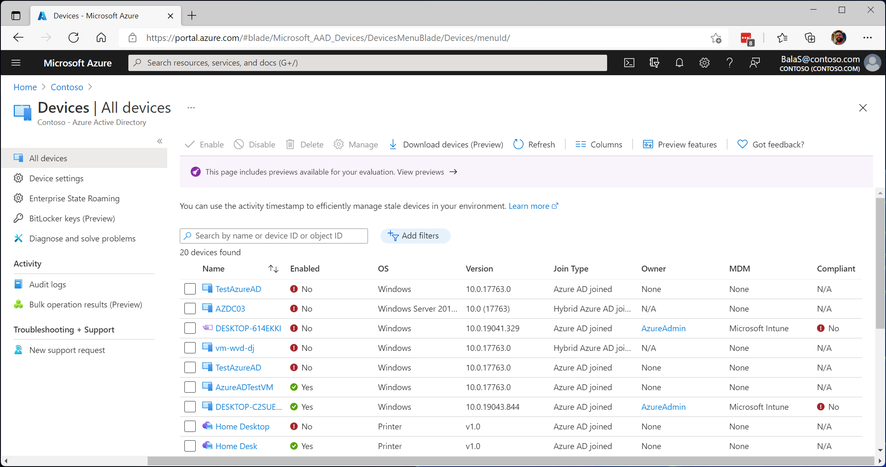

# 什么是设备标识？

[设备标识](/graph/api/resources/device?view=graph-rest-1.0&preserve-view=true)是 Azure Active Directory (Azure AD) 中的一个对象。 此设备对象类似于用户、组或应用程序。 设备标识为管理员提供信息，供其在做出访问或配置决策时使用。

有三种方法可以获取设备标识：

- Azure AD 注册
- Azure AD 加入
- 混合 Azure AD 加入

设备标识是[基于设备的条件访问策略](../conditional-access/require-managed-devices.md)和[具有 Microsoft Endpoint Manager 的移动设备管理](/mem/endpoint-manager-overview)等方案的先决条件。

## 新式设备方案

新式设备方案侧重于以下两种方法： 

- [Azure AD 注册](concept-azure-ad-register.md) 
   - 自带设备办公 (BYOD)
   - 移动设备（手机和平板电脑）
- [Azure AD 加入](concept-azure-ad-join.md)
   - 组织拥有的 Windows 10 设备
   - [组织中作为 Azure 中的 VM 运行的 Windows Server 2019 及更高版本的服务器](howto-vm-sign-in-azure-ad-windows.md)

[混合 Azure AD 联接](concept-azure-ad-join-hybrid.md)被视为实现 Azure AD 联接的过渡步骤。 混合 Azure AD 联接为组织提供对下层 Windows 版本（Windows 7 和 Server 2008）的支持。 这三种方案可以在单个组织中共存。

## 资源访问

将设备注册并联接到 Azure AD，可以让用户无缝登录 (SSO) 到基于云的资源。

已建立 Azure AD 联接的设备受益于[对组织的本地资源的 SSO](azuread-join-sso.md)。

## 设置

可通过自助方式或者或由管理员管理的受控过程，将设备加入 Azure AD。

## 许可要求

[!INCLUDE [Active Directory P1 license](../../../includes/active-directory-p1-license.md)]

## 后续步骤

- 详细了解[已注册到 Azure AD 的设备](concept-azure-ad-register.md)
- 详细了解[已加入 Azure AD 的设备](concept-azure-ad-join.md)
- 详细了解[已加入混合 Azure AD 的设备](concept-azure-ad-join-hybrid.md)
- 若要大致了解如何在 Azure 门户中管理设备标识，请参阅[使用 Azure 门户管理设备标识](device-management-azure-portal.md)。
- 若要详细了解基于设备的条件访问，请参阅[配置 Azure Active Directory 基于设备的条件访问策略](../conditional-access/require-managed-devices.md)。
