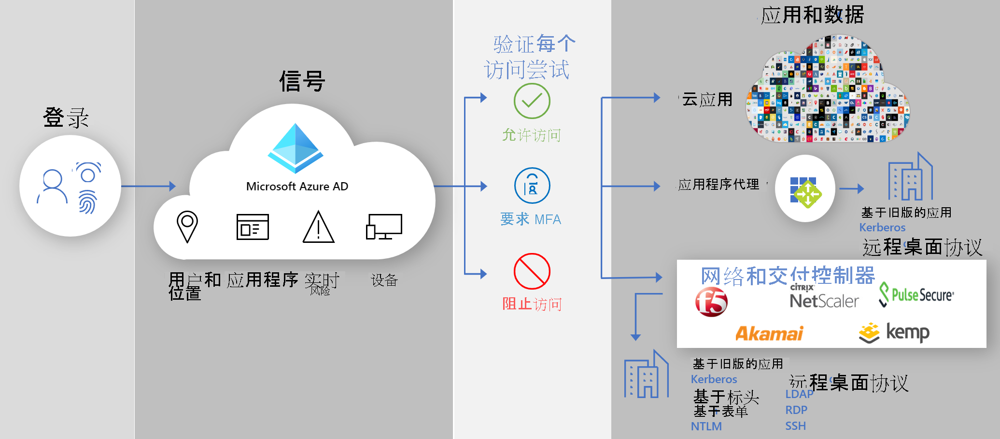

# 安全混合访问：使用 Azure Active Directory 保护旧应用

现在可以通过使用以下功能，将本地的和云中的旧身份验证应用程序连接到 Azure Active Directory (AD)，以保护这些应用程序：

- [Azure AD 应用程序代理](#secure-hybrid-access-through-azure-ad-application-proxy)

- [安全的混合访问合作伙伴](#secure-hybrid-access-through-azure-ad-partner-integrations)

可以使用 Azure AD 功能（例如 [Azure AD 条件访问](https://docs.microsoft.com/azure/active-directory/conditional-access/overview)和 [Azure AD 标识保护](https://docs.microsoft.com/azure/active-directory/identity-protection/overview-identity-protection)）跨所有应用程序弥补差异并增强安全态势。 通过将 Azure AD 作为标识提供者 (IDP)，可以使用新式身份验证和授权方法（如[单一登录 (SSO)](https://docs.microsoft.com/azure/active-directory/manage-apps/what-is-single-sign-on) 和[多重身份验证 (MFA)](https://docs.microsoft.com/azure/active-directory/authentication/concept-mfa-howitworks)）来保护本地旧版应用程序。

## 通过 Azure AD 应用程序代理进行安全的混合访问
  
使用[应用程序代理](https://docs.microsoft.com/azure/active-directory/app-proxy/what-is-application-proxy)，可以提供对本地 Web 应用程序的[安全远程访问](https://docs.microsoft.com/azure/active-directory/app-proxy/application-proxy-add-on-premises-application)。 用户不需要使用 VPN。 用户获得的好处是：可以在进行 [SSO](https://docs.microsoft.com/azure/active-directory/app-proxy/application-proxy-config-sso-how-to#how-to-configure-single-sign-on) 后轻松地从任何设备连接到他们的应用程序。 应用程序代理将远程访问作为服务提供，并且允许向公司网络外部的用户[轻松发布本地应用程序](https://docs.microsoft.com/azure/active-directory/app-proxy/application-proxy-add-on-premises-application)。 它有助于缩放云访问管理，不需要你修改本地应用程序。 接下来，请[计划 Azure AD 应用程序代理](https://docs.microsoft.com/azure/active-directory/app-proxy/application-proxy-deployment-plan)部署。

## 通过 Azure AD 合作伙伴集成实现安全的混合访问  

除了 [Azure AD 应用程序代理](https://aka.ms/whyappproxy)之外，Microsoft 还与第三方提供商合作，实现对本地应用程序和使用旧式身份验证的应用程序进行安全访问的功能。

下列合作伙伴提供预建的解决方案来支持按应用程序实施的条件访问策略，并提供有关 Azure AD 集成的详细指南。 

- [Akamai 企业应用程序访问](https://docs.microsoft.com/azure/active-directory/saas-apps/akamai-tutorial)

- [Citrix 应用程序传送控制器 (ADC)](https://docs.microsoft.com/azure/active-directory/saas-apps/citrix-netscaler-tutorial)  

- [Datawiza Access Broker](https://docs.microsoft.com/azure/active-directory/manage-apps/add-application-portal-setup-oidc-sso)

- [F5 Big-IP APM ADC](https://docs.microsoft.com/azure/active-directory/manage-apps/f5-aad-integration)

- [F5 Big-IP APM VPN](https://docs.microsoft.com/azure/active-directory/manage-apps/f5-aad-password-less-vpn)

- [Kemp](https://docs.microsoft.com/azure/active-directory/saas-apps/kemp-tutorial)

- [Perimeter 81](https://docs.microsoft.com/azure/active-directory/saas-apps/perimeter-81-tutorial)

- [Silverfort Authentication Platform](https://docs.microsoft.com/azure/active-directory/manage-apps/add-application-portal-setup-oidc-sso)

- [Strata](https://docs.microsoft.com/azure/active-directory/saas-apps/maverics-identity-orchestrator-saml-connector-tutorial)

下列合作伙伴提供预建解决方案和有关 Azure AD 集成的详细指南。 

- [Cisco AnyConnect](https://docs.microsoft.com/azure/active-directory/saas-apps/cisco-anyconnect)

- [Fortinet](https://docs.microsoft.com/azure/active-directory/saas-apps/fortigate-ssl-vpn-tutorial)

- [Palo Alto Networks Global Protect](https://docs.microsoft.com/azure/active-directory/saas-apps/paloaltoadmin-tutorial)

- [Pulse Secure Pulse Connect Secure (PCS)](https://docs.microsoft.com/azure/active-directory/saas-apps/pulse-secure-pcs-tutorial)

- [Pulse Secure 虚拟流量管理器 (VTM)](https://docs.microsoft.com/azure/active-directory/saas-apps/pulse-secure-virtual-traffic-manager-tutorial)

- [Zscaler Private Access (ZPA)](https://docs.microsoft.com/azure/active-directory/saas-apps/zscalerprivateaccess-tutorial)
