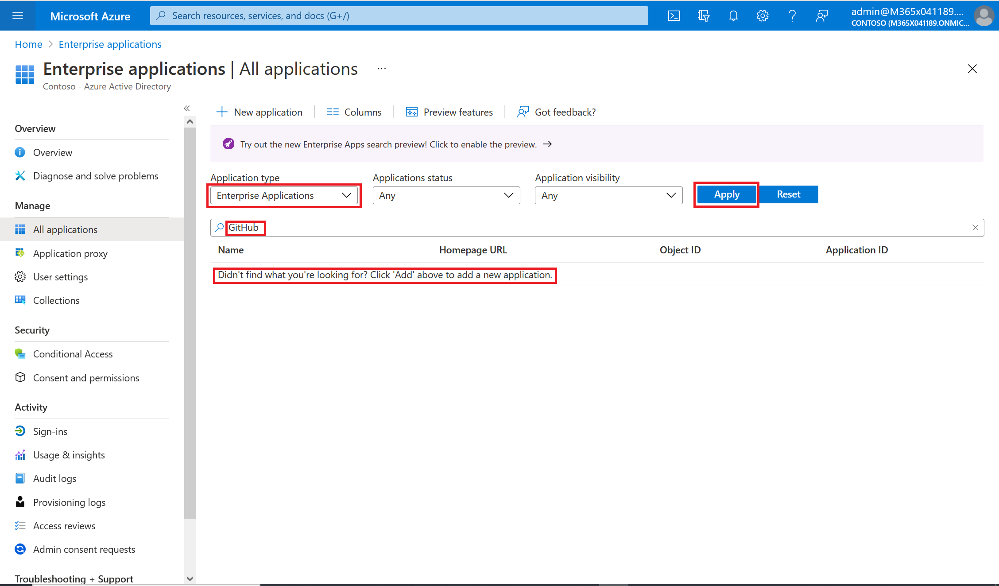
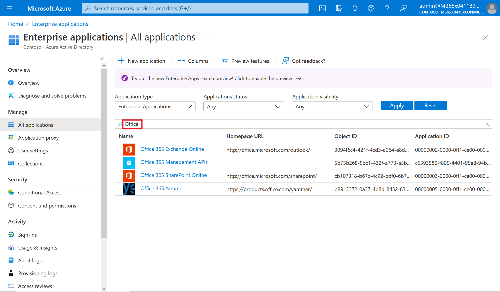

# <a name="quickstart-view-the-list-of-applications-in-your-tenant"></a>快速入门：查看租户中应用程序的列表

将 Azure AD 用作组织使用的应用程序的标识和访问管理 (IAM) 系统以开始使用。 在本快速入门中，你将查看已设置为使用 Azure AD 租户作为其标识提供者 (IdP) 的应用程序（也称为应用）。

## <a name="prerequisites"></a>先决条件

若要查看已在 Azure AD 租户中注册的应用程序，你需要：

- 一个 Azure 帐户。 [免费创建帐户](https://azure.microsoft.com/free/?WT.mc_id=A261C142F)。

>[!IMPORTANT]
>建议使用非生产环境来测试此快速入门中的步骤。

[!INCLUDE [cloud-shell-try-it.md](../../../includes/cloud-shell-try-it.md)]

若要在本地安装和使用 CLI，请运行 Azure CLI 2.0.4 或更高版本。 运行 `az --version` 即可查找版本。 如需进行安装或升级，请参阅[安装 Azure CLI](/cli/azure/install-azure-cli)。

## <a name="find-the-list-of-applications-in-your-tenant"></a>查找租户中的应用程序列表

查看在租户中注册的应用程序，方法如下：

# <a name="portal"></a>[门户](#tab/azure-portal)

向 Azure AD 租户注册的应用程序可以在 Azure 门户的“企业应用”部分中查看。

1. 登录到 [Azure 门户](https://portal.azure.com)。
2. 在“Azure 服务”窗格中，选择“企业应用程序”。 
3. 在“应用程序类型”下拉菜单中选择“所有应用程序”，然后选择“应用”  。 此时会显示租户应用程序的随机示例。
4. 若要查看更多应用程序，请选择列表底部的“加载更多”。 如果租户中有大量应用程序，则也许搜索特定应用程序要比滚动浏览整个列表容易些。 搜索特定的应用程序将在本快速入门的后面部分进行介绍。

# <a name="azure-cli"></a>[Azure CLI](#tab/azure-cli)

使用 [az ad app](/cli/azure/ad/app) 命令登录并使用应用程序。

```azurecli
az login

az ad app list --all
```

---

## <a name="select-viewing-options"></a>选择查看选项

选择查找的内容选择所需的选项。

# <a name="portal"></a>[门户](#tab/azure-portal)

1. 可以根据“应用程序类型”、“应用程序状态”和“应用程序可见性”查看应用程序。  
2. 在“应用程序类型”下选择下述选项之一：
    - “企业应用程序”显示非 Microsoft 应用程序。
    - “Microsoft 应用程序”显示 Microsoft 应用程序。
    - “所有应用程序”显示非 Microsoft 应用程序和 Microsoft 应用程序。
3. 在“应用程序状态”下选择“任何”、“已禁用”或“已启用”。    “任何”选项包括已禁用和已启用的应用程序。
4. 在“应用程序可见性”下选择“任何”或“已隐藏”  。 “已隐藏”选项显示租户中存在的、但对用户不可见的应用程序。
5. 选择所需的选项后，选择“应用”。

# <a name="azure-cli"></a>[Azure CLI](#tab/azure-cli)

```azurecli
az ad app list --filter "displayname eq 'test' and servicePrincipalType eq 'Application'"
```

---

## <a name="search-for-an-application"></a>搜索应用程序

搜索特定的应用程序：

# <a name="portal"></a>[门户](#tab/azure-portal)

1. 在“应用程序类型”菜单中，选择“所有应用程序”，然后选择“应用”  。
2. 输入要查找的应用程序的名称。 如果该应用程序已添加到 Azure AD 租户中，则会显示在搜索结果中。 此示例显示 GitHub 尚未添加到租户应用程序中。
    
3. 尝试输入应用程序名称的头几个字母。 此示例显示以“Office”开头的所有应用程序。
    

# <a name="azure-cli"></a>[Azure CLI](#tab/azure-cli)

```azurecli
az ad app show --id 710abb12-abeb-40ba-91ab-4b1f44f9ceb8 --query 'objectId' -o json
```

---

> [!TIP]
> 可使用 Graph API 自动管理应用，具体请参阅[使用 Microsoft Graph API 自动管理应用](/graph/application-saml-sso-configure-api)。

## <a name="clean-up-resources"></a>清理资源

你没有在此快速入门中创建任何新资源，因此没有要清理的内容。

## <a name="next-steps"></a>后续步骤

请继续到下一篇文章，了解如何使用 Azure AD 作为应用的标识提供程序。
> [!div class="nextstepaction"]
> [添加应用](add-application-portal.md)
