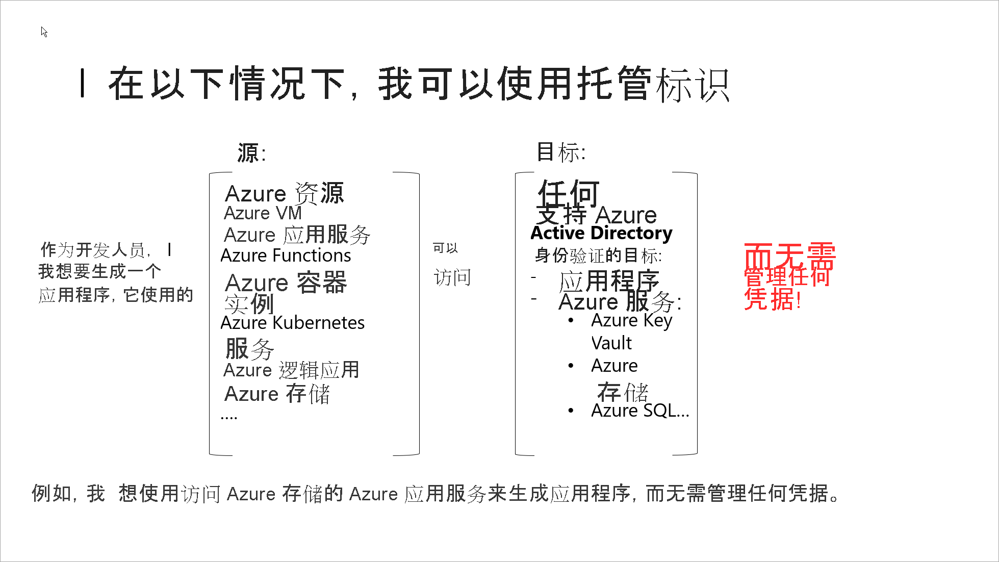

# 什么是 Azure 资源的托管标识？

开发人员面临的一个共同挑战是如何管理密码和凭据，以确保构成解决方案的不同组件之间的通信安全。 托管标识使开发人员无需管理凭据。 托管标识为应用程序提供一个标识，可以在连接到支持 Azure Active Directory (Azure AD) 身份验证的资源时使用。 应用程序可以使用托管标识来获取 Azure AD 令牌。 例如，应用程序可以使用托管标识来访问 [Azure 密钥保管库](../../key-vault/general/overview.md) 等资源，开发人员可以采用安全的方式存储凭据或访问存储帐户。

看看如何使用托管标识 

> [!VIDEO https://channel9.msdn.com/Shows/On-NET/Using-Azure-Managed-identities/player?format=ny]

下面是使用托管标识的一些好处：

- 你无需管理凭据， 而且你甚至可能都无法访问凭据。
- 你可以使用托管标识对支持 [Azure Active Directory 身份验证](../authentication/overview-authentication.md)（包括你自己的应用程序）的任何资源进行身份验证。
- 无需额外付费也可使用托管标识。

> [!NOTE]
> Azure 资源托管标识是以前称为托管服务标识 (MSI) 的服务的新名称。

## 托管标识类型

托管标识分为两种类型：

- **系统分配**：某些 Azure 服务允许你直接在服务实例上启用托管标识。 启用系统分配的托管标识后，系统会在 Azure AD 中创建一个与该服务实例的生命周期相关联的标识。 因此，资源被删除时，Azure 会自动删除标识。 按照设计，只有该 Azure 资源可以使用此标识从 Azure AD 请求令牌。
- **用户分配**：你也可以将托管标识创建为独立的 Azure 资源。 你可以[创建用户分配的托管标识](how-to-manage-ua-identity-portal.md)，并将其分配给一个或多个 Azure 服务实例。 对于用户分配的托管标识，标识与使用它的资源分开管理。   

下表显示了这两种托管标识之间的差异。

|  属性    | 系统分配的托管标识 | 用户分配的托管标识 |
|------|----------------------------------|--------------------------------|
| 创建 |  作为 Azure 资源（例如 Azure 虚拟机或 Azure 应用服务）的一部分创建 | 作为独立 Azure 资源创建 |
| 生命周期 | 与用于创建托管标识的 Azure 资源共享生命周期。   删除父资源时，也会删除托管标识。 | 独立生命周期。   必须显式删除。 |
| 在 Azure 资源之间共享 | 无法共享。   只能与单个 Azure 资源相关联。 | 可以共享   用户分配的同一个托管标识可以关联到多个 Azure 资源。 |
| 常见用例 | 包含在单个 Azure 资源中的工作负荷   需要独立标识的工作负荷。   例如，在单个虚拟机上运行的应用程序 | 在多个资源上运行的并可以共享单个标识的工作负荷。   需要在预配流程中预先对安全资源授权的工作负荷。   其资源经常回收，但权限应保持一致的工作负荷。   例如，其中的多个虚拟机需要访问同一资源的工作负荷 |

> [!IMPORTANT]
> 无论选择哪种标识，托管标识都是一种只能用于 Azure 资源的特殊类型的服务主体。 删除托管标识时，相应的服务主体也会自动删除。

## 如何使用 Azure 资源的托管标识？

## 哪些 Azure 服务支持此功能？

Azure 资源的托管标识可以用来向支持 Azure AD 身份验证的服务证明身份。 如需支持 Azure 资源托管标识功能的 Azure 服务的列表，请参阅[支持 Azure 资源托管标识的服务](./services-support-managed-identities.md)。

## 使用托管标识可以执行哪些操作？

支持系统分配托管标识的资源允许执行以下操作：

- 在资源级别启用或禁用托管标识。
- 使用 RBAC 角色[授予权限](howto-assign-access-portal.md)。
- 在 [Azure 活动日志](../../azure-resource-manager/management/view-activity-logs.md)中查看创建、读取、更新和删除 (CRUD) 操作。
- 在 Azure AD [登录日志](../reports-monitoring/concept-sign-ins.md)中查看登录活动。

如果改为选择用户分配的托管标识：

- 可以[创建、读取、更新和删除](how-to-manage-ua-identity-portal.md)标识。
- 可以使用 RBAC 角色分配来[授予权限](howto-assign-access-portal.md)。
- 可以在多个资源上使用用户分配的托管标识。
- 可以在 [Azure 活动日志](../../azure-resource-manager/management/view-activity-logs.md)中查看 CRUD 操作。
- 在 Azure AD [登录日志](../reports-monitoring/concept-sign-ins.md)中查看登录活动。

可以使用 Azure 资源管理器 (ARM) 模板、Azure 门户、Azure CLI、PowerShell 和 REST API 来执行托管标识的操作。

## 后续步骤

* [使用 Windows VM 系统分配托管标识访问资源管理器](tutorial-windows-vm-access-arm.md)
* [使用 Linux VM 系统分配托管标识访问资源管理器](tutorial-linux-vm-access-arm.md)
* [如何使用应用服务和 Azure Functions 的托管标识](../../app-service/overview-managed-identity.md)
* [如何将托管标识与 Azure 容器实例结合使用](../../container-instances/container-instances-managed-identity.md)
* [实施 Microsoft Azure 资源的托管标识](https://www.pluralsight.com/courses/microsoft-azure-resources-managed-identities-implementing)。
