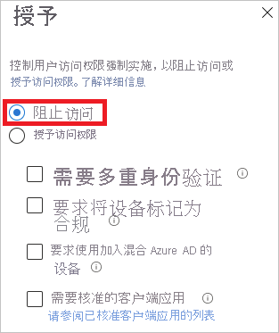
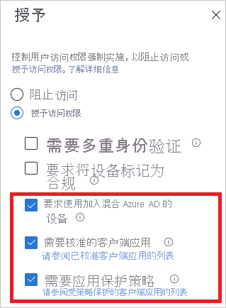
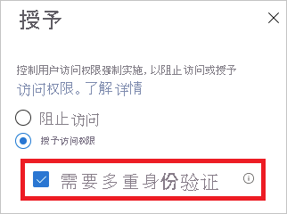
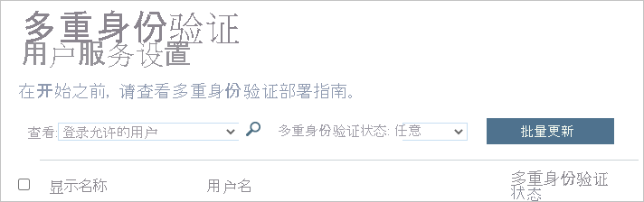

# Azure AD 登录诊断方案

可以使用 Azure AD 登录诊断在没有 Microsoft 支持人员参与的情况下分析登录过程中发生的情况并获取解决问题的建议。  

本文将会概述使用此工具时可以识别和解决的方案类型。

## 支持的方案

Azure AD 登录诊断支持以下方案：

- **条件访问**

    - 被条件访问阻止  

    - 因条件访问失败  

    - 条件访问中的多重身份验证 (MFA)  

    - B2B 因条件访问而阻止了登录 

- 多重身份验证 (MFA)  

    - 来自其他要求的 MFA  

    - 需要 MFA 证明  

    - 需要 MFA 证明（风险登录位置）  

- 正确和错误的凭据  

    - 成功登录  

    - 帐户已锁定  

    - 无效的用户名或密码  

- 企业应用  

    - 企业应用服务提供程序  

    - 企业应用配置  

- 其他方案   

    - 安全默认值  
    
    - 错误代码见解  

    - 旧式身份验证  

    - 被风险策略阻止 

## 条件性访问  

### 被条件访问阻止 

在本方案中，登录尝试已被条件访问策略阻止。 

此方案的诊断部分显示有关用户登录事件和所应用策略的详细信息。 

 

### 因条件访问失败 

这种情况通常是由于登录尝试失败造成的，失败原因是未满足条件访问策略的要求。 常见示例包括： 

- 要求使用已建立混合 Azure AD 联接的设备 

- 需要批准的客户端应用 

- 需要应用保护策略 

此方案的诊断部分显示有关用户登录尝试和所应用策略的详细信息。 

 

### 通过条件访问进行 MFA 

在此方案中，条件访问策略要求使用多重身份验证集登录。 

此方案的诊断部分显示有关用户登录尝试和所应用策略的详细信息。 

 

 

## 多重身份验证  

### 来自其他要求的 MFA 

在此方案中，条件访问策略未强制实施多重身份验证要求。 例如，基于每个用户的多重身份验证。 

 

此诊断方案的目的是提供有关以下内容的更多详细信息： 

- 中断的多重身份验证的源 

- 客户端交互的结果 

你还可以查看用户登录尝试的所有详细信息。 

 

### 需要 MFA 证明 

在此方案中，登录尝试被设置多重身份验证的请求中断。 此设置也称为“证明”。 

 

当要求用户使用多重身份验证但尚未对其进行配置，或管理员已要求用户对其进行配置时，则会发生多重身份验证证明。 

 

此诊断方案旨在表明多重身份验证中断是由于缺乏用户配置导致的。 建议的解决方案是要求用户完成“证明”。 

 

### 需要 MFA 证明（风险登录位置） 

在此方案中，登录尝试被从风险登录位置发出的设置多重身份验证的请求中断。 

 

此诊断方案旨在表明多重身份验证中断是由于缺乏用户配置导致的。 建议的解决方案是要求用户完成“证明”，具体而言，需要通过没有风险的网络位置完成。 

 

这种情况的一个例子是策略要求用户仅从受信任的网络位置设置 MFA，但用户从不受信任的网络位置登录。 

 

## 正确和错误的凭据

### 成功登录 

在此方案中，登录事件未由条件访问或多重身份验证中断。  

 

此诊断方案将提供预期会因条件访问策略或多重身份验证而中断的用户登录事件的详细信息。 

 

### 该帐户已被锁定 

在此方案中，用户使用错误凭据登录的次数过多。 如果使用错误凭据尝试进行基于密码的登录的次数过多，则会发生这种情况。 该诊断方案将为管理员提供所需的信息让其确定登录尝试的来源位置，以及这些用户登录尝试是否合法。 

 

此诊断方案将提供有关应用、尝试次数、所用设备、操作系统和 IP 地址的详细信息。 

 

在 Azure AD 智能锁定文档中可以找到有关此主题的详细信息。 

 

 

### 无效的用户名或密码 

在此方案中，用户尝试使用无效的用户名或密码登录。 诊断的目的是使管理员能够确定问题是与用户输入了错误的凭据有关，还是与缓存了旧密码并在重新提交该密码的客户端和/或应用程序有关。 

 

此诊断方案将提供有关应用、尝试次数、所用设备、操作系统和 IP 地址的详细信息。 

 

## 企业应用 

在企业应用程序中，以下两个方面可能会出现问题： 

- 标识提供者 (Azure AD) 应用程序配置 
- 服务提供程序（应用程序服务，也称为 SaaS 应用程序）端

 

针对这些问题进行诊断可以确定要分析问题的哪一面以求找到解决方法，并采取相应的措施。 

 

### 企业应用服务提供程序 

在此方案中，用户尝试登录到某个应用程序。 登录由于登录流的应用程序（也称为服务提供程序）一端有问题而失败。 通常，必须通过更改配置或解决应用程序服务中的问题来解决此诊断检测到的问题。  

解决这种情况意味着需要登录到其他服务，并根据诊断指南更改某些配置。 

 

### 企业应用配置 

在此方案中，登录由于应用程序的 Azure AD 端出现应用程序配置问题而失败。 

 

解决这种情况需要在应用程序的“企业应用程序”边栏选项卡项中检查并更新应用程序的配置。 

 

## 其他方案 

### 安全默认值 

此方案包括用户登录因安全默认值设置而中断的登录事件。 安全默认值对组织强制实施最佳做法安全性，并要求在多个方案中配置和使用多重身份验证 (MFA)，以防止密码喷射、重放攻击和网络钓鱼企图得逞。 

有关详细信息，请参阅[什么是安全默认值？](../fundamentals/concept-fundamentals-security-defaults.md) 

### 错误代码见解 

如果某个事件在登录诊断中不提供上下文分析数据，则可能会显示更新的错误代码解释和相关内容。 错误代码见解包含有关方案、如何修正问题以及要阅读的有关该问题的任何内容的详细文本。 

### 旧式身份验证 

此诊断方案将诊断由于客户端尝试使用基本身份验证（也称为旧式身份验证）而被阻止或中断的登录事件。 

作为确保安全性的最佳做法，建议阻止使用旧式身份验证登录。 旧式身份验证协议（如 POP、SMTP、IMAP 和 MAPI）无法强制执行多重身份验证 (MFA)，这使它们成为攻击者攻击组织的首选入口点。 

有关详细信息，请参阅[如何使用条件访问来阻止 Azure AD 上的旧式身份验证](../conditional-access/block-legacy-authentication.md)。 

### B2B 因条件访问而阻止了登录 

此诊断方案将检测由于以下原因而阻止或中断的登录：用户来自另一家组织（B2B 登录），而该组织的条件访问策略要求客户端的设备加入资源租户。 

有关详细信息，请参阅 [B2B 协作用户的条件访问](../external-identities/conditional-access.md)。 

### 被风险策略阻止 

该场景是：当登录尝试被识别为有风险时，标识保护策略会阻止登录尝试。 

有关详细信息，请参阅[如何配置和启用风险策略](../identity-protection/howto-identity-protection-configure-risk-policies.md)。 

## 后续步骤

- [什么是 Azure AD 中的登录诊断？](overview-sign-in-diagnostics.md)
