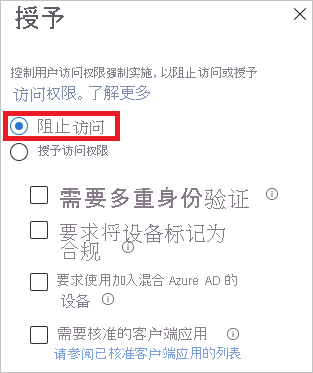
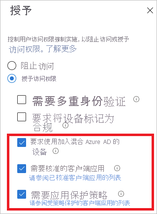
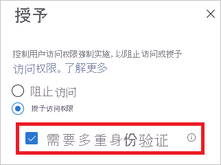

# 什么是 Azure AD 中的登录诊断？

Azure AD 提供了灵活的安全模型，可使用此模板控制用户可以对受管理资源执行的操作。 对这些资源的访问不仅受访问者标识控制，还受访问方式控制 。 通常，由于有许多配置选项，因此灵活性伴随着一定程度的复杂性。 复杂性可能会增加出错的风险。

IT 管理员需要一种解决方案，该解决方案可以提供对系统中活动的恰当见解，以便可以在问题发生时轻松诊断和解决问题。 Azure AD 的登录诊断就是这种解决方案的一个示例。 使用诊断可以在没有 Microsoft 支持人员参与的情况下分析登录过程中发生的情况以及可以采取哪些措施来解决问题。

本文概述该解决方案的功能以及如何使用它。

## 要求

所有版本的 Azure AD 都提供登录诊断。  需要具有 Azure AD 中的全局管理员身份才能使用登录诊断。

## 工作原理

在 Azure AD 中，对登录尝试的响应与访问者标识和访问租户的方式有关 。 例如，当从公司网络登录时，管理员通常可以配置租户的所有方面。 但是，当使用同一帐户从不受信任的网络登录时，甚至可能会遭到阻止。
 
由于系统可以灵活地响应登录尝试，因此可能最终需要解决登录问题。登录诊断具有以下功能：

- 分析登录数据。 

- 显示发生的情况，以及提供有关如何解决问题的建议。 

Azure AD 的登录诊断旨在启用登录错误的自我诊断。 若要完成诊断过程，需执行以下操作：

 
1. 定义你所关心的登录事件的范围

2. 选择要查看的登录

3. 查看诊断结果

4. 采取措施

 
### 定义范围

此步骤旨在定义要调查的登录的范围。 范围基于用户或标识符（correlationId、requestId）和时间范围。 若要进一步缩小范围，还可以指定应用名称。 Azure AD 使用范围信息来查找合适的事件。  

### 选择登录  

根据搜索条件，Azure AD 检索所有匹配的登录并将其显示在身份验证摘要列表视图中。 

 
可以自定义在此视图中显示的列。

### 查看诊断结果 

对于所选登录事件，Azure AD 可提供诊断结果。 

 
结果从评估开始。 评估用几句话解释发生的情况。 解释有助于了解系统的行为。 

下一步，获取应用于所选登录的相关条件访问策略的摘要。 本部分通过建议的补救步骤来完成，以解决你的问题。 如果不借助其他帮助，要想解决问题往往不太可能，因此建议创建支持工单。 

### 执行操作 
此时，应拥有解决问题所需的信息。

## 方案

本部分提供所涵盖的诊断方案的概述。 实现以下方案： 
 
- 被条件访问阻止

- 因条件访问失败

- 通过条件访问进行 MFA

- 来自其他要求的 MFA

- 需要 MFA 证明

- 需要 MFA 证明，但用户登录尝试并非来自安全位置

- 成功登录

### 被条件访问阻止

此方案基于被条件访问策略阻止的登录。

此方案的诊断部分显示有关用户登录和应用策略的详细信息。

### 因条件访问失败

此方案通常是由于登录失败造成的，因为未满足条件访问策略的要求。 常见示例包括：

- 要求使用已建立混合 Azure AD 联接的设备

- 需要批准的客户端应用

- 需要应用保护策略   

此方案的诊断部分显示有关用户登录和应用策略的详细信息。

### 通过条件访问进行 MFA

此方案基于要求使用多重身份验证集登录的条件访问策略。

此方案的诊断部分显示有关用户登录和应用策略的详细信息。

### 来自其他要求的 MFA

此方案基于条件访问策略未强制实施的多重身份验证要求。 例如，基于每个用户的多重身份验证。

此诊断方案的目的是提供有关以下内容的更多详细信息：

- 多重身份验证中断的源。 
- 客户端交互的结果。

此外，本部分还提供有关用户登录尝试的所有详细信息。 

### 需要 MFA 证明

此方案基于被设置多重身份验证的请求中断的登录。 此设置也称为“证明”。

当要求用户使用多重身份验证但尚未对其进行配置，或管理员通过配置用户对其进行配置时，则会发生多重身份验证证明。

此诊断方案的目的是提供多重身份验证中断要设置的见解和建议，从而让用户完成证明。

### 风险登录时需要进行 MFA 证明

此方案是由于登录被从不安全登录设置多重身份验证的请求中断而导致的。 

此诊断方案的目的是提供多重身份验证中断要设置的见解和建议，从而让用户完成证明，但请从安全的网络位置执行此操作。 例如，如果将公司网络定义为命名位置，请改为尝试通过公司网络进行证明。

### 成功登录

此方案基于没有被条件访问或多重身份验证中断的登录。

此诊断方案的目的是，在有条件访问策略或需要应用的策略的情况下，或在需要中断用户登录的已配置多重身份验证的情况下，提供对用户在登录过程中提供的信息的见解。

## 后续步骤

* [什么是 Azure Active Directory 报表？](overview-reports.md)
* [什么是 Azure Active Directory 监视？](overview-monitoring.md)
