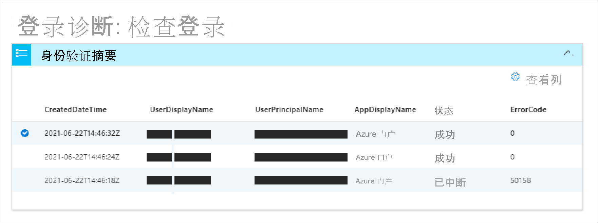

# 什么是 Azure AD 中的登录诊断？

确定登录失败原因可能会迅速成为一项具有挑战性的任务。 需要分析登录尝试期间发生的情况，并研究可用的建议来解决问题。 理想情况下，你希望能够自行解决问题，而无需 Microsoft 支持人员等其他人的帮助。 如果遇到这种情况，可以使用 Azure AD 中的登录诊断，该工具可帮助调查 Azure AD 中的登录情况。 

本文概述诊断的定义以及如何使用诊断来解决与登录相关的错误。 

## 工作原理  

在 Azure AD 中，登录尝试由以下项控制：

- 用户 - 执行登录尝试的用户。
- 方式 - 执行登录尝试的方式。

例如，可以配置条件访问策略，使管理员能够在从公司网络登录时配置租户的所有方面。 但是，当同一用户从不受信任的网络登录同一帐户时，可能会遭到阻止。 

由于系统可以更灵活地响应登录尝试，因此可能最终需要解决登录问题。登录诊断是一种工具，旨在通过以下方式自助诊断登录问题：  

- 分析登录事件数据。  

- 显示有关所发生情况的信息。  

- 提供解决问题的建议。  

若要开始并完成诊断过程，需执行以下操作：   

1. 标识事件 - 输入有关登录事件的信息 

2. 选择事件 - 根据共享的信息选择事件。 

3. 采取措施 - 查看诊断结果并执行相关步骤。

### 标识事件 

若要标识相关事件，可以根据以下选项进行筛选：

- 用户的名称
- 应用程序 
- 相关 ID 或请求 ID 
- 日期和时间

### 选择事件  

根据搜索条件，Azure AD 检索所有匹配的登录事件并将其显示在身份验证摘要列表视图中。  

可以根据自己的偏好更改列中显示的内容。 示例如下：

- 风险详细信息
- 条件访问状态
- 位置
- 资源 ID
- 用户类型
- 身份验证详细信息

### 执行操作

对于选定的登录事件，你会获得诊断结果。 浏览结果，确定可以采取哪些措施来解决问题。 这些结果会添加建议步骤并阐明相关信息，例如相关策略、登录详细信息和支持文档。 由于并非总是可以在不借助其他帮助的情况下解决问题，因此可能建议创建支持工单。 

## 如何访问

若要使用诊断，必须以全局管理员或全局读者的身份登录租户。 如果没有此级别的访问权限，请使用 [Privileged Identity Management (PIM)](../privileged-identity-management/pim-resource-roles-activate-your-roles.md) 提升租户内全局管理员/读者的访问权限。 这使你可以临时访问诊断。  

借助正确级别的访问权限，可以在不同位置查找诊断： 

选项 A：诊断和解决问题 

1. 打开 Azure Active Directory AAD 或 Azure AD 条件访问。 

2. 从主菜单中，单击“诊断和解决问题”。  

3. 在“排查器”下，有一个登录诊断磁贴。 

4. 单击“排查”按钮。  

 

 

选项 B：登录事件 

1. 打开 Azure Active Directory。 

2. 在主菜单的“监视”部分，选择“登录” 。 

3. 从登录列中表，选择状态为“失败”的登录。 可以按“状态”筛选列表，以便更轻松地查找失败的登录。 

4. 系统将打开选定登录的“活动详细信息: 登录”选项卡。 单击虚线图标，查看更多菜单图标。 选择“排查和支持”选项卡。 

5. 单击“启动登录诊断”链接。 

 

选项 C：支持案例 

创建支持案例时也可以使用诊断，你可以在提交案例之前进行自助诊断。 

## 后续步骤

- [Azure AD 方案的登录诊断](concept-sign-in-diagnostics-scenarios.md)
