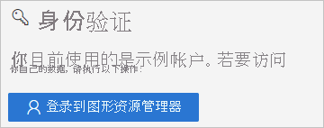

# 快速入门：使用 Microsoft Graph API 访问 Azure AD 日志 

使用 Azure AD 登录日志中的信息，可以了解用户登录失败时所发生的情况。 本快速入门介绍如何使用 Graph API 访问登录日志。

## 先决条件

若要完成本快速入门中的方案，你需要：

- 有权访问 Azure AD 租户 - 如果你无权访问 Azure AD 租户，请参阅[立即创建 Azure 免费帐户](https://azure.microsoft.com/free/?WT.mc_id=A261C142F)。 
- **名为 Isabella Simonsen 的测试帐户**：如果不知道如何创建测试帐户，请参阅 [添加基于云的用户](../fundamentals/add-users-azure-active-directory.md#add-a-new-user)。

## 执行一次失败的登录

此步骤的目的是在 Azure AD 登录日志中创建一条登录失败记录。

若要完成此步骤，请执行以下操作：

1. 以 Isabella Simonsen 的身份使用错误的密码登录到 [Azure 门户](https://portal.azure.com/)。

2. 等待 5 分钟，确保可以在登录日志中找到一条登录记录。 有关详细信息，请参阅[活动报告](reference-reports-latencies.md#activity-reports)。

## 查找失败的登录

本部分提供使用 Graph API 获取有关登录的信息的步骤。

    

若要查看失败的登录，请执行以下操作：

1. 导航到 [Microsoft Graph 资源管理器](https://developer.microsoft.com/en-us/graph/graph-explorer)。

2. 以全局管理员的身份登录到你的租户。

       

3. 在 HTTP 谓词下拉列表中，选择“GET” 。

4. 在 API 版本下拉列表中，选择“beta” 。

5. 在请求查询地址栏中，键入 `https://graph.microsoft.com/beta/auditLogs/signIns?$top=100&$filter=userDisplayName eq 'Isabella Simonsen'`
 
6. 单击“运行查询”。

查看查询结果。

    

## 清理资源

不再需要测试用户时，请将其删除。 如果不知道如何删除 Azure AD 用户，请参阅[从 Azure AD 中删除用户](../fundamentals/add-users-azure-active-directory.md#delete-a-user)。

## 后续步骤

> [!div class="nextstepaction"]
> [什么是 Azure Active Directory 报表？](overview-reports.md)
