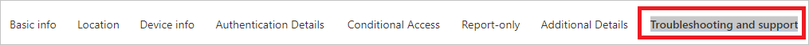
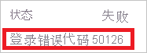
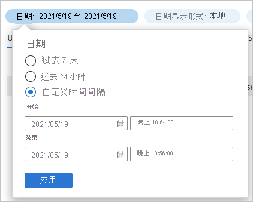
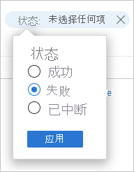

# 快速入门：使用 Azure AD 登录日志分析登录 

使用 Azure AD 登录日志中的信息，可以了解用户登录失败时所发生的情况。 本快速入门介绍如何使用登录日志找出失败的登录。

## 先决条件

若要完成本快速入门中的方案，你需要：

- 有权访问 Azure AD 租户 - 如果你无权访问 Azure AD 租户，请参阅[立即创建 Azure 免费帐户](https://azure.microsoft.com/free/?WT.mc_id=A261C142F)。 
- **名为 Isabella Simonsen 的测试帐户**：如果不知道如何创建测试帐户，请参阅 [添加基于云的用户](../fundamentals/add-users-azure-active-directory.md#add-a-new-user)。

## 执行一次失败的登录

此步骤的目的是在 Azure AD 登录日志中创建一条登录失败记录。

若要完成此步骤，请执行以下操作：

1. 以 Isabella Simonsen 的身份使用错误的密码登录到 [Azure 门户](https://portal.azure.com/)。

2. 等待 5 分钟，确保可以在登录日志中找到一条登录记录。 有关详细信息，请参阅[活动报告](reference-reports-latencies.md#activity-reports)。

## 查找失败的登录

本部分提供分析失败登录的步骤：

- 筛选登录：删除与分析不相关的所有记录。 例如，设置一个筛选器以便仅显示特定用户的记录。
- 查找其他错误信息：除了可以在登录日志中查找信息以外，还可以使用[登录错误查找工具](https://login.microsoftonline.com/error)来查找错误。 此工具可能会提供有关登录错误的其他信息。 

若要查看失败的登录，请执行以下操作：

1. 导航到[登录日志](https://portal.azure.com/#blade/Microsoft_AAD_IAM/ActiveDirectoryMenuBlade/SignIns)。

2. 若要仅列出 Isabella Simonsen 的记录，请执行以下操作：

    a. 在工具栏中，单击“添加筛选器”。
    
       

    b. 在“选取字段”列表中选择“用户”，然后单击“应用”  。

    c. 在“用户名”文本框中键入 Isabella Simonsen，然后单击“应用”  。

    d. 在工具栏中，单击“刷新”。

3. 若要分析问题，请单击“故障排除和支持”。

       

4. 复制“登录错误代码”。

       

5. 将错误代码粘贴到[登录错误查找工具](https://login.microsoftonline.com/error)的文本框中，然后单击“提交”。

检查该工具的结果，确定它是否提供了其他信息。

## 其他测试

现在你已知道如何在登录日志中按名称查找条目，接下来请尝试使用以下筛选器查找记录：

- 日期 - 尝试使用开始日期和结束日期查找 Isabella  。

    

- 状态 - 尝试使用“状态: 失败”查找 Isabella 。

    

## 清理资源

不再需要测试用户时，请将其删除。 如果不知道如何删除 Azure AD 用户，请参阅[从 Azure AD 中删除用户](../fundamentals/add-users-azure-active-directory.md#delete-a-user)。

## 后续步骤

> [!div class="nextstepaction"]
> [什么是 Azure Active Directory 报表？](overview-reports.md)
