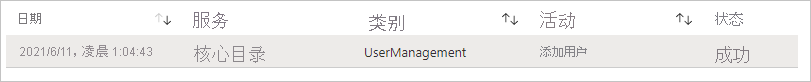
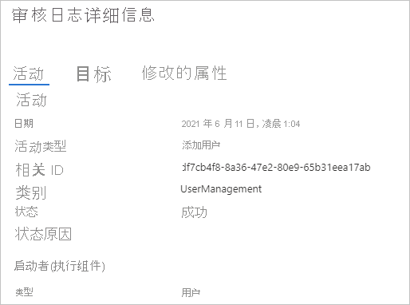

# 快速入门：筛选 Azure AD 审核日志 

借助 Azure AD 审核日志中的信息，可以根据合规要求访问系统活动的记录。 本快速入门介绍如何在审核日志中查找新建的用户帐户。

## 先决条件

若要完成本快速入门中的方案，你需要：

- 有权访问 Azure AD 租户 - 如果你无权访问 Azure AD 租户，请参阅[立即创建 Azure 免费帐户](https://azure.microsoft.com/free/?WT.mc_id=A261C142F)。 
- **名为 Isabella Simonsen 的测试帐户**：如果不知道如何创建测试帐户，请参阅 [添加基于云的用户](../fundamentals/add-users-azure-active-directory.md#add-a-new-user)。

## 查找新用户帐户

本部分提供筛选审核日志的步骤。

若要查找新用户，请执行以下操作：

1. 导航到[审核日志](https://portal.azure.com/#blade/Microsoft_AAD_IAM/ActiveDirectoryMenuBlade/Audit)。

2. 若要仅列出 Isabella Simonsen 的记录，请执行以下操作：

    a. 在工具栏中，单击“添加筛选器”。
    
       

    b. 在“选取字段”列表中选择“目标”，然后单击“应用”  

    c. 在“目标”文本框中，键入 Isabella Simonsen 作为用户主体名称，然后单击“应用”   。

3. 单击筛选的项。

      

4.  查看“审核日志详细信息”。
 
      
 
  

## 清理资源

不再需要测试用户时，请将其删除。 如果不知道如何删除 Azure AD 用户，请参阅[从 Azure AD 中删除用户](../fundamentals/add-users-azure-active-directory.md#delete-a-user)。

## 后续步骤

> [!div class="nextstepaction"]
> [什么是 Azure Active Directory 报表？](overview-reports.md)
