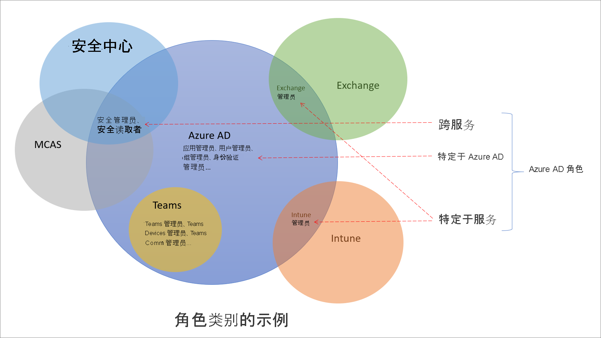

# 了解 Azure Active Directory 中的角色

Azure Active Directory (Azure AD) 内置角色大约有 60 个，它们是具有一组固定角色权限的角色。 为了补充内置角色，Azure AD 还支持自定义角色。 请使用自定义角色来选择你需要的角色权限。 例如，你可以创建一个自定义角色来管理特定 Azure AD 资源，例如应用程序或服务主体。

本文介绍了 Azure AD 角色的定义及其使用方法。

## Azure AD 角色与其他 Microsoft 365 角色的区别

Microsoft 365 中有许多不同的服务，例如 Azure AD 和 Intune。 其中一些服务具有自己的基于角色的访问控制系统，尤其是以下服务：

- Azure AD
- Exchange
- Intune
- 安全中心
- 合规中心
- Microsoft Cloud App Security
- 商业

Teams、SharePoint 和托管桌面等其他服务没有单独的基于角色的访问控制系统。 它们使用 Azure AD 角色来实现其管理访问。 Azure 对虚拟机等 Azure 资源使用其自己的基于角色的访问控制系统，此系统与 Azure AD 角色不同。

说到单独的基于角色的访问控制系统， 就意味着存在另一个数据存储区，用于存储角色定义和角色分配。 同样，也有另一个策略决策点，用于访问检查。 有关详细信息，请参阅 [Azure AD 中 Microsoft 365 服务的角色](m365-workload-docs.md)及[经典订阅管理员角色、Azure 角色和 Azure AD 角色](../../role-based-access-control/rbac-and-directory-admin-roles.md)。

## 为什么某些 Azure AD 角色适用于其他服务

Microsoft 365 具有许多基于角色的访问控制系统，它们是在一段时间内是独立开发的，每个系统都有自己的服务门户。 为了方便你在 Azure 门户中管理适用于整个 Microsoft 365 的标识，我们添加了一些特定于服务的内置角色，其中每个角色都授予对 Microsoft 365 服务的管理访问权限。 添加的角色的一个示例是 Azure AD 中的 Exchange 管理员角色。 此角色与 Exchange 基于角色的访问控制系统中的[“组织管理”角色组](/exchange/organization-management-exchange-2013-help)相同，可以管理 Exchange 的所有方面。 同样，我们添加了 Intune 管理员角色、Teams 管理员、SharePoint 管理员等。 特定于服务的角色是以下部分介绍的一类 Azure AD 内置角色。

## Azure AD 角色的类别

Azure AD 内置角色的区别在于使用场景，可分为以下三大类别。

- **特定于 Azure AD 的角色**：这些角色仅授予管理 Azure AD 中资源的权限。 例如，用户管理员、应用程序管理员、组管理员都授予管理 Azure AD 中资源的权限。
- **服务特定的角色**：对于主要 Microsoft 365 服务（非 Azure AD），我们创建了特定于服务的角色，这些角色授予管理服务中所有功能的权限。  例如，Exchange 管理员、Intune 管理员、SharePoint 管理员和 Teams 管理员角色可以管理相应服务的功能。 Exchange 管理员可以管理邮箱，Intune 管理员可以管理设备策略，SharePoint 管理员可以管理网站集，Teams 管理员可以管理通话质量，等等。
- **跨服务角色**：有些角色可以跨服务。 我们有两个全局角色 - 全局管理员和全局读者。 所有 Microsoft 365 服务都认可这两个角色。 此外还有一些与安全性相关的角色，例如安全管理员和安全读者，这些角色在 Microsoft 365 中授予多个安全服务的访问权限。 例如，在 Azure AD 中使用安全管理员角色，可以管理 Microsoft 365 安全中心、Microsoft Defender 高级威胁防护和 Microsoft Cloud App Security。 同样，在合规性管理员角色中，你可以在 Microsoft 365 合规中心、Exchange 等位置管理与合规性相关的设置。

提供下表是为了帮助你理解这些角色类别。 类别可任意命名，不一定要表示[记录的 Azure AD 角色权限](permissions-reference.md)之外的任何其他功能。

Category | Role
---- | ----
特定于 Azure AD 的角色 | 应用程序管理员 应用程序开发人员 身份验证管理员 B2C IEF 密钥集管理员 B2C IEF 策略管理员 云应用管理员 云设备管理员 条件访问管理员 设备管理员 目录读者 目录同步帐户 目录编写人员 外部 ID 用户流管理员 外部 ID 用户流属性管理员 外部标识提供者管理员 组管理员 来宾邀请者 支持管理员 混合标识管理员 许可证管理员 合作伙伴一线支持人员 合作伙伴二线支持人员 密码管理员 特权身份验证管理员 特权角色管理员 报告读者 用户管理员
跨服务角色 | 全局管理员 合规性管理员 符合性数据管理员 全局读取者 安全管理员 安全操作员 安全读取者 服务支持管理员
特定于服务的角色 | Azure DevOps 管理员 Azure 信息保护管理员 计费管理员 CRM 服务管理员 客户密码箱访问审批者 桌面分析管理员 Exchange 服务管理员 Insights 管理员 Insights 业务主管 Intune 服务管理员 Kaizala 管理员 Lync 服务管理员 消息中心隐私读取者 消息中心读取者 现代商业用户 网络管理员 Office 应用管理员 Power BI 服务管理员 Power Platform 管理员 打印机管理员 打印机技术人员 搜索管理员 搜索编辑员 SharePoint 服务管理员 Teams 通信管理员 Teams 通信支持工程师 Teams 通信支持专家 Teams 设备管理员 Teams 管理员

## 后续步骤

- [Azure AD 基于角色的访问控制概述](custom-overview.md)
- 使用 [Azure 门户、Azure AD PowerShell 或图形 API](custom-create.md) 创建角色分配
- [列出角色分配](view-assignments.md)
