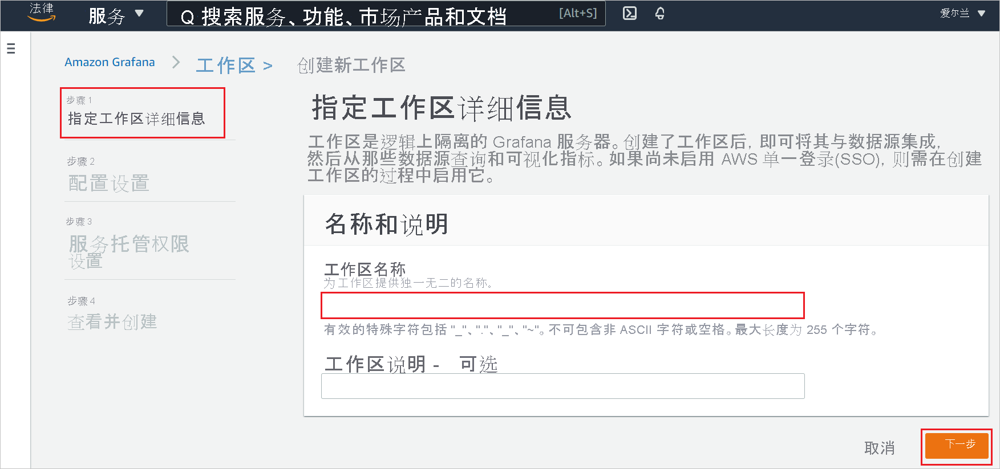
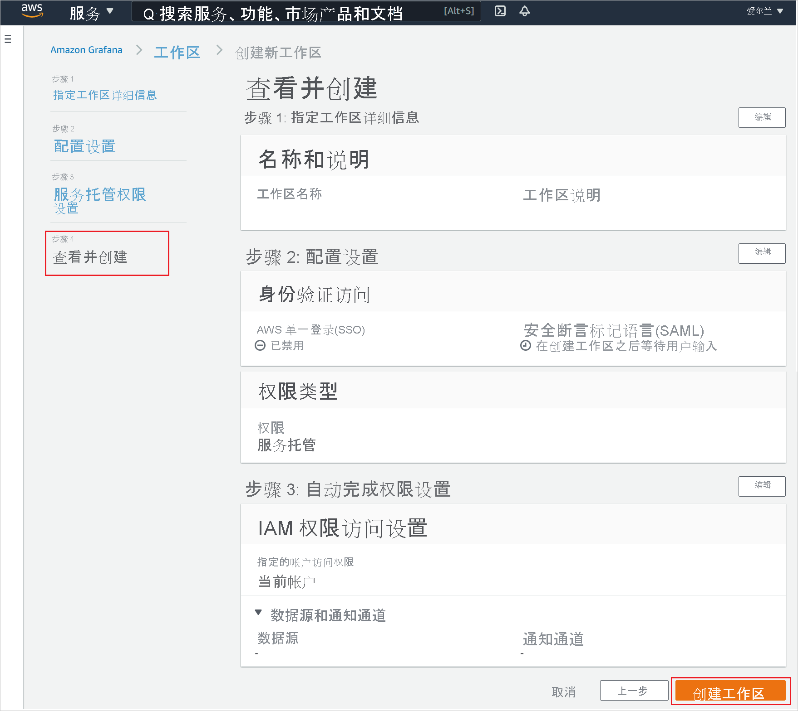
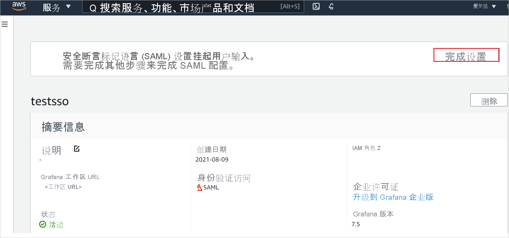
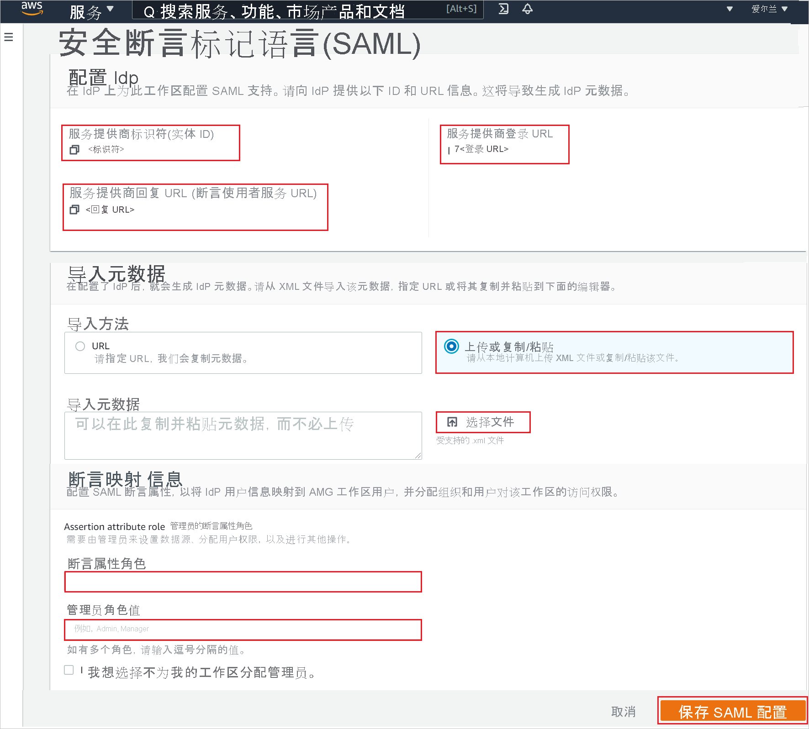

# 教程：Azure Active Directory 单一登录 (SSO) 与 Amazon Managed Grafana 集成

本教程介绍如何将 Amazon Managed Grafana 与 Azure Active Directory (Azure AD) 集成。 将 Amazon Managed Grafana 与 Azure AD 集成后，可以：

* 在 Azure AD 中控制谁有权访问 Amazon Managed Grafana。
* 让用户使用其 Azure AD 帐户自动登录到 Amazon Managed Grafana。
* 在一个中心位置（Azure 门户）管理帐户。

## 先决条件

若要开始操作，需备齐以下项目：

* 一个 Azure AD 订阅。 如果没有订阅，可以获取一个[免费帐户](https://azure.microsoft.com/free/)。
* Amazon Web Services (AWS) [免费帐户](https://aws.amazon.com/free/)。
* 启用了 Amazon Managed Grafana 单一登录 (SSO) 的订阅。

## 方案描述

本教程在测试环境中配置并测试 Azure AD SSO。

* Amazon Managed Grafana 支持 SP 发起的 SSO。
* Amazon Managed Grafana 支持实时用户预配。

## 从库中添加 Amazon Managed Grafana

若要配置 Amazon Managed Grafana 与 Azure AD 的集成，需要从库中将 Amazon Managed Grafana 添加到托管 SaaS 应用列表。

1. 使用工作或学校帐户或个人 Microsoft 帐户登录到 Azure 门户。
1. 在左侧导航窗格中，选择“Azure Active Directory”服务  。
1. 导航到“企业应用程序”，选择“所有应用程序”   。
1. 若要添加新的应用程序，请选择“新建应用程序”  。
1. 在“从库中添加”部分的搜索框中，键入“Amazon Managed Grafana” 。
1. 从结果面板中选择“Amazon Managed Grafana”，然后添加该应用。 在该应用添加到租户时等待几秒钟。

## 配置并测试 Amazon Managed Grafana 的 Azure AD SSO

使用名为 B.Simon 的测试用户配置并测试 Amazon Managed Grafana 的 Azure AD SSO。 若要使 SSO 正常工作，需要在 Azure AD 用户与 Amazon Managed Grafana 中的相关用户之间建立关联。

若要配置并测试 Amazon Managed Grafana 的 Azure AD SSO，请执行以下步骤：

1. **[配置 Azure AD SSO](#configure-azure-ad-sso)** - 使用户能够使用此功能。
    1. **[创建 Azure AD 测试用户](#create-an-azure-ad-test-user)** - 使用 B. Simon 测试 Azure AD 单一登录。
    1. **[分配 Azure AD 测试用户](#assign-the-azure-ad-test-user)** - 使 B. Simon 能够使用 Azure AD 单一登录。
1. **[配置 Amazon Managed Grafana SSO](#configure-amazon-managed-grafana-sso)** - 在应用程序端配置单一登录设置。
    1. **[创建 Amazon Managed Grafana 测试用户](#create-amazon-managed-grafana-test-user)** - 在 Amazon Managed Grafana 中创建 B.Simon 的对应用户，该用户与 Azure AD 中表示 B.Simon 的用户相关联。
1. **[测试 SSO](#test-sso)** - 验证配置是否正常工作。

## 配置 Azure AD SSO

按照下列步骤在 Azure 门户中启用 Azure AD SSO。

1. 在 Azure 门户的“Amazon Managed Grafana”应用程序集成页上，找到“管理”部分并选择“单一登录”  。
1. 在“选择单一登录方法”页上选择“SAML” 。
1. 在“设置 SAML 单一登录”页面上，单击“基本 SAML 配置”旁边的铅笔图标以编辑设置 。

   

1. 在“基本 SAML 配置”部分中，按照以下步骤操作：

    a. 在“标识符(实体 ID)”文本框中，使用以下模式键入 URL：`https://<namespace>.grafana-workspace.<region>.amazonaws.com/saml/metadata`

    b. 在“登录 URL”文本框中，使用以下模式键入 URL：`https://<namespace>.grafana-workspace.<region>.amazonaws.com/login/saml` 

    > [!NOTE]
    > 这些不是实际值。 使用实际标识符和登录 URL 更新这些值。 请联系 [Amazon Managed Grafana 客户端支持团队](https://aws.amazon.com/contact-us/)获取这些值。 还可以参考 Azure 门户中的“基本 SAML 配置”  部分中显示的模式。

1. Amazon Managed Grafana 应用程序需要特定格式的 SAML 断言，这要求向 SAML 令牌属性配置添加自定义属性映射。 以下屏幕截图显示了默认属性的列表。

    

1. 除上述属性以外，Amazon Managed Grafana 应用程序还要求在 SAML 响应中传回其他几个属性，如下所示。 这些属性也是预先填充的，但可以根据要求查看它们。
    
    | 名称 | 源属性 |
    | ----------| --------- |
    | displayName | user.displayname |
    | mail | user.userprincipalname |

1. 在“使用 SAML 设置单一登录”页的“SAML 签名证书”部分中找到“联合元数据 XML”，选择“下载”以下载该证书并将其保存在计算机上     。

    

1. 在“设置 Amazon Managed Grafana”部分中，根据要求复制相应的 URL。

    

### 创建 Azure AD 测试用户

在本部分，我们将在 Azure 门户中创建名为 B.Simon 的测试用户。

1. 在 Azure 门户的左侧窗格中，依次选择“Azure Active Directory”、“用户”和“所有用户”  。
1. 选择屏幕顶部的“新建用户”。
1. 在“用户”属性中执行以下步骤：
   1. 在“名称”字段中，输入 `B.Simon`。  
   1. 在“用户名”字段中输入 username@companydomain.extension。 例如，`B.Simon@contoso.com`。
   1. 选中“显示密码”复选框，然后记下“密码”框中显示的值。
   1. 单击“创建”。

### 分配 Azure AD 测试用户

在本部分中，你将通过向 B.Simon 授予对 Amazon Managed Grafana 的访问权限，使其能够使用 Azure 单一登录。

1. 在 Azure 门户中，依次选择“企业应用程序”、“所有应用程序”。  
1. 在应用程序列表中，选择“Amazon Managed Grafana”。
1. 在应用的概述页中，找到“管理”部分，选择“用户和组”   。
1. 选择“添加用户”，然后在“添加分配”对话框中选择“用户和组”。
1. 在“用户和组”对话框中，从“用户”列表中选择“B.Simon”，然后单击屏幕底部的“选择”按钮。
1. 如果你希望将某角色分配给用户，可以从“选择角色”下拉列表中选择该角色。 如果尚未为此应用设置任何角色，你将看到选择了“默认访问权限”角色。
1. 在“添加分配”对话框中，单击“分配”按钮。  

## 配置 Amazon Managed Grafana SSO

1. 以管理员身份登录到 Amazon Managed Grafana 控制台。

1. 单击“创建工作区”。 

    

1. 在“指定工作区详细信息”页中，键入唯一的工作区名称，然后单击“下一步”。

    

1. 在“配置设置”页中，选中“安全断言标记语言(SAML)”复选框并启用“服务托管”作为权限类型，然后单击“下一步”。

    

1. 在“服务托管权限设置”中，选择“当前帐户”并单击“下一步”。

    

1. 在“查看并创建”页中，验证所有工作区详细信息并单击“创建工作区”。

    

1. 创建工作区后，单击“完成设置”以完成 SAML 配置。

    

1. 在“安全断言标记语言(SAML)”页中，执行以下步骤。

    

    1. 复制“服务提供者标识符(实体 ID)”值，并将此值粘贴到 Azure 门户的“基本 SAML 配置”部分的“标识符”文本框中  。

    1. 复制“服务提供者回复 URL (断言使用者服务 URL)”值，并将此值粘贴到 Azure 门户的“基本 SAML 配置”部分的“回复 URL”文本框中  。

    1. 复制“服务提供者登录 URI”值，并将此值粘贴到 Azure 门户的“基本 SAML 配置”部分的“登录 URL”文本框中  。

    1. 在记事本中打开从 Azure 门户下载的“联合元数据 XML”，然后单击“选择文件”选项上传该 XML 文件。

    1. 在“断言映射”部分中，根据你的要求填写所需的值。

    1. 单击“保存 SAML 配置”。

### 创建 Amazon Managed Grafana 测试用户

在本部分中，我们将在 Amazon Managed Grafana 中创建一个名为 Britta Simon 的用户。 Amazon Managed Grafana 支持默认已启用的实时用户预配。 此部分不存在任何操作项。 如果 Amazon Managed Grafana 中尚不存在用户，则会在进行身份验证后创建一个新用户。

## 测试 SSO 

在本部分，你将使用以下选项测试 Azure AD 单一登录配置。 

* 在 Azure 门户中单击“测试此应用程序”。 这会重定向到 Amazon Managed Grafana 登录 URL，你可以从那里启动登录流。 

* 直接转到 Amazon Managed Grafana 登录 URL，并从那里启动登录流。

* 你可使用 Microsoft 的“我的应用”。 单击“我的应用”中的“Amazon Managed Grafana”磁贴时，会重定向到 Amazon Managed Grafana 登录 URL。 有关“我的应用”的详细信息，请参阅[“我的应用”简介](../user-help/my-apps-portal-end-user-access.md)。

## 后续步骤

配置 Amazon Managed Grafana 后，即可强制实施会话控制，实时防止组织的敏感数据外泄和渗透。 会话控制从条件访问扩展而来。 [了解如何通过 Microsoft Cloud App Security 强制实施会话控制](/cloud-app-security/proxy-deployment-aad)。