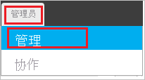
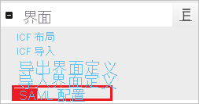
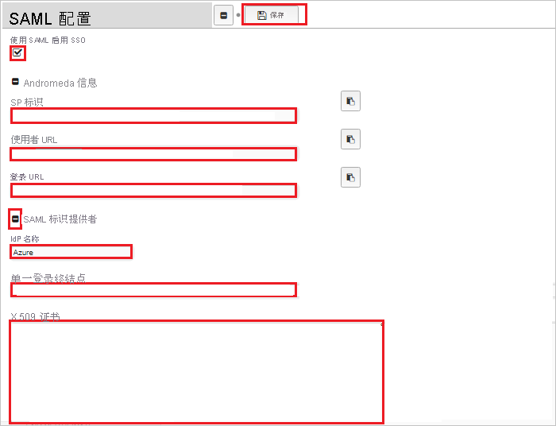
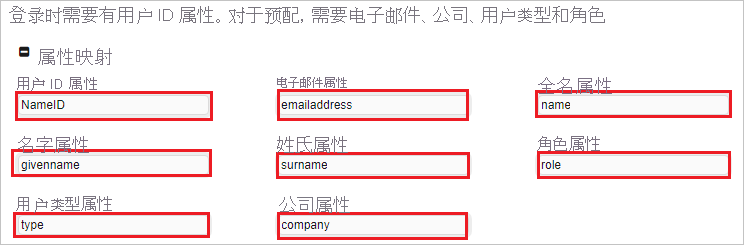

# 教程：Azure Active Directory 与 Andromeda 集成

本教程介绍如何将 Andromeda 与 Azure Active Directory (Azure AD) 集成。 将 Andromeda 与 Azure AD 集成后，可以：

* 在 Azure AD 中控制谁有权访问 Andromeda。
* 让用户使用其 Azure AD 帐户自动登录到 Andromeda。
* 在一个中心位置（Azure 门户）管理帐户。

## 必备条件

若要配置 Azure AD 与 Andromeda 的集成，需要以下项：

* 一个 Azure AD 订阅。 如果没有 Azure AD 环境，可以获取一个[免费帐户](https://azure.microsoft.com/free/)。
* 已启用 Andromeda 单一登录的订阅。

## 方案描述

本教程会在测试环境中配置和测试 Azure AD 单一登录。

* Andromeda 支持 SP 和 IDP 发起的 SSO。
* Andromeda 支持实时用户预配。

## 从库中添加 Andromeda

若要配置 Andromeda 与 Azure AD 的集成，需要从库中将 Andromeda 添加到托管的 SaaS 应用列表。

1. 使用工作或学校帐户或个人 Microsoft 帐户登录到 Azure 门户。
1. 在左侧导航窗格中，选择“Azure Active Directory”服务  。
1. 导航到“企业应用程序”，选择“所有应用程序”   。
1. 若要添加新的应用程序，请选择“新建应用程序”  。
1. 在“从库中添加”部分的搜索框中，键入“Andromeda” 。
1. 从结果面板中选择“Andromeda”，然后添加该应用。 在该应用添加到租户时等待几秒钟。

## 配置并测试 Andromeda 的 Azure AD SSO

使用名为 B. Simon 的测试用户配置和测试 Andromeda 的 Azure AD SSO。 若要使 SSO 正常运行，需要在 Azure AD 用户与 Andromeda 中的相关用户之间建立链接关系。

若要配置并测试 Andromeda 的 Azure AD SSO，请执行以下步骤：

1. **[配置 Azure AD SSO](#configure-azure-ad-sso)** - 使用户能够使用此功能。
   1. **[创建 Azure AD 测试用户](#create-an-azure-ad-test-user)** - 使用 Britta Simon 测试 Azure AD 单一登录。
   1. **[分配 Azure AD 测试用户](#assign-the-azure-ad-test-user)** - 使 Britta Simon 能够使用 Azure AD 单一登录。
2. **[配置 Andromeda SSO](#configure-andromeda-sso)** - 在应用程序端配置单一登录设置。
   1. **[创建 Andromeda 测试用户](#create-andromeda-test-user)** - 在 Andromeda 中创建 Britta Simon 的对应用户，并将其链接到该用户的 Azure AD 表示形式。
3. **[测试 SSO](#test-sso)** - 验证配置是否正常工作。

## 配置 Azure AD SSO

按照下列步骤在 Azure 门户中启用 Azure AD SSO。

1. 在 Azure 门户的 Andromeda 应用程序集成页上，找到“管理”部分，并选择“单一登录”  。
1. 在“选择单一登录方法”页上选择“SAML” 。
1. 在“设置 SAML 单一登录”页面上，单击“基本 SAML 配置”旁边的铅笔图标以编辑设置 。

   

1. 如果要在 **IDP** 发起的模式下配置应用程序，请在“基本 SAML 配置”部分执行以下步骤：  

   a. 在“标识符”文本框中，使用以下模式键入 URL：`https://<tenantURL>.ngcxpress.com/`

   b. 在“回复 URL”文本框中，使用以下模式键入 URL：`https://<tenantURL>.ngcxpress.com/SAMLConsumer.aspx`

1. 如果要在 SP  发起的模式下配置应用程序，请单击“设置其他 URL”  ，并执行以下步骤：

   在“登录 URL”  文本框中，使用以下模式键入 URL：`https://<tenantURL>.ngcxpress.com/SAMLLogon.aspx`。

   > [!NOTE]
   > 这些不是实际值。 本教程稍后将介绍如何使用实际的登录 URL 和标识符来更新该值。

1. Andromeda 应用程序需要特定格式的 SAML 断言。 请为此应用程序配置以下声明。 可以在应用程序集成页的“用户属性”部分管理这些属性的值。  在“使用 SAML 设置单一登录”  页上，单击“编辑”  按钮以打开“用户属性”  对话框。

   

   > [!NOTE]
   > 设置时清除命名空间定义。

1. 在“用户属性”对话框的“用户声明”部分中，通过使用“编辑图标”编辑声明或使用“添加新声明”添加声明，按上图所示配置 SAML 令牌属性，并执行以下步骤     ：

   | 名称    | 源属性  |
   | ------- | ----------------- |
   | 角色 (role)    | 应用特定的角色 |
   | type    | 应用类型          |
   | company | CompanyName       |

   > [!NOTE]
   > Andromeda 需要分配给应用程序的用户的角色。 请在 Azure AD 中设置这些角色，以便可为用户分配相应的角色。 若要了解如何在 Azure AD 中配置角色，请参阅[此文](../develop/howto-add-app-roles-in-azure-ad-apps.md#app-roles-ui)。

   a. 单击“添加新声明”  以打开“管理用户声明”  对话框。

   

   

   b. 在“名称”文本框中，键入为该行显示的属性名称。 

   c. 将“命名空间”留空  。

   d. 选择“源”作为“属性”  。

   e. 在“源属性”  列表中，键入为该行显示的属性值。

   f. 单击“确定”

   g. 单击“保存”  。

1. 在“使用 SAML 设置单一登录”  页上，在“SAML 签名证书”  部分中，单击“下载”  以根据要求从给定的选项下载 **证书(Base64)** 并将其保存在计算机上。

   

1. 在“设置 Andromeda”  部分中，根据要求复制相应的 URL。

   

### 创建 Azure AD 测试用户

在本部分，我们将在 Azure 门户中创建名为 B.Simon 的测试用户。

1. 在 Azure 门户的左侧窗格中，依次选择“Azure Active Directory”、“用户”和“所有用户”  。
1. 选择屏幕顶部的“新建用户”。
1. 在“用户”属性中执行以下步骤：
   1. 在“名称”字段中，输入 `B.Simon`。
   1. 在“用户名”字段中输入 username@companydomain.extension。 例如，`B.Simon@contoso.com`。
   1. 选中“显示密码”复选框，然后记下“密码”框中显示的值。
   1. 单击“创建”。

### 分配 Azure AD 测试用户

在本部分中，你将授予 B. Simon 访问 Andromeda 的权限，使其能够使用 Azure 单一登录。

1. 在 Azure 门户中，依次选择“企业应用程序”、“所有应用程序”。 
1. 在应用程序列表中，选择“Andromeda”  。
1. 在应用的概述页中，找到“管理”部分，选择“用户和组” 。
1. 选择“添加用户”，然后在“添加分配”对话框中选择“用户和组”。
1. 在“用户和组”对话框中，从“用户”列表中选择“B.Simon”，然后单击屏幕底部的“选择”按钮。
1. 如果已如上述所示设置角色，可从“选择角色”下拉列表中选择角色。
1. 在“添加分配”对话框中，单击“分配”按钮。

### 配置 Andromeda SSO

1. 以管理员身份登录 Andromeda 公司站点。

2. 在菜单栏顶部单击“管理”并导航到“管理” 。

   

3. 在工具栏左侧的“界面”部分下面，单击“SAML 配置”。  

   

4. 在“SAML 配置”  部分的页面上，执行以下步骤：

   

   a. 选中“使用 SAML 启用 SSO”。 

   b. 在“Andromeda 信息”部分下，复制“SP 标识”值并将其粘贴到“基本 SAML 配置”部分的“标识符”文本框中。    

   c. 复制“使用者 URL”值，并将其粘贴到“基本 SAML 配置”部分的“回复 URL”文本框中。   

   d. 复制“登录 URL”值，并将其粘贴到“基本 SAML 配置”部分的“登录 URL”文本框中。   

   e. 在“SAML 标识提供者”部分下，键入 IDP 名称。 

   f. 在“单一登录终结点”  文本框中，粘贴从 Azure 门户复制的“登录 URL”  值。

   g. 在记事本中打开从 Azure 门户下载的 **Base64 编码证书**，将其粘贴到“X 509 证书”文本框中。 

   h. 将以下属性映射到相应的值，以便于从 Azure AD 进行 SSO 登录。 登录时必须使用“用户 ID”属性  。 预配时，必须使用“电子邮件”、“公司”、“用户类型”和“角色”     。 本部分定义要关联到 Azure 门户中定义的值的属性映射（名称和值）。

   

   i. 单击“ **保存**”。

### 创建 Andromeda 测试用户

在本部分中，我们会在 Andromeda 中创建一个名为 Britta Simon 的用户。 Andromeda 支持默认启用的实时用户预配。 此部分不存在任何操作项。 如果 Andromeda 中尚不存在用户，则会在进行身份验证后创建一个新用户。 如果需要手动创建用户，请联系 [Andromeda 客户端支持团队](https://www.ngcsoftware.com/support/)。

## 测试 SSO

在本部分，你将使用以下选项测试 Azure AD 单一登录配置。

#### SP 启动的：

* 在 Azure 门户中单击“测试此应用程序”。 这会重定向到 Andromeda 登录 URL，可在其中启动登录流。

* 直接转到 Andromeda 登录 URL，并从那里启动登录流。

#### IDP 启动的：

* 在 Azure 门户中单击“测试此应用程序”后，应会自动登录到为其设置了 SSO 的 Andromeda

* 还可以使用 Microsoft“我的应用”在任何模式下测试此应用程序。 在“我的应用”中单击 Andromeda 磁贴时，如果是在 SP 模式下配置的，会重定向到应用程序登录页来启动登录流；如果是在 IDP 模式下配置的，则应会自动登录到为其设置了 SSO 的 Andromeda。 有关“我的应用”的详细信息，请参阅[“我的应用”简介](../user-help/my-apps-portal-end-user-access.md)。

## 后续步骤

配置 Andromeda 后，可以强制实施会话控制，实时防止组织的敏感数据发生外泄和渗透。 会话控制从条件访问扩展而来。 [了解如何通过 Microsoft Cloud App Security 强制实施会话控制](/cloud-app-security/proxy-deployment-any-app)。