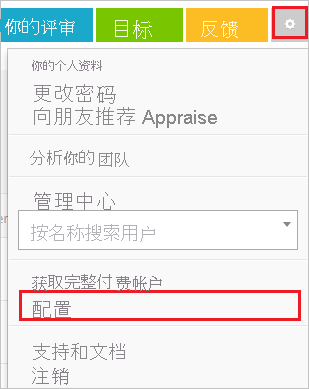
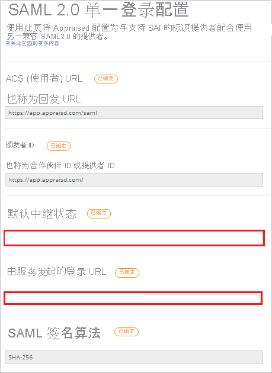
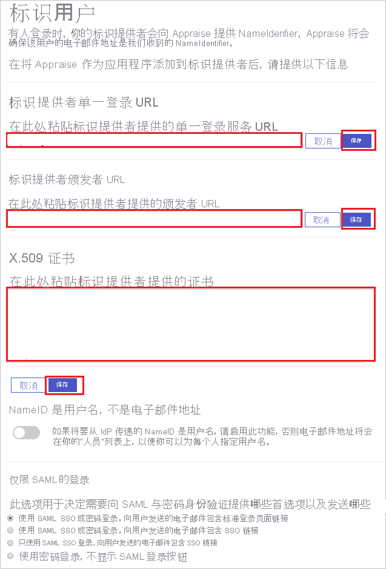
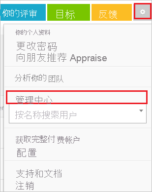

# 教程：将 Appraisd 与 Azure Active Directory 集成

本教程介绍如何将 Appraisd 与 Azure Active Directory (Azure AD) 集成。 将 Appraisd 与 Azure AD 集成后，可以：

* 在 Azure AD 中控制谁有权访问 Appraisd。
* 让用户使用其 Azure AD 帐户自动登录到 Appraisd。
* 在一个中心位置（Azure 门户）管理帐户。

## 必备条件

若要开始操作，需备齐以下项目：

* 一个 Azure AD 订阅。 如果没有订阅，可以获取一个[免费帐户](https://azure.microsoft.com/free/)。
* 启用了 Appraisd 单一登录 (SSO) 的订阅。

## 方案描述

本教程在测试环境中配置并测试 Azure AD SSO。 

* Appraisd 支持 **SP 和 IDP** 发起的 SSO。

## 从库中添加 Appraisd

要配置 Appraisd 与 Azure AD 的集成，需要将库中的 Appraisd 添加到托管 SaaS 应用列表。

1. 使用工作或学校帐户或个人 Microsoft 帐户登录到 Azure 门户。
1. 在左侧导航窗格中，选择“Azure Active Directory”服务  。
1. 导航到“企业应用程序”，选择“所有应用程序”   。
1. 若要添加新的应用程序，请选择“新建应用程序”  。
1. 在“从库中添加”部分的搜索框中，键入“Appraisd”   。
1. 从结果面板中选择“Appraisd”，然后添加该应用  。 在该应用添加到租户时等待几秒钟。

## 配置并测试 Appraisd 的 Azure AD SSO

使用名为 B. Simon 的测试用户配置和测试 Appraisd 的 Azure AD SSO  。 若要使 SSO 有效，需要在 Azure AD 用户与 Appraisd 相关用户之间建立关联。

若要配置并测试 Appraisd 的 Azure AD SSO，请执行以下步骤：

1. **[配置 Azure AD SSO](#configure-azure-ad-sso)** - 使用户能够使用此功能。
    1. **[创建 Azure AD 测试用户](#create-an-azure-ad-test-user)** - 使用 B. Simon 测试 Azure AD 单一登录。
    1. **[分配 Azure AD 测试用户](#assign-the-azure-ad-test-user)** - 使 B. Simon 能够使用 Azure AD 单一登录。
1. [配置 Appraisd SSO](#configure-appraisd-sso) - 在应用程序端配置单一登录设置。
    1. [创建 Appraisd 测试用户](#create-appraisd-test-user) - 在 Appraisd 中创建 B. Simon 的对应用户，并将其关联到用户在 Azure AD 中的表示形式。
1. **[测试 SSO](#test-sso)** - 验证配置是否正常工作。

## 配置 Azure AD SSO

按照下列步骤在 Azure 门户中启用 Azure AD SSO。

1. 在 Azure 门户的“Appraisd”应用程序集成页上，找到“管理”部分，选择“单一登录”  。
1. 在“选择单一登录方法”页上选择“SAML”   。
1. 在“设置 SAML 单一登录”页面上，单击“基本 SAML 配置”旁边的铅笔图标以编辑设置 。

   

4. 在基本 SAML 配置  部分，应用程序进行了预配置，且已通过 Azure 预填充了必要的 URL。 用户需要单击“保存”按钮来保存配置，并执行以下步骤：

    a. 单击“设置其他 URL”  。

    b. 在“中继状态”文本框中键入值 `<TENANTCODE>`

    c. 如果要在 SP 发起的模式下配置应用程序，请在“登录 URL”文本框中使用以下模式键入一个 URL：`https://app.appraisd.com/saml/<TENANTCODE>`  

    > [!NOTE]
    > 在本教程稍后将介绍的“Appraisd SSO 配置”页面上，你获取了实际的登录 URL 和中继状态值。

1. Appraisd 应用程序需要特定格式的 SAML 断言，这要求向“SAML 令牌属性”配置添加自定义属性映射。 以下屏幕截图显示了默认属性的列表，其中的 **nameidentifier** 通过 **user.userprincipalname** 进行映射。 Appraisd 应用程序要求通过 **user.mail** 对 **nameidentifier** 进行映射，因此需单击“编辑”图标对属性映射进行编辑，然后更改属性映射。 

    

1. 在“设置 SAML 单一登录”页的“SAML 签名证书”部分中，找到“证书(Base64)”，选择“下载”以下载该证书并将其保存到计算机上     。

   

1. 在“设置 Appraisd”部分，根据要求复制相应的 URL。 

   

### 创建 Azure AD 测试用户

在本部分中，将在 Azure 门户中创建一个名为 B. Simon 的测试用户。

1. 在 Azure 门户的左侧窗格中，依次选择“Azure Active Directory”、“用户”和“所有用户”  。
1. 选择屏幕顶部的“新建用户”。
1. 在“用户”属性中执行以下步骤：
   1. 在“名称”字段中，输入 `B. Simon`。  
   1. 在“用户名”字段中输入 username@companydomain.extension。 例如，`B. Simon@contoso.com` 。
   1. 选中“显示密码”复选框，然后记下“密码”框中显示的值。
   1. 单击“创建”。

### 分配 Azure AD 测试用户

在本部分中，通过授予 B. Simon 访问 Appraisd 的权限，允许她使用 Azure 单一登录。

1. 在 Azure 门户中，依次选择“企业应用程序”、“所有应用程序”。  
1. 在应用程序列表中，选择 Appraisd  。
1. 在应用的概述页中，找到“管理”部分，选择“用户和组”   。
1. 选择“添加用户”，然后在“添加分配”对话框中选择“用户和组”。
1. 在“用户和组”对话框中，选择“用户”列表中的“B. Simon”，然后单击屏幕底部的“选择”按钮    。
1. 如果在 SAML 断言中需要任何角色值，请在“选择角色”对话框的列表中为用户选择合适的角色，然后单击屏幕底部的“选择”按钮。
1. 在“添加分配”对话框中，单击“分配”按钮。

## 配置 Appraisd SSO

1. 若要在 Appraisd 中自动执行配置，需要安装“我的应用安全登录浏览器扩展”，方法是单击“安装扩展”   。

    

2. 将扩展添加到浏览器后，单击“安装 Appraisd”  会将你定向到 Appraisd 应用程序。 在此处，请提供管理员凭据以登录到 Appraisd。 浏览器扩展会自动配置应用程序，并自动执行第 3-7 步。

    

3. 若要手动设置 Appraisd，请打开新的 Web 浏览器窗口，以管理员身份登录 Appraisd 公司站点，并执行以下步骤：

4. 在页面的右上角，单击“设置”图标，然后导航到“配置”   。

    

5. 从菜单的左侧，单击“SAML 单一登录”  。

    

6. 在“SAML 2.0 单一登录配置”页面上，执行以下步骤  ：

    

    a. 复制“默认中继状态”值，并将其粘贴到 Azure 门户的“基本 SAML 配置”中的“中继状态”文本框    。

    b. 复制“服务发起的登录 URL”值，并将其粘贴到 Azure 门户的“基本 SAML 配置”中的“登录 URL”文本框    。

7. 在同一页面上向下滚动，在“标识用户”下执行以下步骤  ：

    

    a. 在“标识提供者单一登录 URL”文本框中，粘贴从 Azure 门户复制的“登录 URL”值，然后单击“保存”    。

    b. 在“标识提供者证书颁发者 URL”文本框中，粘贴从 Azure 门户复制的“Azure AD 标识符”值，然后单击“保存”    。

    c. 在记事本中，打开从 Azure 门户下载的 base-64 编码证书，复制其内容，然后将其粘贴到“X.509 证书”框中并单击“保存”   。

### 创建 Appraisd 测试用户

必须将 Azure AD 用户预配到 Appraisd 中，然后他们才能登录到 Appraisd。 在 Appraisd 中，预配是一项手动任务。

**若要预配用户帐户，请执行以下步骤：**

1. 以安全管理员身份登录到 Appraisd。

2. 在页面的右上角，单击“设置”图标，然后导航到“管理中心” 。

    

3. 在页面顶部的工具栏中，单击“人员”，再导航到“添加新用户”   。

    

4. 在“添加新用户”页面上，执行以下步骤  ：

    

    a. 在“名字”文本框中，输入用户的名字，例如 Britta   。

    b. 在“姓氏”文本框中，输入用户的姓氏，例如 simon   。

    c. 在“电子邮件”文本框中，输入用户的电子邮件，如 `B. Simon@contoso.com`。 

    d. 单击“添加用户”  。

## 测试 SSO

在本部分，你将使用以下选项测试 Azure AD 单一登录配置。 

#### SP 启动的：

* 在 Azure 门户中单击“测试此应用程序”。 此操作会重定向到 Appraisd 登录 URL，你可在其中启动登录流。  

* 直接转到 Appraisd 登录 URL，并从此处启动登录流。

#### IDP 启动的：

* 在 Azure 门户中单击“测试此应用程序”后，你应会自动登录到为其设置了 SSO 的 Appraisd。 

还可以使用 Microsoft“我的应用”在任何模式下测试此应用程序。 单击“我的应用”中的“Appraisd”磁贴时，如果该应用程序是在 SP 模式下配置的，则会重定向到应用程序登录页来启动登录流；如果是在 IDP 模式下配置的，则会自动登录到为其设置了 SSO 的 Appraisd。 有关“我的应用”的详细信息，请参阅[“我的应用”简介](../user-help/my-apps-portal-end-user-access.md)。

## 后续步骤

配置 Appraisd 后，即可强制实施会话控制，实时防止组织的敏感数据发生外泄和渗透。 会话控制从条件访问扩展而来。 [了解如何通过 Microsoft Cloud App Security 强制实施会话控制](/cloud-app-security/proxy-deployment-aad)。
