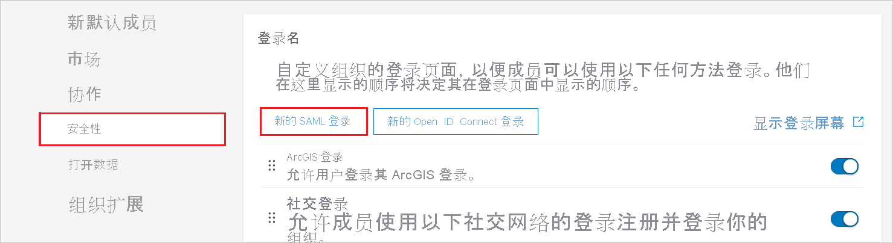
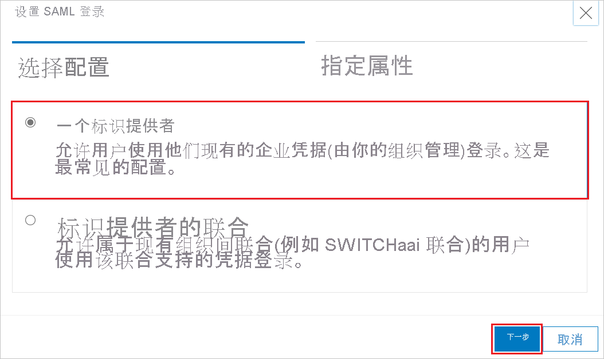
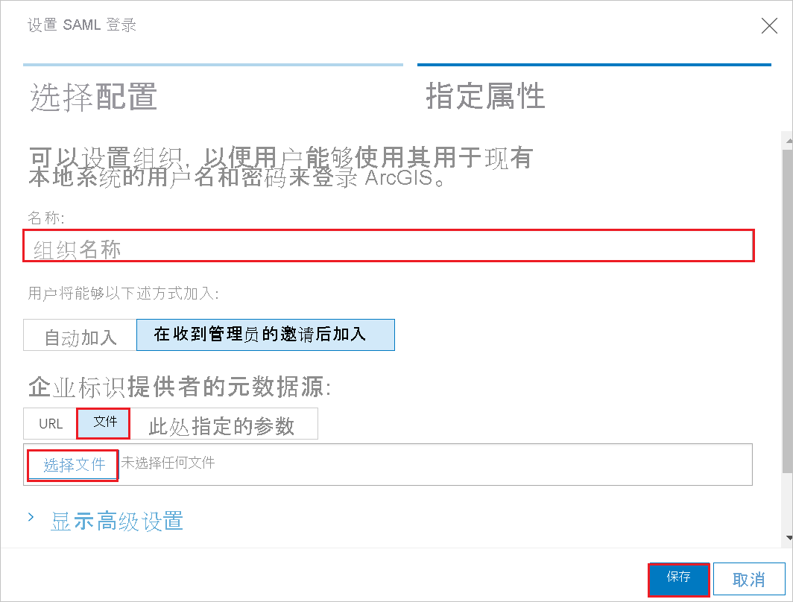
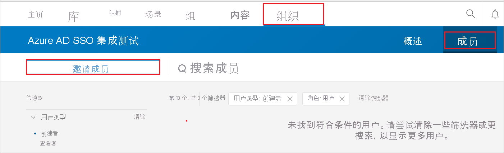
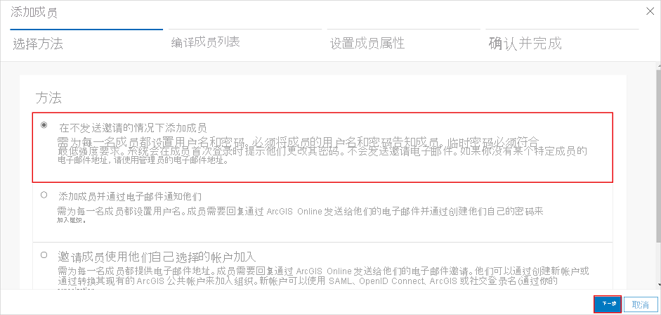
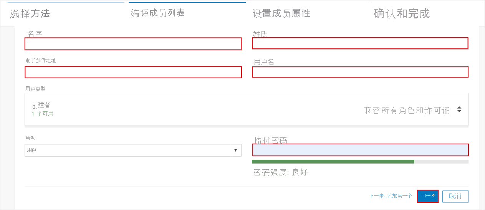
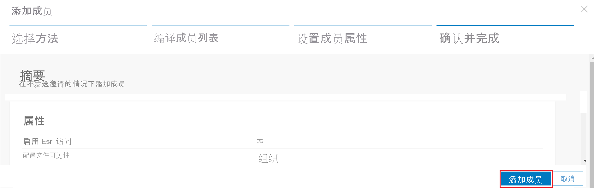

# 教程：Azure Active Directory 与 ArcGIS Online 集成

本教程将介绍如何将 ArcGIS Online 与 Azure Active Directory (Azure AD) 集成。 将 ArcGIS Online 与 Azure AD 集成后，可以：

* 在 Azure AD 中控制谁有权限访问 ArcGIS Online。
* 允许用户使用其 Azure AD 帐户自动登录到 ArcGIS Online。
* 在一个中心位置（Azure 门户）管理帐户。

## 必备条件

若要开始操作，需备齐以下项目：

* 一个 Azure AD 订阅。 如果没有订阅，可以获取一个[免费帐户](https://azure.microsoft.com/free/)。
* 已启用 ArcGIS Online 单一登录 (SSO) 的订阅。

> [!NOTE]
> 此集成也可以通过 Azure AD 美国国家云环境使用。 你可以在“Azure AD 美国国家云应用程序库”中找到此应用程序，并以与在公有云中相同的方式对其进行配置。

## 方案描述

本教程会在测试环境中配置和测试 Azure AD 单一登录。

* ArcGis Online 支持 SP 发起的 SSO。

## 从库中添加 ArcGIS Online

若要配置 ArcGIS Online 与 Azure AD 的集成，需要将库中的 ArcGIS Online 添加到托管的 SaaS 应用列表。

1. 使用工作或学校帐户或个人 Microsoft 帐户登录到 Azure 门户。
1. 在左侧导航窗格中，选择“Azure Active Directory”服务  。
1. 导航到“企业应用程序”，选择“所有应用程序”   。
1. 若要添加新的应用程序，请选择“新建应用程序”  。
1. 在“从库中添加”部分的搜索框中，键入“ArcGIS Online” 。
1. 从结果面板中选择“ArcGIS Online”，然后添加该应用。 在该应用添加到租户时等待几秒钟。

## 配置并测试 ArcGIS Online 的 Azure AD SSO

使用名为 B.Simon 的测试用户配置并测试 ArcGIS Online 的 Azure AD SSO。 若要使 SSO 正常运行，需要在 Azure AD 用户与 ArcGIS Online 中的相关用户之间建立关联。

若要配置并测试 ArcGIS Online 的 Azure AD SSO，请执行以下步骤：

1. **[配置 Azure AD SSO](#configure-azure-ad-sso)** - 使用户能够使用此功能。
    1. **[创建 Azure AD 测试用户](#create-an-azure-ad-test-user)** - 使用 B. Simon 测试 Azure AD 单一登录。
    1. **[分配 Azure AD 测试用户](#assign-the-azure-ad-test-user)** - 使 B. Simon 能够使用 Azure AD 单一登录。
1. **[配置 ArcGIS Online SSO](#configure-arcgis-online-sso)** - 在应用程序端配置单一登录设置。
    1. **[创建 ArcGIS Online 测试用户](#create-arcgis-online-test-user)** - 在 ArcGIS Online 中创建 B.Simon 的对应用户，并将其链接到用户的 Azure AD 表示形式。
1. **[测试 SSO](#test-sso)** - 验证配置是否正常工作。

## 配置 Azure AD SSO

按照下列步骤在 Azure 门户中启用 Azure AD SSO。

1. 在 Azure 门户中的“ArcGIS Online”应用程序集成页面上，找到“管理”部分并选择“单一登录”  。
1. 在“选择单一登录方法”页上选择“SAML” 。
1. 在“设置 SAML 单一登录”页面上，单击“基本 SAML 配置”旁边的铅笔图标以编辑设置 。

   

4. 在“基本 SAML 配置”部分中，按照以下步骤操作：

    a. 在“登录 URL”文本框中，使用以下模式键入 URL：`https://<companyname>.maps.arcgis.com` 

    b. 在“标识符(实体 ID)”文本框中，使用以下模式键入 URL：`<companyname>.maps.arcgis.com`

    > [!NOTE]
    > 这些不是实际值。 使用实际登录 URL 和标识符更新这些值。 若要获取这些值，请与 [ArcGIS Online 客户端支持团队](https://support.esri.com/en/)联系。 还可以参考 Azure 门户中的“基本 SAML 配置”部分中显示的模式。

5. 在“使用 SAML 设置单一登录”页的“SAML 签名证书”部分，单击“下载”以根据要求下载从给定选项提供的“联合元数据 XML”并将其保存在计算机上     。

    

6. 若要在“ArcGIS Online”中自动执行配置，需要安装“我的应用安全登录浏览器扩展”，方法是单击“安装扩展”。

    

7. 将扩展添加到浏览器后，单击“设置 ArcGIS Online”会将你定向到 ArcGIS Online 应用程序。 在此处，提供管理员凭据以登录到 ArcGIS Online。 浏览器扩展将自动配置应用程序，并自动执行“配置 ArcGIS Online 单一登录”部分中的步骤。

### 创建 Azure AD 测试用户 

在本部分，我们将在 Azure 门户中创建名为 B.Simon 的测试用户。

1. 在 Azure 门户的左侧窗格中，依次选择“Azure Active Directory”、“用户”和“所有用户”  。
1. 选择屏幕顶部的“新建用户”。
1. 在“用户”属性中执行以下步骤：
   1. 在“名称”字段中，输入 `B.Simon`。  
   1. 在“用户名”字段中输入 username@companydomain.extension。 例如，`B.Simon@contoso.com` 。
   1. 选中“显示密码”复选框，然后记下“密码”框中显示的值。
   1. 单击“创建”。

### 分配 Azure AD 测试用户

本部分将通过授予 B.Simon 访问 ArcGIS Online 的权限，使其能够使用 Azure 单一登录。

1. 在 Azure 门户中，依次选择“企业应用程序”、“所有应用程序”。 
1. 在应用程序列表中，选择“ArcGIS Online”。
1. 在应用的概述页中，找到“管理”部分，选择“用户和组” 。
1. 选择“添加用户”，然后在“添加分配”对话框中选择“用户和组”。
1. 在“用户和组”对话框中，从“用户”列表中选择“B.Simon”，然后单击屏幕底部的“选择”按钮。
1. 如果你希望将某角色分配给用户，可以从“选择角色”下拉列表中选择该角色。 如果尚未为此应用设置任何角色，你将看到选择了“默认访问权限”角色。
1. 在“添加分配”对话框中，单击“分配”按钮。

## 配置 ArcGIS Online SSO

1. 如果想要手动设置 ArcGIS Online，请打开新的 Web 浏览器窗口并以管理员身份登录到你的 ArcGIS 公司网站，并执行以下步骤：

2. 转到“组织” -> “设置” 。 

    

3. 在左侧菜单中，单击“安全性”，然后选择“登录”选项卡中的“新建 SAML 登录” 。

    

4. 在“设置 SAML 登录”窗口中，配置选为“一个表示提供者”，然后单击“下一页”  。

    

5. 在“指定属性”选项卡中，执行以下步骤：

    

    a. 在“名称”文本框中，键入组织的名称。

    b. 对于“企业标识提供者的元数据源”，请选择“文件” 。

    c. 单击“选择文件”以上传从 Azure 门户下载的“联合元数据 XML”文件 。

    d. 单击“ **保存**”。

### 创建 ArcGIS Online 测试用户

为了使 Azure AD 用户能够登录 ArcGIS Online，必须对其进行预配才能登录 ArcGIS Online。  
就 ArcGIS Online 来说，预配任务需要手动完成。

**若要预配用户帐户，请执行以下步骤：**

1. 登录“ArcGIS”租户。

2. 转到“组织” -> “成员”，然后单击“邀请成员”  。

    

3. 选择“添加成员且无需发送邀请”方法，然后单击“下一页” 。

    

1. 在“编译成员列表”中，选择“新建成员”，然后单击“下一页”  。

4. 在下一页中填写必填字段，然后单击“下一页”。

    

5. 在下一页中，选择要添加的成员，然后单击“下一步”。 

1. 在下一页中，设置必需的成员属性，然后单击“下一页”。

1. 在“确认并完成”选项卡中，单击“添加成员” 。

    

    > [!NOTE]
    > Azure Active Directory 帐户持有者将收到一封电子邮件，并且将单击其中的链接以在激活帐户前确认帐户。

## 测试 SSO

在本部分，你将使用以下选项测试 Azure AD 单一登录配置。 

* 在 Azure 门户中单击“测试此应用程序”。 这将重定向到 Tableau Online 登录 URL，你可以在其中启动登录流。 

* 直接转到 ArcGIS Online 登录 URL，并在其中启动登录流。

* 你可使用 Microsoft 的“我的应用”。 单击“我的应用”中的 ArcGIS Online 磁贴时，会重定向到 ArcGIS Online 登录 URL。 有关“我的应用”的详细信息，请参阅[“我的应用”简介](../user-help/my-apps-portal-end-user-access.md)。

## 后续步骤

配置 ArcGIS Online 后，即可强制实施会话控制，实时防止组织的敏感数据发生外泄和渗透。 会话控制从条件访问扩展而来。 [了解如何通过 Microsoft Cloud App Security 强制实施会话控制](/cloud-app-security/proxy-deployment-any-app)。