# 教程：将 Atlassian Cloud 与 Azure Active Directory 集成

本教程介绍如何将 Atlassian Cloud 与 Azure Active Directory (Azure AD) 集成。 将 Atlassian Cloud 与 Azure AD 集成后，可以：

* 在 Azure AD 中控制谁有权限访问 Atlassian Cloud。
* 让用户使用其 Azure AD 帐户自动登录到 Atlassian Cloud。
* 在一个中心位置（Azure 门户）管理帐户。

## 先决条件

若要开始操作，需备齐以下项目：

* 一个 Azure AD 订阅。 如果没有订阅，可以获取一个[免费帐户](https://azure.microsoft.com/free/)。
* 已启用 Atlassian Cloud 单一登录 (SSO) 的订阅。
* 若要对 Atlassian Cloud 产品启用安全断言标记语言 (SAML) 单一登录，需要设置 Atlassian Access。 详细了解 [Atlassian Access]( https://www.atlassian.com/enterprise/cloud/identity-manager)。

> [!NOTE]
> 此集成也可以通过 Azure AD 美国国家云环境使用。 你可以在“Azure AD 美国国家云应用程序库”中找到此应用程序，并以与在公有云中相同的方式对其进行配置。

## 方案描述

本教程在测试环境中配置并测试 Azure AD SSO。 

* Atlassian Cloud 支持 SP 和 IDP 发起的 SSO。
* Atlassian Cloud 支持[自动用户预配和取消预配](atlassian-cloud-provisioning-tutorial.md)。

## 从库中添加 Atlassian Cloud

要配置 Atlassian Cloud 与 Azure AD 的集成，需要从库中将 Atlassian Cloud 添加到托管 SaaS 应用列表。

1. 使用工作或学校帐户或个人 Microsoft 帐户登录到 Azure 门户。
1. 在左侧导航窗格中，选择“Azure Active Directory”服务  。
1. 导航到“企业应用程序”，选择“所有应用程序”   。
1. 若要添加新的应用程序，请选择“新建应用程序”  。
1. 在“从库中添加”部分的搜索框中，键入“Atlassian Cloud”   。
1. 从结果面板中选择“Atlassian Cloud”，然后添加该应用  。 在该应用添加到租户时等待几秒钟。

## 配置和测试 Azure AD SSO

使用名为 B.Simon 的测试用户配置和测试 Atlassian Cloud 的 Azure AD SSO  。 若要运行 SSO，需要在 Azure AD 用户与 Atlassian Cloud 相关用户之间建立链接关系。

若要配置并测试 Atlassian Cloud 的 Azure AD SSO，请执行以下步骤：

1. **[配置 Atlassian Cloud 的 Azure AD SSO](#configure-azure-ad-with-atlassian-cloud-sso)** - 以使用户能够将基于 Azure AD 的 SAML SSO 用于 Atlassian Cloud。
    1. **[创建 Azure AD 测试用户](#create-an-azure-ad-test-user)** - 使用 B. Simon 测试 Azure AD 单一登录。
    1. **[分配 Azure AD 测试用户](#assign-the-azure-ad-test-user)** - 使 B. Simon 能够使用 Azure AD 单一登录。
1. **[创建 Atlassian Cloud 测试用户](#create-atlassian-cloud-test-user)** - 在 Atlassian Cloud 中创建 B.Simon 的对应用户，并将其链接到该用户的 Azure AD 表示形式。
1. **[测试 SSO](#test-sso)** - 验证配置是否正常工作。

## 使用 Atlassian Cloud 配置 Azure AD SSO

按照下列步骤在 Azure 门户中启用 Azure AD SSO。

1. 若要在 Atlassian Cloud 中自动执行配置，需要安装“我的应用安全登录浏览器扩展”  ，方法是单击“安装扩展”  。

    

1. 将扩展添加到浏览器后，单击“设置 Atlassian Cloud”会将你定向到 Atlassian Cloud 应用程序。 在此处，提供管理员凭据以登录到 Atlassian Cloud。 该浏览器扩展会自动配置该应用程序。

    

1. 如果想要手动设置 Atlassian Cloud，请以管理员身份登录到 Atlassian Cloud 公司网站，并执行以下步骤。

1. 作为准备，请先转至 Atlassian 产品实例并复制或保存实例 URL。
   > [!NOTE]
   > URL 应为 `https://<INSTANCE>.atlassian.com` 模式。

   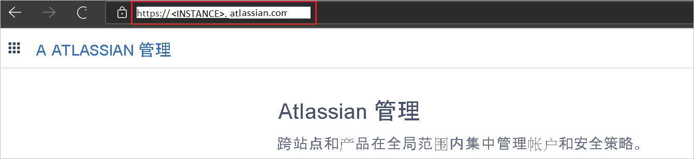

1. 打开 [Atlassian 管理门户](https://admin.atlassian.com/)并单击你的组织名称。

   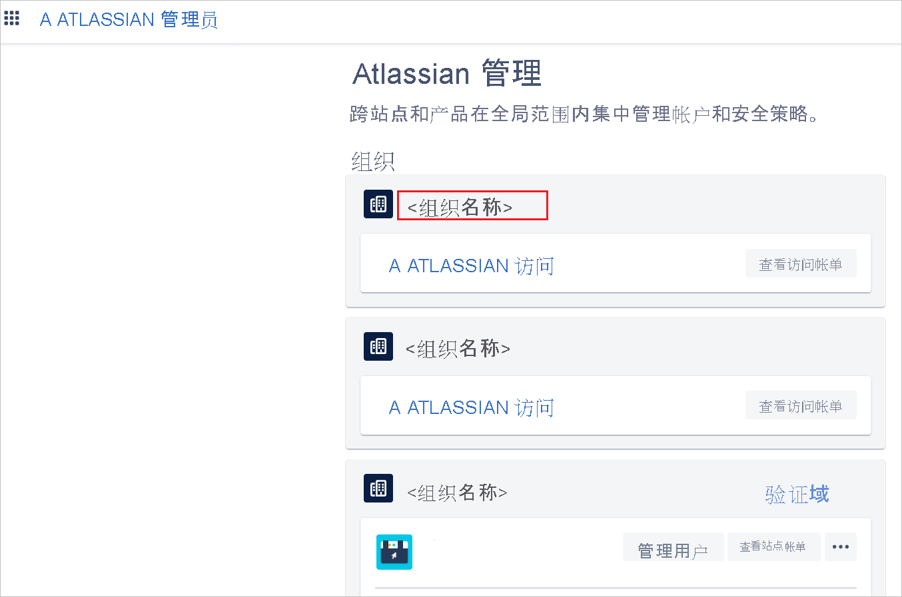

1. 在打算配置单一登录前，需要对你的域进行验证。 有关详细信息，请参阅 [Atlassian 域验证](https://confluence.atlassian.com/cloud/domain-verification-873871234.html)文档。

1. 在“ATLASSIAN 管理门户”中，转至“安全性”选项卡，选择“SAML单一登录”，然后单击“添加 SAML 配置”。   

   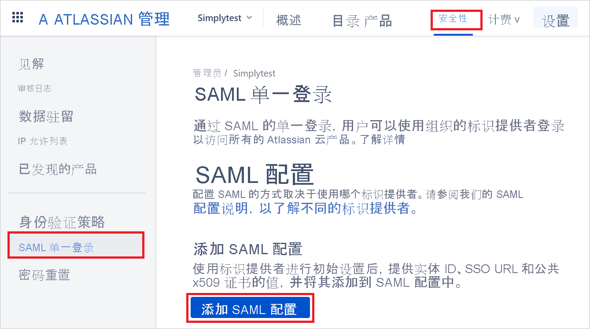

1. 在 Azure 门户的 Atlassian Cloud 应用程序集成页上，找到“管理”部分并选择“设置单一登录”  。

   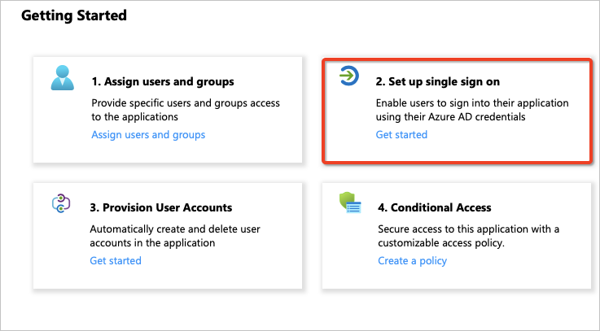

1. 在“选择单一登录方法”页上选择“SAML”   。

   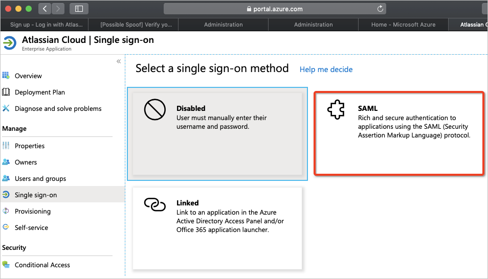

1. 在“设置 SAML 单一登录”页，向下滚动至“设置 Atlassian Cloud” 。
   
   a. 单击“配置 URL”。

   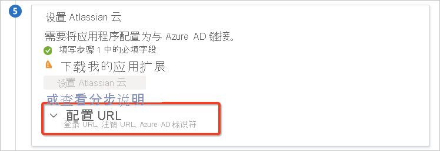
   
   b. 从 Microsoft Azure 门户复制“Azure AD 标识符”值，将其粘贴至 Atlassian 中的“标识提供者实体 ID”文本框中。 
   
   c. 复制“登录 URL”值，将其粘贴至 Atlassian 的“标识提供程序 SSO URL”文本框中。 

   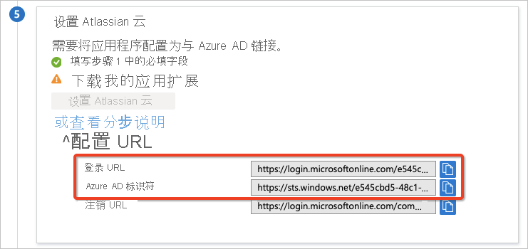

   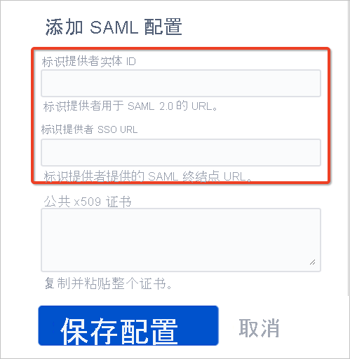

1. 在“设置 SAML 单一登录”页的“SAML 签名证书”部分中，找到“证书(Base64)”，选择“下载”以下载该证书并将其保存到计算机上     。

   

   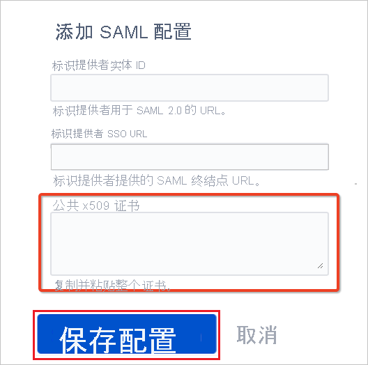

1. 在 Atlassian 中“添加”并“保存”SAML 配置。 

1. 在“基本 SAML 配置”部分中，按照以下步骤操作。

   a. 从 Atlassian 复制“SP 实体 ID”值，将其粘贴至 Azure 中的“标识符（实体 ID）”框中，并将其设置为默认值。 
   
   b. 从 Atlassian 复制“SP 断言使用者服务 URL”值，粘贴至“回复 URL（断言使用者服务 URL）”框中，并设置为默认值。 
   
   c. 复制步骤 4 中的“实例 URL”值，粘贴至 Azure 中的“中继状态”框。 

   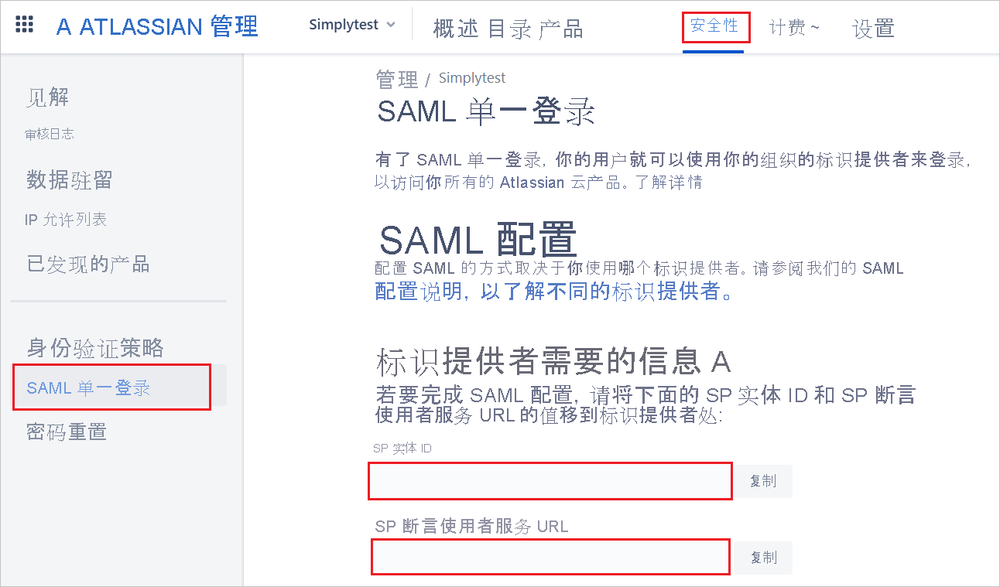

   

   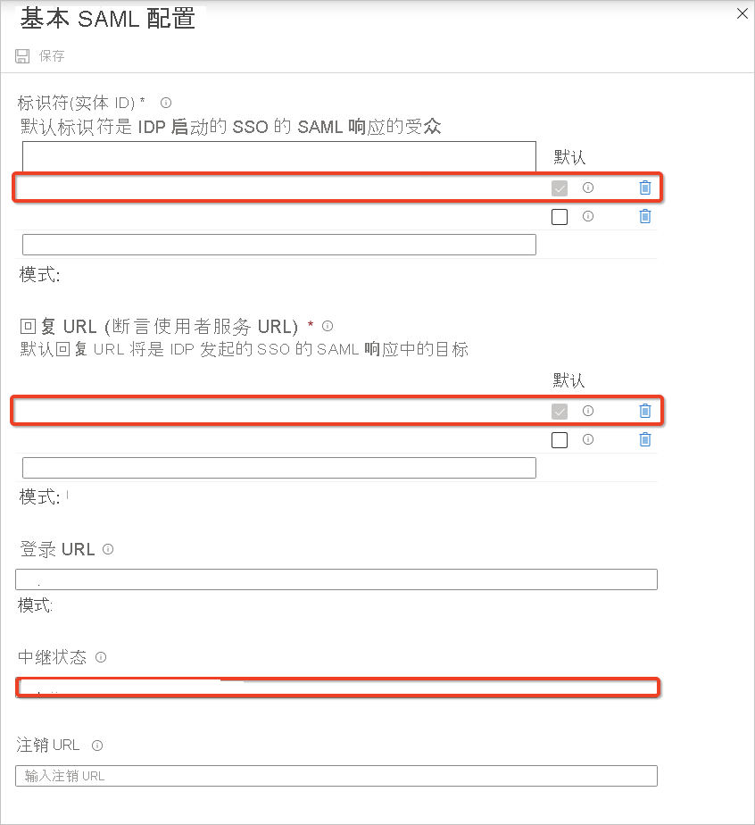
   
1. Atlassian Cloud 应用程序需要特定格式的 SAML 断言，这需要向“SAML 令牌属性”配置添加自定义属性映射。 可单击“编辑”图标来编辑属性映射。 

   
   
   1. 针对具备 Microsoft 365 许可证的 Azure AD 租户的属性映射。
      
      a. 单击“唯一用户标识符(名称 ID)”声明。

      
      
      b. Atlassian Cloud 期望 nameidentifier（唯一用户标识符）映射到用户的电子邮件 (user.email)  。 编辑“源属性”，并将其更改为 user.mail 。 保存对声明所做的更改。

      
      
      c. 最终属性映射应如下所示。

      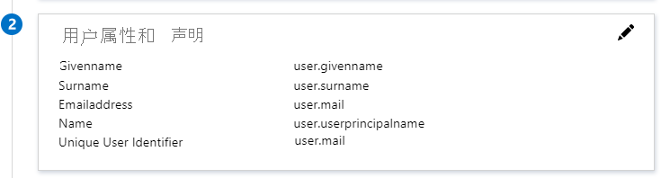
      
   1. 针对无 Microsoft 365 许可证的 Azure AD 租户的属性映射。 

      a. 单击 `http://schemas.xmlsoap.org/ws/2005/05/identity/claims/emailaddress` 声明。

      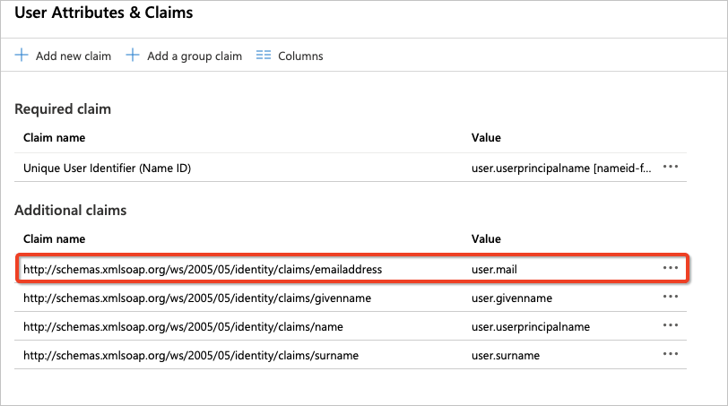
         
      b. 尽管 Azure 不会为在 Azure AD 租户中创建的没有 Microsoft 365 许可证的用户填充 user.mail 属性，但会将此类用户的电子邮件存储在 userprincipalname 属性中 。 Atlassian Cloud 期望 nameidentifier（唯一用户标识符）映射到用户的电子邮件 (user.userprincipalname)  。  编辑“源属性”，并将其更改为 user.userprincipalname 。 保存对声明所做的更改。

      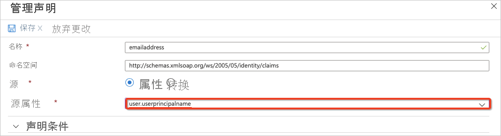
         
      c. 最终属性映射应如下所示。

      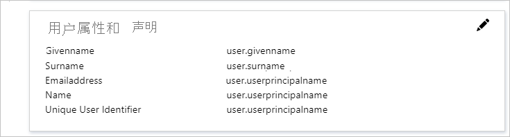

1. 如需在身份验证策略中强制实施 SAML 单一登录，请执行以下步骤。

   a.   在“Atlassian 管理门户”中，选择“安全”选项卡，然后单击“身份验证策略”。  

   b.   对于要强制实施的策略，请选择“编辑”。 

   c.   在“设置”中，为托管用户启用“强制单一登录”，进行 SAML 重定向。  

   d.   单击“更新”  。 

      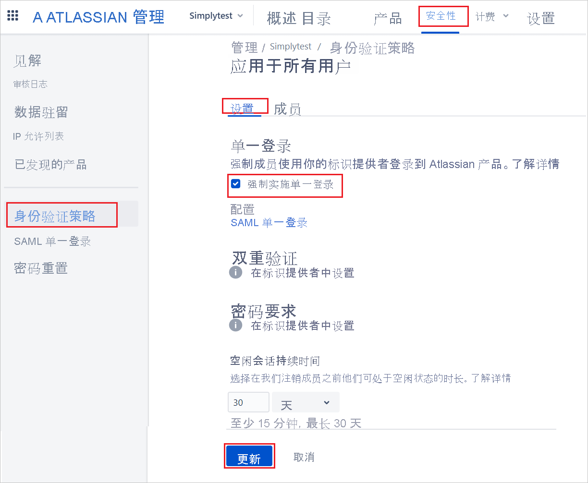 

   > [!NOTE]
   > 管理员可以测试 SAML 配置，只需先在单独的身份验证策略上为一部分用户启用强制 SSO，如果没有问题就可为所有用户启用该策略。

### 创建 Azure AD 测试用户

在本部分，我们将在 Azure 门户中创建名为 B.Simon 的测试用户。

1. 在 Azure 门户的左侧窗格中，依次选择“Azure Active Directory”、“用户”和“所有用户”  。
1. 选择屏幕顶部的“新建用户”。
1. 在“用户”属性中执行以下步骤：
   1. 在“名称”字段中，输入 `B.Simon`。  
   1. 在“用户名”字段中输入 username@companydomain.extension。 例如，`B.Simon@contoso.com`。
   1. 选中“显示密码”复选框，然后记下“密码”框中显示的值。
   1. 单击“创建”。

### 分配 Azure AD 测试用户

在本部分中，通过授予 B.Simon 访问 Atlassian Cloud 的权限，允许其使用 Azure 单一登录。

1. 在 Azure 门户中，依次选择“企业应用程序”、“所有应用程序”。  
1. 在应用程序列表中，选择“Atlassian Cloud”。 
1. 在应用的概述页中，找到“管理”部分，选择“用户和组”   。
1. 选择“添加用户”，然后在“添加分配”对话框中选择“用户和组”。
1. 在“用户和组”对话框中，从“用户”列表中选择“B.Simon”，然后单击屏幕底部的“选择”按钮。
1. 如果你希望将某角色分配给用户，可以从“选择角色”下拉列表中选择该角色。 如果尚未为此应用设置任何角色，你将看到选择了“默认访问权限”角色。
1. 在“添加分配”对话框中，单击“分配”按钮。

### 创建 Atlassian Cloud 测试用户

要使 Azure AD 用户登录至 Atlassian Cloud，请执行以下操作，在 Atlassian Cloud 中手动预配用户帐户：

1. 转至“产品”选项卡，选择“用户”，单击“邀请用户”。  

    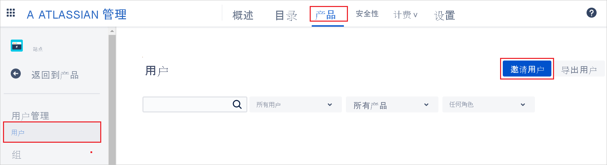

1. 在“电子邮件地址”框中输入该用户的电子邮件地址，单击“邀请用户”。 

    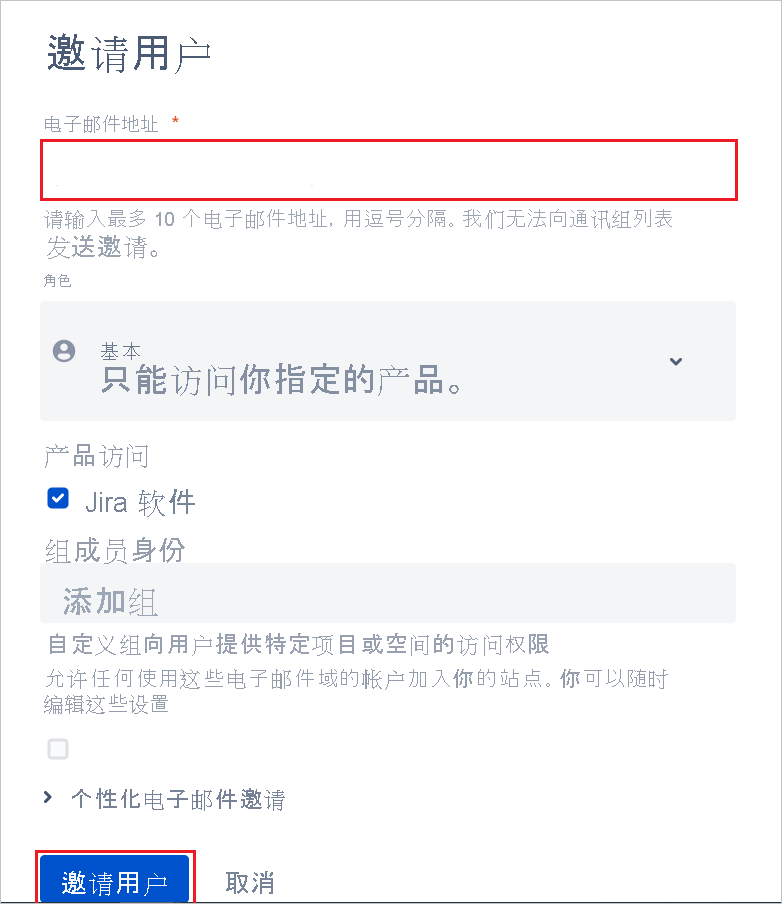

### 测试 SSO

在本部分，你将使用以下选项测试 Azure AD 单一登录配置。 

#### SP 启动的：

* 在 Azure 门户中单击“测试此应用程序”。 这会重定向到 Atlassian Cloud 登录 URL，可在这里启动登录流。  

* 直接转到 Atlassian Cloud 登录 URL，从此处启动登录流。

#### IDP 启动的：

* 在 Microsoft Azure 门户单击“测试此应用程序”，将会自动登录至设置了 SSO 的 Atlassian Cloud。 

还可以使用 Microsoft“我的应用”在任何模式下测试此应用程序。 单击“我的应用”中的 Atlassian Cloud 磁贴时，如果是在 SP 模式下配置的，系统会将你重定向到应用程序登录页面来启动登录流；如果是在 IDP 模式下配置的，你会自动登录到为其设置了 SSO 的 Atlassian Cloud。 有关“我的应用”的详细信息，请参阅[“我的应用”简介](../user-help/my-apps-portal-end-user-access.md)。

## 后续步骤

配置 Atlassian Cloud 后，就可以强制实施会话控制，从而实时保护组织的敏感数据免于外泄和渗透。 会话控制从条件访问扩展而来。 [了解如何通过 Microsoft Cloud App Security 强制实施会话控制](/cloud-app-security/proxy-deployment-any-app)。