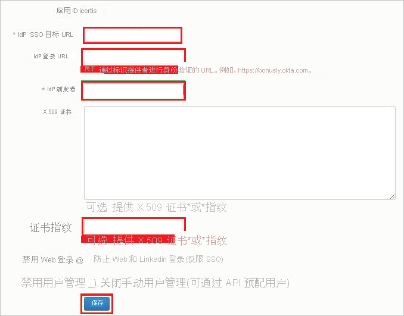
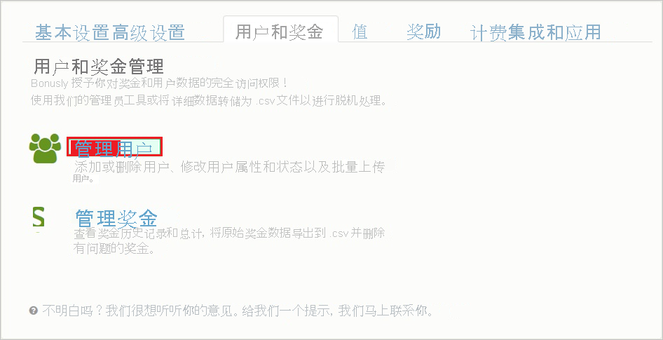
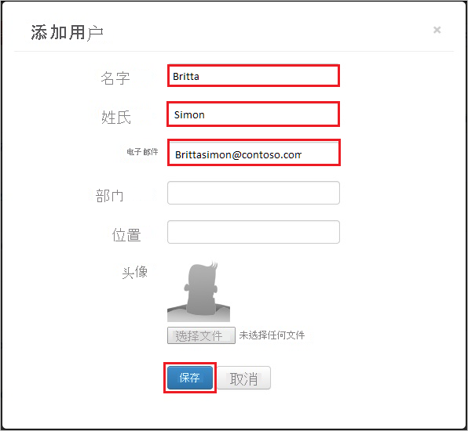

# 教程：Azure Active Directory 与 Bonusly 集成

本教程介绍如何将 Bonusly 与 Azure Active Directory (Azure AD) 相集成。 将 Bonusly 与 Azure AD 集成后，可以：

* 在 Azure AD 中控制谁有权访问 Bonusly。
* 让用户使用其 Azure AD 帐户自动登录到 Bonusly。
* 在一个中心位置（Azure 门户）管理帐户。

## 必备条件

若要配置 Azure AD 与 Bonusly 的集成，需具备以下项：

* 一个 Azure AD 订阅。 如果没有 Azure AD 环境，可以获取一个[免费帐户](https://azure.microsoft.com/free/)。
* 已启用 Bonusly 单一登录的订阅。

## 方案描述

本教程会在测试环境中配置和测试 Azure AD 单一登录。

* Bonusly 支持 IDP 发起的 SSO。
* Bonusly 支持[自动用户预配](bonusly-provisioning-tutorial.md)。

> [!NOTE]
> 此应用程序的标识符是一个固定字符串值，因此只能在一个租户中配置一个实例。

## 从库中添加 Bonusly

要配置 Bonusly 与 Azure AD 的集成，需要从库中将 Bonusly 添加到托管 SaaS 应用列表。

1. 使用工作或学校帐户或个人 Microsoft 帐户登录到 Azure 门户。
1. 在左侧导航窗格中，选择“Azure Active Directory”服务  。
1. 导航到“企业应用程序”，选择“所有应用程序”   。
1. 若要添加新的应用程序，请选择“新建应用程序”。
1. 在“从库中添加”部分的搜索框中，键入“Bonusly” 。
1. 在结果面板中选择“Bonusly”，然后添加该应用。 在该应用添加到租户时等待几秒钟。

## 配置并测试 Bonusly 的 Azure AD SSO

使用名为 B.Simon 的测试用户配置并测试 Bonusly 的 Azure AD SSO。 若要正常使用 SSO，需要在 Azure AD 用户与 Bonusly 中的相关用户之间建立链接关系。

若要配置并测试 Bonusly 的 Azure AD SSO，请执行以下步骤：

1. **[配置 Azure AD SSO](#configure-azure-ad-sso)** - 使用户能够使用此功能。
    1. **[创建 Azure AD 测试用户](#create-an-azure-ad-test-user)** - 使用 B. Simon 测试 Azure AD 单一登录。
    1. **[分配 Azure AD 测试用户](#assign-the-azure-ad-test-user)** - 使 B. Simon 能够使用 Azure AD 单一登录。
1. [配置 Bonusly SSO](#configure-bonusly-sso) - 在应用程序端配置单一登录设置。
    1. [创建 Bonusly 测试用户](#create-bonusly-test-user) - 在 Bonusly 中创建 B.Simon 的对应用户，并将其链接到该用户在 Azure AD 中对应的身份。
1. **[测试 SSO](#test-sso)** - 验证配置是否正常工作。

## 配置 Azure AD SSO

按照下列步骤在 Azure 门户中启用 Azure AD SSO。

1. 在 Azure 门户中的“Bonusly”应用程序集成页上，找到“管理”部分并选择“单一登录”  。
1. 在“选择单一登录方法”页上选择“SAML” 。
1. 在“设置 SAML 单一登录”页面上，单击“基本 SAML 配置”旁边的铅笔图标以编辑设置 。

   

4. 在“基本 SAML 配置”  部分中，执行以下步骤：

    在“回复 URL”文本框中，使用以下模式键入 URL：`https://Bonus.ly/saml/<TENANT_NAME>` 

    > [!NOTE]
    > 此值不是真实值。 请使用实际回复 URL 更新此值。 请联系 [Bonusly 客户端支持团队](https://bonus.ly/contact)获取此值。 还可以参考 Azure 门户中的“基本 SAML 配置”  部分中显示的模式。

5. 在“SAML 签名证书”  部分中，单击“编辑”  按钮以打开“SAML 签名证书”  对话框。

    

6. 在“SAML 签名证书”部分中，复制 **指纹** 并将其保存在计算机上。

    

7. 在“设置 Bonusly”部分中，根据要求复制相应 URL  。

    

### 创建 Azure AD 测试用户

在本部分，我们将在 Azure 门户中创建名为 B.Simon 的测试用户。

1. 在 Azure 门户的左侧窗格中，依次选择“Azure Active Directory”、“用户”和“所有用户”  。
1. 选择屏幕顶部的“新建用户”。
1. 在“用户”属性中执行以下步骤：
   1. 在“名称”字段中，输入 `B.Simon`。  
   1. 在“用户名”字段中输入 username@companydomain.extension。 例如，`B.Simon@contoso.com`。
   1. 选中“显示密码”复选框，然后记下“密码”框中显示的值。
   1. 单击“创建”。

### 分配 Azure AD 测试用户

在本部分，你将通过授予 B.Simon 访问 Bonusly 的权限，使其能够使用 Azure 单一登录。

1. 在 Azure 门户中，依次选择“企业应用程序”、“所有应用程序”。 
1. 在应用程序列表中，选择“Bonusly”  。
1. 在应用的概述页中，找到“管理”部分，选择“用户和组” 。
1. 选择“添加用户”，然后在“添加分配”对话框中选择“用户和组”。
1. 在“用户和组”对话框中，从“用户”列表中选择“B.Simon”，然后单击屏幕底部的“选择”按钮。
1. 如果你希望将某角色分配给用户，可以从“选择角色”下拉列表中选择该角色。 如果尚未为此应用设置任何角色，你将看到选择了“默认访问权限”角色。
1. 在“添加分配”对话框中，单击“分配”按钮。

## 配置 Bonusly SSO

1. 在另一个浏览器窗口中，登录到 **Bonusly** 租户。

1. 在顶部工具栏中，单击“设置”，并选择“集成和应用”。  

    
1. 在“单一登录”下选择“SAML”。  

1. 在“SAML”对话框页上执行以下步骤： 

    

    a. 在“IdP SSO 目标 URL”文本框中，粘贴从 Azure 门户复制的“登录 URL”值   。

    b. 在“IdP 登录 URL”文本框中，粘贴从 Azure 门户复制的“登录 URL”值   。

    c. 在“IdP 颁发者”文本框中，粘贴从 Azure 门户复制的“Azure AD 标识符”值   。
    
    d. 将从 Azure 门户复制的“指纹”值粘贴到“证书指纹”文本框中   。
    
    e. 单击“ **保存**”。

### 创建 Bonusly 测试用户

为了使 Azure AD 用户能够登录 Bonusly，必须将其预配到 Bonusly 中。 就 Bonusly 来说，预配任务需要手动完成。

> [!NOTE]
> 可使用其他任何 Bonusly 用户帐户创建工具或 Bonusly 提供的 API 预配 Azure AD 用户帐户。 

**若要配置用户设置，请执行以下步骤：**

1. 在 Web 浏览器窗口中，登录到 Bonusly 租户。

1. 单击“设置”  。

    

1. 单击“用户和奖金”  选项卡。

    

1. 单击“管理用户”。 

    

1. 单击“添加用户”  。

    

1. 在“添加用户”对话框中，执行以下步骤： 

      

    a. 在“名字”文本框中，输入用户的名字（如“Britta”）   。

    b. 在“姓氏”文本框中，输入用户的姓氏（如“Simon”）   。

    c. 在“电子邮件”文本框中，输入用户的电子邮件地址（例如 `brittasimon@contoso.com`）。

    d. 单击“保存”  。

    > [!NOTE]
    > Azure AD 帐户持有者会收到一封电子邮件，其中包含用于在激活帐户前确认帐户的链接。

> [!NOTE]
>Bonusly 还支持自动用户预配，有关如何配置自动用户预配的更多详细信息，请参见[此处](./bonusly-provisioning-tutorial.md)。

## 测试 SSO

在本部分，你将使用以下选项测试 Azure AD 单一登录配置。

* 在 Azure 门户中单击“测试此应用程序”，然后你应会自动登录到为其设置了 SSO 的 Bonusly。

* 你可使用 Microsoft 的“我的应用”。 在“我的应用”中单击“Bonusly”磁贴时，应会自动登录到为其设置了 SSO 的 Bonusly。 有关“我的应用”的详细信息，请参阅[“我的应用”简介](https://support.microsoft.com/account-billing/sign-in-and-start-apps-from-the-my-apps-portal-2f3b1bae-0e5a-4a86-a33e-876fbd2a4510)。

## 后续步骤

配置 Bonusly 后，可以强制实施会话控制，从而实时防止组织的敏感数据遭到外泄和渗透。 会话控制从条件访问扩展而来。 [了解如何通过 Microsoft Cloud App Security 强制实施会话控制](/cloud-app-security/proxy-deployment-aad)。