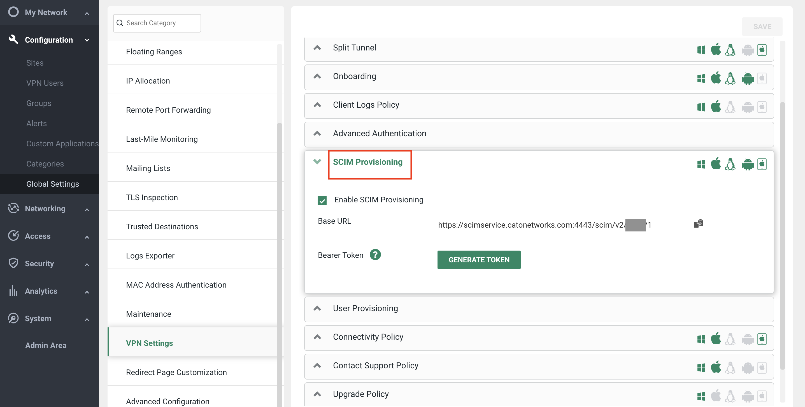

# 教程：为 Cato Networks 配置自动用户预配

本教程介绍在 Cato Networks 和 Azure Active Directory (Azure AD) 中配置自动用户预配时需执行的步骤。 配置后，Azure AD 会使用 Azure AD 预配服务将用户和组自动预配到 [Cato Networks](https://www.catonetworks.com/) 并自动取消预配。 有关此服务的功能、工作原理以及常见问题的重要详细信息，请参阅[使用 Azure Active Directory 自动将用户预配到 SaaS 应用程序和取消预配](../app-provisioning/user-provisioning.md)。 

## 支持的功能
> [!div class="checklist"]
> * 在 Cato Networks 中创建用户
> * 当用户不再有访问需求时，在 Cato Networks 中删除用户
> * 使用户特性在 Azure AD 和 Cato Networks 之间保持同步
> * 在 Cato Networks 中预配组和组成员身份

## 先决条件

本教程中概述的方案假定你已具有以下先决条件：

* [Azure AD 租户](../develop/quickstart-create-new-tenant.md) 
* Azure AD 中[有权](../roles/permissions-reference.md)配置预配的用户帐户（例如应用管理员、云应用管理员、应用所有者或全局管理员）。 
* [Cato Networks](https://www.catonetworks.com/) 帐户。
* Cato Networks 中具有管理员权限的管理员帐户。
* 具有足够用户数量的许可证。

## 步骤 1。 计划预配部署
1. 了解[预配服务的工作原理](../app-provisioning/user-provisioning.md)。
1. 确定谁在[预配范围](../app-provisioning/define-conditional-rules-for-provisioning-user-accounts.md)中。
1. 确定要[在 Azure AD 与 Cato Networks 之间映射](../app-provisioning/customize-application-attributes.md)的数据。 

## 步骤 2。 配置 Cato Networks 以支持通过 Azure AD 进行预配

1. 登录 [Cato 管理应用程序](https://cc2.catonetworks.com)中的帐户。
1. 在导航菜单中，选择“配置”>“全局设置”，然后展开“VPN 设置”部分 。
        
1. 展开“SCIM 预配”部分，通过单击“启用 SCIM 预配”来启用 SCIM 预配 。
         
1. 将 Cato 管理应用程序中的基 URL 和持有者令牌复制到 Azure 门户中的 SCIM 应用：
   1. 在 Cato 管理应用程序（“SCIM 预配”部分）中，复制基 URL。
   1. 在 Azure 门户中 Cato Networks SCIM 应用的“预配”选项卡中，将基 URL 粘贴到“租户 URL”字段 。
        
   1. 在 Cato 管理应用程序（“SCIM 预配”部分）中，单击“生成令牌”并复制持有者令牌 。
   1. 在 Azure 门户的 Cato Networks SCIM 应用中，将持有者令牌粘贴到“机密令牌”字段。
        
1. 在 Cato 管理应用程序（“SCIM 预配”部分）中，单击“保存” 。 Cato 帐户和 Azure AD 之间的 SCIM 预配已配置。 
        
1. 测试 Azure SCIM 应用与 Cato 云之间的连接。 在 Azure 门户中 Cato Networks SCIM 应用的“预配”选项卡中，单击“测试连接” 。         
                                  

## 步骤 3。 从 Azure AD 应用程序库添加 Cato Networks

从 Azure AD 应用程序库添加 Cato Networks，开始管理 Cato Networks 的预配。 若要详细了解如何从库中添加应用，可以单击[此处](../manage-apps/add-application-portal.md)。 

## 步骤 4. 定义谁在预配范围中 

使用 Azure AD 预配服务，可以根据对应用的分配或用户/组的特性来限定谁在预配范围内。 如果选择根据分配来限定要将谁预配到应用，可以按照下面的[步骤](../manage-apps/assign-user-or-group-access-portal.md)操作，将用户和组分配到应用。 如果选择仅根据用户或组的属性来限定要对谁进行预配，可以使用[此处](../app-provisioning/define-conditional-rules-for-provisioning-user-accounts.md)所述的范围筛选器。 

* 将用户和组分配到 Cato Networks 时，必须选择“默认访问”以外的角色。 具有“默认访问”角色的用户将从预配中排除，并在预配日志中被标记为未有效授权。 如果应用程序上唯一可用的角色是默认访问角色，则可以[更新应用程序清单](../develop/howto-add-app-roles-in-azure-ad-apps.md)以添加更多角色。 

* 先小部分测试。 在向全员推出之前，请先使用少量的用户和组进行测试。 如果预配范围设置为分配的用户和组，则可以通过将一两个用户或组分配到应用来控制预配。 当预配范围设置为所有用户和组时，可以指定[基于属性的范围筛选器](../app-provisioning/define-conditional-rules-for-provisioning-user-accounts.md)。 

## 步骤 5。 配置 Cato Networks 的自动用户预配 

本部分逐步介绍了如何配置 Azure AD 预配服务以基于 Azure AD 中的用户和/或组分配在 Cato Networks 中创建、更新和禁用用户和/或组。

### 在 Azure AD 中为 Cato Networks 配置自动用户预配：

1. 登录 [Azure 门户](https://portal.azure.com)。 依次选择“企业应用程序”、“所有应用程序” 。

    

1. 在应用程序列表中，选择“Cato Networks”。

    

1. 选择“预配”  选项卡。

    

1. 将“预配模式”设置为“自动”。

    

1. 在“管理员凭据”部分下，输入 Cato Networks 租户 URL 和机密令牌。 单击“测试连接”以确保 Azure AD 可以连接到 Cato Networks。 如果连接失败，请确保 Cato Networks 帐户具有管理员权限，然后重试。

    

1. 在“通知电子邮件”字段中，输入应接收预配错误通知的个人或组的电子邮件地址，并选中“发生故障时发送电子邮件通知”复选框 。

    

1. 选择“保存”。

1. 在“映射”部分下，选择“将 Azure Active Directory 用户同步到 Cato Networks” 。

1. 在“特性映射”部分中，查看从 Azure AD 同步到 Cato Networks 的用户特性。 选为“匹配”属性的特性用于匹配 Cato Networks 中的用户帐户以执行更新操作。 如果选择更改[匹配目标特性](../app-provisioning/customize-application-attributes.md)，则需要确保 Cato Networks API 支持基于该特性筛选用户。 选择“保存”按钮以提交任何更改  。

   |Attribute|类型|支持筛选|
   |---|---|---|
   |userName|字符串|&check;
   |emails[type eq "work"].value|字符串|
   |活动|Boolean|
   |externalId|字符串|
   |name.givenName|字符串|
   |name.familyName|字符串|
   |phoneNumbers[type eq "work"].value|字符串|

1. 在“映射”部分下，选择“将 Azure Active Directory 组同步到 Cato Networks” 。

1. 在“特性映射”部分中，查看从 Azure AD 同步到 Cato Networks 的组特性。 选为“匹配”属性的特性用于匹配 Cato Networks 中的组以执行更新操作。 选择“保存”按钮以提交任何更改  。

      |Attribute|类型|支持筛选|
      |---|---|---|
      |displayName|字符串|&check;
      |externalId|字符串|
      |members|参考|

1. 若要配置范围筛选器，请参阅[范围筛选器教程](../app-provisioning/define-conditional-rules-for-provisioning-user-accounts.md)中提供的以下说明。

1. 若要为 Cato Networks 启用 Azure AD 预配服务，请在“设置”部分中将“预配状态”更改为“启用”  。

    

1. 通过在“设置”部分的“范围”中选择所需的值，定义要预配到 Cato Networks 的用户和/或组 。

    

1. 在已准备好预配时，请单击“保存”。

    

此操作会对“设置”部分的“范围”中定义的所有用户和组启动初始同步周期 。 初始周期完成的时间比后续周期长，只要 Azure AD 预配服务正在运行，后续周期大约每隔 40 分钟就会进行一次。 

## 步骤 6. 监视部署
配置预配后，请使用以下资源来监视部署：

* 通过[预配日志](../reports-monitoring/concept-provisioning-logs.md)来确定哪些用户已预配成功或失败
* 检查[进度栏](../app-provisioning/application-provisioning-when-will-provisioning-finish-specific-user.md)来查看预配周期的状态以及完成进度
* 如果怀疑预配配置处于非正常状态，则应用程序将进入隔离状态。 可在[此处](../app-provisioning/application-provisioning-quarantine-status.md)了解有关隔离状态的详细信息。  

## 更多资源

* [管理企业应用的用户帐户预配](../app-provisioning/configure-automatic-user-provisioning-portal.md)
* [Azure Active Directory 的应用程序访问与单一登录是什么？](../manage-apps/what-is-single-sign-on.md)

## 后续步骤

* [了解如何查看日志并获取有关预配活动的报告](../app-provisioning/check-status-user-account-provisioning.md)