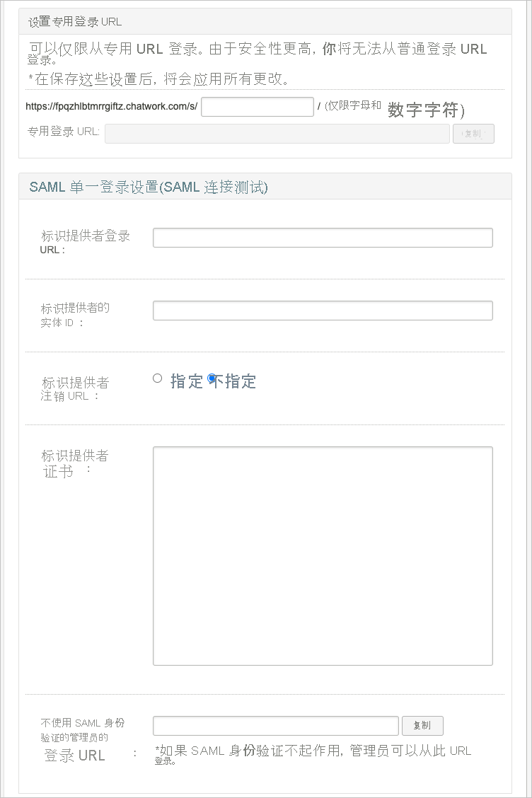
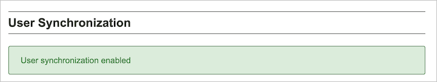

# 教程：为 Chatwork 配置自动用户预配

本教程介绍了在 Chatwork 和 Azure Active Directory (Azure AD) 中配置自动用户预配时需执行的步骤。 配置后，Azure AD 会使用 Azure AD 预配服务自动将用户和组预配到 [Chatwork](https://corp.chatwork.com/) 以及自动取消预配。 有关此服务的功能、工作原理以及常见问题的重要详细信息，请参阅[使用 Azure Active Directory 自动将用户预配到 SaaS 应用程序和取消预配](../app-provisioning/user-provisioning.md)。 

## 支持的功能
> [!div class="checklist"]
> * 在 Chatwork 中创建用户。
> * 在用户不再有访问需求的情况下，在 Chatwork 中删除用户。
> * 使用户特性在 Azure AD 和 Chatwork 之间保持同步。
> * [单一登录](chatwork-tutorial.md)到 Chatwork（必需）。

## 先决条件

本教程中概述的方案假定你已具有以下先决条件：

* [Azure AD 租户](../develop/quickstart-create-new-tenant.md)。 
* Azure AD 中[有权](../roles/permissions-reference.md)配置预配的用户帐户（例如应用管理员、云应用管理员、应用所有者或全局管理员）。 
* [Chatwork](https://corp.chatwork.com/) 租户。
* 在 Chatwork 中具有管理员权限的用户帐户。
* 签订 Chatwork 企业计划或 KDDI Chatwork 合同的组织。

## 步骤 1。 计划预配部署
1. 了解[预配服务的工作原理](../app-provisioning/user-provisioning.md)。
1. 确定谁在[预配范围](../app-provisioning/define-conditional-rules-for-provisioning-user-accounts.md)中。
1. 确定要[在 Azure AD 与 Chatwork 之间映射](../app-provisioning/customize-application-attributes.md)的数据。 

## 步骤 2. 配置 Chatwork 以支持通过 Azure AD 进行预配

### 1. 从 Chatwork 管理页打开“用户同步”

以具有管理员权限的用户身份访问 Chatwork 管理门户。 如果你具有管理员权限，则能够访问“用户同步”页。 

“用户同步”页包含有关使用用户预配功能的说明和限制。 选中所有项。

### 2. 配置 SAML 登录设置。

如果使用 Azure AD 和用户预配，请使用 Azure AD ID 登录 Chatwork。 

### 3. 在接受各个项后，选中相应的复选框。

在接受有关使用用户预配功能的注意事项和限制后，请选中相应的复选框。

选中所有项后，单击“启用用户同步”按钮。

启用用户预配功能后，会在页面顶部显示一条消息，指示已启用该功能。

## 步骤 3. 从 Azure AD 应用程序库添加 Chatwork

从 Azure AD 应用程序库添加 Chatwork，开始管理 Chatwork 的预配。 如果以前为 SSO 设置过 Chatwork，则可以使用同一应用程序。 但建议你在最初测试集成时创建一个单独的应用。 若要详细了解如何从库中添加应用，可以单击[此处](../manage-apps/add-application-portal.md)。

## 步骤 4. 定义谁在预配范围中 

使用 Azure AD 预配服务，可以根据对应用的分配或用户/组的特性来限定谁在预配范围内。 如果选择根据分配来限定要将谁预配到应用，可以按照下面的[步骤](../manage-apps/assign-user-or-group-access-portal.md)操作，将用户和组分配到应用。 如果选择仅根据用户或组的属性来限定要对谁进行预配，可以使用[此处](../app-provisioning/define-conditional-rules-for-provisioning-user-accounts.md)所述的范围筛选器。 

* 将用户和组分配到 Chatwork 时，必须选择“默认访问”以外的角色。 具有“默认访问”角色的用户将从预配中排除，并在预配日志中被标记为未有效授权。 如果应用程序上唯一可用的角色是默认访问角色，则可以[更新应用程序清单](../develop/howto-add-app-roles-in-azure-ad-apps.md)以添加更多角色。 

* 先小部分测试。 在向所有用户推出之前，先对一小部分用户和组进行测试。 如果预配范围设置为分配的用户和组，可以通过将一两个用户或组分配到应用来控制它。 如果预配范围设置为所有用户和组，可以指定[基于特性的范围筛选器](../app-provisioning/define-conditional-rules-for-provisioning-user-accounts.md)。 

## 步骤 5。 配置 Chatwork 的自动用户预配 

本部分逐步介绍了如何配置 Azure AD 预配服务以基于 Azure AD 中的用户和/或组分配在 Chatwork 中创建、更新和禁用用户和/或组。

### 在 Azure AD 中为 Chatwork 配置自动用户预配：

1. 登录 [Azure 门户](https://portal.azure.com)。 依次选择“企业应用程序”、“所有应用程序” 。

    

1. 在应用程序列表中，选择“Chatwork”。

    

1. 选择“预配”  选项卡。

    

1. 将“预配模式”设置为“自动”。

    

1. 在“管理员凭据”部分下，单击“授权”，确保输入 Chatwork 帐户的管理员凭据。 单击“测试连接”以确保 Azure AD 可以连接到 Chatwork。 如果连接失败，请确保 Chatwork 帐户具有管理员权限，然后重试。

   
1. 在“通知电子邮件”字段中，输入应接收预配错误通知的个人或组的电子邮件地址，并选中“发生故障时发送电子邮件通知”复选框 。

    

1. 选择“保存”。

1. 在“映射”部分，选择“将 Azure Active Directory 用户同步到 Chatwork” 。

1. 在“特性映射”部分中，查看从 Azure AD 同步到 Chatwork 的用户特性。 选为“匹配”属性的特性用于匹配 Chatwork 中的用户帐户以执行更新操作。 如果选择更改[匹配目标特性](../app-provisioning/customize-application-attributes.md)，则需要确保 Chatwork API 支持基于该特性筛选用户。 选择“保存”按钮以提交任何更改。

   |Attribute|类型|支持筛选|
   |---|---|---|
   |userName|字符串|&check;
   |活动|Boolean|   
   |title|字符串|
   |externalId|字符串|
   |urn:ietf:params:scim:schemas:extension:enterprise:2.0:User:department|字符串|
   |urn:ietf:params:scim:schemas:extension:enterprise:2.0:User:organization|字符串|

1. 若要配置范围筛选器，请参阅[范围筛选器教程](../app-provisioning/define-conditional-rules-for-provisioning-user-accounts.md)中提供的以下说明。

1. 若要为 Chatwork 启用 Azure AD 预配服务，请在“设置”部分将“预配状态”更改为“启用”  。

    

1. 通过在“设置”部分的“范围”中选择所需的值，定义要预配到 Chatwork 的用户和/或组 。

    

1. 已准备好预配时，单击“保存”  。

    

此操作会对“设置”部分的“范围”中定义的所有用户和组启动初始同步周期 。 初始周期执行的时间比后续周期长，只要 Azure AD 预配服务正在运行，后续周期大约每隔 40 分钟就会进行一次。 

## 步骤 6. 监视部署
配置预配后，请使用以下资源来监视部署：

* 通过[预配日志](../reports-monitoring/concept-provisioning-logs.md)来确定哪些用户已预配成功或失败
* 检查[进度栏](../app-provisioning/application-provisioning-when-will-provisioning-finish-specific-user.md)来查看预配周期的状态以及完成进度
* 如果怀疑预配配置处于非正常状态，则应用程序将进入隔离状态。 可在[此处](../app-provisioning/application-provisioning-quarantine-status.md)了解有关隔离状态的详细信息。  

## 更多资源

* [管理企业应用的用户帐户预配](../app-provisioning/configure-automatic-user-provisioning-portal.md)
* [Azure Active Directory 的应用程序访问与单一登录是什么？](../manage-apps/what-is-single-sign-on.md)

## 后续步骤

* [了解如何查看日志并获取有关预配活动的报告](../app-provisioning/check-status-user-account-provisioning.md)