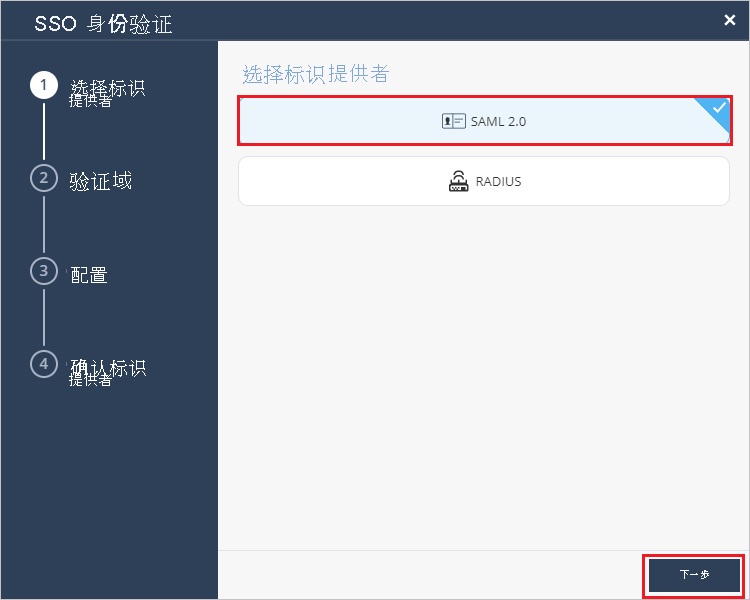
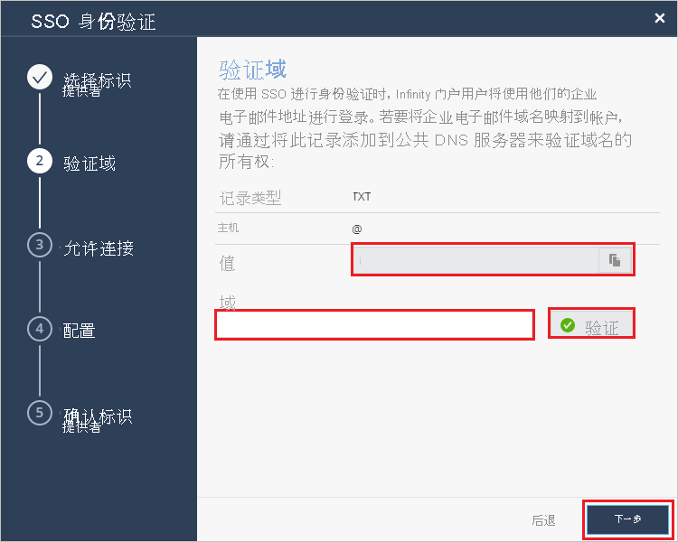
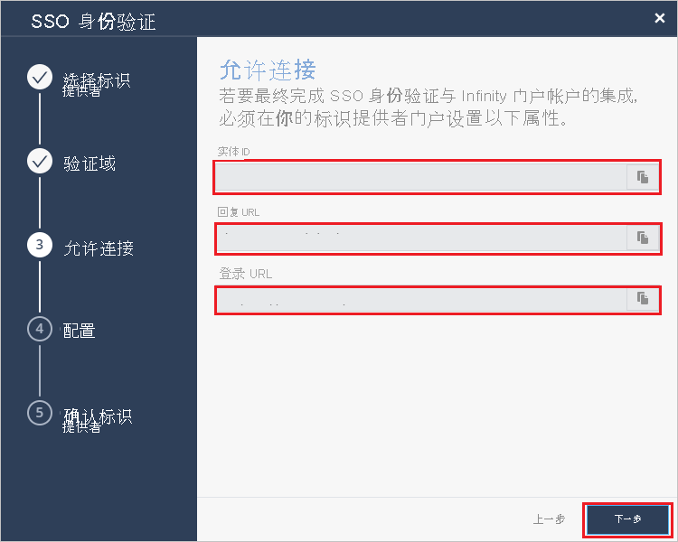
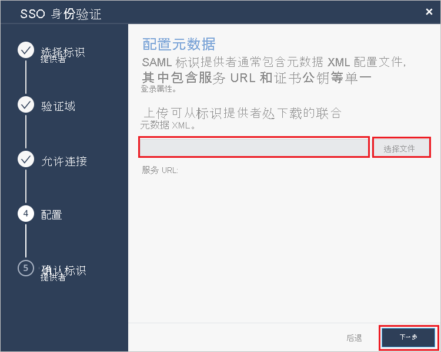
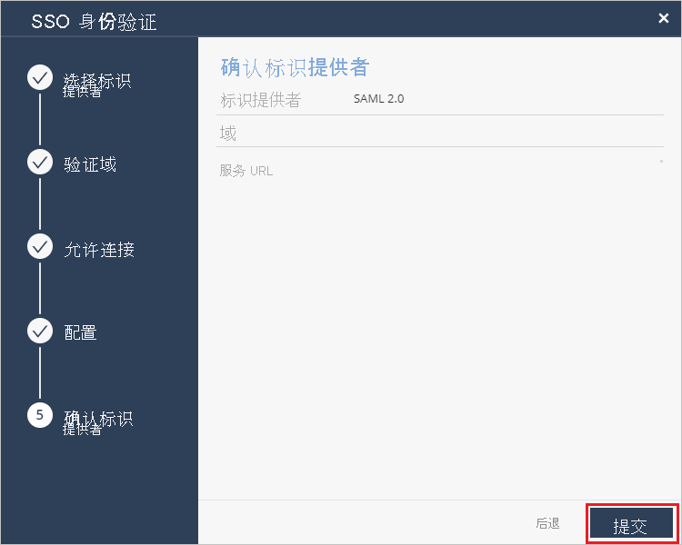

# 教程：Azure Active Directory 单一登录 (SSO) 与 Check Point Infinity Portal 集成

在本教程中，将学习如何将 Check Point Infinity Portal 与 Azure Active Directory (Azure AD) 集成。 将 Check Point Infinity Portal 与 Azure AD 集成后，可以：

* 在 Azure AD 中控制谁有权访问 Check Point Infinity Portal。
* 让用户使用 Azure AD 帐户自动登录 Check Point Infinity Portal。
* 在一个中心位置（Azure 门户）管理帐户。

## 必备条件

若要开始操作，需备齐以下项目：

* 一个 Azure AD 订阅。 如果没有订阅，可以获取一个[免费帐户](https://azure.microsoft.com/free/)。
* 已启用 Check Point Infinity Portal 单一登录 (SSO) 的订阅。

## 方案描述

本教程在测试环境中配置并测试 Azure AD SSO。

* Check Point Infinity Portal 支持 SP 发起的 SSO。

* Check Point Infinity Portal 支持实时用户预配。

> [!NOTE]
> 此应用程序的标识符是一个固定字符串值，因此只能在一个租户中配置一个实例。

## 从库中添加 Check Point Infinity Portal

若要配置 Check Point Infinity Portal 与 Azure AD 的集成，需将 Check Point Infinity Portal 从库中添加到托管 SaaS 应用列表中。

1. 使用工作或学校帐户或个人 Microsoft 帐户登录到 Azure 门户。
1. 在左侧导航窗格中，选择“Azure Active Directory”服务  。
1. 导航到“企业应用程序”，选择“所有应用程序”   。
1. 若要添加新的应用程序，请选择“新建应用程序”。
1. 在“从库中添加”部分的搜索框中，键入“Check Point Infinity Portal” 。
1. 从结果面板中选择“Check Point Infinity Portal”，添加该应用。 在该应用添加到租户时等待几秒钟。

## 配置并测试 Check Point Infinity Portal 的 Azure AD SSO

使用名为 B.Simon 的测试用户配置和测试 Check Point Infinity Portal 的 Azure AD SSO。 若要使 SSO 正常工作，需要在 Azure AD 用户与 Check Point Infinity Portal 相关用户之间建立关联。

若要配置并测试 Check Point Infinity Portal 的 Azure AD SSO，请执行以下步骤：

1. **[配置 Azure AD SSO](#configure-azure-ad-sso)** - 使用户能够使用此功能。
    1. **[创建 Azure AD 测试用户](#create-an-azure-ad-test-user)** - 使用 B. Simon 测试 Azure AD 单一登录。
    1. **[分配 Azure AD 测试用户](#assign-the-azure-ad-test-user)** - 使 B. Simon 能够使用 Azure AD 单一登录。
1. **[配置 Check Point Infinity Portal SSO](#configure-check-point-infinity-portal-sso)** - 在应用程序端配置单一登录设置。
    1. **[创建 Check Point Infinity Portal 测试用户](#create-check-point-infinity-portal-test-user)** - 在 Check Point Infinity Portal 中创建 B.Simon 的对应用户，并将其关联到其在 Azure AD 中的表示形式。
1. **[测试 SSO](#test-sso)** - 验证配置是否正常工作。

## 配置 Azure AD SSO

按照下列步骤在 Azure 门户中启用 Azure AD SSO。

1. 在 Azure 门户的 Check Point Infinity Portal 应用程序集成页上，找到“管理”部分，并选择“单一登录”。  
1. 在“选择单一登录方法”页上选择“SAML” 。
1. 在“设置 SAML 单一登录”页面上，单击“基本 SAML 配置”旁边的铅笔图标以编辑设置 。

   

1. 在“基本 SAML 配置”部分中，按照以下步骤操作：

    a. 在“标识符”文本框中，键入以下值之一：

    | 环境 | 标识符 |
    |-------------| -------------|
    | EU/US | `cloudinfra.checkpoint.com` |
    | AP | `ap.portal.checkpoint.com` |
    |

    b. 在“回复 URL”文本框中，键入以下 URL 之一： 

    | 环境 | 回复 URL |
    |-------------| -------------|
    | EU/US | `https://portal.checkpoint.com/` |
    | AP | `https://ap.portal.checkpoint.com/` |
    |

    c. 在“登录 URL”文本框中，键入以下 URL 之一：

    | 环境 | 登录 URL |
    |-------------| -------------|
    | EU/US | `https://portal.checkpoint.com/` |
    | AP | `https://ap.portal.checkpoint.com/` |
    |

1. 在“使用 SAML 设置单一登录”页的“SAML 签名证书”部分中找到“联合元数据 XML”，选择“下载”以下载该证书并将其保存在计算机上     。

    

1. 在“设置 Check Point Infinity Portal”部分，根据需要复制相应的 URL。

    

### 创建 Azure AD 测试用户

在本部分，我们将在 Azure 门户中创建名为 B.Simon 的测试用户。

1. 在 Azure 门户的左侧窗格中，依次选择“Azure Active Directory”、“用户”和“所有用户”  。
1. 选择屏幕顶部的“新建用户”。
1. 在“用户”属性中执行以下步骤：
   1. 在“名称”字段中，输入 `B.Simon`。  
   1. 在“用户名”字段中输入 username@companydomain.extension。 例如，`B.Simon@contoso.com` 。
   1. 选中“显示密码”复选框，然后记下“密码”框中显示的值。
   1. 单击“创建”。

### 分配 Azure AD 测试用户

在本部分中，你将通过授予 B.Simon 对 Check Point Infinity Portal 的访问权限，使其能够使用 Azure 单一登录。

1. 在 Azure 门户中，依次选择“企业应用程序”、“所有应用程序”。 
1. 在应用程序列表中，选择“Check Point Infinity Portal”。
1. 在应用的概述页中，找到“管理”部分，选择“用户和组” 。
1. 选择“添加用户”，然后在“添加分配”对话框中选择“用户和组”。
1. 在“用户和组”对话框中，从“用户”列表中选择“B.Simon”，然后单击屏幕底部的“选择”按钮。
1. 如果你希望将某角色分配给用户，可以从“选择角色”下拉列表中选择该角色。 如果尚未为此应用设置任何角色，你将看到选择了“默认访问权限”角色。
1. 在“添加分配”对话框中，单击“分配”按钮。

## 配置 Check Point Infinity Portal SSO

1. 以管理员身份登录 Check Point Infinity Portal 公司站点。

2. 导航到“全局设置” > “帐户设置”，然后单击“SSO 身份验证”下方的“定义”。
   
    

3. 在“SSO 身份验证”页上，选择“SAML 2.0”作为“标识提供者” ，然后单击“下一步”。
     
   

4. 在“验证域”部分中，执行以下步骤：

   
 
   a. 复制 DNS 记录值并将其添加到公司 DNS 服务器中的 DNS 值。 

   b. 在“域”字段中输入公司的域名称，然后单击“验证”。  

   c. 等待 Check Point 批准 DNS 记录更新，可能需要长达 30 分钟。 

   d. 验证域名称后，单击“下一步”。 

5. 在“允许连接”部分中，执行以下步骤：
    
    

   a. 复制“实体 ID”值，并将此值粘贴到 Azure 门户上“基本 SAML 配置”部分的“Azure AD 标识符”文本框中 。

   b. 复制“回复 URL”值，并将此值粘贴到 Azure 门户上“基本 SAML 配置”部分的“回复 URL”文本框中 。

   c. 复制“登录 URL”值，并将此值粘贴到 Azure 门户上“基本 SAML 配置”部分的“登录 URL”文本框中。 
      
   d. 单击“下一步”。

6. 在“配置”部分，单击“选择文件”并上传从 Azure 门户下载的“联合元数据 XML”文件，然后单击“下一步”。    

    

7. 在“确认标识提供者”部分中，查看配置，然后单击“提交”。
     
    

### 创建 Check Point Infinity Portal 测试用户

在本部分，我们将在 Check Point Infinity Portal 中创建一个名为 Britta Simon 的用户。 Check Point Infinity Portal 支持默认启用的实时用户预配。 此部分不存在任何操作项。 如果 Check Point Infinity Portal 中尚不存在用户，执行身份验证后会创建一个新用户。

## 测试 SSO 

在本部分，你将使用以下选项测试 Azure AD 单一登录配置。 

* 在 Azure 门户中单击“测试此应用程序”。 这会重定向到 Check Point Infinity Portal 登录 URL，你可在其中启动登录流。 

* 直接转到 Check Point Infinity Portal 登录 URL，并从中启动登录流。

* 你可使用 Microsoft 的“我的应用”。 单击“我的应用”中的“Check Point Infinity Portal”磁贴后，会重定向到 Check Point Infinity Portal 登录 URL。 有关“我的应用”的详细信息，请参阅[“我的应用”简介](../user-help/my-apps-portal-end-user-access.md)。

## 后续步骤

配置 Check Point Infinity Portal 后，可以强制实施会话控制，实时防止组织的敏感数据外泄和渗透。 会话控制从条件访问扩展而来。 [了解如何通过 Microsoft Cloud App Security 强制实施会话控制](/cloud-app-security/proxy-deployment-any-app)。
