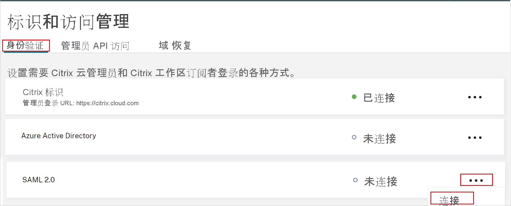
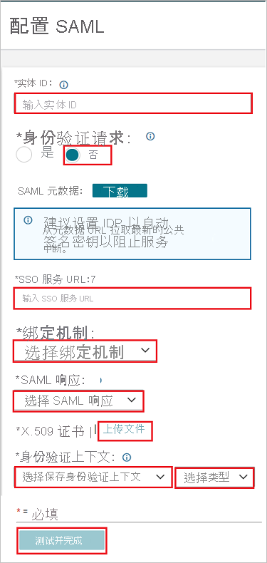

# 教程：Azure Active Directory 单一登录 (SSO) 与 Citrix Cloud SAML SSO 的集成

本教程介绍如何将 Citrix Cloud SAML SSO 与 Azure Active Directory (Azure AD) 相集成。 将 Citrix Cloud SAML SSO 与 Azure AD 集成后，可以：

* 在 Azure AD 中控制谁有权访问 Citrix Cloud SAML SSO。
* 让用户使用其 Azure AD 帐户自动登录到 Citrix Cloud SAML SSO。
* 在一个中心位置（Azure 门户）管理帐户。

## 必备条件

若要开始操作，需备齐以下项目：

* 一个 Azure AD 订阅。 如果没有订阅，可以获取一个[免费帐户](https://azure.microsoft.com/free/)。
* 一个 Citrix Cloud 订阅。 如果你没有订阅，请注册一个。 

## 方案描述

本教程在测试环境中配置并测试 Azure AD SSO。

* Citrix Cloud SAML SSO 支持 SP 发起的 SSO。

> [!NOTE]
> 此应用程序的标识符是一个固定字符串值，因此只能在一个租户中配置一个实例。

## 从库中添加 Citrix Cloud SAML SSO

若要配置 Citrix Cloud SAML SSO 与 Azure AD 的集成，需要从库中将 Citrix Cloud SAML SSO 添加到托管 SaaS 应用列表。

1. 使用工作或学校帐户或个人 Microsoft 帐户登录到 Azure 门户。
1. 在左侧导航窗格中，选择“Azure Active Directory”服务  。
1. 导航到“企业应用程序”，选择“所有应用程序”   。
1. 若要添加新的应用程序，请选择“新建应用程序”。
1. 在“从库中添加”部分的搜索框中，键入“Citrix Cloud SAML SSO” 。
1. 在结果面板中选择“Citrix Cloud SAML SSO”，然后添加该应用。 在该应用添加到租户时等待几秒钟。

## 配置并测试 Citrix Cloud SAML SSO 的 Azure AD SSO

使用名为 B.Simon 的测试用户配置并测试 Citrix Cloud SAML SSO 的 Azure AD SSO。 若要正常使用 SSO，需要在 Azure AD 用户与 Citrix Cloud SAML SSO 中的相关用户之间建立链接关系。此用户必须也存在于已通过 Azure AD Connect 同步到 Azure AD 订阅的 Active Directory 中。

若要配置并测试 Citrix Cloud SAML SSO 的 Azure AD SSO，请执行以下步骤：

1. **[配置 Azure AD SSO](#configure-azure-ad-sso)** - 使用户能够使用此功能。
    1. **[创建 Azure AD 测试用户](#create-an-azure-ad-test-user)** - 使用 B. Simon 测试 Azure AD 单一登录。
    1. **[分配 Azure AD 测试用户](#assign-the-azure-ad-test-user)** - 使 B. Simon 能够使用 Azure AD 单一登录。
1. [配置 Citrix Cloud SAML SSO](#configure-citrix-cloud-saml-sso) - 在应用程序端配置单一登录设置。
1. **[测试 SSO](#test-sso)** - 验证配置是否正常工作。

## 配置 Azure AD SSO

按照下列步骤在 Azure 门户中启用 Azure AD SSO。

1. 在 Azure 门户中的“Citrix Cloud SAML SSO”应用程序集成页上，找到“管理”部分并选择“单一登录”  。
1. 在“选择单一登录方法”页上选择“SAML” 。
1. 在“设置 SAML 单一登录”页面上，单击“基本 SAML 配置”旁边的铅笔图标以编辑设置 。

   

1. 在“基本 SAML 配置”  部分中，执行以下步骤：

    在“登录 URL”文本框中，使用以下模式键入 URL：`https://<SUBDOMAIN>.cloud.com`

    > [!NOTE]
    > 此值不是真实值。 请使用你的 Citrix 工作区 URL 更新该值。 访问你的 Citrix Cloud 帐户即可获取该值。 还可以参考 Azure 门户中的“基本 SAML 配置”  部分中显示的模式。

1. Citrix Cloud SAML SSO 应用程序需要特定格式的 SAML 断言，这需要你将自定义属性映射添加到 SAML 令牌属性配置。 以下屏幕截图显示了默认属性的列表。

    

1. 除上述属性以外，Citrix Cloud SAML SSO 应用程序还要求在 SAML 响应中传回其他几个属性，如下所示。 这些属性也是预先填充的，但你可以根据需要查看它们。在 SAML 响应中传递的值应映射到用户的 Active Directory 属性。
    
    | 名称 | 源属性 |
    | -----|-----|
    | cip_sid | user.onpremisesecurityidentifier |
    | cip_upn | user.userprincipalname |
    | cip_oid | ObjectGUID（扩展属性） |
    | cip_email | user.mail |
    | displayName | user.displayname |

    > [!NOTE]
    > 必须根据你的需求手动配置 ObjectGUID。

1. 在“设置 SAML 单一登录”页的“SAML 签名证书”部分找到“证书(PEM)”，选择“下载”以下载该证书并将其保存到计算机上   。

    

1. 在“设置 Citrix Cloud SAML SSO”部分，根据你的需求复制相应的 URL。

    

### 创建 Azure AD 测试用户

在本部分，我们将在 Azure 门户中创建名为 B.Simon 的测试用户。

1. 在 Azure 门户的左侧窗格中，依次选择“Azure Active Directory”、“用户”和“所有用户”  。
1. 选择屏幕顶部的“新建用户”。
1. 在“用户”属性中执行以下步骤：
   1. 在“名称”字段中，输入 `B.Simon`。  
   1. 在“用户名”字段中输入 username@companydomain.extension。 例如，`B.Simon@contoso.com` 。
   1. 选中“显示密码”复选框，然后记下“密码”框中显示的值。
   1. 单击“创建”。

    > [!NOTE]
    > 需要从 Active Directory 同步此用户。 若要正常使用 SSO，需要在 Azure AD 用户与 Citrix Cloud SAML SSO 中的相关用户之间建立链接关系。
    
### 分配 Azure AD 测试用户

在本部分，你将通过授予 B.Simon 访问 Citrix Cloud SAML SSO 的权限，使其能够使用 Azure 单一登录。

1. 在 Azure 门户中，依次选择“企业应用程序”、“所有应用程序”。 
1. 在“应用程序”列表中，选择“Citrix Cloud SAML SSO”。
1. 在应用的概述页中，找到“管理”部分，选择“用户和组” 。
1. 选择“添加用户”，然后在“添加分配”对话框中选择“用户和组”。
1. 在“用户和组”对话框中，从“用户”列表中选择“B.Simon”，然后单击屏幕底部的“选择”按钮。
1. 如果你希望将某角色分配给用户，可以从“选择角色”下拉列表中选择该角色。 如果尚未为此应用设置任何角色，你将看到选择了“默认访问权限”角色。
1. 在“添加分配”对话框中，单击“分配”按钮。

## 配置 Citrix Cloud SAML SSO

1. 以管理员身份登录到 Citrix Cloud SAML SSO 公司站点。

1. 导航到“Citrix Cloud”菜单并选择“标识和访问管理”。

     

1. 在“身份验证”下找到“SAML 2.0”，然后从省略号菜单中选择“连接”  。

    

1. 在“配置 SAML”页中执行以下步骤。

    

    a. 在“实体 ID”文本框中，粘贴从 Azure 门户复制的“Azure AD 标识符”值   。

    b. 在“为身份验证请求签名”中，选择“否” 。

    c. 在“SSO 服务 URL”文本框中，粘贴从 Azure 门户复制的“登录 URL”值 。

    d. 从下拉列表中选择“绑定机制”，可以选择“HTTP-POST”或“HTTP-Redirect”绑定  。

    e. 在“SAML 响应”下，从下拉列表中选择“为响应或断言签名” 。

    f. 将“证书(PEM)”从 Azure 门户上传到“X.509 证书”部分 。

    g. 在“身份验证上下文”中，从下拉列表中选择“未指定”和“完全匹配”  。

    h. 单击“测试并完成”。

## 测试 SSO 

在本部分，你将使用以下选项测试 Azure AD 单一登录配置。 

* 直接访问 Citrix 工作区 URL，并从中启动登录流。

* 使用已同步到 AD 的 Active Directory 用户身份登录到 Citrix 工作区以完成测试。

## 后续步骤

配置 Citrix Cloud SAML SSO 后，可以强制实施会话控制，从而实时防止组织的敏感数据遭到外泄和渗透。 会话控制从条件访问扩展而来。 [了解如何通过 Microsoft Cloud App Security 强制实施会话控制](/cloud-app-security/proxy-deployment-aad)。