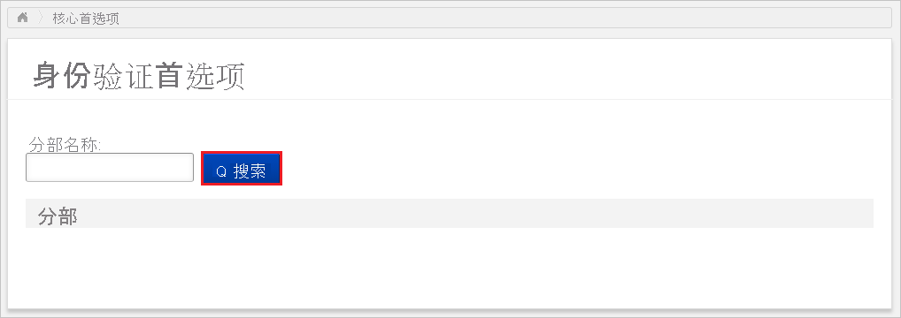
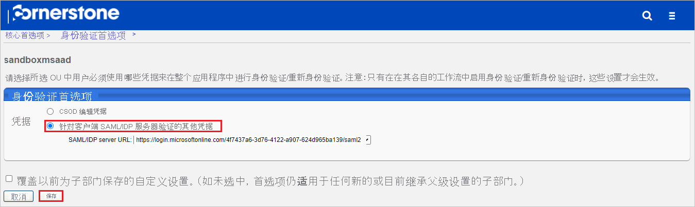
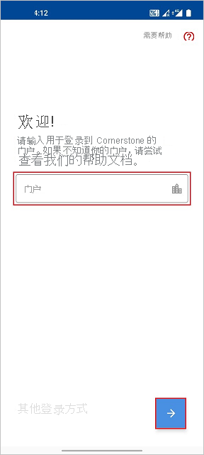
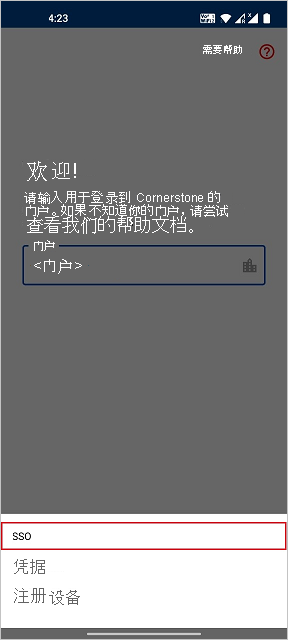
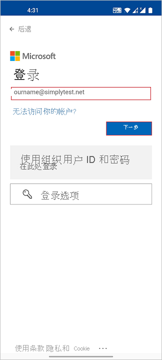
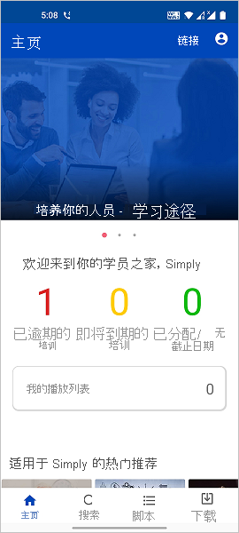

# 教程：Azure Active Directory 单一登录 (SSO) 与 Cornerstone 的集成

本教程介绍如何设置 Cornerstone 与 Azure Active Directory (Azure AD) 之间的单一登录集成。 将 Cornerstone 与 Azure AD 集成后，可以：

* 在 Azure AD 中控制谁有权通过 SSO 访问 Cornerstone。
* 让用户通过其 Azure AD 帐户自动登录到 Cornerstone。
* 在一个中心位置（Azure 门户）管理帐户。

## 必备条件

若要开始操作，需备齐以下项目：

* 一个 Azure AD 订阅。 如果没有订阅，可以获取一个[免费帐户](https://azure.microsoft.com/free/)。
* 已在 Cornerstone 中启用 SSO。

> [!NOTE]
> 此集成也可以通过 Azure AD 美国国家云环境使用。 你可以在“Azure AD 美国国家云应用程序库”中找到此应用程序，并以与在公有云中相同的方式对其进行配置。

## 方案描述

本教程在测试环境中配置并测试 Azure AD SSO。

* Cornerstone 支持 SP 发起的 SSO。

* 如果要集成这个特定的列表中的一个或多个产品，应使用库中的此 Cornerstone 单一登录应用。

    我们提供了以下几个方面的解决方案：

    1. 招聘
    2. 学习
    3. 开发
    4. Content
    5. 性能
    6. 事业
    7. HR

## 从库中添加 Cornerstone Single Sign-On

若要配置 Azure AD SSO 与 Cornerstone 的集成，需要执行以下操作：

1. 使用工作或学校帐户或个人 Microsoft 帐户登录到 Azure 门户。
1. 在左侧导航窗格中，选择“Azure Active Directory”服务  。
1. 导航到“企业应用程序”，选择“所有应用程序”   。
1. 若要添加新的应用程序，请选择“新建应用程序”  。
1. 在 **从库中添加** 部分的搜索框中，键入 **Cornerstone Single Sign-On**。
1. 在结果面板中选择 **Cornerstone Single Sign-On**，然后添加该应用。 在该应用添加到租户时等待几秒钟。

## 为 Cornerstone 配置和测试 Azure AD SSO

使用名为 B.Simon 的测试用户配置并测试 Cornerstone 的 Azure AD SSO。 若要运行 SSO，需要在 Azure AD 用户与 Cornerstone 相关用户之间建立链接关系。

若要配置并测试 Cornerstone 的 Azure AD SSO，请执行以下步骤：

1. **[配置 Azure AD SSO](#configure-azure-ad-sso)** - 使用户能够使用此功能。
    1. **[创建 Azure AD 测试用户](#create-an-azure-ad-test-user)** - 使用 B. Simon 测试 Azure AD 单一登录。
    1. **[分配 Azure AD 测试用户](#assign-the-azure-ad-test-user)** - 使 B. Simon 能够使用 Azure AD 单一登录。
2. **[配置 Cornerstone 单一登录](#configure-cornerstone-single-sign-on)** - 在 Cornerstone 中配置 SSO。
    1. [创建 Cornerstone Single Sign-On 测试用户](#create-cornerstone-single-sign-on-test-user) - 在 Cornerstone 中创建 B.Simon 的对应用户，并将其链接到该用户的 Azure AD 表示形式。
3. **[测试 SSO](#test-sso)** - 验证配置是否正常工作。
4. **[测试 Cornerstone（移动版）的 SSO](#test-sso-for-cornerstone-mobile)** - 验证配置是否正常工作。

## 配置 Azure AD SSO

按照下列步骤在 Azure 门户中启用 Azure AD SSO。

1. 在 Azure 门户中的 **Cornerstone Single Sign-On** 应用程序集成页上，找到 **管理** 部分并选择 **单一登录**。
1. 在“选择单一登录方法”页上选择“SAML”   。
1. 在“设置 SAML 单一登录”页面上，单击“基本 SAML 配置”旁边的铅笔图标以编辑设置 。

   

1. 在“基本 SAML 配置”部分中，按照以下步骤操作：

    a. 在“标识符”文本框中，使用以下模式键入 URL：`https://<PORTAL_NAME>.csod.com`

    b. 在“回复 URL”文本框中，使用以下模式键入 URL：`https://<PORTAL_NAME>.csod.com/samldefault.aspx?ouid=<OUID>`

    c. 在“登录 URL”文本框中，使用以下模式键入 URL：`https://<PORTAL_NAME>.csod.com/samldefault.aspx?ouid=<OUID>` 

    > [!NOTE]
    > 这些不是实际值。 使用实际回复 URL、标识符和登录 URL 更新这些值。 请联系你的 Cornerstone 实现项目团队获取这些值。 还可以参考 Azure 门户中的“基本 SAML 配置”  部分中显示的模式。

4. 在“设置 SAML 单一登录”页的“SAML 签名证书”部分中，找到“证书(Base64)”，选择“下载”以下载该证书并将其保存到计算机上     。

    

6. 在 **设置 Cornerstone Single Sign-on** 部分，根据要求复制相应的 URL。

    

### 创建 Azure AD 测试用户

在本部分，我们将在 Azure 门户中创建名为 B.Simon 的测试用户。

1. 在 Azure 门户的左侧窗格中，依次选择“Azure Active Directory”、“用户”和“所有用户”  。
1. 选择屏幕顶部的“新建用户”。
1. 在“用户”属性中执行以下步骤：
    1. 在“名称”字段中，输入 `B.Simon`。  
    1. 在“用户名”字段中输入 username@companydomain.extension。 例如，`B.Simon@contoso.com` 。
    1. 选中“显示密码”复选框，然后记下“密码”框中显示的值。
    1. 单击“创建”。

### 分配 Azure AD 测试用户

在本部分中，通过授予 B.Simon 访问 Cornerstone 的权限，允许其使用 Azure 单一登录。

1. 在 Azure 门户中，依次选择“企业应用程序”、“所有应用程序”。 
1. 在应用程序列表中，选择 **Cornerstone Single Sign-On**。
1. 在应用的概述页中，找到“管理”部分，选择“用户和组” 。
1. 选择“添加用户”，然后在“添加分配”对话框中选择“用户和组”。
1. 在“用户和组”对话框中，从“用户”列表中选择“B.Simon”，然后单击屏幕底部的“选择”按钮。
1. 如果你希望将某角色分配给用户，可以从“选择角色”下拉列表中选择该角色。 如果尚未为此应用设置任何角色，你将看到选择了“默认访问权限”角色。
1. 在“添加分配”对话框中，单击“分配”按钮。

## 配置 Cornerstone 单一登录

若要在 Cornerstone 中配置 SSO，需要联系你的 Cornerstone 实现项目团队。 他们会对此进行设置，使两端的 SAML SSO 连接均正确设置。

### 创建 Cornerstone Single Sign-On 测试用户

本部分需在 Cornerstone 中创建一个名为“Britta Simon”的用户。 请与你的 Cornerstone 实现项目团队合作，将用户添加到 Cornerstone 中。 使用单一登录前，必须先创建并激活用户。

## 测试 SSO 

在本部分，你将使用以下选项测试 Azure AD 单一登录配置。 

* 在 Azure 门户中单击“测试此应用程序”。 这样将会重定向到 Cornerstone 登录 URL，可以从那里启动登录流。 

* 直接转到 Cornerstone 登录 URL，并从那里启动登录流。

* 你可使用 Microsoft 的“我的应用”。 在“我的应用”中单击“Cornerstone 单一登录”磁贴时，会重定向到 Cornerstone 登录 URL。 有关“我的应用”的详细信息，请参阅[“我的应用”简介](../user-help/my-apps-portal-end-user-access.md)。

## 测试 Cornerstone（移动版）的 SSO

1. 在另一个浏览器窗口中，以管理员身份登录到 Cornerstone 网站，然后执行以下步骤。

    a. 转到“管理”>“工具”>“核心函数”>“核心首选项”>“身份验证首选项”。

    

    b. 在搜索框中提供部门名称，搜索“部门名称”。

    c. 单击结果中的“部门名称”。

    d. 从“SAML/IDP 服务器 URL”下拉列表中，选择应该用于用户身份验证的相应 SAML/IDP 服务器。

    

    e. 单击“ **保存**”。

1. 转到“管理”>“工具”>“核心函数”>“核心首选项”>“移动设备”。

    a. 选择相应的“部门 OU”。

    b. 选择“允许用户”以允许此 OU 中的用户在其移动设备和平板电脑设备上访问 Cornerstone Learn 应用以及勾选“启用移动访问权限”复选框。

    c. 单击“ **保存**”。

2. 打开“Cornerstone Learn”移动应用程序。 在登录页中，输入门户网站名称。

    

3. 单击“备用登录”，然后单击“SSO”。

    

4. .  输入登录 Cornerstone 应用程序所需的“Azure AD 凭据”，然后单击“下一步”。 

    

5. 最后登录成功后，将显示应用程序主页，如下所示。

    

## 后续步骤

配置 Cornerstone Single Sign-On 后，可以强制实施会话控制，实时防止组织的敏感数据遭到外泄和渗透。 会话控制从条件访问扩展而来。 [了解如何通过 Microsoft Cloud App Security 强制实施会话控制](/cloud-app-security/proxy-deployment-aad)
