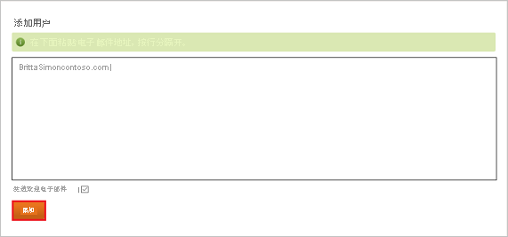

# 教程：Azure Active Directory 与 Datahug 集成

本教程介绍如何将 Datahug 与 Azure Active Directory (Azure AD) 集成。 将 Datadog 与 Azure AD 集成后，你可以：

* 在 Azure AD 中控制谁有权访问 Datahug。
* 让用户使用其 Azure AD 帐户自动登录到 Datahug。
* 在一个中心位置（Azure 门户）管理帐户。

## 必备条件

若要开始操作，需备齐以下项目：

* 一个 Azure AD 订阅。 如果没有订阅，可以获取一个[免费帐户](https://azure.microsoft.com/free/)。
* 已启用 Datahug 单一登录 (SSO) 的订阅。

## 方案描述

本教程会在测试环境中配置和测试 Azure AD 单一登录。

* Datahug 支持 SP 和 IDP 发起的 SSO 。

## 从库中添加 Datahug

要配置 Datahug 与 Azure AD 的集成，需要从库中将 Datahug 添加到托管 SaaS 应用列表。

1. 使用工作或学校帐户或个人 Microsoft 帐户登录到 Azure 门户。
1. 在左侧导航窗格中，选择“Azure Active Directory”服务  。
1. 导航到“企业应用程序”，选择“所有应用程序”   。
1. 若要添加新的应用程序，请选择“新建应用程序”  。
1. 在“从库中添加”部分的搜索框中，键入“Datahug” 。
1. 从结果面板中选择“Datahug”，然后添加该应用。 在该应用添加到租户时等待几秒钟。

## 配置并测试 Datahug 的 Azure AD SSO

使用名为 B.Simon 的测试用户配置并测试 Datahug 的 Azure AD SSO。 若要运行 SSO，需要在 Azure AD 用户与 Datahug 相关用户之间建立链接关系。

若要配置并测试 Datahug 的 Azure AD SSO，请执行以下步骤：

1. **[配置 Azure AD SSO](#configure-azure-ad-sso)** - 使用户能够使用此功能。
    1. **[创建 Azure AD 测试用户](#create-an-azure-ad-test-user)** - 使用 B. Simon 测试 Azure AD 单一登录。
    1. **[分配 Azure AD 测试用户](#assign-the-azure-ad-test-user)** - 使 B. Simon 能够使用 Azure AD 单一登录。
1. **[配置 Datahug SSO](#configure-datahug-sso)** - 在应用程序端配置单一登录设置。
    1. **[创建 Datahug 测试用户](#create-datahug-test-user)** - 在 Datahug 中创建 B.Simon 的对应用户，并将其链接到该用户的 Azure AD 表示形式。
1. **[测试 SSO](#test-sso)** - 验证配置是否正常工作。

## 配置 Azure AD SSO

按照下列步骤在 Azure 门户中启用 Azure AD SSO。

1. 在 Azure 门户中的 Datahug 应用程序集成页上，找到“管理”部分并选择“单一登录”  。
1. 在“选择单一登录方法”页上选择“SAML” 。
1. 在“设置 SAML 单一登录”页面上，单击“基本 SAML 配置”旁边的铅笔图标以编辑设置 。

   

4. 如果要在 **IDP** 发起的模式下配置应用程序，请在“基本 SAML 配置”部分中执行以下步骤：

    a. 在“标识符”文本框中，使用以下模式键入 URL：`https://apps.datahug.com/identity/<uniqueID>`

    b. 在“回复 URL”文本框中，使用以下模式键入 URL：`https://apps.datahug.com/identity/<uniqueID>/acs`

5. 如果要在 SP  发起的模式下配置应用程序，请单击“设置其他 URL”  ，并执行以下步骤：

    在“登录 URL”文本框中，键入 URL：`https://apps.datahug.com/`

    > [!NOTE]
    > 这些不是实际值。 请使用实际标识符和回复 URL 更新这些值。 请联系 [Datahug 客户端支持团队](https://www.sap.com/corporate/en/company/office-locations.html)获取这些值。 还可以参考 Azure 门户中的“基本 SAML 配置”  部分中显示的模式。

6. 在“使用 SAML 设置单一登录”页的“SAML 签名证书”部分，单击“下载”以根据要求下载从给定选项提供的“联合元数据 XML”并将其保存在计算机上     。

    

7. 在“SAML 签名证书”  部分中，单击“编辑”  按钮以打开“SAML 签名证书”  对话框并执行以下步骤。

    

    a. 从“签名选项”中选择“为 SAML 断言签名”。  

    b. 从“签名算法”中选择“SHA-1”。  
    
    c. 单击“保存”  。

8. 在“设置 Datahug”部分中，根据要求复制相应的 URL  。

    

### 创建 Azure AD 测试用户 

在本部分，我们将在 Azure 门户中创建名为 B.Simon 的测试用户。

1. 在 Azure 门户的左侧窗格中，依次选择“Azure Active Directory”、“用户”和“所有用户”  。
1. 选择屏幕顶部的“新建用户”。
1. 在“用户”属性中执行以下步骤：
   1. 在“名称”字段中，输入 `B.Simon`。  
   1. 在“用户名”字段中输入 username@companydomain.extension。 例如，`B.Simon@contoso.com`。
   1. 选中“显示密码”复选框，然后记下“密码”框中显示的值。
   1. 单击“创建”。

### 分配 Azure AD 测试用户

本部分将授予 B.Simon 访问 Datahug 的权限，使其能够使用 Azure 单一登录。

1. 在 Azure 门户中，依次选择“企业应用程序”、“所有应用程序”。  
1. 在应用程序列表中，选择“Datahug”。 
1. 在应用的概述页中，找到“管理”部分，选择“用户和组”   。
1. 选择“添加用户”，然后在“添加分配”对话框中选择“用户和组”。
1. 在“用户和组”对话框中，从“用户”列表中选择“B.Simon”，然后单击屏幕底部的“选择”按钮。
1. 如果你希望将某角色分配给用户，可以从“选择角色”下拉列表中选择该角色。 如果尚未为此应用设置任何角色，你将看到选择了“默认访问权限”角色。
1. 在“添加分配”对话框中，单击“分配”按钮。  

## 配置 Datahug SSO

若要在 **Datahug** 端配置单一登录，需要将下载的“联合元数据 XML”以及从 Azure 门户复制的相应 URL 发送给 [Datahug 支持团队](https://www.sap.com/corporate/en/company/office-locations.html)。 他们会对此进行设置，使两端的 SAML SSO 连接均正确设置。

### 创建 Datahug 测试用户

要使 Azure AD 用户能够登录到 Datahug，必须将其预配到 Datahug 中。  
对于 Datahug，预配是一项手动任务。

**若要预配用户帐户，请执行以下步骤：**

1. 以管理员身份登录到 Datahug 公司站点。

2. 将鼠标悬停在右上角的小齿轮上，然后单击“设置” 。
   
    

3. 选择“人员”，并单击“添加用户”选项卡 。

    

4. 键入要为其创建帐户的人员的电子邮件，并单击“添加”。 

    

    > [!NOTE] 
    > 选中“发送欢迎电子邮件”复选框可向用户发送注册邮件。   
    > 如果要为 Salesforce 创建帐户，请不要发送欢迎电子邮件。

## 测试 SSO

在本部分，你将使用以下选项测试 Azure AD 单一登录配置。 

#### SP 启动的：

* 在 Azure 门户中单击“测试此应用程序”。 这会重定向到 Datahug 登录 URL，可以从那里启动登录流。  

* 直接转到 Datahug 登录 URL，并从那里启动登录流。

#### IDP 启动的：

* 在 Azure 门户中单击“测试此应用程序”后，你应会自动登录到为其设置了 SSO 的 Datahug。 

还可以使用 Microsoft“我的应用”在任何模式下测试此应用程序。 在“我的应用”中单击“Datahug”磁贴时，如果是在 SP 模式下配置的，你会被重定向到应用程序登录页来启动登录流；如果是在 IDP 模式下配置的，你应会自动登录到为其设置了 SSO 的 Datahug。 有关“我的应用”的详细信息，请参阅[“我的应用”简介](../user-help/my-apps-portal-end-user-access.md)。

## 后续步骤

配置 Datahug 后，即可强制实施会话控制，实时防止组织的敏感数据外泄和渗透。 会话控制从条件访问扩展而来。 [了解如何通过 Microsoft Cloud App Security 强制实施会话控制](/cloud-app-security/proxy-deployment-aad)。