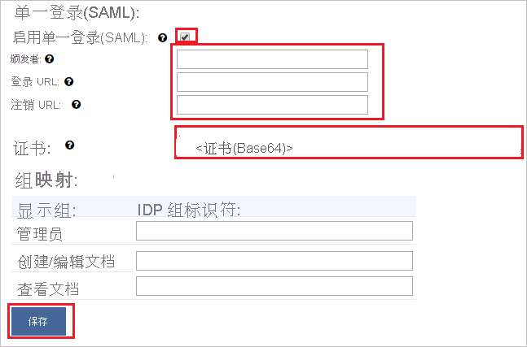

# 教程：将 Displayr 与 Azure Active Directory 集成

本教程介绍如何将 Displayr 与 Azure Active Directory (Azure AD) 集成。 将 Displayr 与 Azure AD 集成后，可以：

* 在 Azure AD 中控制谁有权访问 Displayr。
* 让用户使用其 Azure AD 帐户自动登录到 Displayr。
* 在一个中心位置（Azure 门户）管理帐户。

## 先决条件

若要开始操作，需备齐以下项目：

* 一个 Azure AD 订阅。 如果没有订阅，可以获取一个[免费帐户](https://azure.microsoft.com/free/)。
* 已启用单一登录 (SSO) 的 Displayr 公司。

## 方案描述

本教程介绍如何在 Displayr 公司配置 Azure AD SSO。

* Displayr 支持 **SP** 发起的 SSO。

## 从库中添加 Displayr

要配置 Displayr 与 Azure AD 的集成，需要从库中将 Displayr 添加到托管 SaaS 应用列表。

1. 使用工作或学校帐户或个人 Microsoft 帐户登录到 Azure 门户。
1. 在左侧导航窗格中，选择“Azure Active Directory”服务  。
1. 导航到“企业应用程序”，选择“所有应用程序”   。
1. 若要添加新的应用程序，请选择“新建应用程序”  。
1. 在“从库中添加”部分的搜索框中，键入“Displayr”   。
1. 从结果面板中选择“Displayr”，然后添加该应用  。 在该应用添加到租户时等待几秒钟。

## 配置 Displayr 的 Azure AD SSO

若要配置 Displayr 的 Azure AD SSO，请执行以下步骤：

1. **[配置 Azure AD SSO](#configure-azure-ad-sso)** ，使用户能够使用此功能。
1. [配置 Displayr SSO](#configure-displayr-sso)，以在应用程序端配置 SSO 设置。
1. **[仅允许特定用户访问](#restrict-access-to-specific-users)** ，从而规定哪些 Azure AD 用户可登录到 Displayr。
1. **[测试 SSO](#test-sso)** ，验证配置是否正常工作。

## 配置 Azure AD SSO

按照下列步骤在 Azure 门户中启用 Azure AD SSO。

1. 在 Azure 门户的“Displayr”应用程序集成页上，找到“管理”部分并选择“单一登录”  。
1. 在“选择单一登录方法”页上选择“SAML”   。
1. 在“设置 SAML 单一登录”页面上，单击“基本 SAML 配置”旁边的铅笔图标以编辑设置 。

   

1. 在“基本 SAML 配置”部分中，按照以下步骤操作：

    a. 在“标识符(实体 ID)”文本框中，键入使用以下模式的值：`<YOURDOMAIN>.displayr.com`
    
    b. 在“回复 URL”文本框中键入 URL：`https://app.displayr.com/Login/ProcessSamlResponse`
    
    c. 在“登录 URL”  文本框中，使用以下模式键入 URL：`https://<YOURDOMAIN>.displayr.com`。

    d. 单击“ **保存**”。

    >[!NOTE]
    >这些不是实际值。 使用实际标识符和登录 URL 更新这些值。 请联系 [Displayr 客户端支持团队](mailto:support@displayr.com)获取这些值。 还可参考 Azure 门户的“基本 SAML 配置”部分中显示的模式。

1. 在“设置 SAML 单一登录”页的“SAML 签名证书”部分中，找到“证书(Base64)”，选择“下载”以下载该证书并将其保存到计算机上     。

   

1. Displayr 应用程序需要特定格式的 SAML 断言，这要求向 SAML 令牌属性配置添加自定义属性映射。 以下屏幕截图显示了默认属性的列表。 单击“编辑”图标以打开“用户属性”对话框  。

   

1. 除了上述属性，Displayr 应用程序还要求在 SAML 响应中传递回更多的属性。 在“组声明(预览)”对话框中的“用户属性和声明”部分，执行以下步骤   ：

   a. 单击“添加组声明”。

      

   b. 从单选列表中选择“所有组”。 

   c. 选择“组 ID”作为“源属性”  。 

   f. 单击“ **保存**”。

1. 在“设置 Displayr”部分，根据要求复制相应的 URL  。

   

## 配置 Displayr SSO

1. 若要在 Displayr 中自动执行配置，需要安装“我的应用安全登录浏览器扩展”，方法是单击“安装扩展”   。

    

2. 将扩展添加到浏览器后，单击“设置 Displayr”，此时将定向到 Displayr 应用程序  。 在此处，提供管理员凭据以登录到 Displayr。 浏览器扩展会自动配置该应用程序，并自动执行步骤 3-6。

    

3. 如果想要手动设置 Displayr，请打开新的 Web 浏览器窗口并以管理员身份登录 Displayr 公司站点，然后执行以下步骤：

4. 单击“用户”图标，然后导航到“帐户设置” 。

    

5. 在顶部菜单中切换到“设置”，然后在该页中向下滚动，单击“配置单一登录(SAML)” 。

    

6. 在“单一登录(SAML)”  页上，执行以下步骤：

    

    a. 选中“启用单一登录(SAML)”框。 

    b. 从 Azure AD 的“基本 SAML 配置”部分复制“标识符”实际值，并将其粘贴到“证书颁发者”文本框中    。

    c. 在“登录 URL”文本框中，粘贴从 Azure 门户复制的“登录 URL”值   。

    d. 在“注销 URL”文本框中，粘贴从 Azure 门户复制的“注销 URL”值   。

    e. 在记事本中打开“证书(Base64)”文件，复制其内容并将其粘贴到“证书”文本框中  。

    f. “组映射”为可选。 

    g. 单击“保存”  。  

### 仅允许特定用户访问

默认情况下，你添加了 Displayr 应用程序的租户中的所有用户都可使用 SSO 登录到 Displayr。 如果要仅允许特定用户或组访问，请查看[仅允许 Azure AD 租户中的一组用户访问Azure AD 应用](../develop/howto-restrict-your-app-to-a-set-of-users.md)。

## 测试 SSO

在本部分，你将使用以下选项测试 Azure AD 单一登录配置。 

* 在 Azure 门户中单击“测试此应用程序”。 这会重定向到 Displayr 登录 URL，可从中启动登录流。 

* 直接转到 Displayr 登录 URL，并从那里启动登录流。

* 你可使用 Microsoft 的“我的应用”。 在“我的应用”中单击“Displayr”磁贴时，会重定向到 Displayr 登录 URL。 有关“我的应用”的详细信息，请参阅[“我的应用”简介](https://support.microsoft.com/account-billing/sign-in-and-start-apps-from-the-my-apps-portal-2f3b1bae-0e5a-4a86-a33e-876fbd2a4510)。

## 后续步骤

配置 Displayr 后，可以强制实施会话控制，实时防止组织的敏感数据外泄和渗透。 会话控制从条件访问扩展而来。 [了解如何通过 Microsoft Cloud App Security 强制实施会话控制](/cloud-app-security/proxy-deployment-aad)。