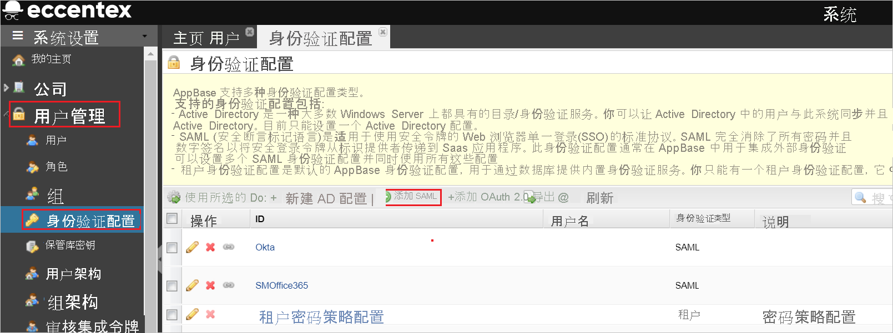

# 教程：Azure Active Directory 单一登录 (SSO) 与 Eccentex AppBase for Azure 集成

本教程介绍如何将 Eccentex AppBase for Azure 与 Azure Active Directory (Azure AD) 相集成。 将 Eccentex AppBase for Azure 与 Azure AD 集成后，可以：

* 在 Azure AD 中控制谁有权访问 Eccentex AppBase for Azure。
* 让用户使用其 Azure AD 帐户自动登录到 Eccentex AppBase for Azure。
* 在一个中心位置（Azure 门户）管理帐户。

## 先决条件

若要开始操作，需备齐以下项目：

* 一个 Azure AD 订阅。 如果没有订阅，可以获取一个[免费帐户](https://azure.microsoft.com/free/)。
* 已启用 Eccentex AppBase for Azure 单一登录 (SSO) 的订阅。

## 方案描述

本教程在测试环境中配置并测试 Azure AD SSO。

* Eccentex AppBase for Azure 支持 SP 发起的 SSO。

* Eccentex AppBase for Azure 支持实时用户预配。

## 从库中添加 Eccentex AppBase for Azure

若要配置 Eccentex AppBase for Azure 与 Azure AD 的集成，需要从库中将 Eccentex AppBase for Azure 添加到托管 SaaS 应用列表。

1. 使用工作或学校帐户或个人 Microsoft 帐户登录到 Azure 门户。
1. 在左侧导航窗格中，选择“Azure Active Directory”服务  。
1. 导航到“企业应用程序”，选择“所有应用程序”   。
1. 若要添加新的应用程序，请选择“新建应用程序”  。
1. 在“从库中添加”部分的搜索框中，键入“Eccentex AppBase for Azure” 。
1. 在结果面板中选择“Eccentex AppBase for Azure”，然后添加该应用。 在该应用添加到租户时等待几秒钟。

## 配置并测试 Eccentex AppBase for Azure 的 Azure AD SSO

使用名为“B.Simon”的测试用户配置并测试 Eccentex AppBase for Azure 的 Azure AD SSO。 若要正常使用 SSO，需要在 Azure AD 用户与 Eccentex AppBase for Azure 中的相关用户之间建立链接关系。

若要配置并测试 Eccentex AppBase for Azure 的 Azure AD SSO，请执行以下步骤：

1. **[配置 Azure AD SSO](#configure-azure-ad-sso)** - 使用户能够使用此功能。
    1. **[创建 Azure AD 测试用户](#create-an-azure-ad-test-user)** - 使用 B. Simon 测试 Azure AD 单一登录。
    1. **[分配 Azure AD 测试用户](#assign-the-azure-ad-test-user)** - 使 B. Simon 能够使用 Azure AD 单一登录。
1. **[配置 Eccentex AppBase for Azure SSO](#configure-eccentex-appbase-for-azure-sso)** - 在应用程序端配置单一登录设置。
    1. **[创建 Eccentex AppBase for Azure 测试用户](#create-eccentex-appbase-for-azure-test-user)** - 在 Eccentex AppBase for Azure 中创建 B.Simon 的对应用户，并将其链接到用户的 Azure AD 表示形式。
1. **[测试 SSO](#test-sso)** - 验证配置是否正常工作。

## 配置 Azure AD SSO

按照下列步骤在 Azure 门户中启用 Azure AD SSO。

1. 在 Azure 门户中的“Eccentex AppBase for Azure”应用程序集成页上，找到“管理”部分并选择“单一登录”  。
1. 在“选择单一登录方法”页上选择“SAML” 。
1. 在“设置 SAML 单一登录”页面上，单击“基本 SAML 配置”旁边的铅笔图标以编辑设置 。

   

1. 在“基本 SAML 配置”部分中，按照以下步骤操作：

    a. 在“标识符(实体 ID)”文本框中，使用以下模式之一键入 URL：

    | **Identifier** |
    |--------|
    | `https://<CustomerName>.appbase.com/Ecx.Web` |
    | `https://<CustomerName>.eccentex.com:<PortNumber>/Ecx.Web` |

    b. 在“登录 URL”文本框中，使用以下模式之一键入 URL：

    | **登录 URL** |
    |---------|
    | `https://<CustomerName>.appbase.com/Ecx.Web/Account/sso?tenantCode=<TenantCode>&authCode=<AuthConfigurationCode>`|
    | `https://<CustomerName>.eccentex.com:<PortNumber>/Ecx.Web/Account/sso?tenantCode=<TenantCode>&authCode=<AuthConfigurationCode>` |

    > [!NOTE]
    > 这些不是实际值。 使用实际标识符和登录 URL 更新这些值。 若要获取这些值，请与 [Eccentex AppBase for Azure 客户端支持团队](mailto:eccentex.support@eccentex.com)联系。 还可以参考 Azure 门户中的“基本 SAML 配置”  部分中显示的模式。

1. 在“使用 SAML 设置单一登录”页的“SAML 签名证书”部分中，找到“证书(原始)”，选择“下载”以下载该证书并将其保存到计算机上     。

    

1. 在“设置 Eccentex AppBase for Azure”部分，根据要求复制相应的 URL

    

### 创建 Azure AD 测试用户

在本部分，我们将在 Azure 门户中创建名为 B.Simon 的测试用户。

1. 在 Azure 门户的左侧窗格中，依次选择“Azure Active Directory”、“用户”和“所有用户”  。
1. 选择屏幕顶部的“新建用户”。
1. 在“用户”属性中执行以下步骤：
   1. 在“名称”字段中，输入 `B.Simon`。  
   1. 在“用户名”字段中输入 username@companydomain.extension。 例如，`B.Simon@contoso.com`。
   1. 选中“显示密码”复选框，然后记下“密码”框中显示的值。
   1. 单击“创建”。

### 分配 Azure AD 测试用户

在本部分，通过授予 B.Simon 访问 Eccentex AppBase for Azure 的权限，使其能够使用 Azure 单一登录。

1. 在 Azure 门户中，依次选择“企业应用程序”、“所有应用程序”。  
1. 在应用程序列表中选择“Eccentex AppBase for Azure”。
1. 在应用的概述页中，找到“管理”部分，选择“用户和组”   。
1. 选择“添加用户”，然后在“添加分配”对话框中选择“用户和组”。
1. 在“用户和组”对话框中，从“用户”列表中选择“B.Simon”，然后单击屏幕底部的“选择”按钮。
1. 如果你希望将某角色分配给用户，可以从“选择角色”下拉列表中选择该角色。 如果尚未为此应用设置任何角色，你将看到选择了“默认访问权限”角色。
1. 在“添加分配”对话框中，单击“分配”按钮。  

## 配置 Eccentex AppBase for Azure SSO

1. 以管理员身份登录到 Eccentex AppBase for Azure 公司站点。

1. 转到“齿轮”图标并单击“管理用户” 。

    

1. 导航到“用户管理” > “身份验证配置”并单击“添加 SAML”按钮  。

    

1. 在“新建 SAML 配置”页上，执行以下步骤。

    

    1. 在“名称”文本框中，键入一个简短的配置名称。 

    1. 在“颁发者 URL”文本框中，输入从 Azure 门户复制的 Azure 应用程序 ID 。

    1. 复制“应用程序 URL”值，并将此值粘贴到 Azure 门户上“基本 SAML 配置”部分的“标识符(实体 ID)”文本框中  。

    1. 在“AppBase 新用户载入”中，从下拉列表中选择“仅邀请” 。

    1. 在“AppBase 身份验证失败行为”中，从下拉列表中选择“显示错误页” 。

    1. 根据证书加密选择“签名摘要方法”和“签名方法” 。

    1. 在“使用证书”中，从下拉列表中选择“手动上传” 。

    1. 在“身份验证上下文类名”中，从下拉列表中选择“密码” 。

    1. 在“服务提供程序到标识提供者的绑定”中，从下拉列表中选择“HTTP 重定向” 。

        > [!NOTE]
        > 请确保未选中“为出站请求签名”。

    1. 复制“断言使用者服务 URL”值，将此值粘贴到 Azure 门户上“基本 SAML 配置”的“回复 URL”文本框中  。

    1. 在“身份验证请求目标 URL”文本框中，粘贴从 Azure 门户复制的“登录 URL”值 。

    1. 在“服务提供程序资源 URL”文本框中，粘贴从 Azure 门户复制的“登录 URL”值 。

    1. 在“项目标识 URL”文本框中，粘贴从 Azure 门户复制的“登录 URL”值 。

    1. 在“身份验证请求协议绑定”中，从下拉列表中选择“HTTP-POST” 。

    1. 在“身份验证请求名称 ID 策略”中，从下拉列表中选择“永久” 。

    1. 在“项目响应方 URL”文本框中，粘贴从 Azure 门户复制的“登录 URL”值 。

    1. 启用“强制执行响应签名验证”复选框。

    1. 在记事本中打开从 Azure 门户下载的“证书(原始)”，将内容粘贴到“SAML 相互证书上传”文本框中 。

    1. 在“注销响应协议绑定”中，从下拉列表中选择“HTTP-POST” 。

    1. 在“AppBase 自定义注销 URL”文本框中，粘贴从 Azure 门户复制的“注销 URL”的值。 
    
    1. 单击“保存”  。

### 创建 Eccentex AppBase for Azure 测试用户

在本部分中，我们将在 Eccentex AppBase for Azure 中创建名为“Britta Simon”的用户。 Eccentex AppBase for Azure 支持在默认情况下启用的实时用户预配。 此部分不存在任何操作项。 如果 Eccentex AppBase for Azure 中尚不存在用户，身份验证后会创建一个新用户。

## 测试 SSO 

在本部分，你将使用以下选项测试 Azure AD 单一登录配置。 

* 在 Azure 门户中单击“测试此应用程序”。 这将重定向到 Eccentex AppBase for Azure 登录 URL，你可以在其中启动登录流。 

* 直接转到 Eccentex AppBase for Azure 登录 URL，并从中启动登录流。

* 你可使用 Microsoft 的“我的应用”。 单击“我的应用”中的 Eccentex AppBase for Azure 磁贴时，将会重定向到 Eccentex AppBase for Azure 登录 URL。 有关“我的应用”的详细信息，请参阅[“我的应用”简介](../user-help/my-apps-portal-end-user-access.md)。

## 后续步骤

配置 Eccentex AppBase for Azure 后，即可强制实施会话控制，实时防止组织的敏感数据遭受外泄和渗透。 会话控制从条件访问扩展而来。 [了解如何通过 Microsoft Cloud App Security 强制实施会话控制](/cloud-app-security/proxy-deployment-aad)。