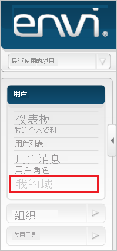
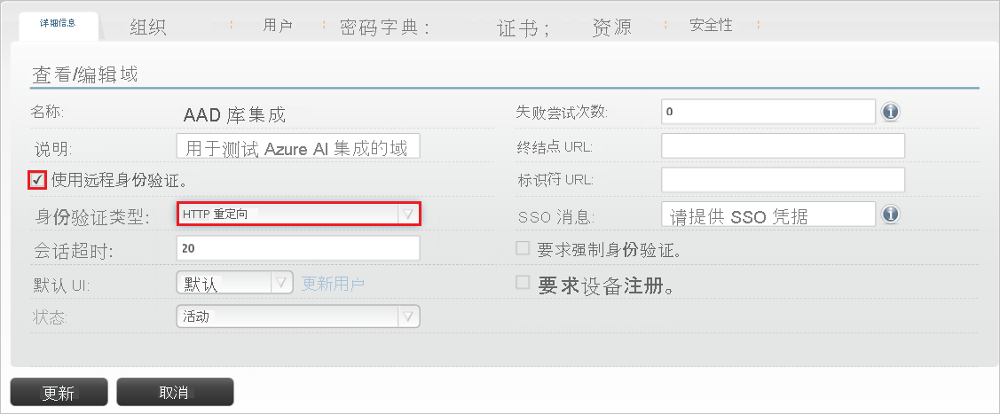
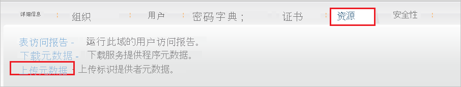
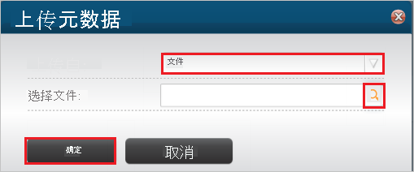
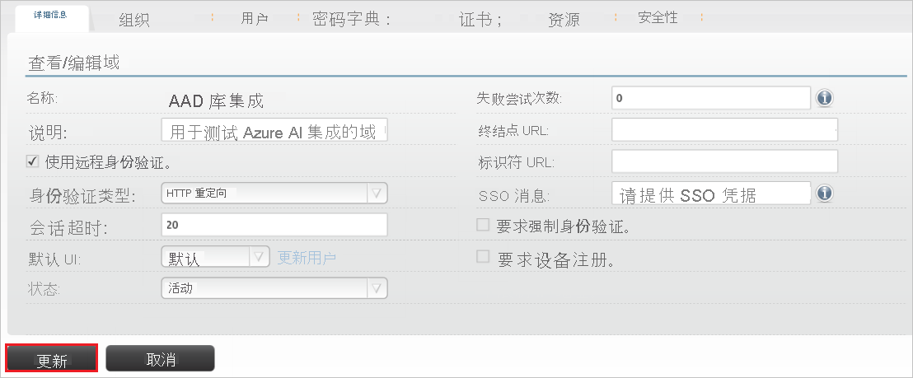
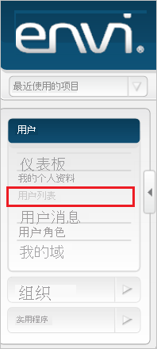
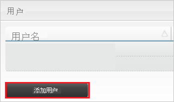
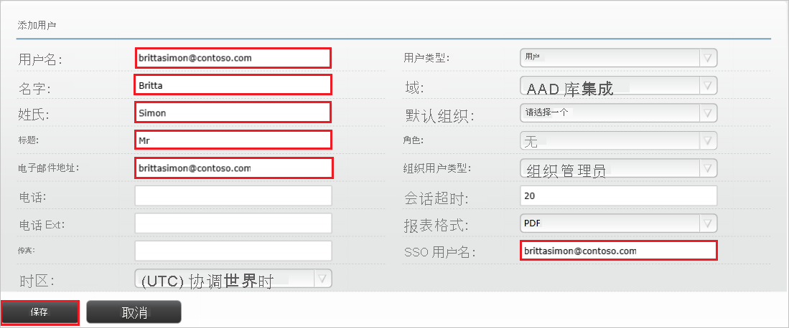

# 教程：Azure Active Directory 与 Envi MMIS 集成

本教程介绍如何将 Envi MMIS 与 Azure Active Directory (Azure AD) 集成。 将 Envoy 与 Azure AD 集成后，你可以：

* 在 Azure AD 中控制谁有权访问 Envi MMIS。
* 让用户能够使用其 Azure AD 帐户自动登录到 Envi MMIS。
* 在一个中心位置（Azure 门户）管理帐户。

## 先决条件

若要开始操作，需备齐以下项目：

* 一个 Azure AD 订阅。 如果没有订阅，可以获取一个[免费帐户](https://azure.microsoft.com/free/)。
* 已启用 Envi MMIS 单一登录 (SSO) 的订阅。

## 方案描述

本教程会在测试环境中配置和测试 Azure AD 单一登录。

* Envi MMIS 支持 SP 和 IDP 发起的 SSO 。

## 从库中添加 Envi MMIS

若要配置 Envi MMIS 与 Azure AD 的集成，需要从库中将 Envi MMIS 添加到托管 SaaS 应用的列表。

1. 使用工作或学校帐户或个人 Microsoft 帐户登录到 Azure 门户。
1. 在左侧导航窗格中，选择“Azure Active Directory”服务  。
1. 导航到“企业应用程序”，选择“所有应用程序”   。
1. 若要添加新的应用程序，请选择“新建应用程序”  。
1. 在“从库中添加”部分的搜索框中，键入“Envi MMIS” 。
1. 从结果面板中选择“Envi MMIS”，然后添加该应用。 在该应用添加到租户时等待几秒钟。

## 配置并测试 Envi MMIS 的 Azure AD SSO

使用名为 B.Simon 的测试用户配置并测试 Envi MMIS 的 Azure AD SSO。 若要使 SSO 正常运行，需要在 Azure AD 用户与 Envi MMIS 相关用户之间建立链接关系。

若要配置并测试 Envi MMIS 的 Azure AD SSO，请执行以下步骤：

1. **[配置 Azure AD SSO](#configure-azure-ad-sso)** - 使用户能够使用此功能。
    1. **[创建 Azure AD 测试用户](#create-an-azure-ad-test-user)** - 使用 B. Simon 测试 Azure AD 单一登录。
    1. **[分配 Azure AD 测试用户](#assign-the-azure-ad-test-user)** - 使 B. Simon 能够使用 Azure AD 单一登录。
1. **[配置 Envi MMIS SSO](#configure-envi-mmis-sso)** - 在应用程序端配置单一登录设置。
    1. **[创建 Envi MMIS 测试用户](#create-envi-mmis-test-user)** - 在 Envi MMIS 中创建 B.Simon 的对应用户，并将其链接到该用户的 Azure AD 表示形式。
1. **[测试 SSO](#test-sso)** - 验证配置是否正常工作。

## 配置 Azure AD SSO

按照下列步骤在 Azure 门户中启用 Azure AD SSO。

1. 在 Azure 门户中的 Envi MMIS 应用程序集成页上，找到“管理”部分并选择“单一登录”  。
1. 在“选择单一登录方法”页上选择“SAML” 。
1. 在“设置 SAML 单一登录”页面上，单击“基本 SAML 配置”旁边的铅笔图标以编辑设置 。

   

4. 如果要在 **IDP** 发起的模式下配置应用程序，请在“基本 SAML 配置”部分中执行以下步骤：

    a. 在“标识符”文本框中，使用以下模式键入 URL：`https://www.<CUSTOMER DOMAIN>.com/Account`

    b. 在“回复 URL”文本框中，使用以下模式键入 URL：`https://www.<CUSTOMER DOMAIN>.com/Account/Acs`

5. 如果要在 SP  发起的模式下配置应用程序，请单击“设置其他 URL”  ，并执行以下步骤：

    在“登录 URL”  文本框中，使用以下模式键入 URL：`https://www.<CUSTOMER DOMAIN>.com/Account`

    > [!NOTE]
    > 这些不是实际值。 请使用实际的“标识符”、“回复 URL”和“登录 URL”更新这些值。 请联系 [Envi MMIS 客户端支持团队](mailto:support@ioscorp.com)以获取这些值。 还可以参考 Azure 门户中的“基本 SAML 配置”  部分中显示的模式。

6. 在“使用 SAML 设置单一登录”页的“SAML 签名证书”部分，单击“下载”以根据要求下载从给定选项提供的“联合元数据 XML”并将其保存在计算机上     。

    

7. 在“设置 Envi MMIS”部分中，根据要求复制相应的 URL  。

    

### 创建 Azure AD 测试用户 

在本部分，我们将在 Azure 门户中创建名为 B.Simon 的测试用户。

1. 在 Azure 门户的左侧窗格中，依次选择“Azure Active Directory”、“用户”和“所有用户”  。
1. 选择屏幕顶部的“新建用户”。
1. 在“用户”属性中执行以下步骤：
   1. 在“名称”字段中，输入 `B.Simon`。  
   1. 在“用户名”字段中输入 username@companydomain.extension。 例如，`B.Simon@contoso.com`。
   1. 选中“显示密码”复选框，然后记下“密码”框中显示的值。
   1. 单击“创建”。

### 分配 Azure AD 测试用户

本部分将授予 B.Simon 访问 Envi MMIS 的权限，使其能够使用 Azure 单一登录。

1. 在 Azure 门户中，依次选择“企业应用程序”、“所有应用程序”。  
1. 在应用程序列表中，选择“Envi MMIS”  。
1. 在应用的概述页中，找到“管理”部分，选择“用户和组”   。
1. 选择“添加用户”，然后在“添加分配”对话框中选择“用户和组”。
1. 在“用户和组”对话框中，从“用户”列表中选择“B.Simon”，然后单击屏幕底部的“选择”按钮。
1. 如果你希望将某角色分配给用户，可以从“选择角色”下拉列表中选择该角色。 如果尚未为此应用设置任何角色，你将看到选择了“默认访问权限”角色。
1. 在“添加分配”对话框中，单击“分配”按钮。  

## 配置 Envi MMIS SSO

1. 在另一个 Web 浏览器窗口中，以管理员身份登录到 Envi MMIS 站点。

2. 单击“我的域”选项卡。 

    

3. 单击 **“编辑”** 。

    

4. 选择“使用远程身份验证”复选框，然后从“身份验证类型”下拉列表中选择“HTTP 重定向”。   

    

5. 选择“资源”选项卡，然后单击“上传元数据”   。

    

6. 在“上传元数据”  弹出窗口中，执行以下步骤：

    

    a. 从“上传方式”下拉列表中选择“文件”   选项。

    b. 选择“选择文件”图标即可从 Azure 门户上传已下载的元数据文件。 

    c. 单击“确定”  。

7. 在上传下载的元数据文件以后，相关字段会自动进行填充。 单击“更新”  。

    

### 创建 Envi MMIS 测试用户

若要使 Azure AD 用户能够登录到 Envi MMIS，必须将这些用户预配到 Envi MMIS 中。 对于 Envi MMIS，需要手动执行预配。

**若要预配用户帐户，请执行以下步骤：**

1. 以管理员身份登录到 Envi MMIS 公司站点。

2. 单击“用户列表”  选项卡。

    

3. 单击“添加用户”按钮。 

    

4. 在“添加用户”  部分中，执行以下步骤：

    

    a. 在“用户名”  文本框中，键入 Britta Simon 帐户的用户名（例如 **brittasimon\@contoso.com**）。
    
    b. 在“名字”文本框中，键入 BrittaSimon 的名字（如“Britta”）   。

    c. 在“姓氏”文本框中，键入 BrittaSimon 的姓氏（如“Simon”）   。

    d. 在“职务”  文本框中，键入用户的职务。
    
    e. 在“电子邮件地址”文本框中，键入 Britta Simon 帐户的电子邮件地址，例如“brittasimon\@contoso.com”。

    f. 在“SSO 用户名”  文本框中，键入 Britta Simon 帐户的用户名（例如 **brittasimon\@contoso.com**）。

    g. 单击“ **保存**”。

## 测试 SSO

在本部分，你将使用以下选项测试 Azure AD 单一登录配置。 

#### SP 启动的：

* 在 Azure 门户中单击“测试此应用程序”。 这将重定向到 Envi MMIS 登录 URL，可从那里启动登录流。  

* 直接转到 Envi MMIS 登录 URL，并从那里启动登录流。

#### IDP 启动的：

* 在 Azure 门户中单击“测试此应用程序”后，你应会自动登录到为其设置了 SSO 的 Envi MMIS。 

还可以使用 Microsoft“我的应用”在任何模式下测试此应用程序。 在“我的应用”中单击“Envi MMIS”磁贴时，如果是在 SP 模式下配置的，你会被重定向到应用程序登录页来启动登录流；如果是在 IDP 模式下配置的，你应会自动登录到为其设置了 SSO 的 Envi MMIS。 有关“我的应用”的详细信息，请参阅[“我的应用”简介](https://support.microsoft.com/account-billing/sign-in-and-start-apps-from-the-my-apps-portal-2f3b1bae-0e5a-4a86-a33e-876fbd2a4510)。

## 后续步骤

配置 Envi MMIS 后，即可强制实施会话控制，实时防止组织的敏感数据外泄和渗透。 会话控制从条件访问扩展而来。 [了解如何通过 Microsoft Cloud App Security 强制实施会话控制](/cloud-app-security/proxy-deployment-aad)。