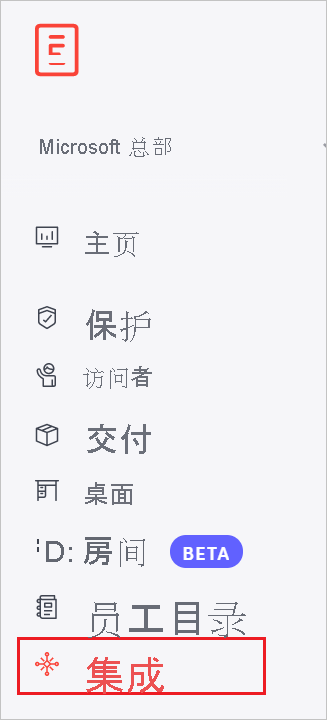
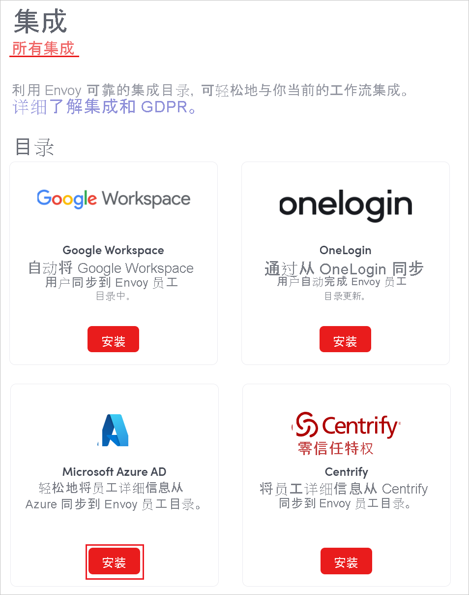
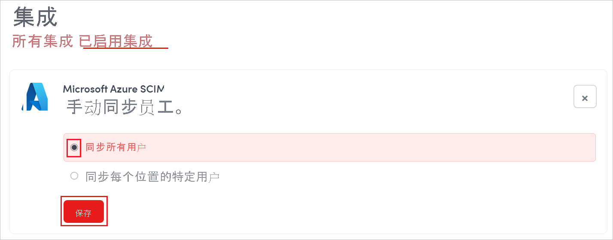
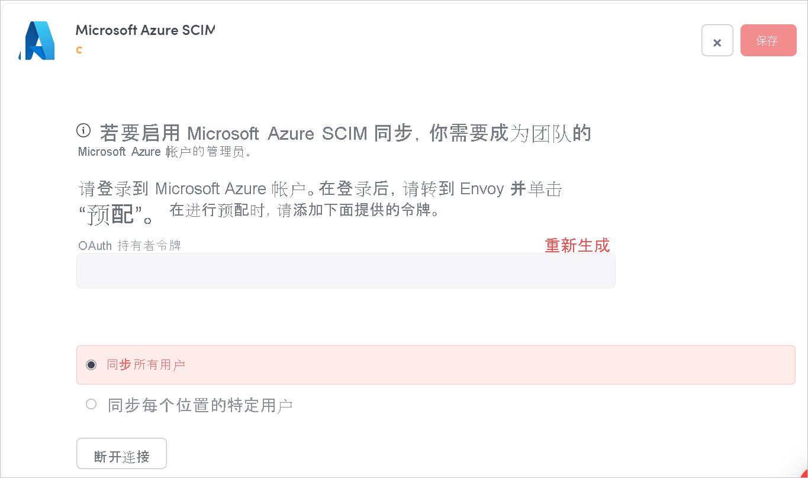

# 教程：为 Envoy 配置自动用户设置

本教程介绍了在 Envoy 和 Azure Active Directory (Azure AD) 中配置自动用户设置需执行的步骤。 配置后，Azure AD 会使用 Azure AD 预配服务自动将用户和组预配到 [Envoy](https://envoy.com/pricing/) 和取消预配。 有关此服务的功能、工作原理以及常见问题的重要详细信息，请参阅[使用 Azure Active Directory 自动将用户预配到 SaaS 应用程序和取消预配](../app-provisioning/user-provisioning.md)。 

## 支持的功能
> [!div class="checklist"]
> * 在 Envoy 中创建用户
> * 在用户不再有访问需求的情况下，在 Envoy 中删除用户
> * 使用户特性在 Azure AD 和 Envoy 之间保持同步
> * 在 Envoy 中预配组和组成员身份
> * [单一登录](./envoy-tutorial.md)到 Envoy（推荐）

## 先决条件

本教程中概述的方案假定你已具有以下先决条件：

* [Azure AD 租户](../develop/quickstart-create-new-tenant.md) 
* 具有配置预配[权限](../roles/permissions-reference.md)的 Azure AD 用户帐户（例如应用程序管理员、云应用程序管理员、应用程序所有者或全局管理员）。 
* [Envoy 租户](https://envoy.com/pricing/)。
* Envoy 中具有管理员权限的用户帐户。

> [!NOTE]
> 此集成也可以通过 Azure AD 美国国家云环境使用。 你可以在“Azure AD 美国国家云应用程序库”中找到此应用程序，并以与在公有云中相同的方式对其进行配置。

## 步骤 1。 计划预配部署
1. 了解[预配服务的工作原理](../app-provisioning/user-provisioning.md)。
2. 确定谁在[预配范围](../app-provisioning/define-conditional-rules-for-provisioning-user-accounts.md)中。
3. 确定[在 Azure AD 与 Envoy 之间映射](../app-provisioning/customize-application-attributes.md)的数据。 

## 步骤 2。 配置 Envoy 以支持通过 Azure AD 进行预配

1. 登录到 [Envoy 管理控制台](https://dashboard.envoy.com/login)。 单击“集成”。 

    

2. 单击“安装”，安装 Microsoft Azure SCIM 集成 。

    

3. 单击“保存”，执行“同步所有用户” 。 

    

4. 复制“OAUTH 持有者令牌”。 将在 Azure 门户中 Envoy 应用程序的“预配”选项卡的“机密令牌”字段中输入此值。
    
    

## 步骤 3. 从 Azure AD 应用程序库添加 Envoy

从 Azure AD 应用程序库添加 Envoy，开始管理 Envoy 的预配。 如果之前为 Envoy 设置过 SSO，则可使用同一应用程序。 但建议你在最初测试集成时创建一个单独的应用。 若要详细了解如何从库中添加应用，可以单击[此处](../manage-apps/add-application-portal.md)。 

## 步骤 4. 定义谁在预配范围中 

使用 Azure AD 预配服务，可以根据对应用的分配或用户/组的特性来限定谁在预配范围内。 如果选择根据分配来限定要将谁预配到应用，可以按照下面的[步骤](../manage-apps/assign-user-or-group-access-portal.md)操作，将用户和组分配到应用。 如果选择仅根据用户或组的属性来限定要对谁进行预配，可以使用[此处](../app-provisioning/define-conditional-rules-for-provisioning-user-accounts.md)所述的范围筛选器。 

* 将用户和组分配到 Envoy 时，必须选择“默认访问”以外的角色。 具有“默认访问”角色的用户将从预配中排除，并在预配日志中被标记为未有效授权。 如果应用程序上唯一可用的角色是默认访问角色，则可以[更新应用程序清单](../develop/howto-add-app-roles-in-azure-ad-apps.md)以添加其他角色。 

* 先小部分测试。 在向全员推出之前，请先使用少量的用户和组进行测试。 如果预配范围设置为分配的用户和组，则可以先尝试将一两个用户或组分配到应用。 当预配范围设置为所有用户和组时，可以指定[基于属性的范围筛选器](../app-provisioning/define-conditional-rules-for-provisioning-user-accounts.md)。 

## 步骤 5。 配置到 Envoy 的自动用户设置 

本部分介绍了如何配置 Azure AD 预配服务以基于 Azure AD 中的用户和/或组分配在 TestApp 中创建、更新和禁用用户和/或组。

### 在 Azure AD 中为 Envoy 配置自动用户设置：

1. 登录 [Azure 门户](https://portal.azure.com)。 依次选择“企业应用程序”、“所有应用程序” 。

    

2. 在应用程序列表中，选择“Envoy”。

    

3. 选择“预配”  选项卡。

    

4. 将“预配模式”设置为“自动”。

    

5. 在“管理员凭据”部分下的“租户 URL”中，输入 `https://app.envoy.com/scim/v2` 。 在“机密令牌”中，输入之前检索到的“OAUTH 持有者令牌”值 。 单击“测试连接”，确保 Azure AD 可连接到 Envoy。 如果连接失败，请确保 Envoy 帐户具有管理员权限，然后重试。

   

6. 在“通知电子邮件”字段中，输入应接收预配错误通知的个人或组的电子邮件地址，并选中“发生故障时发送电子邮件通知”复选框 。

    

7. 选择“保存”。

8. 在“映射”部分下，选择“将 Azure Active Directory 用户同步到 Envoy” 。

9. 在“特性映射”部分中，查看从 Azure AD 同步到 Envoy 的用户特性。 选为“匹配”属性的特性用于匹配 Envoy 中的用户帐户以执行更新操作。 如果选择更改[匹配目标特性](../app-provisioning/customize-application-attributes.md)，则需要确保 Envoy API 支持基于该特性筛选用户。 选择“保存”按钮以提交任何更改  。

   |Attribute|类型|
   |---|---|
   |userName|字符串|
   |externalId|字符串|
   |displayName|字符串|
   |title|字符串|
   |emails[type eq "work"].value|字符串|
   |preferredLanguage|字符串|
   |department|字符串|
   |addresses[type eq "work"].country|字符串|
   |addresses[type eq "work"].locality|字符串|
   |addresses[type eq "work"].region|字符串|
   |addresses[type eq "work"].postalCode|字符串|
   |addresses[type eq "work"].formatted|字符串|
   |addresses[type eq "work"].streetAddress|字符串|
   |name.givenName|字符串|
   |name.familyName|字符串|
   |name.formatted|字符串|
   |phoneNumbers[type eq "mobile"].value|字符串|
   |phoneNumbers[type eq "work"].value|字符串|
   |区域设置|字符串|

10. 在“映射”部分下，选择“将 Azure Active Directory 组同步到 Envoy” 。

11. 在“特性映射”部分中，查看从 Azure AD 同步到 Envoy 的组特性。 选为“匹配”属性的特性用于匹配 Envoy 中的组以执行更新操作。 选择“保存”按钮以提交任何更改  。

      |Attribute|类型|
      |---|---|
      |displayName|字符串|
      |externalId|字符串|
      |members|参考|

12. 若要配置范围筛选器，请参阅[范围筛选器教程](../app-provisioning/define-conditional-rules-for-provisioning-user-accounts.md)中提供的以下说明。

13. 要为 Envoy 启用 Azure AD 预配服务，请在“设置”部分中将“预配状态”更改为“开”  。

    

14. 通过在“设置”部分的“范围”中选择所需的值，定义要预配到 Envoy 的用户和/或组 。

    

15. 已准备好预配时，单击“保存”  。

    

此操作会对“设置”部分的“范围”中定义的所有用户和组启动初始同步周期 。 初始周期执行的时间比后续周期长，只要 Azure AD 预配服务正在运行，后续周期大约每隔 40 分钟就会进行一次。 

## 步骤 6. 监视部署
配置预配后，请使用以下资源来监视部署：

* 通过[预配日志](../reports-monitoring/concept-provisioning-logs.md)来确定哪些用户已预配成功或失败
* 检查[进度栏](../app-provisioning/application-provisioning-when-will-provisioning-finish-specific-user.md)来查看预配周期的状态以及完成进度
* 如果怀疑预配配置处于非正常状态，则应用程序将进入隔离状态。 可在[此处](../app-provisioning/application-provisioning-quarantine-status.md)了解有关隔离状态的详细信息。

## 其他资源

* [管理企业应用的用户帐户预配](../app-provisioning/configure-automatic-user-provisioning-portal.md)
* [Azure Active Directory 的应用程序访问与单一登录是什么？](../manage-apps/what-is-single-sign-on.md)

## 后续步骤

* [了解如何查看日志并获取有关预配活动的报告](../app-provisioning/check-status-user-account-provisioning.md)