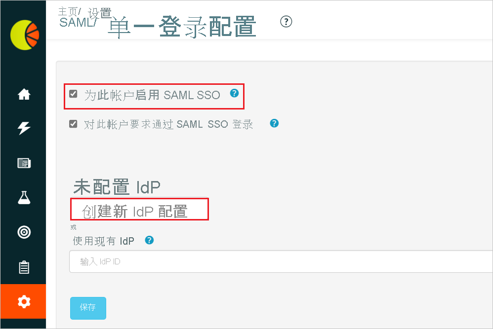
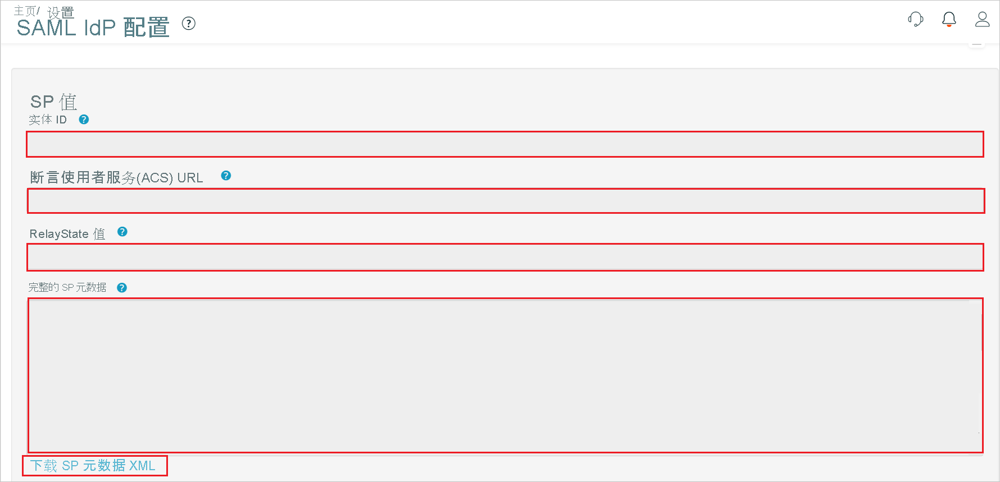
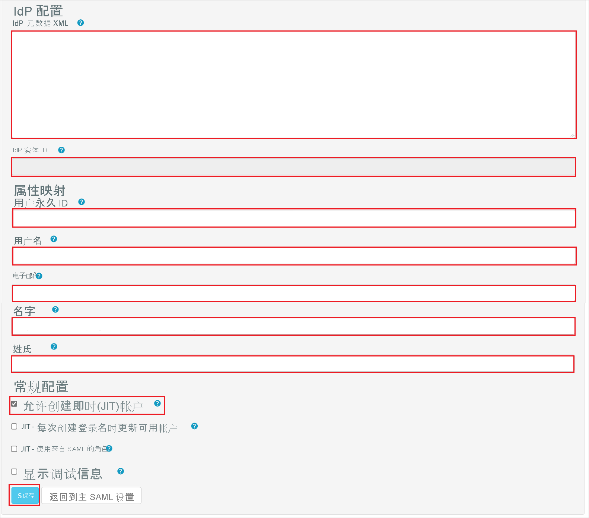

# 教程：Azure Active Directory 单一登录 (SSO) 与 Fresh Relevance 集成

本教程介绍如何将 Fresh Relevance 与 Azure Active Directory (Azure AD) 集成。 将 Fresh Relevance 与 Azure AD 集成后，可以：

* 在 Azure AD 中控制谁有权访问 Fresh Relevance。
* 让用户使用其 Azure AD 帐户自动登录到 Fresh Relevance。
* 在一个中心位置（Azure 门户）管理帐户。

## 先决条件

若要开始操作，需备齐以下项目：

* 一个 Azure AD 订阅。 如果没有订阅，可以获取一个[免费帐户](https://azure.microsoft.com/free/)。
* 已启用 Fresh Relevance 单一登录 (SSO) 的订阅。

## 方案描述

本教程在测试环境中配置并测试 Azure AD SSO。

* Fresh Relevance 支持 IDP 发起的 SSO。

* Fresh Relevance 支持实时用户预配。

## 从库中添加 Fresh Relevance

若要配置 Fresh Relevance 与 Azure AD 的集成，需要从库中将 Fresh Relevance 添加到托管 SaaS 应用列表。

1. 使用工作或学校帐户或个人 Microsoft 帐户登录到 Azure 门户。
1. 在左侧导航窗格中，选择“Azure Active Directory”服务  。
1. 导航到“企业应用程序”，选择“所有应用程序”   。
1. 若要添加新的应用程序，请选择“新建应用程序”  。
1. 在“从库中添加”部分的搜索框中，键入“Fresh Relevance” 。
1. 从结果面板中选择“Fresh Relevance”，然后添加该应用。 在该应用添加到租户时等待几秒钟。

## 配置并测试 Fresh Relevance 的 Azure AD SSO

使用名为 B.Simon 的测试用户配置并测试 Fresh Relevance 的 Azure AD SSO。 若要使 SSO 有效，需要在 Azure AD 用户与 Fresh Relevance 相关用户之间建立关联。

若要配置并测试 Fresh Relevance 的 Azure AD SSO，请执行以下步骤：

1. **[配置 Azure AD SSO](#configure-azure-ad-sso)** - 使用户能够使用此功能。
    1. **[创建 Azure AD 测试用户](#create-an-azure-ad-test-user)** - 使用 B. Simon 测试 Azure AD 单一登录。
    1. **[分配 Azure AD 测试用户](#assign-the-azure-ad-test-user)** - 使 B. Simon 能够使用 Azure AD 单一登录。
1. [配置 Fresh Relevance SSO](#configure-fresh-relevance-sso) - 在应用程序端配置单一登录设置。
    1. [创建 Fresh Relevance 测试用户](#create-fresh-relevance-test-user) - 在 Fresh Relevance 中创建 B.Simon 的对应用户，并将其关联到其在 Azure AD 中的表示形式。
1. **[测试 SSO](#test-sso)** - 验证配置是否正常工作。

## 配置 Azure AD SSO

按照下列步骤在 Azure 门户中启用 Azure AD SSO。

1. 在 Azure 门户的“Fresh Relevance”应用程序集成页上，找到“管理”部分并选择“单一登录”  。
1. 在“选择单一登录方法”页上选择“SAML” 。
1. 在“设置 SAML 单一登录”页面上，单击“基本 SAML 配置”旁边的铅笔图标以编辑设置 。

   

1. 在“基本 SAML 配置”  部分，如果有 **服务提供程序元数据文件**，请执行以下步骤：

    a. 单击“上传元数据文件”  。

    

    b. 单击“文件夹徽标”  来选择元数据文件并单击“上传”。 

    

    c. 成功上传元数据文件后，“标识符”  和“回复 URL”  值会自动填充在“基本 SAML 配置”部分：

    > [!Note]
    > 如果“标识符”和“回复 URL”值未自动填充，请根据需求手动填充这些值。

    d. 在“中继状态”文本框中，使用以下模式键入值：`<ID>`

1. 在“使用 SAML 设置单一登录”  页的“SAML 签名证书”  部分中，单击“复制”按钮，以复制“应用联合元数据 URL”  ，并将它保存在计算机上。

    

### 创建 Azure AD 测试用户

在本部分，我们将在 Azure 门户中创建名为 B.Simon 的测试用户。

1. 在 Azure 门户的左侧窗格中，依次选择“Azure Active Directory”、“用户”和“所有用户”  。
1. 选择屏幕顶部的“新建用户”。
1. 在“用户”属性中执行以下步骤：
   1. 在“名称”字段中，输入 `B.Simon`。  
   1. 在“用户名”字段中输入 username@companydomain.extension。 例如，`B.Simon@contoso.com`。
   1. 选中“显示密码”复选框，然后记下“密码”框中显示的值。
   1. 单击“创建”。

### 分配 Azure AD 测试用户

在本部分中，将通过授予 B.Simon 访问 Fresh Relevance 的权限，允许其使用 Azure 单一登录。

1. 在 Azure 门户中，依次选择“企业应用程序”、“所有应用程序”。  
1. 在应用程序列表中，选择“Fresh Relevance”。
1. 在应用的概述页中，找到“管理”部分，选择“用户和组”   。
1. 选择“添加用户”，然后在“添加分配”对话框中选择“用户和组”。
1. 在“用户和组”对话框中，从“用户”列表中选择“B.Simon”，然后单击屏幕底部的“选择”按钮。
1. 如果你希望将某角色分配给用户，可以从“选择角色”下拉列表中选择该角色。 如果尚未为此应用设置任何角色，你将看到选择了“默认访问权限”角色。
1. 在“添加分配”对话框中，单击“分配”按钮。  

## 配置 Fresh Relevance SSO

1. 以管理员身份登录到 Fresh Relevance 公司站点。

1. 转到“设置” > “所有设置” > “安全性和隐私”，然后单击“SAML/Azure AD 单一登录”。

    

1. 在“SAML/单一登录配置”页中，选中“为此帐户启用 SAML SSO”复选框，然后单击“创建新 IdP 配置”按钮  。 

    

1. 在“SAML IdP 配置”页上，执行以下步骤：

    

    

    a. 复制“实体 ID”值，并将此值粘贴到 Azure 门户上“基本 SAML 配置”部分的“标识符(实体 ID)”文本框中  。

    b. 复制“断言使用者服务(ACS) URL”值，将此值粘贴到 Azure 门户上“基本 SAML 配置”的“回复 URL”文本框中  。

    c. 复制“RelayState 值”，将此值粘贴到 Azure 门户上“基本 SAML 配置”的“中继状态”文本框中  。

    d. 单击“下载 SP 元数据 XML”，然后在 Azure 门户中的“基本 SAML 配置”部分上传元数据文件。 

    e. 从 Azure 门户将“应用联合元数据 URL”复制到记事本中，并将内容粘贴到“IdP 元数据 XML”文本框中，然后单击“保存”按钮  。

    f. 如果成功，IdP 的“实体 ID”等信息会显示在“IdP 实体 ID”文本框中 。

    g. 在“属性映射”部分中，手动填充从 Azure 门户复制的必填字段。

    h. 在“常规配置”部分中，启用“允许实时(JIT)帐户创建”，然后单击“保存”  。

    > [!NOTE]
    > 如果这些参数未正确映射，则登录/帐户创建不会成功，并且会显示错误。 若要在登录失败时临时显示增强的属性调试信息，请启用“显示调试信息”复选框。

### 创建 Fresh Relevance 测试用户

在本部分，我们会在 Fresh Relevance 中创建一个名为 Britta Simon 的用户。 Fresh Relevance 支持默认启用的实时用户预配。 此部分不存在任何操作项。 如果 Fresh Relevance 中不存在用户，则会在身份验证后创建一个新用户。

## 测试 SSO 

在本部分，你将使用以下选项测试 Azure AD 单一登录配置。

* 在 Azure 门户中单击“测试此应用程序”后，你应会自动登录到为其设置了 SSO 的 Fresh Relevance。

* 你可使用 Microsoft 的“我的应用”。 单击“我的应用”中的 Fresh Relevance 磁贴后，应会自动登录到为其设置了 SSO 的 Fresh Relevance。 有关“我的应用”的详细信息，请参阅[“我的应用”简介](https://support.microsoft.com/account-billing/sign-in-and-start-apps-from-the-my-apps-portal-2f3b1bae-0e5a-4a86-a33e-876fbd2a4510)。

## 后续步骤

配置 Fresh Relevance 后，就可以强制实施会话控制，从而实时保护组织的敏感数据免于外泄和渗透。 会话控制从条件访问扩展而来。 [了解如何通过 Microsoft Cloud App Security 强制实施会话控制](/cloud-app-security/proxy-deployment-aad)。