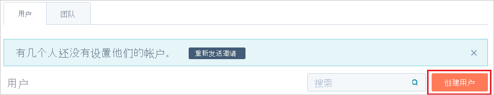

# 教程：Azure AD SSO 与 HubSpot 集成

在本教程中，了解如何将 HubSpot 与 Azure Active Directory (Azure AD) 集成。 将 HubSpot 与 Azure AD 集成后，你可以：

* 在 Azure AD 中控制谁有权访问 HubSpot。
* 让用户能够使用其 Azure AD 帐户自动登录到 HubSpot。
* 在一个中心位置（Azure 门户）管理帐户。

## 先决条件

若要配置 Azure AD 与 HubSpot 的集成，需要以下项：

* 一个 Azure AD 订阅。 如果还没有 Azure AD 订阅，可在开始前创建一个 [免费帐户](https://azure.microsoft.com/free/)。
* 已启用单一登录的 HubSpot 订阅。

## 方案描述

本教程在测试环境中配置和测试 Azure AD 单一登录，并将 HubSpot 与 Azure AD 集成。

HubSpot 支持以下功能：

* SP 发起的单一登录。
* IDP 发起的单一登录。

## 从库中添加 HubSpot

要配置 HubSpot 与 Azure AD 的集成，需要从库中将 HubSpot 添加到托管 SaaS 应用列表。

1. 使用工作或学校帐户或个人 Microsoft 帐户登录到 Azure 门户。
1. 在左侧导航窗格中，选择“Azure Active Directory”服务  。
1. 导航到“企业应用程序”，选择“所有应用程序”   。
1. 若要添加新的应用程序，请选择“新建应用程序”  。
1. 在“从库中添加”部分的搜索框中，键入“HubSpot” 。
1. 从结果面板中选择“HubSpot”，然后添加该应用。 在该应用添加到租户时等待几秒钟。

## 配置并测试 HubSpot 的 Azure AD SSO

使用名为 B.Simon 的测试用户配置并测试 HubSpot 的 Azure AD SSO。 若要使 SSO 有效，需要在 Azure AD 用户与 HubSpot 中的相关用户之间建立关联。

若要配置并测试 HubSpot 的 Azure AD SSO，请执行以下步骤：

1. **[配置 Azure AD SSO](#configure-azure-ad-sso)** - 使用户能够使用此功能。
    1. **[创建 Azure AD 测试用户](#create-an-azure-ad-test-user)** - 使用 B. Simon 测试 Azure AD 单一登录。
    1. **[分配 Azure AD 测试用户](#assign-the-azure-ad-test-user)** - 使 B. Simon 能够使用 Azure AD 单一登录。
1. **[配置 HubSpot SSO](#configure-hubspot-sso)** - 在应用程序端配置单一登录设置。
    1. **[创建 HubSpot 测试用户](#create-hubspot-test-user)** - 在 HubSpot 中创建 B.Simon 的对应用户，将其关联到用户的 Azure AD 表示形式。
1. **[测试 SSO](#test-sso)** - 验证配置是否正常工作。

## 配置 Azure AD SSO

1. 在 Azure 门户中的 HubSpot 应用程序集成页上，找到“管理”部分并选择“单一登录”  。
1. 在“选择单一登录方法”页上选择“SAML”   。
1. 在“设置 SAML 单一登录”页面上，单击“基本 SAML 配置”旁边的铅笔图标以编辑设置 。

   

1. 在“基本 SAML 配置”窗格中，若要配置“IDP 发起模式”，请执行以下步骤： 

    1. 在“标识符”框中，输入具有以下模式的 URL：https:\//api.hubspot.com/login-api/v1/saml/login?portalId=\<CUSTOMER ID\>。

    1. 在“回复 URL”框中，输入具有以下模式的 URL：https:\//api.hubspot.com/login-api/v1/saml/acs?portalId=\<CUSTOMER ID\>。

    > [!NOTE]
    > 若要设置 URL 的格式，还可参考 Azure 门户的“基本 SAML 配置”窗格中显示的模式  。

1. 若要在 *SP 发起* 模式下配置应用程序，请执行以下操作：

    1. 选择“设置其他 URL”  。

    1. 在“登录 URL”框中，输入“https:\//app.hubspot.com/login”   。

1. 在“设置 SAML 单一登录”窗格的“SAML 签名证书”部分中，选择“证书 (Base64)”旁边的“下载”     。 根据需要选择下载选项。 将证书保存在计算机上。

    

1. 在“设置 HubSpot”部分，根据要求复制以下 URL  ：

    

### 创建 Azure AD 测试用户

在本部分，我们将在 Azure 门户中创建名为 B.Simon 的测试用户。

1. 在 Azure 门户的左侧窗格中，依次选择“Azure Active Directory”、“用户”和“所有用户”  。
1. 选择屏幕顶部的“新建用户”。
1. 在“用户”属性中执行以下步骤：
    1. 在“名称”字段中，输入 `B.Simon`。  
    1. 在“用户名”字段中输入 username@companydomain.extension。 例如，`B.Simon@contoso.com`。
    1. 选中“显示密码”复选框，然后记下“密码”框中显示的值。
    1. 单击“创建”。

### 分配 Azure AD 测试用户

在本部分中，将授予 B.Simon 访问 HubSpot 的权限，以使其能够使用 Azure 单一登录。

1. 在 Azure 门户中，依次选择“企业应用程序”、“所有应用程序”。 
1. 在应用程序列表中，选择“HubSpot”  。
1. 在应用的概述页中，找到“管理”部分，选择“用户和组” 。
1. 选择“添加用户”，然后在“添加分配”对话框中选择“用户和组”。
1. 在“用户和组”对话框中，从“用户”列表中选择“B.Simon”，然后单击屏幕底部的“选择”按钮。
1. 如果你希望将某角色分配给用户，可以从“选择角色”下拉列表中选择该角色。 如果尚未为此应用设置任何角色，你将看到选择了“默认访问权限”角色。
1. 在“添加分配”对话框中，单击“分配”按钮。  

## 配置 HubSpot SSO

1. 在浏览器中打开新选项卡并登录到 HubSpot 管理员帐户。

1. 选择页面右上角的 **设置** 图标。

    

1. 选择“帐户默认值”  。

    

1. 向下滚动到“安全”部分，然后选择“设置”   。

    

1. 在“设置单一登录”部分中，执行以下步骤：

    1. 在“受众 URl (服务提供程序实体 ID)”框中，选择“复制”以复制值   。 在 Azure 门户的“基本 SAML 配置”窗格中，将值粘贴到“标识符”框中   。

    1. 在“登录 URL、ACS、收件人或重定向”框中，选择“复制”以复制值 。 在 Azure 门户的“基本 SAML 配置”窗格中，将值粘贴到“回复 URL”框中   。

    1. 在 HubSpot 的“标识提供者或证书颁发者 URL”框中，粘贴在 Azure 门户中复制的“Azure AD 标识符”值   。

    1. 在 HubSpot 的“标识提供者单一登录 URL”框中，粘贴在 Azure 门户中复制的“登录 URL”值   。

    1. 在 Windows 记事本中，打开下载的“证书(Base64)”文件。 选择并复制文件的内容。 然后在 HubSpot 中将其粘贴到“X.509 证书”框中  。

    1. 选择“验证”  。

        

### 创建 HubSpot 测试用户

若要使 Azure AD 用户能够登录到 HubSpot，必须在 HubSpot 中预配该用户。 在 HubSpot 中，预配是一项手动任务。

若要在 HubSpot 中预配用户帐户，请执行以下操作：

1. 以管理员身份登录 HubSpot 公司站点。

1. 选择页面右上角的 **设置** 图标。

    

1. 选择“用户和团队”  。

    

1. 选择“创建用户”  。

    

1. 在“添加电子邮件地址”框中，按 brittasimon\@contoso.com 的格式输入用户的电子邮件地址，然后选择“下一步”   。

    

1. 在“创建用户”部分中，选择每个选项卡  。在每个选项卡上，为用户设置相关选项和权限。 然后，选择“下一步”  。

    

1. 若要向用户发送邀请，请选择“发送”  。

    

    > [!NOTE]
    > 用户接受邀请后，将激活用户。

## 测试 SSO

在本部分，你将使用以下选项测试 Azure AD 单一登录配置。 

#### SP 启动的：

* 在 Azure 门户中单击“测试此应用程序”。 这样将会重定向到 HubSpot 登录 URL，可以从那里启动登录流。  

* 直接转到 HubSpot 登录 URL，并从那里启动登录流。

#### IDP 启动的：

* 在 Azure 门户中单击“测试此应用程序”后，应会自动登录到为其设置了 SSO 的 HubSpot。 

还可以使用 Microsoft“我的应用”在任何模式下测试此应用程序。 在“我的应用”中单击 HubSpot 磁贴时，如果是在 SP 模式下配置的，会重定向到应用程序登录页来启动登录流；如果是在 IDP 模式下配置的，则应会自动登录到为其设置了 SSO 的 HubSpot。 有关“我的应用”的详细信息，请参阅[“我的应用”简介](https://support.microsoft.com/account-billing/sign-in-and-start-apps-from-the-my-apps-portal-2f3b1bae-0e5a-4a86-a33e-876fbd2a4510)。

## 后续步骤

配置 HubSpot 后，可以强制实施会话控制，以实时防止组织的敏感数据发生外泄和渗透。 会话控制从条件访问扩展而来。 [了解如何通过 Microsoft Cloud App Security 强制实施会话控制](/cloud-app-security/proxy-deployment-aad)。