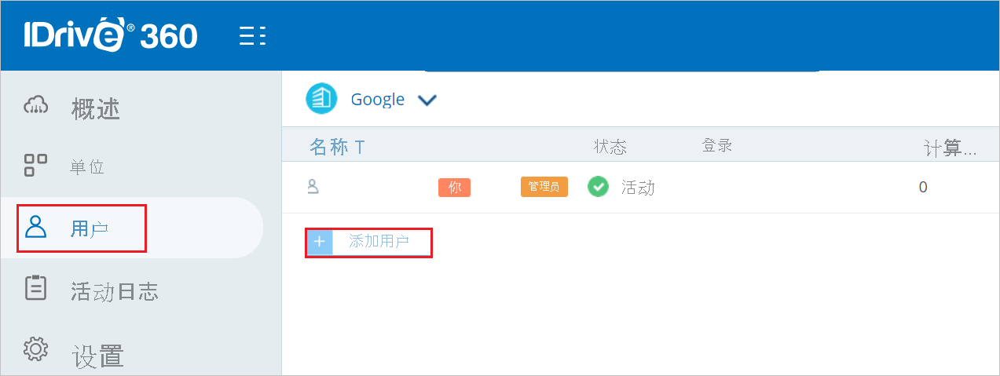
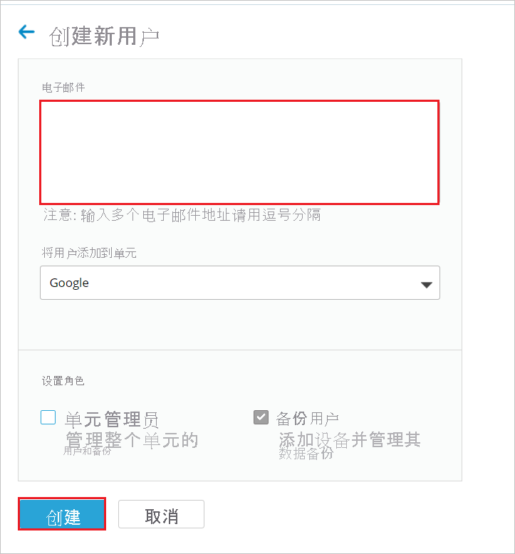

# 教程：Azure Active Directory 单一登录 (SSO) 与 IDrive360 集成

本教程介绍如何将 IDrive360 与 Azure Active Directory (Azure AD) 集成。 将 IDrive360 与 Azure AD 集成后，可以：

* 在 Azure AD 中控制谁有权访问 IDrive360。
* 让用户使用其 Azure AD 帐户自动登录到 IDrive360。
* 在一个中心位置（Azure 门户）管理帐户。

## 先决条件

若要开始操作，需备齐以下项目：

* 一个 Azure AD 订阅。 如果没有订阅，可以获取一个[免费帐户](https://azure.microsoft.com/free/)。
* 已启用 IDrive360 单一登录 (SSO) 的订阅。

## 方案描述

本教程在测试环境中配置并测试 Azure AD SSO。

* IDrive360 支持 SP 和 IDP 发起的 SSO。

> [!NOTE]
> 此应用程序的标识符是一个固定字符串值，因此只能在一个租户中配置一个实例。

## 从库中添加 IDrive360

若要配置 IDrive360 与 Azure AD 的集成，需要从库中将 IDrive360 添加到托管 SaaS 应用列表。

1. 使用工作或学校帐户或个人 Microsoft 帐户登录到 Azure 门户。
1. 在左侧导航窗格中，选择“Azure Active Directory”服务  。
1. 导航到“企业应用程序”，选择“所有应用程序”   。
1. 若要添加新的应用程序，请选择“新建应用程序”。
1. 在“从库中添加”部分的搜索框中，键入“IDrive360”。
1. 在结果面板中选择“IDrive360”，然后添加该应用。 在该应用添加到租户时等待几秒钟。

## 配置并测试 IDrive360 的 Azure AD SSO

使用名为 B.Simon 的测试用户配置并测试 IDrive360 的 Azure AD SSO。 若要使 SSO 正常工作，需要在 Azure AD 用户与 IDrive360 中的相关用户之间建立关联。

若要配置并测试 IDrive360 的 Azure AD SSO，请执行以下步骤：

1. **[配置 Azure AD SSO](#configure-azure-ad-sso)** - 使用户能够使用此功能。
    1. **[创建 Azure AD 测试用户](#create-an-azure-ad-test-user)** - 使用 B. Simon 测试 Azure AD 单一登录。
    1. **[分配 Azure AD 测试用户](#assign-the-azure-ad-test-user)** - 使 B. Simon 能够使用 Azure AD 单一登录。
1. [配置 IDrive360 SSO](#configure-idrive360-sso) - 在应用程序端配置单一登录设置。
    1. [创建 IDrive360 测试用户](#create-idrive360-test-user) - 在 IDrive360 中创建 B.Simon 的对应用户，并将其关联到用户的 Azure AD 表示形式。
1. **[测试 SSO](#test-sso)** - 验证配置是否正常工作。

## 配置 Azure AD SSO

按照下列步骤在 Azure 门户中启用 Azure AD SSO。

1. 在 Azure 门户的 IDrive360 应用程序集成页上，找到“管理”部分并选择“单一登录”。
1. 在“选择单一登录方法”页上选择“SAML” 。
1. 在“设置 SAML 单一登录”页面上，单击“基本 SAML 配置”旁边的铅笔图标以编辑设置 。

   

1. 在“基本 SAML 配置”部分中，用户不必执行任何步骤，因为该应用已经与 Azure 预先集成  。

1. 如果要在 SP  发起的模式下配置应用程序，请单击“设置其他 URL”  ，并执行以下步骤：

    在“登录 URL”文本框中，键入 URL：`https://www.idrive360.com/enterprise/sso`

1. 在“使用 SAML 设置单一登录”页的“SAML 签名证书”部分中，找到“证书 (PEM)”，选择“下载”以下载该证书并将其保存到计算机上   。

    

1. 在“设置 IDrive360”部分中，根据要求复制相应的 URL。

    

### 创建 Azure AD 测试用户

在本部分，我们将在 Azure 门户中创建名为 B.Simon 的测试用户。

1. 在 Azure 门户的左侧窗格中，依次选择“Azure Active Directory”、“用户”和“所有用户”  。
1. 选择屏幕顶部的“新建用户”。
1. 在“用户”属性中执行以下步骤：
   1. 在“名称”字段中，输入 `B.Simon`。  
   1. 在“用户名”字段中输入 username@companydomain.extension。 例如，`B.Simon@contoso.com`。
   1. 选中“显示密码”复选框，然后记下“密码”框中显示的值。
   1. 单击“创建”。

### 分配 Azure AD 测试用户

在本部分，你将通过授予 B.Simon 访问 IDrive360 的权限，使其能够使用 Azure 单一登录。

1. 在 Azure 门户中，依次选择“企业应用程序”、“所有应用程序”。 
1. 在应用程序列表中，选择“IDrive360”。
1. 在应用的概述页中，找到“管理”部分，选择“用户和组” 。
1. 选择“添加用户”，然后在“添加分配”对话框中选择“用户和组”。
1. 在“用户和组”对话框中，从“用户”列表中选择“B.Simon”，然后单击屏幕底部的“选择”按钮。
1. 如果你希望将某角色分配给用户，可以从“选择角色”下拉列表中选择该角色。 如果尚未为此应用设置任何角色，你将看到选择了“默认访问权限”角色。
1. 在“添加分配”对话框中，单击“分配”按钮。

## 配置 IDrive360 SSO

1. 以管理员身份登录到 IDrive360 公司站点。

2. 转到“设置” > “单一登录”并执行以下步骤。

    

    a. 在“SSO 名称”文本框中，键入一个有效的名称。
    
    b. 在“颁发者 URL”文本框中，粘贴从 Azure 门户复制的“Azure AD 标识符”值   。

    c. 在“SSO 终结点”文本框中，粘贴从 Azure 门户复制的“登录 URL”值 。

    d. 单击“上传证书”，上传已从 Azure 门户下载的证书 (PEM)。

    e. 单击“配置单一登录”。

### 创建 IDrive360 测试用户

1. 在另一个 Web 浏览器窗口中，以管理员身份登录到 IDrive360 公司站点。

2. 导航到“用户”选项卡，然后单击“添加用户” 。

    

3. 在“创建新用户”部分中，执行以下步骤。

    
     
    a. 在“电子邮件”文本框中，输入有效的“电子邮件地址”。

    b. 单击“创建”。

## 测试 SSO 

在本部分，你将使用以下选项测试 Azure AD 单一登录配置。 

#### SP 启动的：

* 在 Azure 门户中单击“测试此应用程序”。 这会重定向到 IDrive360 登录 URL，你可以从那里启动登录流。  

* 直接转到 IDrive360 登录 URL，并从那里启动登录流。

#### IDP 启动的：

* 单击 Azure 门户中的“测试此应用程序”后，你应会自动登录到为其设置了 SSO 的 IDrive360。 

还可以使用 Microsoft“我的应用”在任何模式下测试此应用程序。 单击“我的应用”中的 IDrive360 磁贴时，如果是在 SP 模式下配置的，你会被重定向到应用程序登录页来启动登录流；如果是在 IDP 模式下配置的，则应会自动登录到为其设置了 SSO 的 IDrive360。 有关“我的应用”的详细信息，请参阅[“我的应用”简介](https://support.microsoft.com/account-billing/sign-in-and-start-apps-from-the-my-apps-portal-2f3b1bae-0e5a-4a86-a33e-876fbd2a4510)。

## 后续步骤

配置 IDrive360 后，可以强制实施会话控制，实时防止组织的敏感数据外泄和渗透。 会话控制从条件访问扩展而来。 [了解如何通过 Microsoft Cloud App Security 强制实施会话控制](/cloud-app-security/proxy-deployment-aad)。