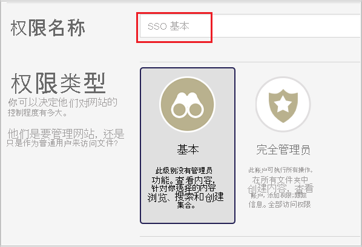
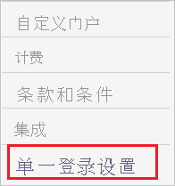
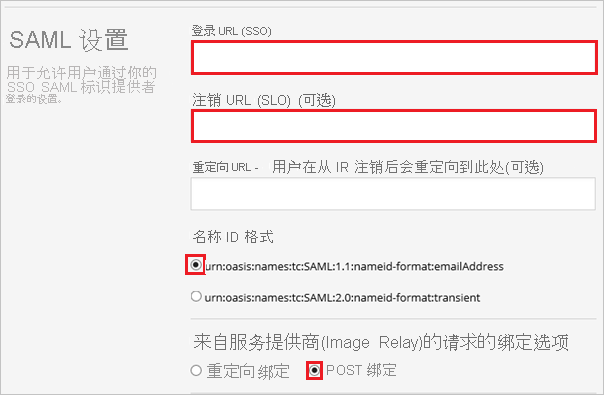
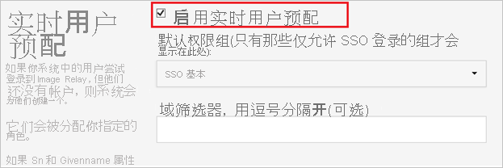
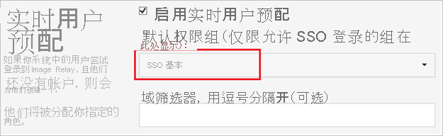
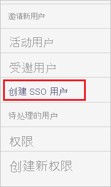
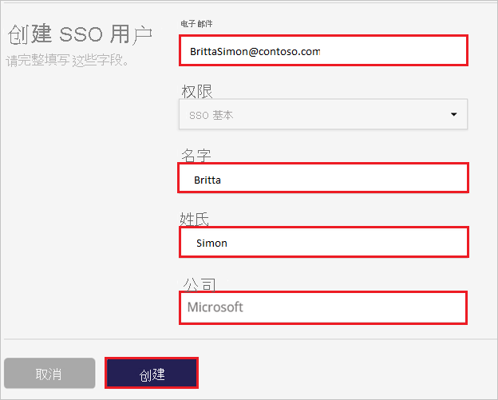

# 教程：Azure Active Directory 与 Image Relay 的集成

本教程介绍如何将 Image Relay 与 Azure Active Directory (Azure AD) 集成。 将 Image Relay 与 Azure AD 集成后，可以：

* 在 Azure AD 中控制谁有权访问 Image Relay。
* 让用户使用其 Azure AD 帐户自动登录到 Image Relay。
* 在一个中心位置（Azure 门户）管理帐户。

## 先决条件

若要开始操作，需备齐以下项目：

* 一个 Azure AD 订阅。 如果没有订阅，可以获取一个[免费帐户](https://azure.microsoft.com/free/)。
* 已启用 Image Relay 单一登录 (SSO) 的订阅。

## 方案描述

本教程会在测试环境中配置和测试 Azure AD 单一登录。

* Image Relay支持 SP 发起的 SSO。

## 从库中添加 Image Relay

要配置 Image Relay 与 Azure AD 的集成，需要从库中将 Image Relay 添加到托管 SaaS 应用列表。

1. 使用工作或学校帐户或个人 Microsoft 帐户登录到 Azure 门户。
1. 在左侧导航窗格中，选择“Azure Active Directory”服务  。
1. 导航到“企业应用程序”，选择“所有应用程序”   。
1. 若要添加新的应用程序，请选择“新建应用程序”。
1. 在“从库中添加”部分的搜索框中，键入“Image Relay” 。
1. 从结果面板中选择“Image Relay”，然后添加该应用。 在该应用添加到租户时等待几秒钟。

## 配置并测试 Image Relay 的 Azure AD SSO

使用名为 B.Simon 的测试用户配置并测试 Image Relay 的 Azure AD SSO。 若要使 SSO 正常工作，需要在 Azure AD 用户与 Image Relay 中的相关用户之间建立关联。

若要配置并测试 Image Relay 的 Azure AD SSO，请执行以下步骤：

1. **[配置 Azure AD SSO](#configure-azure-ad-sso)** - 使用户能够使用此功能。
    1. **[创建 Azure AD 测试用户](#create-an-azure-ad-test-user)** - 使用 B. Simon 测试 Azure AD 单一登录。
    1. **[分配 Azure AD 测试用户](#assign-the-azure-ad-test-user)** - 使 B. Simon 能够使用 Azure AD 单一登录。
1. [配置 Image Relay SSO](#configure-image-relay-sso) - 在应用程序端配置单一登录设置。
    1. [创建 Image Relay 测试用户](#create-image-relay-test-user) - 在 Image Relay 中创建 B.Simon 的对应用户，并将其关联到用户的 Azure AD 表示形式。
1. **[测试 SSO](#test-sso)** - 验证配置是否正常工作。

## 配置 Azure AD SSO

按照下列步骤在 Azure 门户中启用 Azure AD SSO。

1. 在 Azure 门户中的 Image Relay 应用程序集成页上，找到“管理”部分并选择“单一登录”。
1. 在“选择单一登录方法”页上选择“SAML” 。
1. 在“设置 SAML 单一登录”页面上，单击“基本 SAML 配置”旁边的铅笔图标以编辑设置 。

   

4. 在“基本 SAML 配置”部分中，按照以下步骤操作：

    a. 在“标识符(实体 ID)”文本框中，使用以下模式键入 URL：`https://<COMPANYNAME>.imagerelay.com/sso/metadata`

    b. 在“登录 URL”文本框中，使用以下模式键入 URL：`https://<COMPANYNAME>.imagerelay.com/` 

    > [!NOTE]
    > 这些不是实际值。 使用实际标识符和登录 URL 更新这些值。 请联系 [Image Relay 客户端支持团队](http://support.imagerelay.com/)获取这些值。 还可以参考 Azure 门户中的“基本 SAML 配置”  部分中显示的模式。

4. 在“使用 SAML 设置单一登录”  页上，在“SAML 签名证书”  部分中，单击“下载”  以根据要求从给定的选项下载 **证书(Base64)** 并将其保存在计算机上。

    

6. 在“设置 Image Relay”部分，根据要求复制相应的 URL  。

    

### 创建 Azure AD 测试用户

在本部分，我们将在 Azure 门户中创建名为 B.Simon 的测试用户。

1. 在 Azure 门户的左侧窗格中，依次选择“Azure Active Directory”、“用户”和“所有用户”  。
1. 选择屏幕顶部的“新建用户”。
1. 在“用户”属性中执行以下步骤：
   1. 在“名称”字段中，输入 `B.Simon`。  
   1. 在“用户名”字段中输入 username@companydomain.extension。 例如，`B.Simon@contoso.com`。
   1. 选中“显示密码”复选框，然后记下“密码”框中显示的值。
   1. 单击“创建”。

### 分配 Azure AD 测试用户

在本部分，你将通过授予 B.Simon 访问 Image Relay 的权限，使其能够使用 Azure 单一登录。

1. 在 Azure 门户中，依次选择“企业应用程序”、“所有应用程序”。 
1. 在应用程序列表中，选择“Image Relay”  。
1. 在应用的概述页中，找到“管理”部分，选择“用户和组” 。
1. 选择“添加用户”，然后在“添加分配”对话框中选择“用户和组”。
1. 在“用户和组”对话框中，从“用户”列表中选择“B.Simon”，然后单击屏幕底部的“选择”按钮。
1. 如果你希望将某角色分配给用户，可以从“选择角色”下拉列表中选择该角色。 如果尚未为此应用设置任何角色，你将看到选择了“默认访问权限”角色。
1. 在“添加分配”对话框中，单击“分配”按钮。

## 配置 Image Relay SSO

1. 在另一个浏览器窗口中，以管理员身份登录到 Image Relay 公司站点。

2. 在顶部工具栏中，单击“用户和权限”  工作负荷。

     

3. 单击“创建新权限”  。

    

4. 在“单一登录设置”  工作负荷中，选中“此组只能通过单一登录进行登录”  复选框，并单击“保存”  。

     

5. 转到“帐户设置”  。

     

6. 转到“单一登录设置”  工作负荷。

    

7. 在“SAML 设置”  对话框中，执行以下步骤：

    

    a. 在“登录 URL”文本框中，粘贴从 Azure 门户复制的“登录 URL”值   。

    b. 在“注销 URL”文本框中，粘贴从 Azure 门户复制的“注销 URL”值   。

    c. 对于“名称 ID 格式”  ，选择“urn:oasis:names:tc:SAML:1.1:nameid-format:emailAddress”  。

    d. 对于“来自服务提供商(Image Relay)的请求的绑定选项”  ，选择“POST 绑定”  。

    e. 在“x.509 证书”下  ，单击“更新证书”  。

    

    f. 在记事本中打开下载的证书，复制其内容，然后将其粘贴到“x.509 证书”文本框中  。

    

    g. 在“实时用户预配”  部分中，选择“启用实时用户预配”  。

    

    h. 选择仅允许通过单一登录进行登录的权限组（例如，**SSO 基本**）。

    

    i. 单击“ **保存**”。

### 创建 Image Relay 测试用户

本部分的目的是在 Image Relay 中创建名为“Britta Simon”的用户。

**若要在 Image Relay 中创建名为“Britta Simon”的用户，请执行以下步骤：**

1. 以管理员身份登录 Image Relay 公司站点。

2. 转到“用户和权限”，并选择“创建 SSO 用户”。

     

3. 输入要预配的用户的“电子邮件”  、“名字”  、“姓氏”  和“公司”  ，并选择只能通过单一登录进行登录的权限组（例如，SSO 基本）。

    

4. 单击“创建”。

## 测试 SSO

在本部分，你将使用以下选项测试 Azure AD 单一登录配置。 

* 在 Azure 门户中单击“测试此应用程序”。 这会重定向到 Image Relay 登录 URL，你可以从那里启动登录流。 

* 直接转到 Image Relay 登录 URL，并从那里启动登录流。

* 你可使用 Microsoft 的“我的应用”。 在“我的应用”中单击 Image Relay 磁贴时，会重定向到 Image Relay 登录 URL。 有关“我的应用”的详细信息，请参阅[“我的应用”简介](https://support.microsoft.com/account-billing/sign-in-and-start-apps-from-the-my-apps-portal-2f3b1bae-0e5a-4a86-a33e-876fbd2a4510)。

## 后续步骤

配置 Image Relay 后，可以强制实施会话控制，实时防止组织的敏感数据外泄和渗透。 会话控制从条件访问扩展而来。 [了解如何通过 Microsoft Cloud App Security 强制实施会话控制](/cloud-app-security/proxy-deployment-aad)。