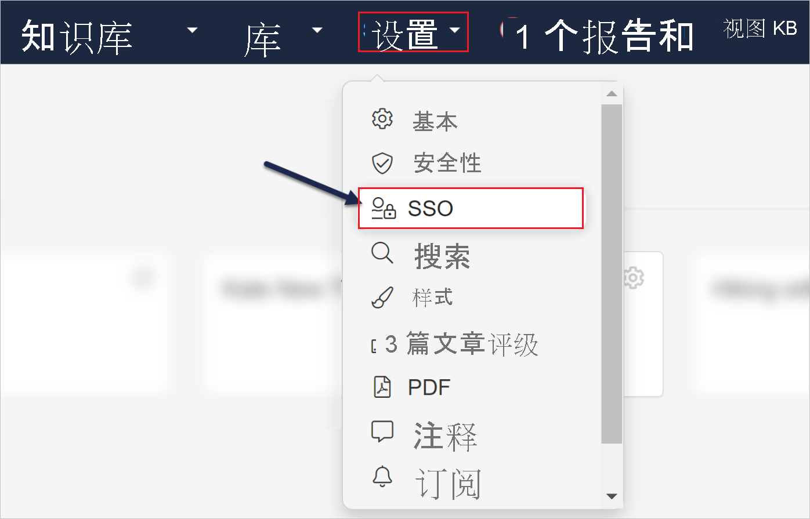
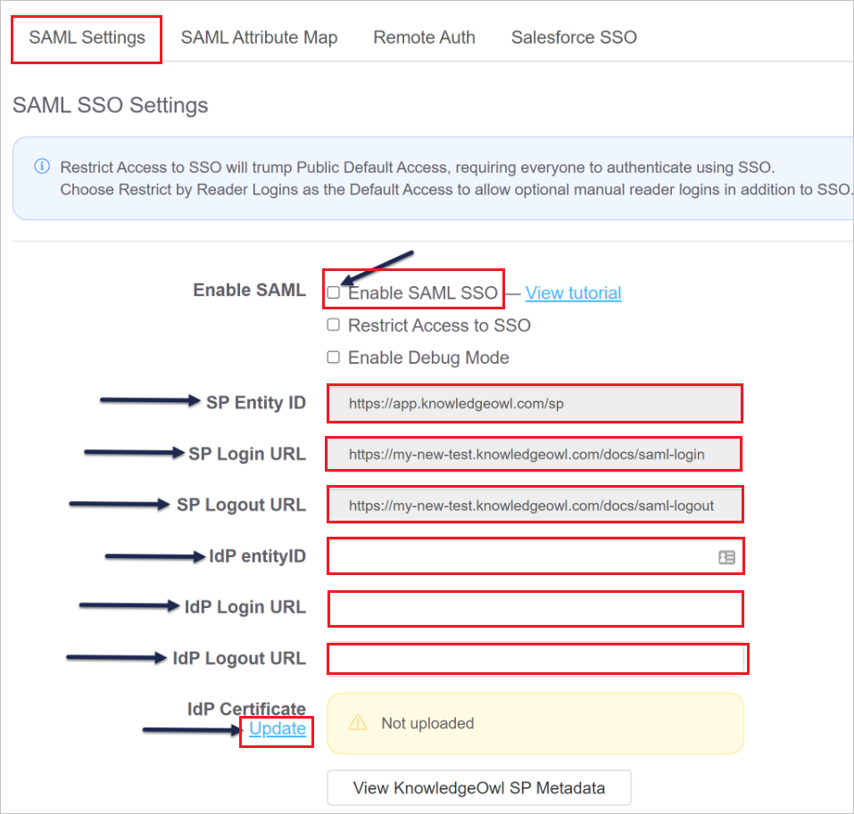
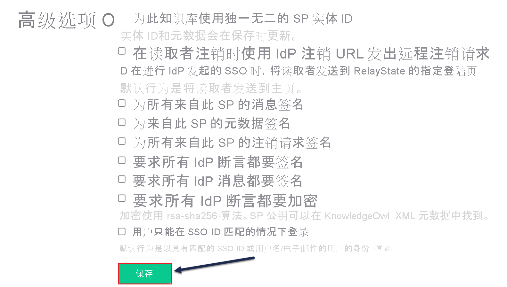
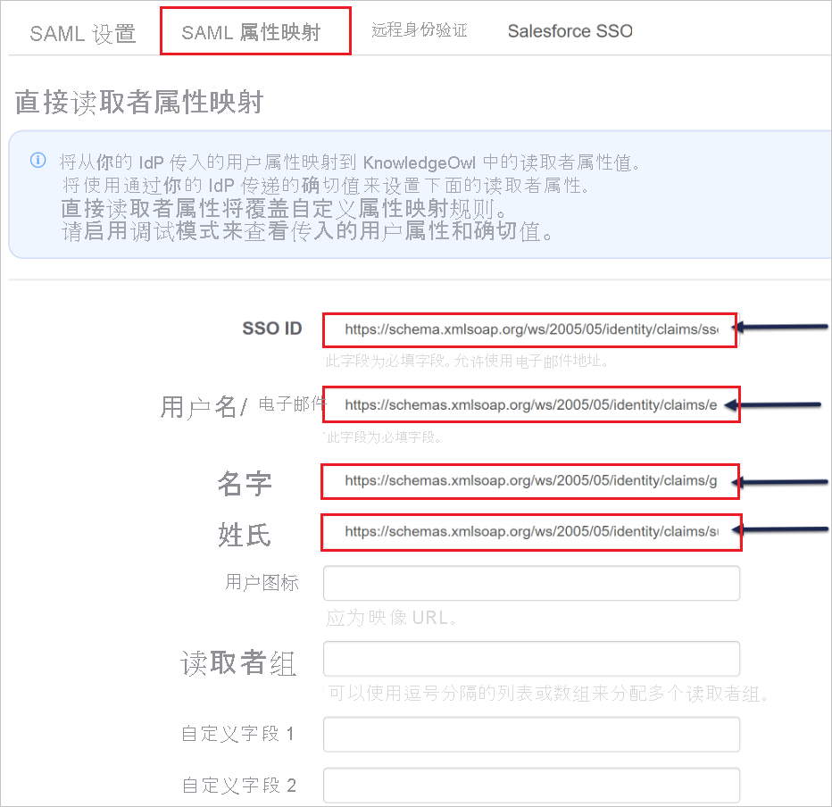
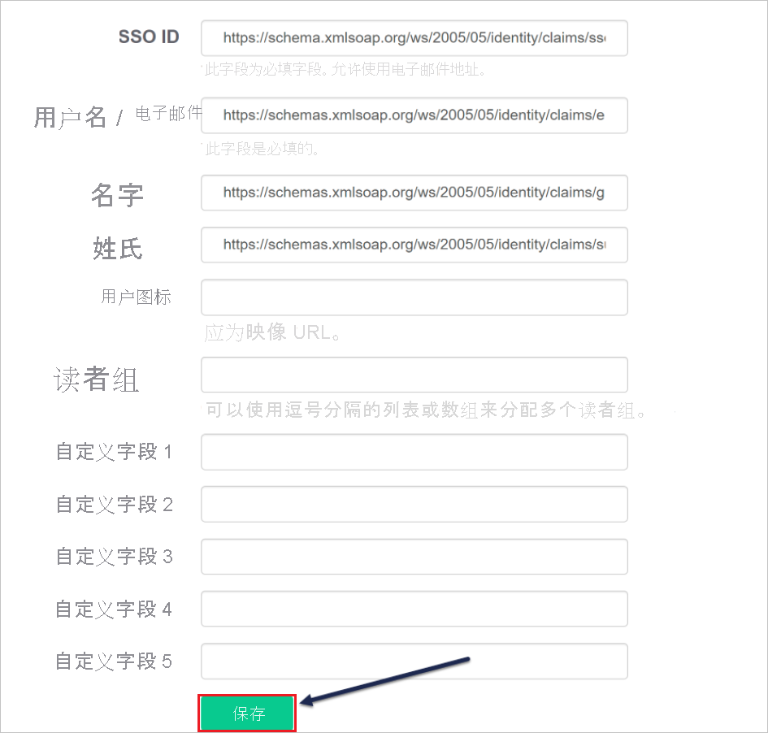

# <a name="tutorial-azure-active-directory-single-sign-on-sso-integration-with-knowledgeowl"></a>教程：Azure Active Directory 单一登录 (SSO) 与 KnowledgeOwl 集成

本教程介绍如何将 KnowledgeOwl 与 Azure Active Directory (Azure AD) 集成。 将 KnowledgeOwl 与 Azure AD 集成后，可以：

* 在 Azure AD 中控制谁有权访问 KnowledgeOwl。
* 让用户使用其 Azure AD 帐户自动登录到 KnowledgeOwl。
* 在一个中心位置（Azure 门户）管理帐户。

## <a name="prerequisites"></a>先决条件

若要开始操作，需备齐以下项目：

* 一个 Azure AD 订阅。 如果没有订阅，可以获取一个[免费帐户](https://azure.microsoft.com/free/)。
* 启用了 KnowledgeOwl 单一登录 (SSO) 的订阅。

## <a name="scenario-description"></a>方案描述

本教程在测试环境中配置并测试 Azure AD SSO。

* KnowledgeOwl 支持 SP 和 IDP 发起的 SSO。
* KnowledgeOwl 支持实时用户预配。

## <a name="add-knowledgeowl-from-the-gallery"></a>从库中添加 KnowledgeOwl

要配置 KnowledgeOwl 与 Azure AD 的集成，需要从库中将 KnowledgeOwl 添加到托管 SaaS 应用列表。

1. 使用工作或学校帐户或个人 Microsoft 帐户登录到 Azure 门户。
1. 在左侧导航窗格中，选择“Azure Active Directory”服务  。
1. 导航到“企业应用程序”，选择“所有应用程序”   。
1. 若要添加新的应用程序，请选择“新建应用程序”  。
1. 在“从库中添加”部分的搜索框中，键入“KnowledgeOwl”   。
1. 从结果面板中选择“KnowledgeOwl”，然后添加该应用  。 在该应用添加到租户时等待几秒钟。

## <a name="configure-and-test-azure-ad-sso-for-knowledgeowl"></a>配置并测试 KnowledgeOwl 的 Azure AD SSO

使用名为 **B.Simon** 的测试用户配置和测试 KnowledgeOwl 的 Azure AD SSO。 若要运行 SSO，需要在 Azure AD 用户与 KnowledgeOwl 相关用户之间建立链接关系。

若要配置并测试 KnowledgeOwl 的 Azure AD SSO，请执行以下步骤：

1. **[配置 Azure AD SSO](#configure-azure-ad-sso)** - 使用户能够使用此功能。
    1. **[创建 Azure AD 测试用户](#create-an-azure-ad-test-user)** - 使用 B. Simon 测试 Azure AD 单一登录。
    1. **[分配 Azure AD 测试用户](#assign-the-azure-ad-test-user)** - 使 B. Simon 能够使用 Azure AD 单一登录。
1. **[配置 KnowledgeOwl SSO](#configure-knowledgeowl-sso)** - 在应用程序端配置单一登录。
    1. **[创建 KnowledgeOwl 测试用户](#create-knowledgeowl-test-user)** - 在 KnowledgeOwl 中创建 B.Simon 的对应用户，并将其链接到用户的 Azure AD 表示形式。
1. **[测试 SSO](#test-sso)** - 验证配置是否正常工作。

## <a name="configure-azure-ad-sso"></a>配置 Azure AD SSO

按照下列步骤在 Azure 门户中启用 Azure AD SSO。

1. 在 Azure 门户的 KnowledgeOwl 应用程序集成页面上，找到“管理”部分并选择“单一登录”  。
1. 在“选择单一登录方法”页上选择“SAML” 。
1. 在“设置 SAML 单一登录”页面上，单击“基本 SAML 配置”旁边的铅笔图标以编辑设置 。

   

1. 如果要在“IDP”发起的模式下配置应用程序，请在“基本 SAML 配置”部分中输入以下字段的值   ：

    a. 在“标识符”文本框中，使用以下模式之一键入 URL：
    
    ```http
    https://app.knowledgeowl.com/sp
    https://app.knowledgeowl.com/sp/id/<unique ID>
    ```

    b. 在“回复 URL”文本框中，使用以下模式之一键入 URL：
    
    ```http
    https://subdomain.knowledgeowl.com/help/saml-login
    https://subdomain.knowledgeowl.com/docs/saml-login
    https://subdomain.knowledgeowl.com/home/saml-login
    https://privatedomain.com/help/saml-login
    https://privatedomain.com/docs/saml-login
    https://privatedomain.com/home/saml-login
    ```

1. 如果要在 SP  发起的模式下配置应用程序，请单击“设置其他 URL”  ，并执行以下步骤：

    在“登录 URL”文本框中，使用以下模式之一键入 URL：
    
    ```http
    https://subdomain.knowledgeowl.com/help/saml-login
    https://subdomain.knowledgeowl.com/docs/saml-login
    https://subdomain.knowledgeowl.com/home/saml-login
    https://privatedomain.com/help/saml-login
    https://privatedomain.com/docs/saml-login
    https://privatedomain.com/home/saml-login
    ```

    > [!NOTE]
    > 这些不是实际值。 将需要从实际的标识符、答复 URL 和登录 URL 更新这些值（本教程稍后会介绍）。

1. KnowledgeOwl 应用程序需要特定格式的 SAML 断言，这要求向 SAML 令牌属性配置添加自定义属性映射。 以下屏幕截图显示了默认属性的列表。

    

1. 除了上述属性，KnowledgeOwl 应用程序还要求在 SAML 响应中传递回更多的属性，如下所示。 这些属性也是预先填充的，但可以根据要求查看它们。

    | 名称 | 源属性 | 命名空间 |
    | ------------ | -------------------- | -----|
    | ssoid | user.mail | `http://schemas.xmlsoap.org/ws/2005/05/identity/claims`|

1. 在“使用 SAML 设置单一登录”页的“SAML 签名证书”部分中，找到“证书(原始)”，选择“下载”以下载该证书并将其保存到计算机上     。

    

1. 在“设置 KnowledgeOwl”部分，根据要求复制相应 URL  。

    

### <a name="create-an-azure-ad-test-user"></a>创建 Azure AD 测试用户

在本部分，我们将在 Azure 门户中创建名为 B.Simon 的测试用户。

1. 在 Azure 门户的左侧窗格中，依次选择“Azure Active Directory”、“用户”和“所有用户”  。
1. 选择屏幕顶部的“新建用户”。
1. 在“用户”属性中执行以下步骤：
   1. 在“名称”字段中，输入 `B.Simon`。  
   1. 在“用户名”字段中输入 username@companydomain.extension。 例如，`B.Simon@contoso.com`。
   1. 选中“显示密码”复选框，然后记下“密码”框中显示的值。
   1. 单击“创建”。

### <a name="assign-the-azure-ad-test-user"></a>分配 Azure AD 测试用户

在本部分中，通过授予 B.Simon 访问 KnowledgeOwl 的权限，允许其使用 Azure 单一登录。

1. 在 Azure 门户中，依次选择“企业应用程序”、“所有应用程序”。  
1. 在应用程序列表中，选择“KnowledgeOwl”  。
1. 在应用的概述页中，找到“管理”部分，选择“用户和组”   。
1. 选择“添加用户”，然后在“添加分配”对话框中选择“用户和组”。
1. 在“用户和组”对话框中，从“用户”列表中选择“B.Simon”，然后单击屏幕底部的“选择”按钮。
1. 如果你希望将某角色分配给用户，可以从“选择角色”下拉列表中选择该角色。 如果尚未为此应用设置任何角色，你将看到选择了“默认访问权限”角色。
1. 在“添加分配”对话框中，单击“分配”按钮。  

## <a name="configure-knowledgeowl-sso"></a>配置 KnowledgeOwl SSO

1. 在另一个 Web 浏览器窗口中，以管理员身份登录到 KnowledgeOwl 公司站点。

1. 单击“设置”，然后选择“SSO” 。

    

1. 滚动到“SAML 设置”选项卡，执行以下步骤：

    

    a. 选择“启用 SAML SSO”  。

    b. 复制“SP 实体 ID”值，并将其粘贴到 Azure 门户上“基本 SAML 配置”部分的“标识符(实体 ID)”中    。

    c. 复制“SP 登录 URL”值并将其粘贴到 Azure 门户上“基本 SAML 配置”部分的“登录 URL 和答复 URL”文本框中    。

    d. 在“IdP entityID”文本框中，粘贴从 Azure 门户复制的“Azure AD 标识符”值   。

    e. 在“IdP 登录 URL”文本框中，粘贴从 Azure 门户复制的“登录 URL”值   。

    f. 在“IDP 注销 URL”文本框中，粘贴从 Azure 门户复制的“注销 URL”值 。

    g. 单击“IdP 证书”下的“上传”链接，上传从 Azure 门户下载的证书 。

    h. 单击页面底部的“保存”  。

    

    i. 打开“SAML 属性映射”选项卡以映射属性并执行以下操作：

    

    * 在“SSO ID”文本框中输入 `http://schemas.xmlsoap.org/ws/2005/05/identity/claims/ssoid`。
    * 在“用户名/电子邮件”文本框中输入 `http://schemas.xmlsoap.org/ws/2005/05/identity/claims/emailaddress`  。
    * 在“名字”文本框中输入 `http://schemas.xmlsoap.org/ws/2005/05/identity/claims/givenname`  。
    * 在“姓氏”文本框中输入 `http://schemas.xmlsoap.org/ws/2005/05/identity/claims/surname`  。

    j. 单击页面底部的“保存”  。

    

### <a name="create-knowledgeowl-test-user"></a>创建 KnowledgeOwl 测试用户

在本部分，我们将在 KnowledgeOwl 中创建一个名为 B.Simon 的用户。 KnowledgeOwl 支持默认启用的实时用户预配。 此部分不存在任何操作项。 如果 KnowledgeOwl 中尚不存在用户，身份验证后会创建一个新用户。

> [!Note]
> 如果需要手动创建用户，请联系 [KnowledgeOwl 支持团队](mailto:support@knowledgeowl.com)。

## <a name="test-sso"></a>测试 SSO

在本部分，你将使用以下选项测试 Azure AD 单一登录配置。 

#### <a name="sp-initiated"></a>SP 启动的

* 在 Azure 门户中单击“测试此应用程序”。 这将重定向到 KnowledgeOwl 登录 URL，可以从那里启动登录流。  

* 直接转到 KnowledgeOwl 登录 URL，并从那里启动登录流。

#### <a name="idp-initiated"></a>IDP 启动的

* 在 Azure 门户中单击“测试此应用程序”后，你应会自动登录到为其设置了 SSO 的 KnowledgeOwl 应用程序。 

还可以使用 Microsoft“我的应用”门户在任何模式下测试此应用程序。 在“我的应用”门户中单击 KnowledgeOwl 磁贴时，如果是在 SP 模式下配置的，你会被重定向到应用程序登录页面来启动登录流；如果是在 IDP 模式下配置的，你应会自动登录到为其设置了 SSO 的 KnowledgeOwl 应用程序。 有关“我的应用”门户的详细信息，请参阅[“我的应用”简介](https://support.microsoft.com/account-billing/sign-in-and-start-apps-from-the-my-apps-portal-2f3b1bae-0e5a-4a86-a33e-876fbd2a4510)。

## <a name="next-steps"></a>后续步骤

配置 KnowledgeOwl 后，即可强制实施会话控制，实时防止组织的敏感数据发生外泄和渗透。 会话控制从条件访问扩展而来。 [了解如何通过 Microsoft Cloud App Security 强制实施会话控制](/cloud-app-security/proxy-deployment-any-app)。