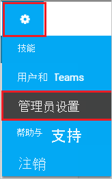
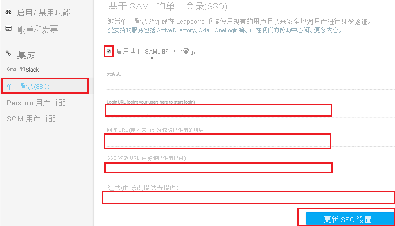

# 教程：Azure Active Directory 单一登录 (SSO) 与 Leapsome 集成

本教程介绍如何将 Leapsome 与 Azure Active Directory (Azure AD) 集成。 将 Leapsome 与 Azure AD 集成后，可以：

* 在 Azure AD 中控制谁有权访问 Leapsome。
* 让用户使用其 Azure AD 帐户自动登录到 Leapsome。
* 在一个中心位置（Azure 门户）管理帐户。

## 先决条件

若要开始操作，需备齐以下项目：

* 一个 Azure AD 订阅。 如果没有订阅，可以获取一个[免费帐户](https://azure.microsoft.com/free/)。
* 已启用 Leapsome 单一登录 (SSO) 的订阅。

## 方案描述

本教程在测试环境中配置并测试 Azure AD SSO。

* Leapsome 支持 SP 和 IDP 发起的 SSO。
* Leapsome 支持[自动用户预配](leapsome-provisioning-tutorial.md)。

> [!NOTE]
> 此应用程序的标识符是一个固定字符串值，因此只能在一个租户中配置一个实例。

## 从库中添加 Leapsome

若要配置将 Leapsome 集成到 Azure AD，需要将 Leapsome 从库中添加到托管 SaaS 应用程序列表。

1. 使用工作或学校帐户或个人 Microsoft 帐户登录到 Azure 门户。
1. 在左侧导航窗格中，选择“Azure Active Directory”服务  。
1. 导航到“企业应用程序”，选择“所有应用程序”   。
1. 若要添加新的应用程序，请选择“新建应用程序”  。
1. 在“从库中添加”部分的搜索框中，键入“Leapsome”。
1. 从结果面板中选择“Leapsome”，然后添加该应用。 在该应用添加到租户时等待几秒钟。

## 配置并测试 Leapsome 的 Azure AD SSO

使用名为 **B.Simon** 的测试用户配置和测试 Leapsome 的 Azure AD SSO。 若要运行 SSO，需要在 Azure AD 用户与 Leapsome 相关用户之间建立关联关系。

若要配置并测试 Leapsome 的 Azure AD SSO，请执行以下步骤：

1. **[配置 Azure AD SSO](#configure-azure-ad-sso)** - 使用户能够使用此功能。
    1. **[创建 Azure AD 测试用户](#create-an-azure-ad-test-user)** - 使用 B. Simon 测试 Azure AD 单一登录。
    1. **[分配 Azure AD 测试用户](#assign-the-azure-ad-test-user)** - 使 B. Simon 能够使用 Azure AD 单一登录。
1. **[配置 Leapsome SSO](#configure-leapsome-sso)** - 在应用程序端配置单一登录设置。
    1. **[创建 Leapsome 测试用户](#create-leapsome-test-user)** - 在 Leapsome 中创建与 B.Simon 对等的用户，并将它与用户的 Azure AD 身份关联。
1. **[测试 SSO](#test-sso)** - 验证配置是否正常工作。

## 配置 Azure AD SSO

按照下列步骤在 Azure 门户中启用 Azure AD SSO。

1. 在 Azure 门户中的“Leapsome”应用程序集成页上，找到“管理”部分并选择“单一登录”  。
1. 在“选择单一登录方法”页上选择“SAML” 。
1. 在“设置 SAML 单一登录”页面上，单击“基本 SAML 配置”旁边的铅笔图标以编辑设置 。

   

1. 如果要在 **IDP** 发起的模式下配置应用程序，请在“基本 SAML 配置”部分执行以下步骤： 

    a. 在“标识符”文本框中键入 URL：`https://www.leapsome.com`

    b. 在“回复 URL”文本框中，使用以下模式键入 URL：`https://www.leapsome.com/api/users/auth/saml/<CLIENTID>/assert`

1. 如果要在 SP  发起的模式下配置应用程序，请单击“设置其他 URL”  ，并执行以下步骤：

    在“登录 URL”文本框中，使用以下模式键入 URL：`https://www.leapsome.com/api/users/auth/saml/<CLIENTID>/login`

    > [!NOTE]
    > 上面的回复 URL 和登录 URL 不是实际值。 将使用实际值更新这些值（本教程稍后将会介绍）。

1. Leapsome 应用程序需要特定格式的 SAML 断言，这要求向“SAML 令牌属性”配置添加自定义属性映射。 以下屏幕截图显示了默认属性的列表。

    

1. 除了上述属性，Leapsome 应用程序还要求在 SAML 响应中传递回更多的属性，如下所示。 这些属性也是预先填充的，但可以根据要求查看它们。

    | 名称 | 源属性 | 命名空间 |
    | ---------------| --------------- | --------- |  
    | 名 | user.givenname | http://schemas.xmlsoap.org/ws/2005/05/identity/claims |
    | 姓 | user.surname | http://schemas.xmlsoap.org/ws/2005/05/identity/claims |
    | title | user.jobtitle | http://schemas.xmlsoap.org/ws/2005/05/identity/claims |
    | picture | 员工图片的 URL | http://schemas.xmlsoap.org/ws/2005/05/identity/claims |
    | | |

    > [!Note]
    > 图片属性值不是实际值。 请使用实际图片 URL 更新此值。 若要获取此值，请联系 [Leapsome 客户端支持团队](mailto:support@leapsome.com)。

1. 在“使用 SAML 设置单一登录”页的“SAML 签名证书”部分中，找到“证书(Base64)”，选择“下载”以下载该证书并将其保存到计算机上   。

    

1. 在“设置 Leapsome”部分中，根据要求复制相应的 URL。

    

### 创建 Azure AD 测试用户

在本部分，我们将在 Azure 门户中创建名为 B.Simon 的测试用户。

1. 在 Azure 门户的左侧窗格中，依次选择“Azure Active Directory”、“用户”和“所有用户”  。
1. 选择屏幕顶部的“新建用户”。
1. 在“用户”属性中执行以下步骤：
   1. 在“名称”字段中，输入 `B.Simon`。  
   1. 在“用户名”字段中输入 username@companydomain.extension。 例如，`B.Simon@contoso.com`。
   1. 选中“显示密码”复选框，然后记下“密码”框中显示的值。
   1. 单击“创建”。

### 分配 Azure AD 测试用户

在本部分中，将通过授予 B.Simon 访问 Leapsome 的权限，允许其使用 Azure 单一登录。

1. 在 Azure 门户中，依次选择“企业应用程序”、“所有应用程序”。 
1. 在应用程序列表中，选择“Leapsome”。
1. 在应用的概述页中，找到“管理”部分，选择“用户和组” 。
1. 选择“添加用户”，然后在“添加分配”对话框中选择“用户和组”。
1. 在“用户和组”对话框中，从“用户”列表中选择“B.Simon”，然后单击屏幕底部的“选择”按钮。
1. 如果你希望将某角色分配给用户，可以从“选择角色”下拉列表中选择该角色。 如果尚未为此应用设置任何角色，你将看到选择了“默认访问权限”角色
1. 在“添加分配”对话框中，单击“分配”按钮。

## 配置 Leapsome SSO

1. 在另一个 Web 浏览器窗口中，以安全管理员身份登录 Leapsome。

1. 依次单击右上角的“设置”徽标和“管理员设置”。

    

1. 单击左侧菜单栏上的“单一登录(SSO)”，并在“基于 SAML 的单一登录(SSO)”页上按照以下步骤操作：

    

    a. 选中“启用基于 SAML 的单一登录”。

    b. 将“登录 URL (指引用户开始登录)”值复制并粘贴到 Azure 门户上“基本 SAML 配置”部分中的“登录 URL”文本框。

    c. 将“回复 URL (接收标识提供程序的响应)”值复制并粘贴到 Azure 门户上“基本 SAML 配置”部分中的“回复 URL”文本框。

    d. 在“SSO 登录 URL (由标识提供程序提供)”文本框中，粘贴从 Azure 门户复制的“登录 URL”值。

    e. 将从 Azure 门户下载的证书（不含 `--BEGIN CERTIFICATE and END CERTIFICATE--` 注释）复制并粘贴到“证书(由标识提供程序提供)”文本框。

    f. 单击“更新 SSO 设置”。

### 创建 Leapsome 测试用户

本部分介绍了如何在 Leapsome 中创建用户“Britta Simon”。 请与 [Leapsome 客户端支持团队](mailto:support@leapsome.com)协作，将必须添加到允许列表的用户或域添加到 Leapsome 平台中。 如果域是由团队添加，用户会自动预配到 Leapsome 平台。 使用单一登录前，必须先创建并激活用户。

Leapsome 还支持自动用户预配，有关如何配置自动用户预配的更多详细信息，请参见[此处](./leapsome-provisioning-tutorial.md)。

## 测试 SSO

在本部分，你将使用以下选项测试 Azure AD 单一登录配置。 

#### SP 启动的：

* 在 Azure 门户中单击“测试此应用程序”。 这会重定向到 Leapsome 登录 URL，可从中启动登录流。  

* 直接转到 Leapsome 登录 URL，并从中启动登录流。

#### IDP 启动的：

* 在 Azure 门户中单击“测试此应用程序”，然后你应会自动登录到为其设置了 SSO 的 Leapsome。 

还可以使用 Microsoft“我的应用”在任何模式下测试此应用程序。 在“我的应用”中单击“Leapsome”磁贴时，如果该应用程序是在 SP 模式下配置的，则你会重定向到应用程序登录页，从中可以启动登录流；如果它是在 IDP 模式下配置的，则你应会自动登录到为其设置了 SSO 的 Leapsome。 有关“我的应用”的详细信息，请参阅[“我的应用”简介](https://support.microsoft.com/account-billing/sign-in-and-start-apps-from-the-my-apps-portal-2f3b1bae-0e5a-4a86-a33e-876fbd2a4510)。

## 后续步骤

配置 Leapsome 后，可以强制实施会话控制，从而实时防止组织的敏感数据遭到外泄和渗透。 会话控制从条件访问扩展而来。 [了解如何通过 Microsoft Cloud App Security 强制实施会话控制](/cloud-app-security/proxy-deployment-aad)。