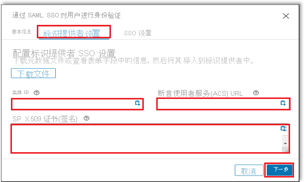

# 教程：Azure Active Directory 单一登录 (SSO) 与 LinkedIn Learning 集成

本教程介绍如何将 LinkedIn Learning 与 Azure Active Directory (Azure AD) 集成。 将 LinkedIn Learning 与 Azure AD 集成后，可以：

* 在 Azure AD 中控制谁有权访问 LinkedIn Learning。
* 让用户使用其 Azure AD 帐户自动登录到 LinkedIn Learning。
* 在一个中心位置（Azure 门户）管理帐户。

## 必备条件

若要开始操作，需备齐以下项目：

* 一个 Azure AD 订阅。 如果没有订阅，可以获取一个[免费帐户](https://azure.microsoft.com/free/)。
* 已启用 LinkedIn Learning 单一登录 (SSO) 的订阅。

## 方案描述

本教程在测试环境中配置并测试 Azure AD SSO。

* LinkedIn Learning 支持 SP 和 IDP 发起的 SSO。
* LinkedIn Learning 支持 Just In Time 用户预配。

## 从库中添加 LinkedIn Learning

要配置 LinkedIn Learning 与 Azure AD 的集成，需要从库中将 LinkedIn Learning 添加到托管 SaaS 应用列表。

1. 使用工作或学校帐户或个人 Microsoft 帐户登录到 Azure 门户。
1. 在左侧导航窗格中，选择“Azure Active Directory”服务  。
1. 导航到“企业应用程序”，选择“所有应用程序”   。
1. 若要添加新的应用程序，请选择“新建应用程序”  。
1. 在“从库中添加”部分的搜索框中，键入 **LinkedIn Learning**。 
1. 在结果面板中选择“LinkedIn Learning”，然后添加该应用。  在该应用添加到租户时等待几秒钟。

## 配置并测试 LinkedIn Learning 的 Azure AD SSO

使用名为 **B.Simon** 的测试用户配置和测试 LinkedIn Learning 的 Azure AD SSO。 若要运行 SSO，需要在 Azure AD 用户与 LinkedIn Learning 相关用户之间建立链接关系。

若要配置并测试 LinkedIn Learning 的 Azure AD SSO，请执行以下步骤：

1. **[配置 Azure AD SSO](#configure-azure-ad-sso)** - 使用户能够使用此功能。
    1. **[创建 Azure AD 测试用户](#create-an-azure-ad-test-user)** - 使用 B. Simon 测试 Azure AD 单一登录。
    1. **[分配 Azure AD 测试用户](#assign-the-azure-ad-test-user)** - 使 B. Simon 能够使用 Azure AD 单一登录。
1. **[配置 LinkedIn Learning SSO](#configure-linkedin-learning-sso)** - 在应用程序端配置单一登录。
    1. [分配许可证](#assign-licenses) - 在 LinkedIn Learning 中创建 B.Simon 的对应用户，并将其链接到用户的 Azure AD 表示形式。
1. **[测试 SSO](#test-sso)** - 验证配置是否正常工作。

## 配置 Azure AD SSO

按照下列步骤在 Azure 门户中启用 Azure AD SSO。

1. 在 Azure 门户的“LinkedIn Learning”应用程序集成页上，找到“管理”部分并选择“单一登录”  。
1. 在“选择单一登录方法”页上选择“SAML” 。
1. 在“设置 SAML 单一登录”页面上，单击“基本 SAML 配置”旁边的铅笔图标以编辑设置 。

   

1. 如果要在 **IDP** 发起的模式下配置应用程序，请在“基本 SAML 配置”部分执行以下步骤： 

    a. 在“标识符”文本框中，输入从 LinkedIn 门户复制的“实体 ID”   。 

    b. 在“回复 URL”文本框中，输入从 LinkedIn 门户复制的“断言使用者服务(ACS) URL”   。

    c. 如果想在 SP 发起的模式下配置应用程序，请单击将在其中指定登录 URL 的“基本 SAML 配置”部分中的“设置其他 URL”选项    。 若要创建登录 URL，请复制断言使用者服务 (ACS) URL 并将 /saml/ 替换为 /login/  。 执行该操作后，单一登录 URL 应包含以下模式：

    `https://www.linkedin.com/checkpoint/enterprise/login/<AccountId>?application=learning&applicationInstanceId=<InstanceId>`

    > [!NOTE]
    > 这些不是实际值。 本教程稍后将在“配置 LinkedIn Learning SSO”部分中介绍如何使用实际的标识符、回复 URL 和登录 URL 来更新这些值。

1. LinkedIn Learning 应用程序需要特定格式的 SAML 断言，这要求向 SAML 令牌属性配置添加自定义属性映射。 以下屏幕截图显示了默认属性的列表，其中的 **nameidentifier** 通过 **user.userprincipalname** 进行映射。 LinkedIn Learning 应用程序要求通过 **user.mail** 对 **nameidentifier** 进行映射，因此需单击“编辑”图标对属性映射进行编辑，然后更改属性映射。 

    

1. 在“使用 SAML 设置单一登录”页的“SAML 签名证书”部分中找到“联合元数据 XML”，选择“下载”以下载该证书并将其保存在计算机上     。

    

1. 在“设置 LinkedIn Learning”部分中，根据要求复制相应的 URL。 

    

### 创建 Azure AD 测试用户

在本部分，我们将在 Azure 门户中创建名为 B.Simon 的测试用户。

1. 在 Azure 门户的左侧窗格中，依次选择“Azure Active Directory”、“用户”和“所有用户”  。
1. 选择屏幕顶部的“新建用户”。
1. 在“用户”属性中执行以下步骤：
   1. 在“名称”字段中，输入 `B.Simon`。  
   1. 在“用户名”字段中输入 username@companydomain.extension。 例如，`B.Simon@contoso.com` 。
   1. 选中“显示密码”复选框，然后记下“密码”框中显示的值。
   1. 单击“创建”。

### 分配 Azure AD 测试用户

在本部分中，将通过授予 B.Simon 访问 LinkedIn Learning 的权限，允许其使用 Azure 单一登录。

1. 在 Azure 门户中，依次选择“企业应用程序”、“所有应用程序”。  
1. 在应用程序列表中，选择“LinkedIn Learning”  。
1. 在应用的概述页中，找到“管理”部分，选择“用户和组”   。
1. 选择“添加用户”，然后在“添加分配”对话框中选择“用户和组”。
1. 在“用户和组”对话框中，从“用户”列表中选择“B.Simon”，然后单击屏幕底部的“选择”按钮。
1. 如果你希望将某角色分配给用户，可以从“选择角色”下拉列表中选择该角色。 如果尚未为此应用设置任何角色，你将看到选择了“默认访问权限”角色。
1. 在“添加分配”对话框中，单击“分配”按钮。  

## 配置 LinkedIn Learning SSO

1. 以管理员身份登录 LinkedIn Learning 公司站点。

1. 选择“转到管理员” > “我” > “身份验证”。   

     

1. 在“身份验证”下选择“配置单一登录”，然后单击“添加新 SSO”。      

    

1. 从“添加新 SSO”下拉列表中选择“SAML” 。

    

1. 在“基本”选项卡中，输入“SAML 连接名称”，然后单击“下一步”  。

    

1. 导航到“标识提供者设置”选项卡，单击“下载文件”以下载元数据文件并将其保存在计算机上，然后单击“下一步”。  

    

    > [!NOTE]    
    > 你可能无法将此文件导入到标识提供者中。 例如，Okta 没有此功能。 如果这种情况符合你的配置要求，请选择“使用单个字段”继续操作。

1. 在“标识提供者设置”选项卡中，单击“加载并复制字段信息”以复制所需字段，将其粘贴到 Azure 门户的“基本 SAML 配置”部分，然后单击“下一步”。   

    

1. 导航到“SSO 设置”选项卡，单击“上传 XML 文件”以上传从 Azure 门户下载的“联合元数据 XML 文件”。  

    

1. 在“SSO 设置”选项卡中，手动填充从 Azure 门户复制的必填字段。

    

1. 在“SSO 设置”下，根据要求选择 SSO 选项，然后单击“保存”。 

    

#### 启用单一登录

完成配置后，通过从 SSO“状态”下拉列表中选择“活动”来启用 SSO。

  

### 分配许可证

启用 SSO 后，通过将“自动预配许可证”切换为“启用”并单击“保存”，可以自动将许可证分配给员工。   启用此选项后，则在用户首次进行身份验证时，会自动向其授予许可证。

   

> [!NOTE]   
> 如果未启用此选项，则管理员必须手动在“人员”选项卡中添加用户。LinkedIn Learning 通过用户的电子邮件地址来标识用户。

## 测试 SSO 

在本部分，你将使用以下选项测试 Azure AD 单一登录配置。 

#### SP 启动的：

* 在 Azure 门户中单击“测试此应用程序”。 这会重定向到 LinkedIn Learning 登录 URL，可在其中启动登录流。  

* 直接转到 LinkedIn Learning 登录 URL，并从那里启动登录流。

#### IDP 启动的：

* 在 Azure 门户中单击“测试此应用程序”后，你应该会自动登录到设置了 SSO 的 LinkedIn Learning。 

还可以使用 Microsoft“我的应用”在任何模式下测试此应用程序。 在“我的应用”中单击 LinkedIn Learning 磁贴时，如果是在 SP 模式下配置的，会重定向到应用程序登录页来启动登录流；如果是在 IDP 模式下配置的，则应会自动登录到为其设置了 SSO 的 LinkedIn Learning。 有关“我的应用”的详细信息，请参阅[“我的应用”简介](../user-help/my-apps-portal-end-user-access.md)。

## 后续步骤

配置 LinkedIn Learning 后，就可以强制实施会话控制，从而实时保护组织的敏感数据免于外泄和渗透。 会话控制从条件访问扩展而来。 [了解如何通过 Microsoft Cloud App Security 强制实施会话控制](/cloud-app-security/proxy-deployment-aad)。
