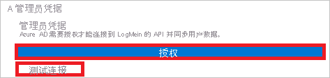
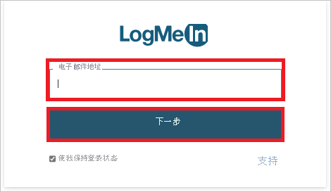
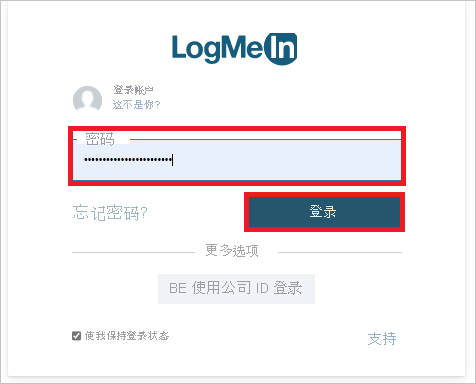

# 教程：为 LogMeIn 配置自动用户预配

本教程介绍在 LogMeIn 和 Azure Active Directory (Azure AD) 中配置自动用户预配所要执行的步骤。 配置后，Azure AD 会使用 Azure AD 预配服务自动将用户和组预配到 [LogMeIn](https://www.logmein.com/) 以及将其取消预配。 有关此服务的功能、工作原理以及常见问题的重要详细信息，请参阅[使用 Azure Active Directory 自动将用户预配到 SaaS 应用程序和取消预配](../app-provisioning/user-provisioning.md)。 

## 支持的功能
> [!div class="checklist"]
> * 在 LogMeIn 中创建用户
> * 在用户不再有访问需求的情况下，在 LogMeIn 中删除用户
> * 使用户特性在 Azure AD 和 LogMeIn 之间保持同步
> * 在 LogMeIn 中预配组和组成员身份
> * [单一登录](./logmein-tutorial.md)到 LogMeIn（推荐）

## 先决条件

本教程中概述的方案假定你已具有以下先决条件：

* [Azure AD 租户](../develop/quickstart-create-new-tenant.md) 
* Azure AD 中[有权](../roles/permissions-reference.md)配置预配的用户帐户（例如应用管理员、云应用管理员、应用所有者或全局管理员）。 
* 在 LogMeIn 组织中心中创建的至少具有一个已验证域的组织 
* LogMeIn 组织中心中具有配置预配[权限](https://support.goto.com/meeting/help/manage-organization-users-g2m710102)的用户帐户（例如，具有读写权限的组织管理员角色），如步骤 2 中所示。

## 步骤 1。 计划预配部署
1. 了解[预配服务的工作原理](../app-provisioning/user-provisioning.md)。
2. 确定谁在[预配范围](../app-provisioning/define-conditional-rules-for-provisioning-user-accounts.md)中。
3. 确定要[在 Azure AD 与 LogMeIn 之间映射](../app-provisioning/customize-application-attributes.md)的数据。 

## 步骤 2. 配置 LogMeIn 以支持通过 Azure AD 进行预配

1. 登录到[组织中心](https://organization.logmeininc.com)。

2. 帐户的电子邮件地址中使用的域是系统在 10 天内提示你进行验证的域。  

3. 可以使用下列任一方法验证域的所有权：

   方法 1：向域区域文件添加 DNS 记录。  
   若要使用 DNS 方法，请在 DNS 区域中的电子邮件域级别放置 DNS 记录。  使用“main.com”作为域的示例类似于：`@ IN TXT "logmein-verification-code=668e156b-f5d3-430e-9944-f1d4385d043e"` 或 `main.com. IN TXT “logmein-verification-code=668e156b-f5d3-430e-9944-f1d4385d043e”`

   以下是详细说明：
     1. 在域主机上登录到域帐户。
     2. 导航到用于更新域 DNS 记录的页面。
     3. 找到域的 TXT 记录，然后为该域和每个子域添加 TXT 记录。
     4. 保存所有更改。
     5. 可以通过打开命令行并输入以下命令之一（基于操作系统，使用“main.com”作为域示例）来验证是否已发生更改：
         * 对于 Unix 和 Linux 系统：`$ dig TXT main.com`
         * 对于 Windows 系统：`c:\ > nslookup -type=TXT main.com`
     6. 响应将显示在其自己的行上。

   方法 2：向特定网站上传 Web 服务器文件。
   将纯文本文件上传到包含验证字符串的 Web 服务器根目录，该字符串外不包含任何空格或特殊字符。
   
      * 位置：`http://<yourdomain>/logmein-verification-code.txt`
      * 内容：`logmein-verification-code=668e156b-f5d3-430e-9944-f1d4385d043e`

4. 添加 DNS 记录或 TXT 文件后，返回[组织中心](https://organization.logmeininc.com)并单击“验证”。

5. 现在，你已通过验证你的域在组织中心中创建了一个组织，并且在此验证过程中使用的帐户现在是组织管理员。

## 步骤 3. 从 Azure AD 应用程序库添加 LogMeIn

从 Azure AD 应用程序库添加 LogMeIn，开始管理 LogMeIn 的预配。 如果以前为 SSO 设置过 LogMeIn，则可以使用同一应用程序。 但建议你在最初测试集成时创建一个单独的应用。 若要详细了解如何从库中添加应用，可以单击[此处](../manage-apps/add-application-portal.md)。 

## 步骤 4. 定义谁在预配范围中 

使用 Azure AD 预配服务，可以根据对应用的分配或用户/组的特性来限定谁在预配范围内。 如果选择根据分配来限定要将谁预配到应用，可以按照下面的[步骤](../manage-apps/assign-user-or-group-access-portal.md)操作，将用户和组分配到应用。 如果选择仅根据用户或组的属性来限定要对谁进行预配，可以使用[此处](../app-provisioning/define-conditional-rules-for-provisioning-user-accounts.md)所述的范围筛选器。 

* 将用户和组分配到 LogMeIn 时，必须选择“默认访问”以外的角色。 具有“默认访问”角色的用户将从预配中排除，并在预配日志中被标记为未有效授权。 如果应用程序上唯一可用的角色是默认访问角色，则可以[更新应用程序清单](../develop/howto-add-app-roles-in-azure-ad-apps.md)以添加其他角色。 

* 先小部分测试。 在向全员推出之前，请先使用少量的用户和组进行测试。 如果预配范围设置为分配的用户和组，则可以先尝试将一两个用户或组分配到应用。 当预配范围设置为所有用户和组时，可以指定[基于属性的范围筛选器](../app-provisioning/define-conditional-rules-for-provisioning-user-accounts.md)。 

## 步骤 5。 配置 LogMeIn 的自动用户预配 

本部分介绍了如何配置 Azure AD 预配服务以基于 Azure AD 中的用户和/或组分配在 TestApp 中创建、更新和禁用用户和/或组。

### 在 Azure AD 中为 LogMeIn 配置自动用户预配：

1. 登录 [Azure 门户](https://portal.azure.com)。 依次选择“企业应用程序”、“所有应用程序” 。

    

2. 在应用程序列表中，选择“LogMeIn”。

    

3. 选择“预配”  选项卡。

    

4. 将“预配模式”设置为“自动”。

    

5. 在“管理员凭据”部分下，单击“授权”。 你将被重定向到 LogMeIn 的授权页。 输入 LogMeIn 用户名并单击“下一步”按钮。 输入 LogMeIn 密码并单击“登录”按钮。 单击“测试连接”，确保 Azure AD 可连接到 LogMeIn。 如果连接失败，请确保 LogMeIn 帐户具有管理员权限，然后重试。

    

      

      

6. 在“通知电子邮件”字段中，输入应接收预配错误通知的个人或组的电子邮件地址，并选中“发生故障时发送电子邮件通知”复选框 。

    

7. 选择“保存”。

8. 在“映射”部分下，选择“将 Azure Active Directory 用户同步到 LogMeIn” 。

9. 在“特性映射”部分中，查看从 Azure AD 同步到 LogMeIn 的用户特性。 选为“匹配”属性的特性用于匹配 LogMeIn 中的用户帐户以执行更新操作。 如果选择更改[匹配目标特性](../app-provisioning/customize-application-attributes.md)，需要确保 LogMeIn API 支持基于该特性筛选用户。 选择“保存”按钮以提交任何更改。

   |Attribute|类型|
   |---|---|
   |userName|字符串|
   |externalId|字符串|
   |活动|Boolean|
   |name.givenName|字符串|
   |name.familyName|字符串|
   |urn:ietf:params:scim:schemas:extension:enterprise:2.0:User:department|字符串|
   |urn:ietf:params:scim:schemas:extension:enterprise:2.0:User:employeeNumber|字符串|
   |urn:ietf:params:scim:schemas:extension:enterprise:2.0:User:costCenter|字符串|
   |urn:ietf:params:scim:schemas:extension:enterprise:2.0:User:division|字符串|

10. 在“映射”部分下，选择“将 Azure Active Directory 组同步到 LogMeIn” 。

11. 在“特性映射”部分中，查看从 Azure AD 同步到 LogMeIn 的组特性。 选为“匹配”属性的特性用于匹配 LogMeIn 中的组以执行更新操作。 选择“保存”按钮以提交任何更改。

      |Attribute|类型|
      |---|---|
      |displayName|字符串|
      |externalId|字符串|
      |members|参考|

12. 若要配置范围筛选器，请参阅[范围筛选器教程](../app-provisioning/define-conditional-rules-for-provisioning-user-accounts.md)中提供的以下说明。

13. 若要为 LogMeIn 启用 Azure AD 预配服务，请在“设置”部分中将“预配状态”更改为“启用”  。

    

14. 通过在“设置”部分的“范围”中选择所需的值，定义要预配到 LogMeIn 的用户和/或组 。

    

15. 已准备好预配时，单击“保存”  。

    

此操作会对“设置”部分的“范围”中定义的所有用户和组启动初始同步周期 。 初始周期执行的时间比后续周期长，只要 Azure AD 预配服务正在运行，后续周期大约每隔 40 分钟就会进行一次。 

## 步骤 6. 监视部署
配置预配后，请使用以下资源来监视部署：

1. 通过[预配日志](../reports-monitoring/concept-provisioning-logs.md)来确定哪些用户已预配成功或失败
2. 检查[进度栏](../app-provisioning/application-provisioning-when-will-provisioning-finish-specific-user.md)来查看预配周期的状态以及完成进度
3. 如果怀疑预配配置处于非正常状态，则应用程序将进入隔离状态。 可在[此处](../app-provisioning/application-provisioning-quarantine-status.md)了解有关隔离状态的详细信息。  

## 其他资源

* [管理企业应用的用户帐户预配](../app-provisioning/configure-automatic-user-provisioning-portal.md)
* [Azure Active Directory 的应用程序访问与单一登录是什么？](../manage-apps/what-is-single-sign-on.md)

## 后续步骤

* [了解如何查看日志并获取有关预配活动的报告](../app-provisioning/check-status-user-account-provisioning.md)