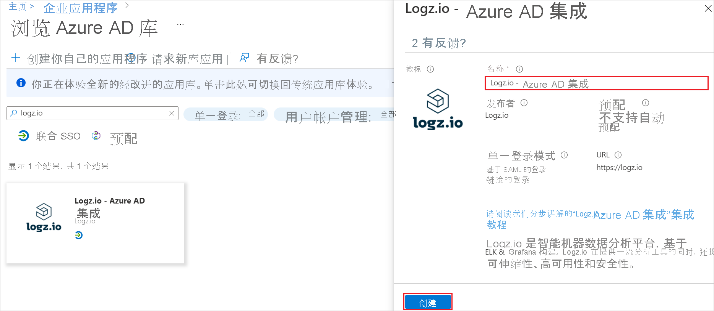

# 教程：为 Logz.io - Azure AD Integration 设置 Azure Active Directory 单一登录 (SSO)

## Logz.io - Azure 门户集成的单一登录 (SSO)

Logz.io 提供与 Azure 市场的集成。 本主题将指导管理员为 Logz.io-Azure 门户集成设置 SSO，以便为通过 Microsoft Azure 市场访问 Logz.io 资源的用户启用 SSO 链接。

### 好处

通过 SSO 授权用户访问 Logz.io Azure 资源的优势： 

+ 无需为每个用户预定义唯一用户名和密码：任何拥有 SSO 链接的用户都可以登录应用程序。
+ 更好地控制用户：只有在 Azure 帐户中定义的用户才能使用 SSO 链接。

在为 Logz.io 设置 Azure 资源之前准备 SSO 连接。 你需要使用在此过程中创建的凭据来设置资源。 

### 在 Azure Active Directory 中为 Logz.io 资源创建 SSO 连接 

你将创建一个 Azure Active Directory (AD) 企业应用程序，以便使用 SSO 从 Azure 资源连接到 Logz.io 帐户。 

### 先决条件： 

若要开始操作，需拥有以下权限：

* 对 Azure Active Directory (AAD) 的访问权限
* 创建新企业应用程序的权限
* 要为其创建 Logz.io 资源的 Azure 订阅的所有者角色权限 

为了能够访问和使用为 Logz.io-Azure 集成资源创建的 SSO 链接，必须在关联的 Azure 帐户中定义用户。 

#### 为 Logz.io - Azure 门户资源设置 SSO 链接

##### 从库中添加 Logz.io-Azure Active Directory Integration

若要在 Azure 门户中为 Logz.io 资源配置 SSO，需要从库中将 Logz.io - Azure AD Integration 添加到托管 SaaS 应用列表。

1. 使用 Microsoft 帐户登录 Azure 门户。
2. 在 Azure 门户中，在“Logz.io | 概述”的“+ 添加”菜单中，选择“企业应用程序”。

   
   
3. 在 Azure Active Directory 库中，浏览到“Logz.io - Azure AD Integration”应用程序并选择它。
4. 使用相关名称重命名集成并单击“创建”。 （在接下来的步骤中，我们使用了名称“适用于 logz.io 资源的 AD 应用”）

   

##### 复制应用程序 ID

在“适用于 logz.io 资源的 AD 应用 | 概述”>“属性”中，复制“应用程序 ID”属性 。

##### 配置 Azure AD SSO

1. 在“适用于 logz.io 资源的 AD 应用 | 概述”>“开始”的“2. 设置单一登录”中，单击“开始”以打开“单一登录”   。

   

2. 在“适用于 logz.io 资源的 AD 应用 | 单一登录”中，选择“SAML”方法 。

   

##### 基本 SAML 配置   

1. 在“适用于 logz.io 资源的 AD 应用 | 基于 SAML 的登录”中，单击“编辑”以打开“基本 SAML 配置”面板。

   

2. 在“标识符(实体 ID)”文本框中，使用模式 `urn:auth0:logzio:*` 键入值：将 `*` 替换为你在过程 2 中复制的应用程序 ID，然后单击“默认”选项。 

3. 在“回复 URL (断言使用者服务 URL)”文本框中，使用模式 `https://logzio.auth0.com/login/callback?connection=` 键入 URL：将 `CONNECTION_NAME` 替换为你在过程 2 中复制的应用程序 ID。

4. 单击面板顶部的“保存”。

    

##### 配置用户分配选项    

在“适用于 logz.io 资源的 AD 应用 | 属性”（“管理”>“属性”）中，将“需要进行用户分配?”设置为“否”，然后单击“保存”。  
此步骤可让有权访问 SSO 链接的用户通过 Microsoft Azure 门户登录到 Logz.io，而无需你在 Active Directory 中预定义每个用户。

此选项允许在 Active Directory 下定义的任何用户使用 SSO 链接，而无需通过刚刚创建的 AD 应用为每个用户定义特定的访问权限。 

如果你不想配置此选项，组织就必须为每个用户分配对 Logz.io 的特定访问权限。

### 通过 Azure Active Directory 为 Logz.io 资源启用 SSO

创建 Logz.io 帐户时，请使用为 Logz.io 资源创建的 AD 应用来启用 Azure Active Directory 单一登录。  

Logz.io AAD 应用资源名称会在你键入时自动填充。

当你登录到 Logz.io 资源时，系统会显示 SSO 链接。   
单击链接可访问你在 Logz.io 中的帐户。 

如果你在创建 Logz.io 资源时未配置 SSO，稍后可以通过“单一登录”边栏选项卡进行配置。

你必须在 Azure 中配置日志，以确保将日志发送到 Logz.io。

## 现有 Logz.io 帐户的 Azure Active Directory 单一登录

本部分介绍如何将 Logz.io - Azure AD Integration 与 Azure Active Directory (Azure AD) 集成。 将 Logz.io - Azure AD Integration 与 Azure AD 集成后，可以：

* 在 Azure AD 中控制谁有权访问 Logz.io - Azure AD Integration。
* 让用户使用其 Azure AD 帐户自动登录到 Logz.io - Azure AD Integration。
* 在一个中心位置（Azure 门户）管理帐户。

### 先决条件

若要开始操作，需备齐以下项目：

* 一个 Azure AD 订阅。 如果没有订阅，可以获取一个[免费帐户](https://azure.microsoft.com/free/)。
* 启用了单一登录 (SSO) 的 Logz.io - Azure AD Integration 订阅。

### 方案描述

本教程在测试环境中配置并测试 Azure AD SSO。

* Logz.io - Azure AD Integration 支持 IDP 发起的 SSO。

### 从库中添加 Logz.io - Azure AD Integration

若要配置 Logz.io - Azure AD Integration 与 Azure AD 的集成，需要从库中将 Logz.io - Azure AD Integration 添加到托管 SaaS 应用列表。

1. 使用工作或学校帐户或个人 Microsoft 帐户登录到 Azure 门户。
1. 在左侧导航窗格中，选择“Azure Active Directory”服务  。
1. 导航到“企业应用程序”，选择“所有应用程序”   。
1. 若要添加新的应用程序，请选择“新建应用程序”  。
1. 在“从库中添加”部分的搜索框中，键入 Logz.io - Azure AD Integration。  
1. 在结果面板中选择“Logz.io - Azure AD Integration”，然后添加该应用。  在该应用添加到租户时等待几秒钟。

### 配置并测试 Logz.io - Azure AD Integration 的 Azure AD SSO

使用名为 B.Simon 的测试用户配置并测试 Logz.io - Azure AD Integration 的 Azure AD SSO。  若要使 SSO 有效，需要在 Azure AD 用户与 Logz.io - Azure AD Integration 相关用户之间建立关联。

若要配置并测试 Logz.io - Azure AD Integration 的 Azure AD SSO，请执行以下步骤：

1. **[配置 Azure AD SSO](#configure-azure-ad-sso)** - 使用户能够使用此功能。
    1. **[创建 Azure AD 测试用户](#create-an-azure-ad-test-user)** - 使用 B. Simon 测试 Azure AD 单一登录。
    1. **[分配 Azure AD 测试用户](#assign-the-azure-ad-test-user)** - 使 B. Simon 能够使用 Azure AD 单一登录。
1. **[配置 Logz.io - Azure AD Integration SSO](#configure-logzio-azure-ad-integration-sso)** - 在应用程序端配置单一登录设置。
    1. **[创建 Logz.io - Azure AD Integration 测试用户](#create-logzio-azure-ad-integration-test-user)** - 在 Logz.io - Azure AD Integration 中创建 B.Simon 的对应用户，并将其关联到用户的 Azure AD 表示形式。
1. **[测试 SSO](#test-sso)** - 验证配置是否正常工作。

### 配置 Azure AD SSO

按照下列步骤在 Azure 门户中启用 Azure AD SSO。

1. 在 Azure 门户中的“Logz.io - Azure AD Integration”应用程序集成页上，找到“管理”部分，然后选择“单一登录”  。
1. 在“选择单一登录方法”页上选择“SAML” 。
1. 在“设置 SAML 单一登录”页面上，单击“基本 SAML 配置”旁边的铅笔图标以编辑设置 。

   

1. 在“设置 SAML 单一登录”页上，执行以下步骤  ：

    a. 在“标识符”文本框中，使用以下模式键入值：`urn:auth0:logzio:CONNECTION-NAME`

    b. 在“回复 URL”文本框中，使用以下模式键入 URL：`https://logzio.auth0.com/login/callback?connection=CONNECTION-NAME`

    > [!NOTE]
    > 这些不是实际值。 请使用实际标识符和回复 URL 更新这些值。 请联系 [Logz.io - Azure AD Integration 客户端支持团队](mailto:help@logz.io)获取这些值。 还可以参考 Azure 门户中的“基本 SAML 配置”  部分中显示的模式。

1. Logz.io - Azure AD Integration 应用程序需要特定格式的 SAML 断言，因此，需要在 SAML 令牌属性配置中添加自定义属性映射。 以下屏幕截图显示了默认属性的列表。

    

1. 除上述属性以外，Logz.io - Azure AD Integration 应用程序还要求在 SAML 响应中传回其他几个属性，如下所示。 这些属性也是预先填充的，但可以根据要求查看它们。
    
    | 名称 |  源属性|
    | ---------------| --------- |
    | session-expiration | user.session-expiration |
    | 电子邮件 | user.mail |
    | 组 | user.groups |

1. 在“使用 SAML 设置单一登录”页的“SAML 签名证书”部分中，找到“证书(Base64)”，选择“下载”以下载该证书并将其保存到计算机上     。

    

1. 在“设置 Logz.io - Azure AD Integration”部分，根据要求复制相应的 URL。 

    

#### 创建 Azure AD 测试用户

在本部分，我们将在 Azure 门户中创建名为 B.Simon 的测试用户。

1. 在 Azure 门户的左侧窗格中，依次选择“Azure Active Directory”、“用户”和“所有用户”  。
1. 选择屏幕顶部的“新建用户”。
1. 在“用户”属性中执行以下步骤：
   1. 在“名称”字段中，输入 `B.Simon`。  
   1. 在“用户名”字段中输入 username@companydomain.extension。 例如，`B.Simon@contoso.com`。
   1. 选中“显示密码”复选框，然后记下“密码”框中显示的值。
   1. 单击“创建”。

#### 分配 Azure AD 测试用户

在本部分，你将通过授予 B.Simon 访问 Logz.io - Azure AD Integration 的权限，使其能够使用 Azure 单一登录。

1. 在 Azure 门户中，依次选择“企业应用程序”、“所有应用程序”。  
1. 在应用程序列表中选择“Logz.io - Azure AD Integration”。 
1. 在应用的概述页中，找到“管理”部分，选择“用户和组”   。
1. 选择“添加用户”，然后在“添加分配”对话框中选择“用户和组”。
1. 在“用户和组”对话框中，从“用户”列表中选择“B.Simon”，然后单击屏幕底部的“选择”按钮。
1. 如果在 SAML 断言中需要任何角色值，请在“选择角色”对话框的列表中为用户选择合适的角色，然后单击屏幕底部的“选择”按钮。
1. 在“添加分配”对话框中，单击“分配”按钮。  

### 配置 Logz.io - Azure AD Integration SSO

若要在 Logz.io - Azure AD Integration 端配置单一登录，需要将下载的“证书(Base64)”以及从 Azure 门户复制的相应 URL 发送给 [Logz.io - Azure AD Integration 支持团队](mailto:help@logz.io)。   他们会对此进行设置，使两端的 SAML SSO 连接均正确设置。

#### 创建 Logz.io - Azure AD Integration 测试用户

在本部分，你将在 Logz.io - Azure AD Integration 中创建名为 Britta Simon 的用户。 请与 [Logz.io - Azure AD 集成支持团队](mailto:help@logz.io)协作，将用户添加到 Logz.io - Azure AD 集成平台。 使用单一登录前，必须先创建并激活用户。

### 测试 SSO 

在本部分，你将使用以下选项测试 Azure AD 单一登录配置。

* 在 Azure 门户中单击“测试此应用程序”后，应会自动登录到为其设置了 SSO 的 Logz.io Azure AD Integration。

* 你可使用 Microsoft 的“我的应用”。 在“我的应用”中单击“Logz.io Azure AD Integration”磁贴时，应会自动登录到设置了 SSO 的 Logz.io Azure AD Integration。 有关“我的应用”的详细信息，请参阅[“我的应用”简介](../user-help/my-apps-portal-end-user-access.md)。

### 后续步骤

配置 Logz.io Azure AD Integration 后，可以强制实施会话控制，实时防止组织的敏感数据外泄和渗透。 会话控制从条件访问扩展而来。 [了解如何通过 Microsoft Cloud App Security 强制实施会话控制](/cloud-app-security/proxy-deployment-aad)。
