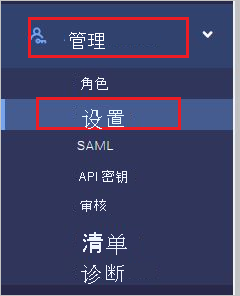
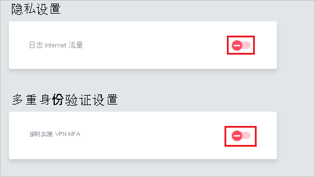
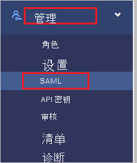
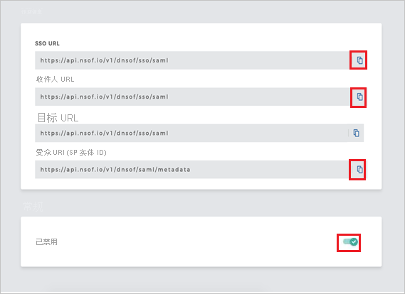
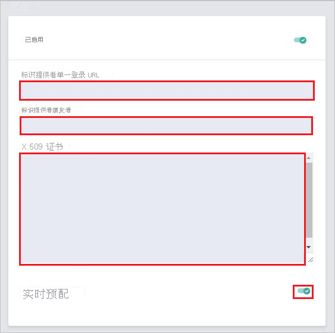

# 教程：Azure Active Directory 与 Meta Networks 连接器集成

本教程介绍如何将 Meta Networks Connector 与 Azure Active Directory (Azure AD) 集成。 将 Meta Networks Connector 与 Azure AD 集成后，可以进行以下操作：

* 在 Azure AD 中控制谁有权限访问 Meta Networks Connector。
* 让用户使用其 Azure AD 帐户自动登录到 Meta Networks Connector。
* 在一个中心位置（Azure 门户）管理帐户。

## 先决条件

若要开始操作，需备齐以下项目：

* 一个 Azure AD 订阅。 如果没有订阅，可以获取一个[免费帐户](https://azure.microsoft.com/free/)。
* 已启用 Meta Networks Connector 单一登录 (SSO) 的订阅。

## 方案描述

本教程会在测试环境中配置和测试 Azure AD 单一登录。

* Meta Networks Connector 支持 SP 和 IDP 发起的 SSO 。
 
* Meta Networks Connector 支持即时用户预配。

* Meta Networks Connector [支持自动用户预配](meta-networks-connector-provisioning-tutorial.md)。

## 从库中添加 Meta Networks Connector

若要配置 Meta Networks 连接器与 Azure AD 的集成，需要从库中将 Meta Networks 连接器添加到托管 SaaS 应用列表。

1. 使用工作或学校帐户或个人 Microsoft 帐户登录到 Azure 门户。
1. 在左侧导航窗格中，选择“Azure Active Directory”服务  。
1. 导航到“企业应用程序”，选择“所有应用程序”   。
1. 若要添加新的应用程序，请选择“新建应用程序”  。
1. 在“从库中添加”部分的搜索框中，键入 Meta Networks Connector 。
1. 在结果面板中选择“Meta Networks Connector”，然后添加该应用。 在该应用添加到租户时等待几秒钟。

## 配置并测试 Meta Networks Connector 的 Azure AD SSO

使用名为 B.Simon 的测试用户配置并测试 Meta Networks Connector 的 Azure AD SSO。 若要使 SSO 正常工作，需要在 Azure AD 用户与 Meta Networks Connector 中的相关用户之间建立关联。

若要配置并测试 Meta Networks Connector 的 Azure AD SSO，请执行以下步骤：

1. **[配置 Azure AD SSO](#configure-azure-ad-sso)** - 使用户能够使用此功能。
    1. **[创建 Azure AD 测试用户](#create-an-azure-ad-test-user)** - 使用 B. Simon 测试 Azure AD 单一登录。
    1. **[分配 Azure AD 测试用户](#assign-the-azure-ad-test-user)** - 使 B. Simon 能够使用 Azure AD 单一登录。
1. [配置 Meta Networks Connector SSO](#configure-meta-networks-connector-sso) - 在应用程序端配置单一登录设置。
    1. [创建 Meta Networks Connector 测试用户](#create-meta-networks-connector-test-user) - 在 Meta Networks Connector 中创建 B.Simon 的对应用户，并将其与用户的 Azure AD 表示形式相关联。
1. **[测试 SSO](#test-sso)** - 验证配置是否正常工作。

## 配置 Azure AD SSO

按照下列步骤在 Azure 门户中启用 Azure AD SSO。

1. 在 Azure 门户中的“Meta Networks Connector”应用程序集成页上，找到“管理”部分并选择“单一登录”  。
1. 在“选择单一登录方法”页上选择“SAML” 。
1. 在“设置 SAML 单一登录”页面上，单击“基本 SAML 配置”旁边的铅笔图标以编辑设置 。

   

4. 如果要在 **IDP** 发起的模式下配置应用程序，请在“基本 SAML 配置”部分中执行以下步骤：

    a. 在“标识符”文本框中，使用以下模式键入 URL：`https://login.nsof.io/v1/<ORGANIZATION-SHORT-NAME>/saml/metadata`

    b. 在“回复 URL”文本框中，使用以下模式键入 URL：`https://login.nsof.io/v1/<ORGANIZATION-SHORT-NAME>/sso/saml`

5. 如果要在 SP  发起的模式下配置应用程序，请单击“设置其他 URL”  ，并执行以下步骤：

    a. 在“登录 URL”  文本框中，使用以下模式键入 URL：`https://<ORGANIZATION-SHORT-NAME>.metanetworks.com/login`。

    b. 在“中继状态”  文本框中，使用以下格式键入 URL：`https://<ORGANIZATION-SHORT-NAME>.metanetworks.com/#/`

    > [!NOTE]
    > 这些不是实际值。 本教程稍后将介绍如何使用实际的标识符、回复 URL 和登录 URL 来更新这些值。

6. Meta Networks Connector 应用程序需要特定格式的 SAML 断言，这要求向 SAML 令牌属性配置添加自定义属性映射。 以下屏幕截图显示了默认属性的列表。 单击“编辑”图标打开“用户属性”对话框。  

    
    
7. 除了上述属性，Meta Networks Connector 应用程序还要求在 SAML 响应中传递回更多的属性。 在“用户属性”对话框的“用户声明”部分执行以下步骤，以便添加 SAML 令牌属性，如下表所示：
    
    | 名称 | 源属性 | 命名空间|
    | ---------------| --------------- | -------- |
    | 名 | user.givenname | |
    | 姓 | user.surname | |
    | emailaddress| user.mail| `http://schemas.xmlsoap.org/ws/2005/05/identity/claims` |
    | name | user.userprincipalname| `http://schemas.xmlsoap.org/ws/2005/05/identity/claims` |
    | phone | user.telephonenumber | |

    a. 单击“添加新声明”  以打开“管理用户声明”  对话框。

    

    

    b. 在“名称”文本框中，键入为该行显示的属性名称。 

    c. 将“命名空间”留空  。

    d. 选择“源”作为“属性”  。

    e. 在“源属性”  列表中，键入为该行显示的属性值。

    f. 单击“确定”

    g. 单击“保存”  。

8. 在“使用 SAML 设置单一登录”  页上，在“SAML 签名证书”  部分中，单击“下载”  以根据要求从给定的选项下载 **证书(Base64)** 并将其保存在计算机上。

    

9. 在“设置 Meta Networks Connector”部分中，根据要求复制相应的 URL  。

    

### 创建 Azure AD 测试用户 

在本部分，我们将在 Azure 门户中创建名为 B.Simon 的测试用户。

1. 在 Azure 门户的左侧窗格中，依次选择“Azure Active Directory”、“用户”和“所有用户”  。
1. 选择屏幕顶部的“新建用户”。
1. 在“用户”属性中执行以下步骤：
   1. 在“名称”字段中，输入 `B.Simon`。  
   1. 在“用户名”字段中输入 username@companydomain.extension。 例如，`B.Simon@contoso.com`。
   1. 选中“显示密码”复选框，然后记下“密码”框中显示的值。
   1. 单击“创建”。

### 分配 Azure AD 测试用户

本部分通过授予 B.Simon 访问 Meta Networks Connector 的权限，使其能够使用 Azure 单一登录。

1. 在 Azure 门户中，依次选择“企业应用程序”、“所有应用程序”。  
1. 在应用程序列表中，选择“Meta Networks 连接器”  。
1. 在应用的概述页中，找到“管理”部分，选择“用户和组”   。
1. 选择“添加用户”，然后在“添加分配”对话框中选择“用户和组”。
1. 在“用户和组”对话框中，从“用户”列表中选择“B.Simon”，然后单击屏幕底部的“选择”按钮。
1. 如果你希望将某角色分配给用户，可以从“选择角色”下拉列表中选择该角色。 如果尚未为此应用设置任何角色，你将看到选择了“默认访问权限”角色。
1. 在“添加分配”对话框中，单击“分配”按钮。  

## 配置 Meta Networks Connector SSO

1. 在浏览器中打开新选项卡并登录到 Meta Networks 连接器管理员帐户。
    
    > [!NOTE]
    > Meta Networks 连接器是一个安全的系统。 因此在访问对方门户之前，需先将公共 IP 地址添加到对方的允许列表中。 访问[此处](https://whatismyipaddress.com/)给出的链接可获取公共 IP 地址。 将 IP 地址发送到 [Meta Networks Connector 客户端支持团队](mailto:support@metanetworks.com)可将 IP 地址添加到允许列表中。
    
2. 转到“管理员”，然后选择“设置”   。
    
    
    
3. 请确保“记录 Internet 流量”和“强制开启 VPN MFA”设置为关闭   。
    
    
    
4. 转到“管理员”，然后选择“SAML”   。
    
    
    
5. 在“详细信息”页面上执行以下步骤  ：
    
    
    
    a. 复制“SSO URL”值并将其粘贴到“Meta Networks 连接器域和 URL”部分中的“登录 URL”文本框中    。
    
    b. 复制“收件人 URL”值并将其粘贴到“Meta Networks 连接器域和 URL”部分中的“回复 URL”文本框中    。
    
    c. 复制“受众 URI (SP 实体 ID)”值并将其粘贴到“Meta Networks 连接器域和 URL”部分中的“标识符(实体 ID)”文本框中    。
    
    d. 启用 SAML。
    
6. 在“常规”选项卡上执行以下步骤：

    

    a. 在“标识提供者单一登录 URL”中，粘贴从 Azure 门户复制的“登录 URL”值   。

    b. 在“标识提供者颁发者”文本框中，粘贴从 Azure 门户复制的“Azure AD 标识符”值   。

    c. 在记事本中打开从 Azure 门户下载的证书，将其粘贴到“X.509 证书”文本框中  。

    d. 启用“实时预配”  。

### 创建 Meta Networks Connector 测试用户

在本部分，我们会在 Meta Networks Connector 中创建一个名为 Britta Simon 的用户。 Meta Networks Connector 支持默认启用的即时预配。 此部分不存在任何操作项。 尝试访问 Meta Networks Connector 时，如果该应用中尚不存在用户，则系统会创建一个新用户。

>[!Note]
>如果需要手动创建用户，请联系 [Meta Networks 连接器客户端支持团队](mailto:support@metanetworks.com)。

Meta Networks 还支持自动用户预配，有关如何配置自动用户预配的更多详细信息，请参见[此处](./meta-networks-connector-provisioning-tutorial.md)。

## 测试 SSO 

在本部分，你将使用以下选项测试 Azure AD 单一登录配置。 

#### SP 启动的：

* 在 Azure 门户中单击“测试此应用程序”。 这会重定向到 Meta Networks Connector 登录 URL，可从此处启动登录流。  

* 直接转到 Meta Networks Connector 登录 URL，从那里启动登录流。

#### IDP 启动的：

* 在 Azure 门户中单击“测试此应用程序”后，应会自动登录到为其设置了 SSO 的 Meta Networks Connector。 

还可以使用 Microsoft“我的应用”在任何模式下测试此应用程序。 在“我的应用”中单击 Meta Networks Connector 磁贴时，如果是在 SP 模式下配置的，则会重定向到应用程序登录页来启动登录流；如果是在 IDP 模式下配置的，则应会自动登录到为其设置了 SSO 的 Meta Networks Connector。 有关“我的应用”的详细信息，请参阅[“我的应用”简介](https://support.microsoft.com/account-billing/sign-in-and-start-apps-from-the-my-apps-portal-2f3b1bae-0e5a-4a86-a33e-876fbd2a4510)。

## 后续步骤

配置 Meta Networks Connector 后，可以强制实施会话控制，实时防止组织的敏感数据外泄和渗透。 会话控制从条件访问扩展而来。 [了解如何通过 Microsoft Cloud App Security 强制实施会话控制](/cloud-app-security/proxy-deployment-aad)。