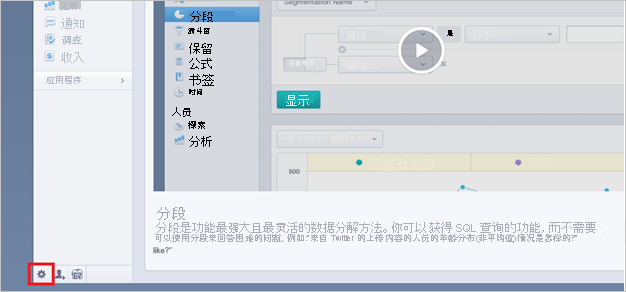
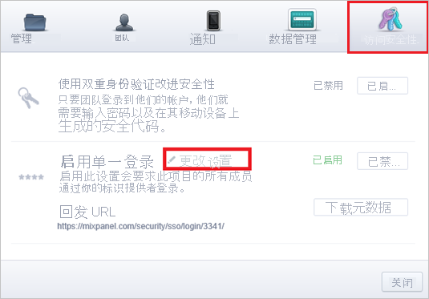
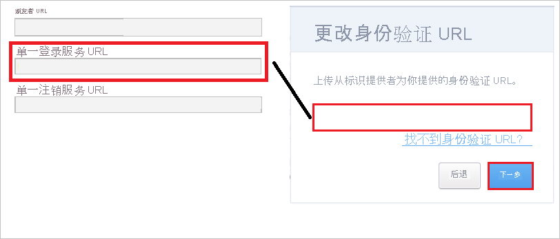
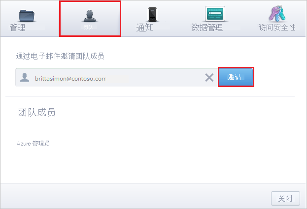

# 教程：Azure Active Directory 与 Mixpanel 的集成

本教程介绍如何将 Mixpanel 与 Azure Active Directory (Azure AD) 集成。 将 Mixpanel 与 Azure AD 集成后，可以：

* 在 Azure AD 中控制谁有权访问 Mixpanel。
* 让用户使用其 Azure AD 帐户自动登录到 Mixpanel。
* 在一个中心位置（Azure 门户）管理帐户。

## 必备条件

若要开始操作，需备齐以下项目：

* 一个 Azure AD 订阅。 如果没有订阅，可以获取一个[免费帐户](https://azure.microsoft.com/free/)。
* 启用了 Mixpanel 单一登录 (SSO) 的订阅。

## 方案描述

本教程会在测试环境中配置和测试 Azure AD 单一登录。

* Mixpanel 支持 SP 发起的 SSO。

> [!NOTE]
> 此应用程序的标识符是一个固定字符串值，因此只能在一个租户中配置一个实例。

## 从库中添加 Mixpanel

要配置 Mixpanel 与 Azure AD 的集成，需要从库中将 Mixpanel 添加到托管 SaaS 应用列表。

1. 使用工作或学校帐户或个人 Microsoft 帐户登录到 Azure 门户。
1. 在左侧导航窗格中，选择“Azure Active Directory”服务  。
1. 导航到“企业应用程序”，选择“所有应用程序”   。
1. 若要添加新的应用程序，请选择“新建应用程序”。
1. 在“从库中添加”部分的搜索框中，键入“Mixpanel” 。
1. 从结果面板中选择“Mixpanel”，然后添加该应用。 在该应用添加到租户时等待几秒钟。

## 配置并测试 Mixpanel 的 Azure AD SSO

使用名为 B.Simon 的测试用户配置和测试 Mixpanel 的 Azure AD SSO。 若要使 SSO 正常工作，需要在 Azure AD 用户与 Mixpanel 中的相关用户之间建立关联。

若要配置并测试 Mixpanel 的 Azure AD SSO，请执行以下步骤：

1. **[配置 Azure AD SSO](#configure-azure-ad-sso)** - 使用户能够使用此功能。
    1. **[创建 Azure AD 测试用户](#create-an-azure-ad-test-user)** - 使用 B. Simon 测试 Azure AD 单一登录。
    1. **[分配 Azure AD 测试用户](#assign-the-azure-ad-test-user)** - 使 B. Simon 能够使用 Azure AD 单一登录。
1. [配置 Mixpanel SSO](#configure-mixpanel-sso) - 在应用程序端配置单一登录设置。
    1. [创建 Mixpanel 测试用户](#create-mixpanel-test-user) - 在 Mixpanel 中创建 B.Simon 的对应用户，将其链接到该用户的 Azure AD 表示形式。
1. **[测试 SSO](#test-sso)** - 验证配置是否正常工作。

## 配置 Azure AD SSO

按照下列步骤在 Azure 门户中启用 Azure AD SSO。

1. 在 Azure 门户的“Mixpanel”应用程序集成页上，找到“管理”部分，选择“单一登录”。  
1. 在“选择单一登录方法”页上选择“SAML” 。
1. 在“设置 SAML 单一登录”页面上，单击“基本 SAML 配置”旁边的铅笔图标以编辑设置 。

   

4. 在“基本 SAML 配置”  部分中，执行以下步骤：

    在“登录 URL”文本框中，键入 URL：`https://mixpanel.com/login/`

    > [!NOTE]
    > 请在 [https://mixpanel.com/register/](https://mixpanel.com/register/) 注册以设置登录凭据并联系 [Mixpanel 支持团队](mailto:support@mixpanel.com)来为租户启用 SSO 设置。 如果需要，还可以从 Mixpanel 支持团队获取登录 URL。 

5. 在“使用 SAML 设置单一登录”  页上，在“SAML 签名证书”  部分中，单击“下载”  以根据要求从给定的选项下载 **证书(Base64)** 并将其保存在计算机上。

    

6. 在“设置 Mixpanel”部分，根据要求复制相应的 URL  。

    

### 创建 Azure AD 测试用户 

在本部分，我们将在 Azure 门户中创建名为 B.Simon 的测试用户。

1. 在 Azure 门户的左侧窗格中，依次选择“Azure Active Directory”、“用户”和“所有用户”  。
1. 选择屏幕顶部的“新建用户”。
1. 在“用户”属性中执行以下步骤：
   1. 在“名称”字段中，输入 `B.Simon`。  
   1. 在“用户名”字段中输入 username@companydomain.extension。 例如，`B.Simon@contoso.com` 。
   1. 选中“显示密码”复选框，然后记下“密码”框中显示的值。
   1. 单击“创建”。

### 分配 Azure AD 测试用户

在本部分中，将通过授予 B.Simon 访问 Mixpanel 的权限，允许其使用 Azure 单一登录。

1. 在 Azure 门户中，依次选择“企业应用程序”、“所有应用程序”。 
1. 在应用程序列表中，选择“Mixpanel”。 
1. 在应用的概述页中，找到“管理”部分，选择“用户和组” 。
1. 选择“添加用户”，然后在“添加分配”对话框中选择“用户和组”。
1. 在“用户和组”对话框中，从“用户”列表中选择“B.Simon”，然后单击屏幕底部的“选择”按钮。
1. 如果你希望将某角色分配给用户，可以从“选择角色”下拉列表中选择该角色。 如果尚未为此应用设置任何角色，你将看到选择了“默认访问权限”角色。
1. 在“添加分配”对话框中，单击“分配”按钮。

## 配置 Mixpanel SSO

1. 在另一个浏览器窗口中，以管理员身份登录到 Mixpanel 应用程序。

2. 在页面底部，单击左下角的小 **齿轮** 图标。 
   
     

3. 单击“访问安全性”选项卡，并单击“更改设置”。  
   
     

4. 在“更改证书”对话框页上，单击“选择文件”上传所下载的证书，然后单击“下一步”    。
   
     

5.  在“更改身份验证 URL”对话框页的“身份验证 URL”文本框中，粘贴从 Azure 门户复制的“登录 URL”的值，然后单击“下一步”    。
   
     

6. 单击“完成”  。

### 创建 Mixpanel 测试用户

本部分的目的是在 Mixpanel 中创建名为 Britta Simon 的用户。 

1. 以管理员身份登录到 Mixpanel 公司站点。

2. 在页面底部，单击左下角的小齿轮按钮以打开“设置”窗口。 

3. 单击“团队”选项卡。 

4. 在“团队成员”文本框中，键入 Britta 在 Azure 中的电子邮件地址。 
   
     

5. 单击“邀请”。  

> [!Note]
> 用户将收到一封电子邮件，要求设置配置文件。

## 测试 SSO

在本部分，你将使用以下选项测试 Azure AD 单一登录配置。 

* 在 Azure 门户中单击“测试此应用程序”。 这样将会重定向到 Mixpanel 登录 URL，可以从那里启动登录流。 

* 直接转到 Mixpanel 登录 URL，并从那里启动登录流。

* 你可使用 Microsoft 的“我的应用”。 在“我的应用”中单击 Mixpanel 磁贴时，会重定向到 Mixpanel 登录 URL。 有关“我的应用”的详细信息，请参阅[“我的应用”简介](../user-help/my-apps-portal-end-user-access.md)。

## 后续步骤

配置 Mixpanel 后，可以强制实施会话控制，实时防止组织的敏感数据外泄和渗透。 会话控制从条件访问扩展而来。 [了解如何通过 Microsoft Cloud App Security 强制实施会话控制](/cloud-app-security/proxy-deployment-aad)。