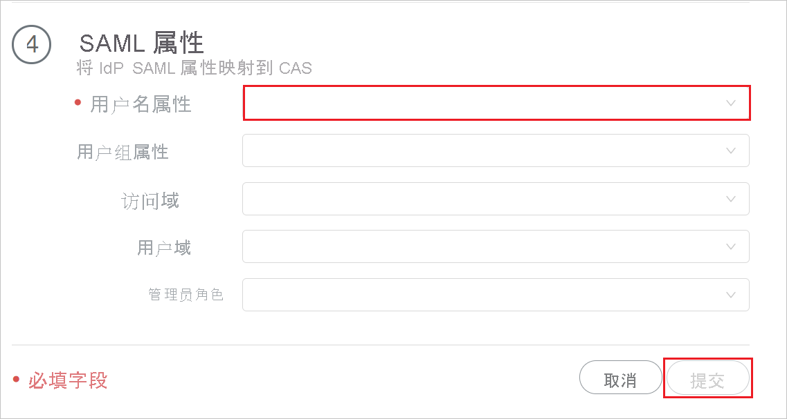

# 教程：Azure Active Directory 单一登录 (SSO) 与 Palo Alto Networks Cloud Identity Engine - Cloud Authentication Service 的集成

在本教程中，你将了解如何将 Palo Alto Networks Cloud Identity Engine - Cloud Authentication Service 与 Azure Active Directory (Azure AD) 集成。 将 Palo Alto Networks Cloud Identity Engine - Cloud Authentication Service 与 Azure AD 集成后，你可以：

* 在 Azure AD 中控制哪些人有权访问 Palo Alto Networks Cloud Identity Engine - Cloud Authentication Service。
* 让用户使用其 Azure AD 帐户自动登录到 Palo Alto Networks Cloud Identity Engine - Cloud Authentication Service。
* 在一个中心位置（Azure 门户）管理帐户。

## 必备条件

若要开始操作，需备齐以下项目：

* 一个 Azure AD 订阅。 如果没有订阅，可以获取一个[免费帐户](https://azure.microsoft.com/free/)。
* 启用单一登录 (SSO) 的 Palo Alto Networks Cloud Identity Engine - Cloud Authentication Service 订阅。

## 方案描述

本教程在测试环境中配置并测试 Azure AD SSO。

* Palo Alto Networks Cloud Identity Engine - Cloud Authentication Service 支持“SP”发起的 SSO。

* Palo Alto Networks Cloud Identity Engine - Cloud Authentication Service 支持“实时”用户预配。

## 从库中添加 Palo Alto Networks Cloud Identity Engine - Cloud Authentication Service

若要配置 Palo Alto Networks Cloud Identity Engine - Cloud Authentication Service 与 Azure AD 的集成，需要从库中将 Palo Alto Networks Cloud Identity Engine - Cloud Authentication Service 添加到托管的 SaaS 应用程序列表。

1. 使用工作或学校帐户或个人 Microsoft 帐户登录到 Azure 门户。
1. 在左侧导航窗格中，选择“Azure Active Directory”服务  。
1. 导航到“企业应用程序”，选择“所有应用程序”   。
1. 若要添加新的应用程序，请选择“新建应用程序”。
1. 在“从库中添加”部分的搜索框中，键入“Palo Alto Networks Cloud Identity Engine - Cloud Authentication Service”。
1. 从结果面板中选择“Palo Alto Networks Cloud Identity Engine - Cloud Authentication Service”，然后添加该应用程序。 在该应用添加到租户时等待几秒钟。

## 针对 Palo Alto Networks Cloud Identity Engine - Cloud Authentication Service 配置并测试 Azure AD SSO

使用名为“B.Simon”的测试用户配置并测试 Palo Alto Networks Cloud Identity Engine - Cloud Authentication Service 的 Azure AD SSO。 若要正常使用 SSO，需要在 Azure AD 用户与 Palo Alto Networks Cloud Identity Engine - Cloud Authentication Service 中的相关用户之间建立链接关系。

若要配置和测试 Palo Alto Networks Cloud Identity Engine - Cloud Authentication Service 的 Azure AD SSO，请执行以下步骤：

1. **[配置 Azure AD SSO](#configure-azure-ad-sso)** - 使用户能够使用此功能。
    1. **[创建 Azure AD 测试用户](#create-an-azure-ad-test-user)** - 使用 B. Simon 测试 Azure AD 单一登录。
    1. **[分配 Azure AD 测试用户](#assign-the-azure-ad-test-user)** - 使 B. Simon 能够使用 Azure AD 单一登录。
1. [配置 Palo Alto Networks Cloud Identity Engine - Cloud Authentication Service SSO](#configure-palo-alto-networks-cloud-identity-engine---cloud-authentication-service-sso) - 在应用程序端配置单一登录设置。
    1. [创建 Palo Alto Networks Cloud Identity Engine - Cloud Authentication Service 测试用户](#create-palo-alto-networks-cloud-identity-engine---cloud-authentication-service-test-user) - 在 Palo Alto Networks Cloud Identity Engine - Cloud Authentication Service 中拥有 B.Simon 的对应用户，且链接到 Azure AD 中的用户名称。
1. **[测试 SSO](#test-sso)** - 验证配置是否正常工作。

## 配置 Azure AD SSO

按照下列步骤在 Azure 门户中启用 Azure AD SSO。

1. 在 Azure 门户中的“Palo Alto Networks Cloud Identity Engine - Cloud Authentication Service”应用程序集成页上，找到“管理”部分并选择“单一登录”。
1. 在“选择单一登录方法”页上选择“SAML” 。
1. 在“设置 SAML 单一登录”页面上，单击“基本 SAML 配置”旁边的铅笔图标以编辑设置 。

   

1. 在“基本 SAML 配置”部分，如果有 **服务提供程序元数据文件**，请执行以下步骤：

    a. 单击“上传元数据文件”  。

    

    b. 单击“文件夹徽标”  来选择元数据文件并单击“上传”。 

    

    c. 成功上传元数据文件后，“标识符”值会自动填充在“基本 SAML 配置”部分中  。

    d. 在“登录 URL”  文本框中，使用以下模式键入 URL：`https://<RegionUrl>.paloaltonetworks.com/sp/acs`。

    > [!Note]
    > 如果“标识符”值未自动填充，请根据要求手动填充该值。 登录 URL 值不是实际值。 使用实际登录 URL 更新此值。 请联系 [Palo Alto Networks Cloud Identity Engine - Cloud Authentication Service 客户端支持团队](mailto:support@paloaltonetworks.com)获取此值。 还可以参考 Azure 门户中的“基本 SAML 配置”  部分中显示的模式。

1. Palo Alto Networks Cloud Identity Engine - Cloud Authentication Service 应用程序需要特定格式的 SAML 断言，因此，你需要在 SAML 令牌属性配置中添加自定义属性映射。 以下屏幕截图显示了默认属性的列表。

    

1. 除了上述属性，Palo Alto Networks Cloud Identity Engine - Cloud Authentication Service 应用程序还要求在 SAML 响应中传递回更多的属性，如下所示。 这些属性也是预先填充的，但可以根据要求查看它们。
    
    | 名称 | 源属性|
    | ---------------| --------- |
    | 组 |  user.groups |
    | username | user.userprincipalname |

1. 在“使用 SAML 设置单一登录”  页的“SAML 签名证书”  部分中，单击“复制”按钮，以复制“应用联合元数据 URL”  ，并将它保存在计算机上。

    

### 创建 Azure AD 测试用户

在本部分，我们将在 Azure 门户中创建名为 B.Simon 的测试用户。

1. 在 Azure 门户的左侧窗格中，依次选择“Azure Active Directory”、“用户”和“所有用户”  。
1. 选择屏幕顶部的“新建用户”。
1. 在“用户”属性中执行以下步骤：
   1. 在“名称”字段中，输入 `B.Simon`。  
   1. 在“用户名”字段中输入 username@companydomain.extension。 例如，`B.Simon@contoso.com` 。
   1. 选中“显示密码”复选框，然后记下“密码”框中显示的值。
   1. 单击“创建”。

### 分配 Azure AD 测试用户

在本部分中，我们通过授予 B.Simon 访问 Palo Alto Networks Cloud Identity Engine - Cloud Authentication Service 的权限，使其能够使用 Azure 单一登录。

1. 在 Azure 门户中，依次选择“企业应用程序”、“所有应用程序”。 
1. 在应用程序列表中，选择“Palo Alto Networks Cloud Identity Engine - Cloud Authentication Service”。
1. 在应用的概述页中，找到“管理”部分，选择“用户和组” 。
1. 选择“添加用户”，然后在“添加分配”对话框中选择“用户和组”。
1. 在“用户和组”对话框中，从“用户”列表中选择“B.Simon”，然后单击屏幕底部的“选择”按钮。
1. 如果你希望将某角色分配给用户，可以从“选择角色”下拉列表中选择该角色。 如果尚未为此应用设置任何角色，你将看到选择了“默认访问权限”角色。
1. 在“添加分配”对话框中，单击“分配”按钮。

## 配置 Palo Alto Networks Cloud Identity Engine - Cloud Authentication Service SSO

1. 以管理员身份登录 Palo Alto Networks Cloud Identity Engine - Cloud Authentication Service 公司网站。

1. 导航至“身份验证” > “标识提供者”，然后单击“添加标识提供者”。

     

1. 在“设置 SAML 身份验证”页面上，执行以下步骤。

     

    a. 在第 1 步中，单击“下载 SP 元数据”以下载元数据文件，并将其保存到计算机上。

    b. 在第 2 步中，填写必填字段，以“配置从 Azure 门户复制的标识提供者配置文件”。 

    c. 在第 3 步中，单击“测试 SAML 设置”，以验证配置文件的配置，并选择“在 IDP 上启用 MFA”。

    

    > [!NOTE]
    > 若要测试“Palo Alto Networks Cloud Identity Engine - Cloud Authentication Service”SSO，请打开“Palo Alto Networks Cloud Identity Engine - Cloud Authentication Service”控制台，然后单击“测试连接”按钮，并使用在“创建 Azure AD 测试用户”部分中创建的测试帐户进行身份验证。 

    d. 在第 4 步中，输入“用户名属性”，然后单击“提交”。 

    

### 创建 Palo Alto Networks Cloud Identity Engine - Cloud Authentication Service 测试用户

在这部分中，我们将在“Palo Alto Networks Cloud Identity Engine - Cloud Authentication Service”中创建名为 Britta Simon 的用户。 “Palo Alto Networks Cloud Identity Engine - Cloud Authentication Service”支持在默认情况下启用的实时用户预配。 此部分不存在任何操作项。 如果“Palo Alto Networks Cloud Identity Engine - Cloud Authentication Service”中不存在用户，系统会在身份验证后创建一个新用户。

## 测试 SSO 

若要测试“Palo Alto Networks Cloud Identity Engine - Cloud Authentication Service”SSO，请打开“Palo Alto Networks Cloud Identity Engine - Cloud Authentication Service”控制台，然后单击“测试连接”按钮，并使用在“创建 Azure AD 测试用户”部分中创建的测试帐户进行身份验证。

## 后续步骤

配置“Palo Alto Networks Cloud Identity Engine - Cloud Authentication Service”后，就可以强制实施会话控制，从而实时防止组织的敏感数据外泄和渗透。 会话控制从条件访问扩展而来。 [了解如何通过 Microsoft Cloud App Security 强制实施会话控制](/cloud-app-security/proxy-deployment-aad)。
