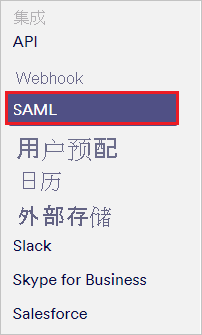
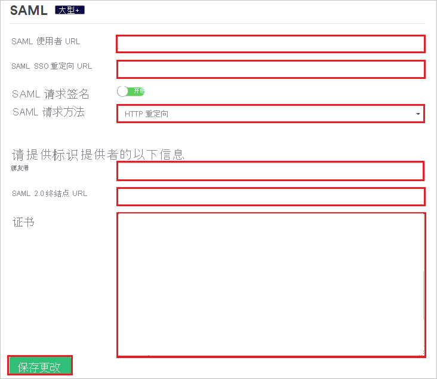
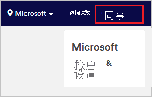
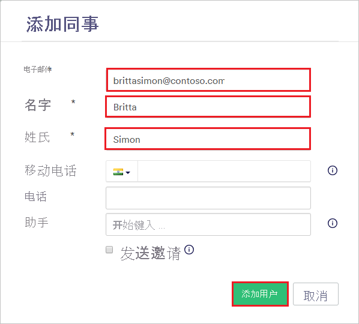

# 教程：Azure Active Directory 与 Proxyclick 的集成

本教程介绍如何将 Proxyclick 与 Azure Active Directory (Azure AD) 集成。 将 Proxyclick 与 Azure AD 集成后，你可以：

* 在 Azure AD 中控制谁有权访问 Proxyclick。
* 让用户可使用其 Azure AD 帐户自动登录到 Proxyclick。
* 在一个中心位置（Azure 门户）管理帐户。

## 先决条件

若要开始操作，需备齐以下项目：

* 一个 Azure AD 订阅。 如果没有订阅，可以获取一个[免费帐户](https://azure.microsoft.com/free/)。
* 已启用 Proxyclick 单一登录 (SSO) 的订阅。

## 方案描述

本教程在测试环境中配置并测试 Azure AD 单一登录。

* Proxyclick 支持 SP 和 IdP 发起的 SSO。

## 从库中添加 Proxyclick

若要配置 Proxyclick 与 Azure AD 的集成，需要从库中将 Proxyclick 添加到托管 SaaS 应用列表。

1. 使用工作或学校帐户或个人 Microsoft 帐户登录到 Azure 门户。
1. 在左侧导航窗格中，选择“Azure Active Directory”服务  。
1. 导航到“企业应用程序”，选择“所有应用程序”   。
1. 若要添加新的应用程序，请选择“新建应用程序”  。
1. 在“从库中添加”部分的搜索框中，键入“Proxyclick” 。
1. 从结果面板中选择“Proxyclick”，然后添加该应用。 在该应用添加到租户时等待几秒钟。

## 配置并测试 Proxyclick 的 Azure AD SSO

使用名为 B.Simon 的测试用户配置并测试 Proxyclick 的 Azure AD SSO。 若要使 SSO 正常工作，需要在 Azure AD 用户与 Proxyclick 中的相关用户之间建立关联。

若要配置并测试 Proxyclick 的 Azure AD SSO，请执行以下步骤：

1. **[配置 Azure AD SSO](#configure-azure-ad-sso)** - 使用户能够使用此功能。
    1. **[创建 Azure AD 测试用户](#create-an-azure-ad-test-user)** - 使用 B. Simon 测试 Azure AD 单一登录。
    1. **[分配 Azure AD 测试用户](#assign-the-azure-ad-test-user)** - 使 B. Simon 能够使用 Azure AD 单一登录。
1. **[配置 Proxyclick SSO](#configure-proxyclick-sso)** - 在应用程序端配置单一登录设置。
    1. **[创建 Proxyclick 测试用户](#create-proxyclick-test-user)** - 在 Proxyclick 中创建 B.Simon 的对应用户，并将其链接到该用户的 Azure AD 表示形式。
1. **[测试 SSO](#test-sso)** - 验证配置是否正常工作。

## 配置 Azure AD SSO

按照下列步骤在 Azure 门户中启用 Azure AD SSO。

1. 在 Azure 门户中的 Proxyclick 应用程序集成页上，找到“管理”部分并选择“单一登录”  。
1. 在“选择单一登录方法”页上选择“SAML” 。
1. 在“设置 SAML 单一登录”页面上，单击“基本 SAML 配置”旁边的铅笔图标以编辑设置 。

   

4. 若要在 IdP 发起的模式下配置应用程序，请在“基本 SAML 配置”对话框中执行以下步骤。
    
    a. 在“标识符”框中，使用以下模式键入 URL：`https://saml.proxyclick.com/init/<COMPANY_ID>`

    b. 在“回复 URL”框中，用以下模式键入 URL：`https://saml.proxyclick.com/consume/<COMPANY_ID>`

5. 如果要在 SP 发起的模式下配置应用程序，选择“设置其他 URL”。 在“登录 URL”文本框中，键入使用以下模式的 URL： 
   
   `https://saml.proxyclick.com/init/<COMPANY_ID>`

    > [!NOTE]
    > 这些值是占位符。 需要使用实际的标识符、回复 URL 和登录 URL。 获取这些值的步骤稍后在本教程中介绍。

6. 在“设置 SAML 单一登录”页的“SAML 签名证书”部分中，选择“证书(Base64)”旁的“下载”链接（根据要求），并将证书保存在计算机上   ：

    

7. 在“设置 Proxyclick”部分，根据要求复制相应的 URL：

    

### 创建 Azure AD 测试用户

在本部分，我们将在 Azure 门户中创建名为 B.Simon 的测试用户。

1. 在 Azure 门户的左侧窗格中，依次选择“Azure Active Directory”、“用户”和“所有用户”  。
1. 选择屏幕顶部的“新建用户”。
1. 在“用户”属性中执行以下步骤：
   1. 在“名称”字段中，输入 `B.Simon`。  
   1. 在“用户名”字段中输入 username@companydomain.extension。 例如，`B.Simon@contoso.com`。
   1. 选中“显示密码”复选框，然后记下“密码”框中显示的值。
   1. 单击“创建”。

### 分配 Azure AD 测试用户

本部分将授予 B.Simon 访问 Proxyclick 的权限，使其能够使用 Azure 单一登录。

1. 在 Azure 门户中，依次选择“企业应用程序”、“所有应用程序”。  
1. 在应用程序列表中，选择“Proxyclick”。
1. 在应用的概述页中，找到“管理”部分，选择“用户和组”   。
1. 选择“添加用户”，然后在“添加分配”对话框中选择“用户和组”。
1. 在“用户和组”对话框中，从“用户”列表中选择“B.Simon”，然后单击屏幕底部的“选择”按钮。
1. 如果你希望将某角色分配给用户，可以从“选择角色”下拉列表中选择该角色。 如果尚未为此应用设置任何角色，你将看到选择了“默认访问权限”角色。
1. 在“添加分配”对话框中，单击“分配”按钮。  

## 配置 Proxyclick SSO

1. 在新的 Web 浏览器窗口中，以管理员身份登录到 Proxyclick 公司站点。

2. 选择“帐户与设置”。

    

3. 向下滚动到“集成”部分，选择“SAML” 。

    

4. 在“SAML”部分，执行以下步骤。

    

    1. 复制“SAML 使用者 URL”值，将其粘贴到 Azure 门户的“基本 SAML 配置”对话框的“回复 URL”框中。

    1. 复制“SAML SSO 重定向 URL”值，将其粘贴到 Azure 门户的“基本 SAML 配置”对话框的“登录 URL”和“标识符”框中。

    1. 在“SAML 请求方法”列表中，选择“HTTP 重定向”。

    1. 在“颁发者”框中，粘贴从 Azure 门户复制的“Azure AD 标识符”值。

    1. 在“SAML 2.0 终结点 URL”框中，粘贴从 Azure 门户复制的“登录 URL”值 。

    1. 在记事本中，打开从 Azure 门户下载的证书文件。 将此文件的内容粘贴到“证书”框中。

    1. 选择“保存更改”。 

### 创建 Proxyclick 测试用户

若要使 Azure AD 用户能够登录到 Proxyclick，需要将其添加到 Proxyclick 中。 需要手动添加它们。

若要创建用户帐户，请执行以下步骤：

1. 以管理员身份登录到 Proxyclick 公司站点。

1. 选择窗口顶部的“同事”。

    

1. 选择“添加同事”。

    

1. 在“添加同事”部分中，执行以下步骤。

    

    1. 在“电子邮件”  框中，输入用户的电子邮件地址。 在此示例中为 **brittasimon\@contoso.com**。

    1. 在“名字”框中，输入用户的名字。 在此示例中为 **Britta**。

    1. 在“姓氏”框中，输入用户的姓氏。 在此示例中为 **Simon**。

    1. 选择“添加用户”。 

## 测试 SSO

在本部分，你将使用以下选项测试 Azure AD 单一登录配置。 

#### SP 启动的：

* 在 Azure 门户中单击“测试此应用程序”。 这会重定向到 Proxyclick 登录 URL，可在其中启动登录流。  

* 直接转到 Proxyclick 登录 URL，并从那里启动登录流。

#### IDP 启动的：

* 在 Azure 门户中单击“测试此应用程序”后，你应会自动登录到为其设置了 SSO 的 Proxyclick。 

还可以使用 Microsoft“我的应用”在任何模式下测试此应用程序。 在“我的应用”中单击“Proxyclick”磁贴时，如果是在 SP 模式下配置的，你会被重定向到应用程序登录页来启动登录流；如果是在 IDP 模式下配置的，你应会自动登录到为其设置了 SSO 的 Proxyclick。 有关“我的应用”的详细信息，请参阅[“我的应用”简介](../user-help/my-apps-portal-end-user-access.md)。

## 后续步骤

配置 Proxyclick 后，即可强制实施会话控制，实时防止组织的敏感数据外泄和渗透。 会话控制从条件访问扩展而来。 [了解如何通过 Microsoft Cloud App Security 强制实施会话控制](/cloud-app-security/proxy-deployment-aad)。