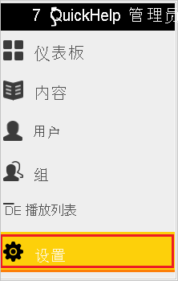
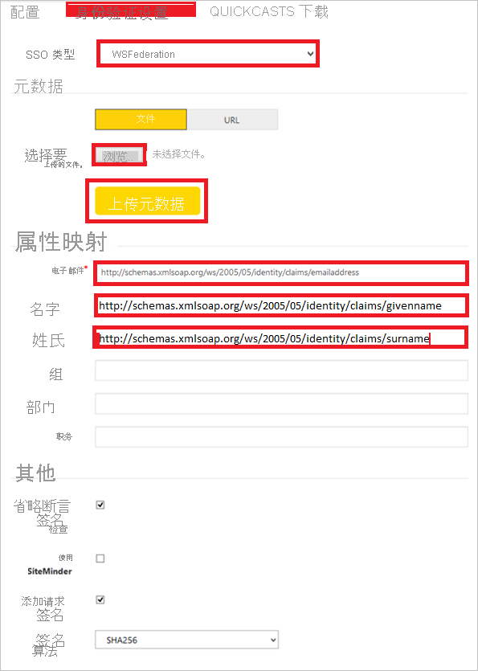

# 教程：Azure Active Directory 与 QuickHelp 集成

本教程介绍如何将 QuickHelp 与 Azure Active Directory (Azure AD) 集成。 将 QuickHelp 与 Azure AD 集成后，可以：

* 在 Azure AD 中控制谁有权访问 QuickHelp。
* 让用户使用其 Azure AD 帐户自动登录到 QuickHelp。
* 在一个中心位置（Azure 门户）管理帐户。

## 必备条件

若要开始操作，需备齐以下项目：

* 一个 Azure AD 订阅。 如果没有订阅，可以获取一个[免费帐户](https://azure.microsoft.com/free/)。
* 已启用 QuickHelp 单一登录 (SSO) 的订阅。

## 方案描述

本教程会在测试环境中配置和测试 Azure AD 单一登录。

* QuickHelp 支持 SP 发起的 SSO。

* QuickHelp 支持实时用户预配。

> [!NOTE]
> 此应用程序的标识符是一个固定字符串值，因此只能在一个租户中配置一个实例。

## 从库中添加 QuickHelp

要配置 QuickHelp 与 Azure AD 的集成，需要从库中将 QuickHelp 添加到托管 SaaS 应用列表。

1. 使用工作或学校帐户或个人 Microsoft 帐户登录到 Azure 门户。
1. 在左侧导航窗格中，选择“Azure Active Directory”服务  。
1. 导航到“企业应用程序”，选择“所有应用程序”   。
1. 若要添加新的应用程序，请选择“新建应用程序”。
1. 在“从库中添加”部分的搜索框中，键入“QuickHelp” 。
1. 从结果面板中选择“QuickHelp”，然后添加该应用。 在该应用添加到租户时等待几秒钟。

## 配置并测试 QuickHelp 的 Azure AD SSO

使用名为 B.Simon 的测试用户配置并测试 QuickHelp 的 Azure AD SSO。 若要使 SSO 正常工作，需要在 Azure AD 用户与 QuickHelp 中的相关用户之间建立关联。

若要配置并测试 QuickHelp 的 Azure AD SSO，请执行以下步骤：

1. **[配置 Azure AD SSO](#configure-azure-ad-sso)** - 使用户能够使用此功能。
    1. **[创建 Azure AD 测试用户](#create-an-azure-ad-test-user)** - 使用 B. Simon 测试 Azure AD 单一登录。
    1. **[分配 Azure AD 测试用户](#assign-the-azure-ad-test-user)** - 使 B. Simon 能够使用 Azure AD 单一登录。
1. **[配置 QuickHelp SSO](#configure-quickhelp-sso)** - 在应用程序端配置单一登录设置。
    1. **[创建 QuickHelp 测试用户](#create-quickhelp-test-user)** - 在 QuickHelp 中创建 B.Simon 的对应用户，并将其关联到其在 Azure AD 中的表示形式。
1. **[测试 SSO](#test-sso)** - 验证配置是否正常工作。

## 配置 Azure AD SSO

按照下列步骤在 Azure 门户中启用 Azure AD SSO。

1. 在 Azure 门户中的“QuickHelp”应用程序集成页上，找到“管理”部分并选择“单一登录”。  
1. 在“选择单一登录方法”页上选择“SAML” 。
1. 在“设置 SAML 单一登录”页面上，单击“基本 SAML 配置”旁边的铅笔图标以编辑设置 。

   

4. 在“基本 SAML 配置”部分中，按照以下步骤操作：

    a. 在“标识符(实体 ID)”文本框中，键入 URL：`https://auth.quickhelp.com` 

    b. 在“登录 URL”文本框中，使用以下模式键入 URL：`https://quickhelp.com/<ROUTE_URL>` 

    > [!NOTE]
    > 登录 URL 值不是实际值。 请使用实际登录 URL 更新此值。 联系组织的 QuickHelp 管理员或 BrainStorm 客户成功经理以获取此值。 还可以参考 Azure 门户中的“基本 SAML 配置”  部分中显示的模式。

5. 在“使用 SAML 设置单一登录”页的“SAML 签名证书”部分，单击“下载”以根据要求下载从给定选项提供的“联合元数据 XML”并将其保存在计算机上     。

    

6. 在“设置 QuickHelp”部分，根据要求复制相应的 URL。 

    

### 创建 Azure AD 测试用户 

在本部分，我们将在 Azure 门户中创建名为 B.Simon 的测试用户。

1. 在 Azure 门户的左侧窗格中，依次选择“Azure Active Directory”、“用户”和“所有用户”  。
1. 选择屏幕顶部的“新建用户”。
1. 在“用户”属性中执行以下步骤：
   1. 在“名称”字段中，输入 `B.Simon`。  
   1. 在“用户名”字段中输入 username@companydomain.extension。 例如，`B.Simon@contoso.com` 。
   1. 选中“显示密码”复选框，然后记下“密码”框中显示的值。
   1. 单击“创建”。

### 分配 Azure AD 测试用户

在本部分，你将通过授予 B.Simon 访问 QuickHelp 的权限，支持其使用 Azure 单一登录。

1. 在 Azure 门户中，依次选择“企业应用程序”、“所有应用程序”。 
1. 在应用程序列表中，选择“QuickHelp”  。
1. 在应用的概述页中，找到“管理”部分，选择“用户和组” 。
1. 选择“添加用户”，然后在“添加分配”对话框中选择“用户和组”。
1. 在“用户和组”对话框中，从“用户”列表中选择“B.Simon”，然后单击屏幕底部的“选择”按钮。
1. 如果你希望将某角色分配给用户，可以从“选择角色”下拉列表中选择该角色。 如果尚未为此应用设置任何角色，你将看到选择了“默认访问权限”角色。
1. 在“添加分配”对话框中，单击“分配”按钮。

## 配置 QuickHelp SSO

1. 以管理员身份登录到 QuickHelp 公司站点。

2. 在顶部菜单中，单击“管理员”。 
   
    

3. 在“QuickHelp 管理员”  菜单上，单击“设置”  。
   
    

4. 单击“身份验证设置”  。

5. 在“身份验证设置”页上，执行以下步骤。
   
    
   
    a. 对于“SSO 类型”，选择“WSFederation”   。
   
    b. 要上载已下载的 Azure 元数据文件，请单击“浏览”  ，导航到该文件，并单击“上载元数据”  。
   
    c. 在“电子邮件”文本框中，键入 `http://schemas.xmlsoap.org/ws/2005/05/identity/claims/emailaddress`。
   
    d. 在“名字”文本框中，`type http://schemas.xmlsoap.org/ws/2005/05/identity/claims/givenname`。
   
    e. 在“姓氏”文本框中，`type http://schemas.xmlsoap.org/ws/2005/05/identity/claims/surname`。
   
    f. 在“操作栏”  中，单击“保存”  。

### 创建 QuickHelp 测试用户

在本部分，我们将在 QuickHelp 中创建名为 Britta Simon 的用户。 QuickHelp 支持默认已启用的实时用户预配。 此部分不存在任何操作项。 如果 QuickHelp 中尚不存在用户，身份验证后会创建一个新用户。

## 测试 SSO 

在本部分，你将使用以下选项测试 Azure AD 单一登录配置。 

* 在 Azure 门户中单击“测试此应用程序”。 这会重定向到 QuickHelp 登录 URL，可以在其中启动登录流。 

* 直接转到 QuickHelp 登录 URL，并从那里启动登录流。

* 你可使用 Microsoft 的“我的应用”。 单击“我的应用”中的 QuickHelp 磁贴时，将会重定向到 QuickHelp 登录 URL。 有关“我的应用”的详细信息，请参阅[“我的应用”简介](../user-help/my-apps-portal-end-user-access.md)。

## 后续步骤

配置 QuickHelp 后，可以强制实施会话控制，实时防止组织的敏感数据外泄和渗透。 会话控制从条件访问扩展而来。 [了解如何通过 Microsoft Cloud App Security 强制实施会话控制](/cloud-app-security/proxy-deployment-aad)。
