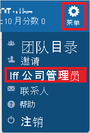
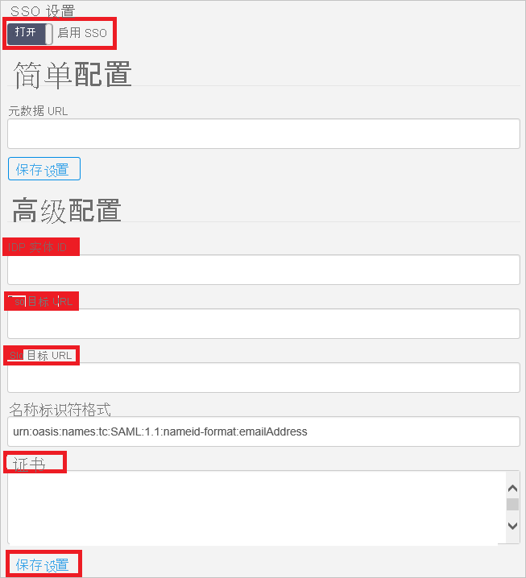

# 教程：Azure Active Directory 与 Recognize 集成

本教程介绍如何将 Recognize 与 Azure Active Directory (Azure AD) 集成。 将 Recognize 与 Azure AD 集成后，可以：

* 在 Azure AD 中控制谁有权访问 Recognize。
* 让用户使用其 Azure AD 帐户自动登录到 Recognize。
* 在一个中心位置（Azure 门户）管理帐户。

## 必备条件

若要开始操作，需备齐以下项目：

* 一个 Azure AD 订阅。 如果没有订阅，可以获取一个[免费帐户](https://azure.microsoft.com/free/)。
* 已启用 Recognize 单一登录 (SSO) 的订阅。

## 方案描述

本教程会在测试环境中配置和测试 Azure AD 单一登录。

* Recognize 支持 SP 发起的 SSO。

## 从库中添加 Recognize

要配置 Recognize 与 Azure AD 的集成，需要从库中将 Recognize 添加到托管 SaaS 应用列表。

1. 使用工作或学校帐户或个人 Microsoft 帐户登录到 Azure 门户。
1. 在左侧导航窗格中，选择“Azure Active Directory”服务  。
1. 导航到“企业应用程序”，选择“所有应用程序”   。
1. 若要添加新的应用程序，请选择“新建应用程序”。
1. 在“从库中添加”部分的搜索框中，键入“Recognize”。
1. 在结果面板中选择“Recognize”，然后添加该应用。 在该应用添加到租户时等待几秒钟。

## 配置并测试 Recognize 的 Azure AD SSO

使用名为 B.Simon 的测试用户配置并测试 Recognize 的 Azure AD SSO。 若要使 SSO 正常工作，需要在 Azure AD 用户与 Recognize 中的相关用户之间建立关联。

若要配置并测试 Recognize 的 Azure AD SSO，请执行以下步骤：

1. **[配置 Azure AD SSO](#configure-azure-ad-sso)** - 使用户能够使用此功能。
    1. **[创建 Azure AD 测试用户](#create-an-azure-ad-test-user)** - 使用 B. Simon 测试 Azure AD 单一登录。
    1. **[分配 Azure AD 测试用户](#assign-the-azure-ad-test-user)** - 使 B. Simon 能够使用 Azure AD 单一登录。
1. [配置 Recognize SSO](#configure-recognize-sso) - 在应用程序端配置单一登录设置。
    1. [创建 Recognize 测试用户](#create-recognize-test-user) - 在 Recognize 中创建 B.Simon 的对应用户，并将其关联到用户的 Azure AD 表示形式。
1. **[测试 SSO](#test-sso)** - 验证配置是否正常工作。

## 配置 Azure AD SSO

按照下列步骤在 Azure 门户中启用 Azure AD SSO。

1. 在 Azure 门户的 Recognize 应用程序集成页上，找到“管理”部分并选择“单一登录”。
1. 在“选择单一登录方法”页上选择“SAML” 。
1. 在“设置 SAML 单一登录”页面上，单击“基本 SAML 配置”旁边的铅笔图标以编辑设置 。

   

4. 在“基本 SAML 配置”  部分，如果有 **服务提供程序元数据文件**，请执行以下步骤：

    >[!NOTE]
    >本教程的“配置 Cisco Webex Meetings 单一登录”部分会提供“服务提供程序元数据文件”。  

    a. 单击“上传元数据文件”  。

    

    b. 单击“文件夹徽标”  来选择元数据文件并单击“上传”。 

    

    c. 成功上传元数据文件后，“标识符”值会自动填充在“基本 SAML 配置”部分中。 

     在“登录 URL”文本框中，使用以下模式键入 URL：`https://recognizeapp.com/<YOUR_DOMAIN>/saml/sso`

    > [!Note]
    > 如果“标识符”值未自动填充，可通过打开“SSO 设置”部分的“服务提供程序元数据 URL”来获取“标识符”值，本教程的“配置 Recognize 单一登录”部分会对此予以介绍。   登录 URL 值不是实际值。 请使用实际登录 URL 更新此值。 请联系 [Recognize 客户端支持团队](mailto:support@recognizeapp.com)获取该值。 还可以参考 Azure 门户中的“基本 SAML 配置”  部分中显示的模式。

5. 在“使用 SAML 设置单一登录”  页上，在“SAML 签名证书”  部分中，单击“下载”  以根据要求从给定的选项下载 **证书(Base64)** 并将其保存在计算机上。

    

6. 在“设置 Recognize”部分，根据要求复制相应的 URL  。

    

### 创建 Azure AD 测试用户 

在本部分，我们将在 Azure 门户中创建名为 B.Simon 的测试用户。

1. 在 Azure 门户的左侧窗格中，依次选择“Azure Active Directory”、“用户”和“所有用户”  。
1. 选择屏幕顶部的“新建用户”。
1. 在“用户”属性中执行以下步骤：
   1. 在“名称”字段中，输入 `B.Simon`。  
   1. 在“用户名”字段中输入 username@companydomain.extension。 例如，`B.Simon@contoso.com` 。
   1. 选中“显示密码”复选框，然后记下“密码”框中显示的值。
   1. 单击“创建”。

### 分配 Azure AD 测试用户

在本部分，你将通过授予 B.Simon 访问 Recognize 的权限，使其能够使用 Azure 单一登录。

1. 在 Azure 门户中，依次选择“企业应用程序”、“所有应用程序”。 
1. 在应用程序列表中，选择“Recognize”  。
1. 在应用的概述页中，找到“管理”部分，选择“用户和组” 。
1. 选择“添加用户”，然后在“添加分配”对话框中选择“用户和组”。
1. 在“用户和组”对话框中，从“用户”列表中选择“B.Simon”，然后单击屏幕底部的“选择”按钮。
1. 如果你希望将某角色分配给用户，可以从“选择角色”下拉列表中选择该角色。 如果尚未为此应用设置任何角色，你将看到选择了“默认访问权限”角色。
1. 在“添加分配”对话框中，单击“分配”按钮。

## 配置 Recognize SSO

1. 在另一个 Web 浏览器窗口中，以管理员身份登录到 Recognize 租户。

2. 在右上角，单击“菜单”  。 转到“公司管理员”  。
   
    

3. 在左侧导航窗格上，单击“设置”。 
   
    

4. 在“SSO 设置”部分中执行以下步骤  。
   
    
    
    a. 对于“启用 SSO”，选择“启用”   。

    b. 在“IDP 实体 ID”文本框中，粘贴从 Azure 门户复制的“Azure AD 标识符”值   。
    
    c. 在“SSO 目标 URL”文本框中，粘贴从 Azure 门户复制的“登录 URL”值   。
    
    d. 在“SLO 目标 URL”文本框中，粘贴从 Azure 门户复制的“注销 URL”值   。 
    
    e. 在记事本中打开下载的“证书(Base64)”文件，将其内容复制到剪贴板，然后将其粘贴到“证书”文本框中   。
    
    f. 单击“保存设置”  按钮。 

5. 在“SSO 设置”  部分旁边，复制“服务提供程序元数据 url”下的 URL  。
   
    

6. 在空白浏览器下打开“元数据 URL 链接”以下载元数据文档  。 从文件复制 EntityDescriptor 值 (entityID)，并将其粘贴到 Azure 门户上的“基本 SAML 配置”中的“标识符”文本框   。
    
    

### 创建 Recognize 测试用户

要使 Azure AD 用户能够登录 Recognize，必须将这些用户预配到 Recognize 中。 对于 Recognize，预配是一项手动任务。

此应用不支持 SCIM 预配，但具有替代的可预配用户的用户同步。 

**若要预配用户帐户，请执行以下步骤：**

1. 以管理员身份登录到 Recognize 公司站点。

2. 在右上角，单击“菜单”  。 转到“公司管理员”  。

3. 在左侧导航窗格上，单击“设置”。 

4. 在“用户同步”  部分中，执行以下步骤。
   
    
   
    a. 对于“启用同步”  ，选择“启用”  。
   
    b. 对于“选择同步提供程序”  ，选择“Microsoft/Office 365”  。
   
    c. 单击“运行用户同步”  。

## 测试 SSO 

在本部分，你将使用以下选项测试 Azure AD 单一登录配置。 

* 在 Azure 门户中单击“测试此应用程序”。 这会重定向到 Recognize 登录 URL，你可以从那里启动登录流。 

* 直接转到 Recognize 登录 URL，并从那里启动登录流。

* 你可使用 Microsoft 的“我的应用”。 单击“我的应用”中的 Recognize 磁贴时，会重定向到 Recognize 登录 URL。 有关“我的应用”的详细信息，请参阅[“我的应用”简介](../user-help/my-apps-portal-end-user-access.md)。

## 后续步骤

配置 Recognize 后，可以强制实施会话控制，实时防止组织的敏感数据外泄和渗透。 会话控制从条件访问扩展而来。 [了解如何通过 Microsoft Cloud App Security 强制实施会话控制](/cloud-app-security/proxy-deployment-aad)。
