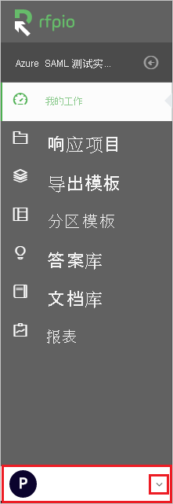
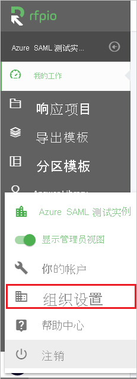
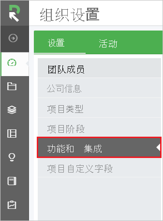
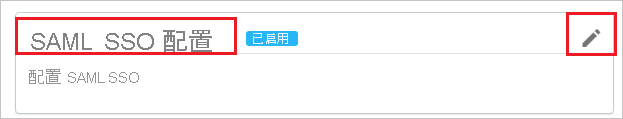
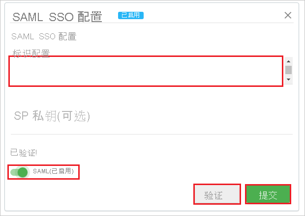
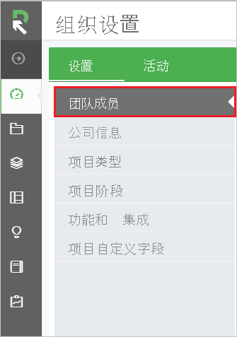
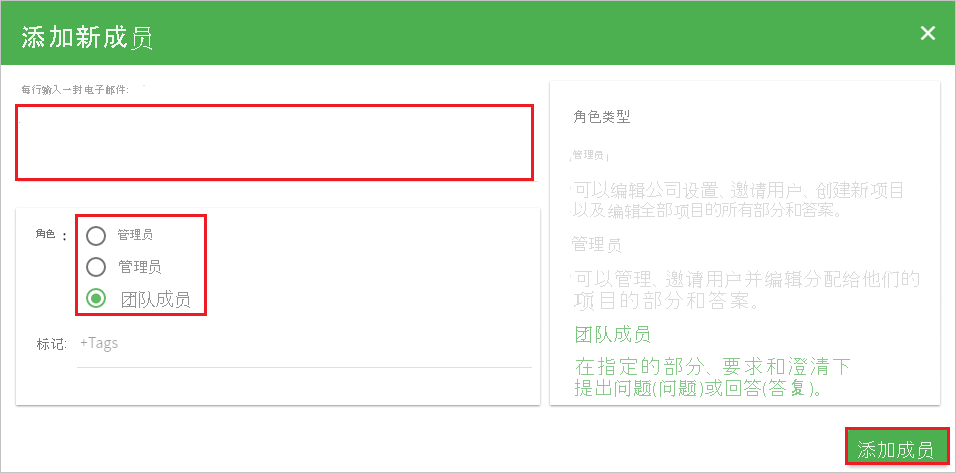

# 教程：Azure AD SSO 与 RFPIO 集成

本教程介绍如何将 RFPIO 与 Azure Active Directory (Azure AD) 集成。 将 RFPIO 与 Azure AD 集成后，可以：

* 在 Azure AD 中控制谁有权访问 RFPIO。
* 让用户使用其 Azure AD 帐户自动登录到 RFPIO。
* 在一个中心位置（Azure 门户）管理帐户。

## 必备条件

若要配置 Azure AD 与 RFPIO 的集成，需要以下项目：

* 一个 Azure AD 订阅。 如果没有 Azure AD 环境，可以获取一个[免费帐户](https://azure.microsoft.com/free/)。
* 启用了 RFPIO 单一登录的订阅。

## 方案描述

本教程会在测试环境中配置和测试 Azure AD 单一登录。

* RFPIO 支持启用了 SP 和 IDP 的 SSO。

* RFPIO 支持[自动用户预配](rfpio-provisioning-tutorial.md)。

> [!NOTE]
> 此应用程序的标识符是一个固定字符串值，因此只能在一个租户中配置一个实例。

## 从库中添加 RFPIO

若要配置 RFPIO 与 Azure AD 的集成，需要从库中将 RFPIO 添加到托管 SaaS 应用列表。

1. 使用工作或学校帐户或个人 Microsoft 帐户登录到 Azure 门户。
1. 在左侧导航窗格中，选择“Azure Active Directory”服务  。
1. 导航到“企业应用程序”，选择“所有应用程序”   。
1. 若要添加新的应用程序，请选择“新建应用程序”  。
1. 在“从库中添加”部分的搜索框中，键入“RFPIO” 。
1. 从结果面板中选择“RFPIO”，然后添加该应用。 在该应用添加到租户时等待几秒钟。

## 配置并测试 RFPIO 的 Azure AD SSO

使用名为 B.Simon 的测试用户配置并测试 RFPIO 的 Azure AD SSO。 若要正常使用 SSO，需要在 Azure AD 用户与 RFPIO 中的相关用户之间建立链接关系。

若要配置并测试 RFPIO 的 Azure AD SSO，请执行以下步骤：

1. **[配置 Azure AD SSO](#configure-azure-ad-sso)** - 使用户能够使用此功能。
    1. **[创建 Azure AD 测试用户](#create-an-azure-ad-test-user)** - 使用 B. Simon 测试 Azure AD 单一登录。
    1. **[分配 Azure AD 测试用户](#assign-the-azure-ad-test-user)** - 使 B. Simon 能够使用 Azure AD 单一登录。
1. [配置 RFPIO SSO](#configure-rfpio-sso) - 在应用程序端配置单一登录设置。
    1. [创建 RFPIO 测试用户](#create-rfpio-test-user) - 在 RFPIO 中创建对应的 B.Simon 用户，该用户链接到其 Azure AD 用户。
1. **[测试 SSO](#test-sso)** - 验证配置是否正常工作。

## 配置 Azure AD SSO

按照下列步骤在 Azure 门户中启用 Azure AD SSO。

1. 在 Azure 门户中的“RFPIO”应用程序集成页上，找到“管理”部分并选择“单一登录”  。
1. 在“选择单一登录方法”页上选择“SAML” 。
1. 在“设置 SAML 单一登录”页面上，单击“基本 SAML 配置”旁边的铅笔图标以编辑设置 。

   

1. 如果要在 **IDP** 发起的模式下配置应用程序，请在“基本 SAML 配置”部分执行以下步骤： 

    a. 在“标识符”文本框中键入 URL：`https://www.rfpio.com`

    b. 单击“设置其他 URL”  。

    c. 在“中继状态”文本框中输入的字符串值  。 请联系 [RFPIO 支持团队](https://www.rfpio.com/contact/)获取此值。

1. 如果要在 SP  发起的模式下配置应用程序，请单击“设置其他 URL”  ，并执行以下步骤：

    在“登录 URL”文本框中，键入 URL：`https://www.app.rfpio.com`

1. RFPIO 应用程序需要特定格式的 SAML 断言，这要求将自定义属性映射添加到 SAML 令牌属性配置。 以下屏幕截图显示了默认属性的列表。

    

1. 除了上述属性，RFPIO 应用程序还要求在 SAML 响应中传递回更多的属性，如下所示。 这些属性也是预先填充的，但可以根据要求查看它们。

    | 名称 | 源属性|
    | ------- | --------- |
    | first_name | user.givenname |
    | last_name | user.surname |

1. 在“使用 SAML 设置单一登录”页的“SAML 签名证书”部分，单击“下载”以根据要求下载从给定选项提供的“联合元数据 XML”并将其保存在计算机上     。

    

1. 在“设置 RFPIO”部分，根据要求复制相应 URL  。

    

### 创建 Azure AD 测试用户

在本部分，我们将在 Azure 门户中创建名为 B.Simon 的测试用户。

1. 在 Azure 门户的左侧窗格中，依次选择“Azure Active Directory”、“用户”和“所有用户”  。
1. 选择屏幕顶部的“新建用户”。
1. 在“用户”属性中执行以下步骤：
   1. 在“名称”字段中，输入 `B.Simon`。  
   1. 在“用户名”字段中输入 username@companydomain.extension。 例如，`B.Simon@contoso.com`。
   1. 选中“显示密码”复选框，然后记下“密码”框中显示的值。
   1. 单击“创建”。

### 分配 Azure AD 测试用户

在本部分中，你将通过授予 B.Simon 访问 RFPIO 的权限，允许其使用 Azure 单一登录。

1. 在 Azure 门户中，依次选择“企业应用程序”、“所有应用程序”。  
1. 在应用程序列表中，选择“RFPIO”  。
1. 在应用的概述页中，找到“管理”部分，选择“用户和组”   。
1. 选择“添加用户”，然后在“添加分配”对话框中选择“用户和组”。
1. 在“用户和组”对话框中，从“用户”列表中选择“B.Simon”，然后单击屏幕底部的“选择”按钮。
1. 如果你希望将某角色分配给用户，可以从“选择角色”下拉列表中选择该角色。 如果尚未为此应用设置任何角色，你将看到选择了“默认访问权限”角色。
1. 在“添加分配”对话框中，单击“分配”按钮。  

## 配置 RFPIO SSO

1. 在另一个 Web 浏览器窗口中，以管理员身份登录到 RFPIO 网站  。

1. 单击左下角的下拉列表。

    

1. 单击“组织设置”  。 

    

1. 单击“功能和集成”  。

    

1. 在 SAML SSO 配置中，单击“编辑”   。

    

1. 在本部分中，执行以下操作：

    
    
    a. 复制下载的元数据 XML 文件的内容，然后将其粘贴到“标识配置”字段   。

    > [!NOTE]
    > 要复制下载的联合元数据 XML 的内容，请使用“Notepad++”或“XML 编辑器”    。

    b. 单击 **“验证”** 。

    c. 单击“验证”后，将“SAML(启用)”改为“开启”   。

    d. 单击“提交”  。

### 创建 RFPIO 测试用户

1. 以管理员身份登录到 RFPIO 公司站点。

1. 单击左下角的下拉列表。

    

1. 单击“组织设置”  。 

    

1. 单击“团队成员”  。

    

1. 单击“添加成员”  。

    

1. 在“添加新成员”部分  。 执行以下操作：

    

    a. 在“每行输入一个电子邮件”字段输入电子邮件地址   。

    b. 根据需要选择“角色”  。

    c. 单击“添加成员”  。

    > [!NOTE]
    > Azure Active Directory 帐户持有者将收到一封电子邮件，其中包含用于在激活帐户前确认帐户的链接。

> [!NOTE]
> RFPIO 还支持自动用户预配；有关如何配置自动用户预配的更多详细信息，请参阅[此处](./rfpio-provisioning-tutorial.md)。  

## 测试 SSO

在本部分，你将使用以下选项测试 Azure AD 单一登录配置。 

#### SP 启动的：

* 在 Azure 门户中单击“测试此应用程序”。 这会重定向到 RFPIO 登录 URL，你可以在那里启动登录流。  

* 直接转到 RFPIO 登录 URL，并从那里启动登录流。

#### IDP 启动的：

* 在 Azure 门户中单击“测试此应用程序”后，你应会自动登录到为其设置了 SSO 的 RFPIO。 

还可以使用 Microsoft“我的应用”在任何模式下测试此应用程序。 单击“我的应用”中的“RFPIO”磁贴时，如果是在 SP 模式下配置的，你会被重定向到应用程序登录页来启动登录流；如果是在 IDP 模式下配置的，则会自动登录到为其设置了 SSO 的 RFPIO。 有关“我的应用”的详细信息，请参阅[“我的应用”简介](https://support.microsoft.com/account-billing/sign-in-and-start-apps-from-the-my-apps-portal-2f3b1bae-0e5a-4a86-a33e-876fbd2a4510)。

## 后续步骤

配置 RFPIO 后，可以强制实施会话控制，实时防止组织的敏感数据外泄和渗透。 会话控制从条件访问扩展而来。 [了解如何通过 Microsoft Cloud App Security 强制实施会话控制](/cloud-app-security/proxy-deployment-aad)。