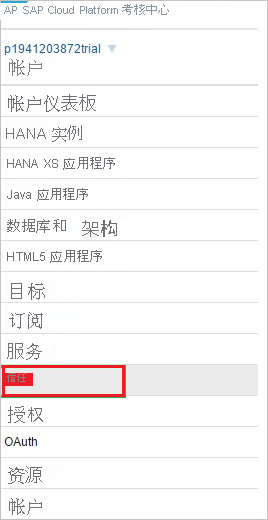
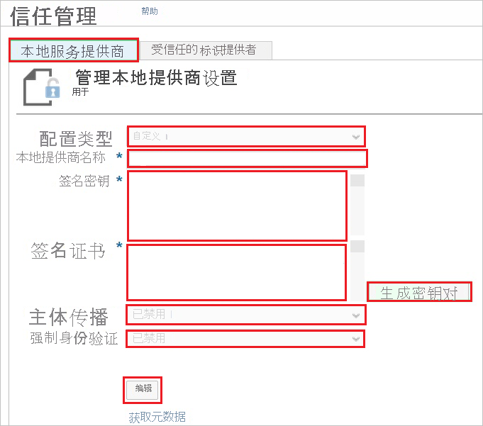
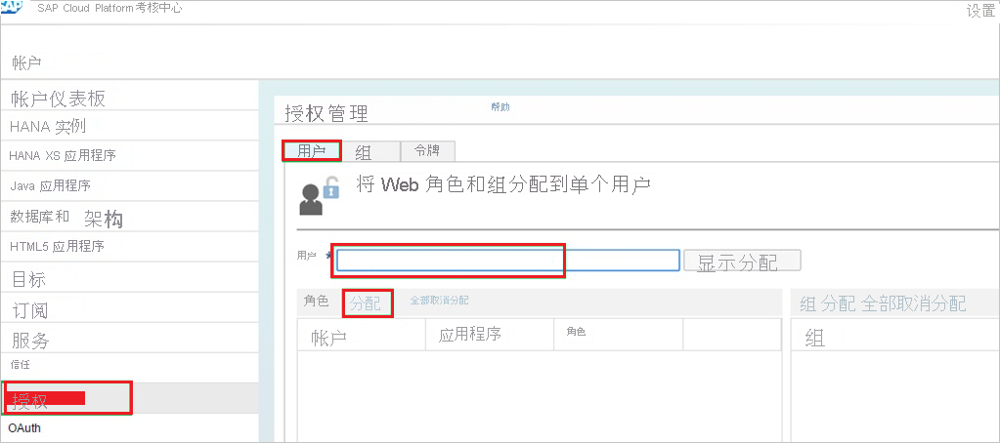

# 教程：Azure AD 与 SAP Cloud Platform 的 SSO 集成

在本教程中，了解如何将 SAP Cloud Platform 与 Azure Active Directory (Azure AD) 集成。 将 SAP Cloud Platform 与 Azure AD 集成后，可以：

* 在 Azure AD 中控制谁有权访问 SAP Cloud Platform。
* 让用户使用其 Azure AD 帐户自动登录到 SAP Cloud Platform。
* 在一个中心位置（Azure 门户）管理帐户。

## 先决条件

若要开始操作，需备齐以下项目：

* 一个 Azure AD 订阅。 如果没有订阅，可以获取一个[免费帐户](https://azure.microsoft.com/free/)。
* 已启用 SAP Cloud Platform 单一登录 (SSO) 的订阅。

>[!IMPORTANT]
>用户需要部署自己的应用程序或订阅 SAP Cloud Platform 帐户上的应用程序来测试单一登录。 在本教程中，会在帐户中部署应用程序。
> 

## 方案描述

本教程会在测试环境中配置和测试 Azure AD 单一登录。

* SAP Cloud Platform 支持 SP 发起的 SSO。

## 从库中添加 SAP Cloud Platform

若要配置 SAP Cloud Platform 与 Azure AD 的集成，需要从库中将 SAP Cloud Platform 添加到托管 SaaS 应用列表。

1. 使用工作或学校帐户或个人 Microsoft 帐户登录到 Azure 门户。
1. 在左侧导航窗格中，选择“Azure Active Directory”服务  。
1. 导航到“企业应用程序”，选择“所有应用程序”   。
1. 若要添加新的应用程序，请选择“新建应用程序”  。
1. 在“从库中添加”部分中，在搜索框中键入“SAP Cloud Platform” 。
1. 从结果面板中选择“SAP Cloud Platform”，然后添加该应用。 在该应用添加到租户时等待几秒钟。

## 配置和测试 SAP Cloud Platform 的 Azure AD SSO

使用名为 B.Simon 的测试用户配置并测试 SAP Cloud Platform 的 Azure AD SSO。 若要正常使用 SSO，需要在 Azure AD 用户与 SAP Cloud Platform 中的相关用户之间建立链接关系。

若要配置并测试 SAP Cloud Platform 的 Azure AD SSO，请执行以下步骤：

1. **[配置 Azure AD SSO](#configure-azure-ad-sso)** - 使用户能够使用此功能。
    1. **[创建 Azure AD 测试用户](#create-an-azure-ad-test-user)** - 使用 Britta Simon 测试 Azure AD 单一登录。
    1. **[分配 Azure AD 测试用户](#assign-the-azure-ad-test-user)** - 使 Britta Simon 能够使用 Azure AD 单一登录。
2. **[配置 SAP Cloud Platform SSO](#configure-sap-cloud-platform-sso)** - 在应用程序端配置单一登录设置。
    1. **[创建 SAP Cloud Platform 测试用户](#create-sap-cloud-platform-test-user)** - 在 SAP Cloud Platform 中创建 Britta Simon 的对应用户，并将其链接到该用户的 Azure AD 表示形式。
1. **[测试 SSO](#test-sso)** - 验证配置是否正常工作。

## 配置 Azure AD SSO

按照下列步骤在 Azure 门户中启用 Azure AD SSO。

1. 在 Azure 门户中，在 SAP Cloud Platform 应用程序集成页上，找到“管理”部分并选择“单一登录”  。
1. 在“选择单一登录方法”页上选择“SAML” 。
1. 在“设置 SAML 单一登录”页面上，单击“基本 SAML 配置”旁边的铅笔图标以编辑设置 。

   

1. 在“基本 SAML 配置”部分，输入以下字段的值：

    a. 在“标识符”文本框，使用以下模式之一键入 SAP Cloud Platform 的 URL：  

    | **Identifier** |
    |-----------|
    | `https://hanatrial.ondemand.com/<instancename>` |
    | `https://hana.ondemand.com/<instancename>` |
    | `https://us1.hana.ondemand.com/<instancename>` |
    | `https://ap1.hana.ondemand.com/<instancename>` |

    b. 在“回复 URL”文本框中，使用以下一种模式键入 URL：

    | 回复 URL |
    |----------|
    | `https://<subdomain>.hanatrial.ondemand.com/<instancename>` |
    | `https://<subdomain>.hana.ondemand.com/<instancename>` |
    | `https://<subdomain>.us1.hana.ondemand.com/<instancename>` |
    | `https://<subdomain>.dispatcher.us1.hana.ondemand.com/<instancename>` |
    | `https://<subdomain>.ap1.hana.ondemand.com/<instancename>` |
    | `https://<subdomain>.dispatcher.ap1.hana.ondemand.com/<instancename>` |
    | `https://<subdomain>.dispatcher.hana.ondemand.com/<instancename>` |

    c. 在“登录 URL”  文本框中，键入用户用于登录“SAP Cloud Platform”应用程序的 URL  。 这是“SAP Cloud Platform”应用程序中受保护资源的特定于帐户的 URL。 URL 基于以下模式：`https://<applicationName><accountName>.<landscape host>.ondemand.com/<path_to_protected_resource>`
      
    >[!NOTE]
    >这是“SAP Cloud Platform”应用程序中要求用户进行身份验证的 URL。
    > 

    | **登录 URL** |
    |------|
    | `https://<subdomain>.hanatrial.ondemand.com/<instancename>` |
    | `https://<subdomain>.hana.ondemand.com/<instancename>` |

    > [!NOTE] 
    > 这些不是实际值。 请使用实际的“标识符”、“回复 URL”和“登录 URL”更新这些值。 请联系 [SAP Cloud Platform 客户端支持团队](https://help.sap.com/viewer/65de2977205c403bbc107264b8eccf4b/Cloud/5dd739823b824b539eee47b7860a00be.html)获取登录 URL 和标识符。 可以从“信任管理”部分获取回复 URL，本教程稍后将会介绍。
    > 
4. 在“使用 SAML 设置单一登录”页的“SAML 签名证书”部分，单击“下载”以根据要求下载从给定选项提供的“联合元数据 XML”并将其保存在计算机上     。

    

### 创建 Azure AD 测试用户

在本部分，我们将在 Azure 门户中创建名为 B.Simon 的测试用户。

1. 在 Azure 门户的左侧窗格中，依次选择“Azure Active Directory”、“用户”和“所有用户”  。
1. 选择屏幕顶部的“新建用户”。
1. 在“用户”属性中执行以下步骤：
   1. 在“名称”字段中，输入 `B.Simon`。  
   1. 在“用户名”字段中输入 username@companydomain.extension。 例如，`B.Simon@contoso.com`。
   1. 选中“显示密码”复选框，然后记下“密码”框中显示的值。
   1. 单击“创建”。

### 分配 Azure AD 测试用户

在本部分中，通过授予 B.Simon 访问 SAP Cloud Platform 的权限，允许她使用 Azure 单一登录。

1. 在 Azure 门户中，依次选择“企业应用程序”、“所有应用程序”。 
1. 在应用程序列表中，选择“SAP Cloud Platform”。
1. 在应用的概述页中，找到“管理”部分，选择“用户和组” 。
1. 选择“添加用户”，然后在“添加分配”对话框中选择“用户和组”。
1. 在“用户和组”对话框中，从“用户”列表中选择“B.Simon”，然后单击屏幕底部的“选择”按钮。
1. 如果你希望将某角色分配给用户，可以从“选择角色”下拉列表中选择该角色。 如果尚未为此应用设置任何角色，你将看到选择了“默认访问权限”角色。
1. 在“添加分配”对话框中，单击“分配”按钮。

## 配置 SAP Cloud Platform SSO

1. 在另一个 Web 浏览器窗口中，登录到 SAP Cloud Platform 考核中心，网址为 `https://account.<landscape host>.ondemand.com/cockpit`（例如： https://account.hanatrial.ondemand.com/cockpit) ）。

2. 单击“信任”  选项卡。
   
    

3. 在“信任管理”部分中的“本地服务提供程序”下，执行以下步骤： 

    
   
    a. 单击 **“编辑”** 。

    b. 对于“配置类型”  ，选择“自定义”  。

    c. 对于“本地提供程序名称”  ，保留默认值。 复制此值并将其粘贴到 SAP Cloud Platform Azure AD 配置的“标识符”字段中。 

    d. 若要生成 **签名密钥** 和 **签名证书** 密钥对，请单击“生成密钥对”  。

    e. 对于“主体传播”  ，选择“禁用”  。

    f. 对于“强制身份验证”  ，选择“禁用”  。

    g. 单击“保存”  。

4. 保存“本地服务提供程序”设置后，执行以下步骤获取回复 URL： 
   
    

    a. 单击“获取元数据”下载 SAP Cloud Platform 元数据文件  。

    b. 打开下载的 SAP Cloud Platform 元数据 XML 文件，并找到 **ns3:AssertionConsumerService** 标记。
 
    c. 复制 **Location** 属性的值，并将其粘贴到 SAP Cloud Platform Azure AD 配置中的“回复 URL”  字段。

5. 单击“受信任的标识提供者”  选项卡，并单击“添加受信任的标识提供者”  。
   
    
   
    >[!NOTE]
    >若要管理受信任的标识提供者的列表，需要已在本地服务提供程序部分中选择自定义配置类型。 如果选择“默认”配置类型，则对 SAP ID 服务有不可编辑的隐式信任。 如果选择“无”，则不具有任何信任设置。
    > 
    > 

6. 单击“常规”  选项卡，并单击“浏览”  以上载已下载的元数据文件。
    
    
    
    >[!NOTE]
    >上传元数据文件后，会自动填充“单一登录 URL”、“单一注销 URL”和“签名证书”的值。   
    > 
     
7. 单击“属性”选项卡  。

8. 在“属性”  选项卡中，执行以下步骤：
    
     

    a. 单击“添加基于断言的属性”  ，并添加以下基于断言的属性：
       
    | 断言属性 | 主体属性 |
    | --- | --- |
    | `http://schemas.xmlsoap.org/ws/2005/05/identity/claims/givenname` |名 |
    | `http://schemas.xmlsoap.org/ws/2005/05/identity/claims/surname` |姓 |
    | `http://schemas.xmlsoap.org/ws/2005/05/identity/claims/emailaddress` |电子邮件 |
   
    >[!NOTE]
    >属性的配置取决于如何开发 SCP 上的应用程序，即它们应在 SAML 响应中预期哪些属性，以及它们在哪个名称（主体属性）下通过代码访问此属性。
    > 
    
    b. 屏幕截图中的 **默认属性** 仅用于说明目的。 它并不是使方案正常工作所必需的。  
 
    c. 屏幕截图中所示的 **主体属性** 的名称和值取决于如何开发应用程序。 很可能应用程序需要不同的映射。

### 基于断言的组

可选步骤是，可以为 Azure Active Directory 标识提供者配置基于断言的组。

使用 SAP Cloud Platform 上的组可将一个或多个用户动态分配到 SAP Cloud Platform 应用程序中的一个或多个角色，具体由 SAML 2.0 断言中的属性值确定。 

例如，如果断言包含属性“contract=temporary”，你可能希望将所有受影响的用户添加到组“TEMPORARY”   。 组“TEMPORARY”可能包含 SAP Cloud Platform 帐户中部署的一个或多个应用程序中的一个或多个角色  。
 
若想要同时将多个用户分配到 SAP Cloud Platform 帐户中的应用程序的一个或多个角色，请使用基于断言的组。 如果只想将一个或少量用户分配到特定角色，建议直接在 SAP Cloud Platform 考核中心的“授权”  选项卡上分配它们。

### 创建 SAP Cloud Platform 测试用户

要使 Azure AD 用户能够登录 SAP Cloud Platform，必须为他们分配 SAP Cloud Platform 中的角色。

**若要向用户分配角色，请执行以下步骤：**

1. 登录到 **SAP Cloud Platform** 考核中心。

2. 执行以下操作：
   
    
   
    a. 单击“授权”  。

    b. 单击“用户”  选项卡。

    c. 在“用户”  文本框中，键入用户的电子邮件地址。

    d. 单击“分配”  ，将用户分配到角色。

    e. 单击“ **保存**”。

## 测试 SSO 

在本部分，你将使用以下选项测试 Azure AD 单一登录配置。 

* 在 Azure 门户中单击“测试此应用程序”。 这样将会重定向到 SAP Cloud Platform 登录 URL，可以从那里启动登录流。 

* 直接转到 SAP Cloud Platform 登录 URL，并从那里启动登录流。

* 你可使用 Microsoft 的“我的应用”。 单击“我的应用”中的 SAP Cloud Platform 磁贴时，应会自动登录到为其设置了 SSO 的 SAP Cloud Platform。 有关“我的应用”的详细信息，请参阅[“我的应用”简介](https://support.microsoft.com/account-billing/sign-in-and-start-apps-from-the-my-apps-portal-2f3b1bae-0e5a-4a86-a33e-876fbd2a4510)。

## 后续步骤

配置 SAP Cloud Platform 后，可以强制实施会话控制，实时防止组织的敏感数据发生外泄和渗透。 会话控制从条件访问扩展而来。 [了解如何通过 Microsoft Cloud App Security 强制实施会话控制](/cloud-app-security/proxy-deployment-any-app)。